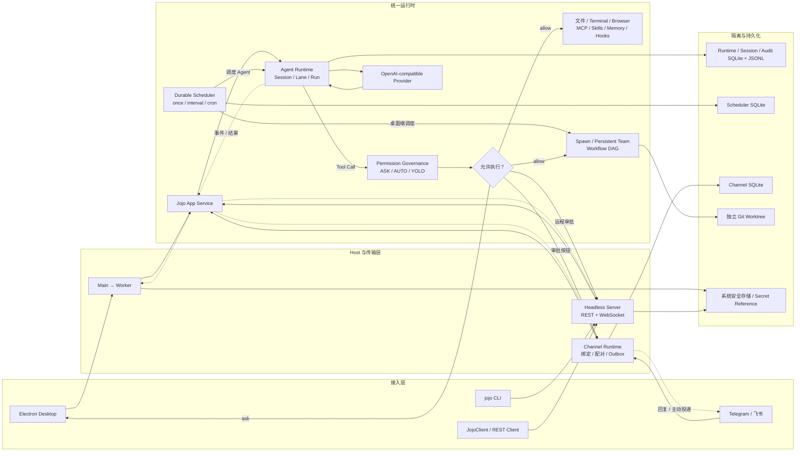

# Jojo Agent

本地优先的 Electron Coding Agent，同时提供可独立运行的 Headless Server 与 `jojo` CLI。一次对话绑定一个本地目录，模型可检索和阅读项目；Main Agent、临时 Spawn、Persistent Team、Workflow、Durable Scheduler 与 Telegram / 飞书 Channel 的工具调用统一经过 Permission Governance，在既有安全边界之上按 ASK / AUTO / YOLO、Global / Workspace 规则和会话 Grant 做确定性决策，并记录可审计的安全摘要。Terminal 与 MCP stdio 进程通过共享 Process Sandbox 执行，MCP Server 还受配置指纹信任、HTTP SSRF 和细粒度审批边界保护。后台 Spawn、持久 Team Member 与声明式 Workflow DAG 可并行执行只读分析，或在独立 Git Worktree 中写入且不自动 Merge。会话记忆、MCP / Skills、受控浏览器、定时自动化、外部消息入口与生命周期 Hooks 都挂在同一套 Runtime 上。

核心 Runtime 通过稳定的公共 API 和组合层同时服务 Electron、普通 Node 测试与无界面 Server Host，不依赖 Renderer 或 Electron IPC。

桌面端基础上手见 [`docs/current-features.md`](./docs/current-features.md)。权限治理设计见 [`docs/Jojo-Agent-Permission-Governance.md`](./docs/Jojo-Agent-Permission-Governance.md)，Spawn / Team 设计见 [`docs/Jojo-Agent-Spawn-Team.md`](./docs/Jojo-Agent-Spawn-Team.md)，Scheduler 实现说明见 [`docs/technical-implementation/scheduler.md`](./docs/technical-implementation/scheduler.md)，Channel 与 CLI 设计分别见 [`docs/Jojo-Agent-Channel-Abstraction-Design.md`](./docs/Jojo-Agent-Channel-Abstraction-Design.md) 和 [`docs/jojo-serve-cli-daemon-config-logging-design.md`](./docs/jojo-serve-cli-daemon-config-logging-design.md)；与代码冲突时以 Contracts、Runtime 和测试为准。

## 当前项目流程



桌面端与 Headless Server 复用同一个 Runtime / App Service 边界：请求进入 Session 与 Lane 后，由模型决定是否调用工具；工具调用先经过 Domain Security Gate 和 Permission Governance，再进入文件、终端、浏览器、扩展或编排能力。执行事件和结果会持久化并返回原入口。Scheduler 使用独立 SQLite、租约和运行记录保证重启后可恢复；桌面端支持 Agent、Team Member、Workflow 三类 Target，Headless Server 当前只支持 Agent Target。Channel Runtime 负责外部会话的绑定、配对、审批和可靠投递，不绕过 Runtime 权限边界。

## 已实现

- Electron Main / sandboxed Preload / React Renderer / Utility Process；Desktop Worker 通过 `createJojoRuntime()` 装配 Runtime，而不是在进程内直接驱动旧循环；
- OpenAI Chat Completions 兼容 Provider：自定义 Base URL、模型发现、逐轮选模型、流式输出；另有 OpenAI 兼容 Embedding，供记忆语义检索使用；
- Agent Core：多轮工具循环、上下文估算、大结果回收、历史压缩、拒绝回填、重复调用保护；
- Runtime 公共边界：`AgentRuntime`、`RuntimeSession`、`RuntimeLane`、`RunHandle`、版本化 Contract，以及统一的 Provider / Tool / Permission / Approval / Memory / Hook 注入；
- Runtime Composition 与 App Service：同一套 Runtime 可由 Electron Worker、普通 Node 程序和 `apps/server` 的 headless 入口复用；
- Headless Network Server：版本化 Zod Protocol、Server Core、Control / Observer Lease、幂等 mutation、REST / WebSocket、远程审批与断线后 Run 查询恢复。开放 Runtime Run / Lane / 审批 / 图片 / Sub-Agent，以及 Scheduler 和 Channel 管理 API；Workflow、Browser、Memory 远程 API 尚未挂出；
- `jojo` CLI：前台 `serve`、YAML 配置与环境变量 / 命令行覆盖、启动前检查、实例锁、结构化日志、状态 / 停止 / 日志 / Doctor，以及 Linux systemd user service 与 macOS launchd 用户服务管理；
- Client SDK：`JojoClient` / `JojoSession` / `JojoRun` 远程对象模型，自动注入认证和幂等键，并以 WebSocket 事件 + REST Snapshot 恢复运行结果；同时提供 Schedule、Channel Instance / Binding / Pairing / Delivery / Health 客户端方法；
- 十个主 Agent 文件 / 网页 / 终端工具：`read_file`、`list_files`、`grep`、`glob`、`web_search`、`web_fetch`、`write_file`、`edit_file`、`delete_file`、`terminal`；另有 Spawn、Team、Workflow、Scheduler、Channel、Memory、Browser、MCP / Skills 编排工具；
- 工作目录边界、真实路径 / 符号链接检查、写前冲突检测、精确编辑与回收站；Terminal 不经过 Shell，使用参数数组、环境变量 allowlist、假 HOME / 独立临时目录、流式脱敏、超时与进程树回收；
- 共享 `@desktop-agent/process-sandbox`：Linux Bubblewrap、macOS Seatbelt 和 Soft fallback；Terminal 网络默认为 `none`，需要联网的命令可申请 `host` 全局网络并由用户在审批中决定，strict 模式在强后端不可用时 fail closed，fallback 的宿主能力会进入审批风险预览。macOS Seatbelt 是敏感目录与网络强化，不等同于 Linux mount namespace 的最小 Host 可见性；
- 会话删除通过 Main 生命周期门禁与 Storage tombstone / 跨实例串行化阻止晚到写入复活 JSONL；
- Desktop IPC 边界使用严格 Zod Schema 和负载大小限制，覆盖 Main ↔ Worker 命令与事件，以及 Preload 推送到 Renderer 的消息；非法消息会被拒绝并记录协议违规；
- 统一 Permission Governance：先执行既有 Domain Security Gate，再依次处理 baseline deny / Hard Floor、用户 DENY、Mandatory Approval、用户 ASK、Session Grant、用户 ALLOW 与 Mode；Workspace 规则对 ALLOW / ASK 比 Global 更具体，任意作用域的 DENY 始终优先。底层 `deny`、工作区外写入等安全边界不能被 Policy、Grant、AUTO 或 YOLO 覆盖；
- Permissions 设置页支持 Global / Workspace Policy、严格 JSON Rules、revision 与 Recent Decisions。规则可匹配 actor、trigger、source、tool、operation、risk、network、是否使用密钥及 resource scope；策略和脱敏后的决策审计保存在 `runtime/permissions.sqlite`，项目文件不能通过提交 `.jojo` 配置给自己授权；
- ASK 保持普通敏感操作逐次审批；AUTO 仅自动允许工作区文件修改，以及 strong / container 沙箱中无网络、无密钥的 medium Terminal；YOLO 取消普通审批，但仍保留 Hard Deny 与 Mandatory Approval。工作区外访问、Skill 安装、项目 Hooks 信任、弱沙箱 critical Terminal，以及同时申请 host network 与密钥的 Terminal 仍需确认；
- 审批展示命令、cwd、风险、沙箱强度、网络模式和密钥名称，允许范围可选“允许一次”“允许类似命令”或“本次对话都允许”，后两者只在当前对话的内存状态中生效；Grant 基于稳定 fingerprint，并绑定 actor、网络、密钥名称、Sandbox 要求及 MCP Server 指纹，不能扩大原授权能力；
- 多会话侧边栏、对话 / 轨迹视图、Markdown 消毒、审批弹窗、停止、加密 API Key，以及 Automations、Channels、Teams、Memory、Browser、MCP、Skills、Hooks 等设置页；
- MCP（stdio / Streamable HTTP，含 OAuth）与本地 `SKILL.md`；Server 连接前按安全身份指纹信任，安全身份变化自动失效，stdio 复用 Process Sandbox，Server Instructions 默认不进入上下文；远程 MCP 默认只允许 HTTPS（显式 loopback HTTP 例外），DNS、私网 / Metadata 地址和每次 Redirect 都会重新校验；
- MCP 工具默认按外部副作用审批；“允许类似命令”绑定当前 Server 配置指纹与精确工具，“本次对话都允许”则覆盖当前对话中的普通交互审批。只有已信任 Server、本地 `trustedReadTools` 策略与 `readOnlyHint=true` 同时满足时才按可信只读处理。大工具集自动切换 manifest + describe/call，Resource / Prompt 仍保持不可信与默认逐次审批；
- MCP 结果有总量边界；敏感 env / Header 明文配置会被拒绝，可通过运行时 `SecretReference` 注入。Desktop Secret Broker 与 Terminal 共用系统安全存储；缺少命名密钥时用户可直接输入，或主动从 `.zshrc` 等 Shell 配置静态导入（不会执行启动脚本），OAuth Token 继续由 Electron `safeStorage` 加密；
- 受控 CDP 浏览器（沙箱或附加本机 Chrome）、录制 / 回放 YAML、文件 / 文件夹附件、图片附件与视觉消息；
- Markdown 记忆：`memory_status` / `memory_read` / `memory_search` / `memory_write` / `memory_forget` / `memory_restore`，候选治理与语义检索；用户记忆在 `~/.jojo/memory`；
- 后台 Sub-Agent：Profile（`explore` / `general` / `code-review` / `synthesize`，可叠加 user/project）、Tool Policy、Continue / Send / Close、Structured Output；工具调用进入统一 Governance，actor / profile 会参与 Policy 与 Audit；
- Persistent Team：稳定 Team / Member 身份与 Runtime Lane、SQLite Task / Inbox、同成员串行与跨成员并行、崩溃安全中断、Team Member Spawn Owner / Cancel 传播，以及 `team_list` / `team_status` / `team_delegate` / `team_wait` / `team_send` / `team_inbox`；设置页支持团队创建编辑、成员策略、运行时启停与任务状态；
- Workflow DAG：依赖与并发、Timeout / Cancel、Retry、Typed Inputs、Tool Step、foreach / condition / 嵌套 Saved Workflow、Budget、资源组与 Provider 限流、JSONL Journal / Resume；
- Durable Scheduler：支持单次、固定间隔与带 IANA 时区的 Cron，misfire 补跑 / 跳过、并发 skip / queue / allow、手动触发、取消、运行历史、租约与崩溃恢复；桌面端可调度 Agent、Team Member 与 Workflow，并可在对话中通过 `schedule_*` 工具直接创建和管理自动化；
- Channel Abstraction：内置 Telegram 与飞书 Adapter，支持外部消息入站、回复与主动投递、会话绑定、陌生私聊配对、群聊提及 / 发送者 / 附件策略、队列策略、审批按钮、健康状态与可靠 Outbox；飞书支持长连接和 Webhook，定时任务结果可投递到已绑定 Channel；
- 可写 Agent 强制 Git Worktree 隔离，Branch / Diff 可审查，默认不自动 Merge；
- WorkflowCard：步骤列表、依赖图、时间线、Usage、预算、错误码、结构化输出与 Isolation Diff；
- 生命周期 Hooks：用户 `~/.jojo/hooks.yml`、项目 `.jojo/hooks.yml`（fingerprint 信任 / 可禁用）、设置页状态与 Reload。

尚未实现：Worker Runtime Backend、Workflow / Browser / Memory 远程 API、可视化 Workflow 编辑器、pipeline / human / HTTP Step、专用 Git 提交工具、自动更新与云同步。Headless Scheduler 当前只支持 Agent Target，桌面端才支持 Team Member 与 Workflow Target；CLI 的 OS 用户服务管理当前支持 Linux systemd 与 macOS launchd，不支持 Windows。Process Sandbox 后续项还包括 Windows 强隔离、OCI Backend、可选域名级网络代理、cgroup 资源限制，以及系统 Keychain provider。

## 开发

要求 Node.js 22+ 与 pnpm 10+（仓库 `packageManager` 为 pnpm 10.33.0）。

```bash
pnpm install
pnpm dev
```

首次启动：

1. 打开「设置」，填写 OpenAI Chat Completions 兼容服务的 API Base URL 和 API Key，获取模型列表并选择默认模型；
2. 在「权限」中选择 ASK / AUTO / YOLO；默认 ASK。需要时可分别配置 Global 与当前 Workspace 的严格 JSON Rules；
3. 选择一个本地项目目录创建会话（可写 Sub-Agent / Workflow 需要 Git 仓库）；
4. 在输入框右下角选择本轮模型后发送任务。可用「＋」添加文件、文件夹或最多 4 张图片；
5. 可选：在「Automations」创建单次 / 间隔 / Cron 自动化，在「Channels」连接 Telegram 或飞书并建立会话绑定。

支持将文件或文件夹直接拖到输入框，也可复制文件后在输入框按 Cmd+V / Ctrl+V 粘贴；剪贴板图片可直接粘贴为图片附件，普通文字粘贴保持不变。文件附件支持 PDF、Markdown、HTML、Excel（`.xlsx` / `.xls` / `.xlsm` / `.xlsb`）、ODS、TXT、CSV、JSON 及常见代码文件。添加文件夹时会递归读取支持的文件并保留相对路径，跳过隐藏项、依赖 / 构建目录与符号链接。文件在本地解析，提取后的文字随消息发送给当前模型；发送后可展开附件查看内容，后续追问会沿用会话中的附件。每条消息最多 50 个文件、总计 200,000 字符，单文件最多 20 MB / 50,000 字符，每次导入最多读取 50 MB；Excel 每张表最多提取前 2,000 行及 500 列。超限截断和解析失败会提示，扫描 PDF 需先 OCR。

项目内检索和公开网页搜索 / 抓取默认允许；ASK 下主会话文件修改会先展示 Diff，Terminal 默认弹出带沙箱能力说明的审批。命令可显式申请主机全局网络和命名密钥，审批会醒目标示；审批菜单可选择仅允许一次、允许同类命令或允许本次对话。AUTO / YOLO 只改变普通 `ask`，不会覆盖底层拒绝或 Mandatory Approval。对话授权不会持久化，项目 Hooks 的版本信任也不会被它绕过。MCP 首次连接或安全配置变化后需要重新信任。可在 Permissions 的 Recent Decisions 中查看最近决策来源、风险、actor 与锁定状态；浏览器、MCP、Skills、记忆与 Hooks 的配置见 [`docs/current-features.md`](./docs/current-features.md)。

常用命令：

```bash
pnpm typecheck
pnpm lint
pnpm test
pnpm build
```

启动 Headless Server 开发入口：

```bash
pnpm jojo config init
export OPENAI_API_KEY='<your-api-key>'
pnpm jojo serve --check
pnpm dev:server
```

默认配置文件为 `~/.jojo/config.yml`。合并优先级为内置默认值 < YAML 配置 < `JOJO_*` 环境变量 < 命令行参数；`config show` 输出会脱敏。服务默认只监听 `127.0.0.1:7788`，绑定非回环地址时必须同时设置 `server.allowRemote: true` 和 token。常用运维命令包括：

```bash
pnpm jojo status
pnpm jojo doctor
pnpm jojo logs --file
pnpm jojo stop
pnpm jojo service install
pnpm jojo service start
```

`serve` 在前台运行；`--daemon` 会明确拒绝，请用 `service install/start` 管理后台服务。CLI 服务管理支持 Linux systemd user service 与 macOS launchd。

Runtime 与真实 Electron 边界冒烟：

```bash
pnpm test:runtime-smoke
pnpm test:e2e:electron
```

`test:runtime-smoke` 不启动 Electron，验证 headless Runtime Composition；`test:e2e:electron` 使用离线 Scripted Provider 启动真实 Main、Preload、Renderer 与 Utility Process，不需要 API Key 或外网。

### Headless Server 与 Client SDK

`apps/server` 导出 `createHeadlessServer()` 和 `createNetworkServer()`。网络层默认只允许监听 `127.0.0.1:7788`；非回环地址必须同时显式启用 `allowRemote` 并配置 token。协议版本为 `1`，提供 `/healthz`、`/readyz`、`/api/v1` REST 资源与 `/api/v1/events` WebSocket。REST API 除 Session / Run / Approval 外，还覆盖 Schedule 和 Channel Instance / Binding / Pairing / Delivery / Health；内置 Headless Scheduler 目前只接受 Agent Target。Channel 内置 Telegram 与飞书 Adapter，Webhook 入口为 `/api/v1/channels/webhook/:instanceId`。

Client SDK 示例：

```ts
import { JojoClient } from '@desktop-agent/client';

const client = new JojoClient({
  baseUrl: 'http://127.0.0.1:7788',
  token: process.env.JOJO_SERVER_TOKEN
});

await client.connect();
const session = await client.createSession({ executionScope: { kind: 'none' } });
const run = await session.run({ input: '分析这个项目', providerId: 'openai', model: 'gpt-5', laneId: 'main' });
console.log(await run.result());
await client.close();
```

`pnpm build` 使用 Electron Forge 生成当前平台安装产物。只生成未封装应用目录：

```bash
pnpm --filter @desktop-agent/desktop package
```

## 测试

自动化测试用 Fake / Scripted runner，不打真实 LLM：

```bash
pnpm test
```

边界加固的关键覆盖：

| 能力 | 测试 |
|---|---|
| Runtime 公共 API / Contract Suite | `packages/agent-runtime/test/public-runtime.test.ts` |
| Node headless Runtime Composition | `packages/runtime-composition/test/headless-runtime.test.ts` |
| 无 Electron 的 Server Host 消费者 | `apps/server/src/server-runtime.test.ts` |
| Server Core / HTTP Transport | `packages/server-core/test/server-core.test.ts`、`packages/server-http/test/http.test.ts` |
| Client SDK 远程 Run / 审批 / Scheduler / Channel | `packages/client/test/e2e.test.ts` |
| `jojo serve` 配置、实例锁、生命周期与服务管理 | `apps/cli/src/**/*.test.ts` |
| Durable Scheduler / SQLite 恢复 / 桌面调度目标 | `packages/scheduler/test/`、`packages/storage/test/sqlite-schedule-store.test.ts`、`apps/desktop/src/worker/*-schedule-dispatcher.test.ts` |
| Channel Registry / Adapter / Runtime / 权限与设置页 | `packages/channel-core/test/`、`packages/channel-adapters/test/`、`packages/channel-runtime/test/`、`apps/desktop/src/renderer/channels-settings.test.ts` |
| Worker IPC strict schema / size guard | `packages/contracts/test/desktop-ipc.test.ts` |
| Preload push runtime validation | `apps/desktop/src/preload/push-validation.test.ts` |
| Session delete lease / JSONL 防复活 | `apps/desktop/src/main/session-lifecycle.test.ts`、`packages/storage/test/session-delete-race.test.ts` |
| Process Sandbox / Terminal 安全边界 | `packages/process-sandbox/test/process-sandbox.test.ts`、`packages/tools-node/test/tools.test.ts` |
| Permission Governance / Policy / Grant / Audit | `packages/permission-governance/test/`、`packages/storage/test/sqlite-permission-governance-store.test.ts`、`apps/desktop/src/renderer/permissions-settings.test.ts` |
| MCP 信任、stdio 沙箱、HTTP SSRF 与 Secret Ref | `packages/extensions/test/extensions.test.ts`、`packages/extensions/test/sandboxed-stdio.test.ts`、`packages/extensions/test/mcp-http-security.test.ts`、`packages/storage/test/sqlite-mcp-trust-store.test.ts` |
| Memory 存储 / 候选 / 语义检索 | `packages/memory/test/` |
| 浏览器驱动与录制 | `packages/browser-automation/test/`、`apps/browser-test-site/` |
| 真实 Electron 离线冒烟 | `apps/desktop/e2e/smoke.spec.ts` |

Electron E2E 覆盖应用启动、离线回合、审批允许 / 拒绝、取消慢回合，以及运行中删除与并发发送竞态；删除场景还会重启应用确认会话和 JSONL 没有复活。CI 在 Linux 上依次执行 `pnpm install --frozen-lockfile`、lint、typecheck、test、Xvfb Electron E2E，以及带重试的 `electron-forge package`。

macOS Seatbelt 实机边界测试默认跳过（嵌套沙箱环境无法运行 `sandbox-exec`）；在非沙箱化的 macOS 终端中可显式执行：

```bash
JOJO_STRONG_SANDBOX_TEST=1 pnpm vitest run packages/process-sandbox/test/process-sandbox.test.ts
```

该测试验证 Node 命令可运行，同时宿主 HOME 读取和回环网络连接被拒绝。

### Workflow

只跑 Workflow 相关：

```bash
pnpm exec vitest run \
  packages/orchestration/test \
  packages/storage/test/workflow-resume.integration.test.ts \
  apps/desktop/src/renderer/workflow-card.test.ts \
  apps/desktop/src/renderer/workflow-dag.test.ts \
  apps/desktop/src/worker/write-agent.e2e.test.ts
```

| 能力 | 测试 |
|---|---|
| DAG 调度、取消、超时、Retry | `packages/orchestration/test/workflow-engine.test.ts` |
| Tool Step、foreach、condition、嵌套 | `workflow-tool-step.test.ts`、`workflow-foreach.test.ts`、`workflow-condition.test.ts`、`workflow-nested.test.ts` |
| Saved Workflow / Args | `saved-workflow.test.ts` |
| Budget / Provider 限流 / 资源组 | `workflow-budget.test.ts`、`provider-semaphore.test.ts`、`resource-group.test.ts` |
| Journal Resume | `packages/storage/test/workflow-resume.integration.test.ts` |
| 依赖图 / 时间线 UI | `apps/desktop/src/renderer/workflow-dag.test.ts`、`workflow-card.test.ts` |
| 真实 `write_file` + Worktree | `apps/desktop/src/worker/write-agent.e2e.test.ts` |

桌面手测：`pnpm dev` 后打开 Git 仓库会话，让主 Agent 调用 Workflow 工具，例如「列出可用的 saved workflow」或「用 `repo-understand` 理解 `packages/orchestration`」。

内置模板：`repo-understand`、`architecture-review`、`code-review`（均必填 `args.target`）。也可把 YAML 放到项目 `.jojo/workflows/` 或 `~/.jojo/workflows/`（项目覆盖用户，再覆盖 builtin）。对话中会出现 WorkflowCard，可取消 / 恢复。

`explore` / `code-review` / `synthesize` 只读；`general` 写入独立 Worktree，主工作区与 Git Index 不变。

## 结构

```text
apps/desktop/             Electron Main、Preload、Renderer、Worker
apps/server/              无 Electron 的 headless Server Host 组合入口
apps/cli/                 jojo serve、配置、日志、诊断与 OS 用户服务管理
apps/browser-test-site/   浏览器自动化集成测试站点
packages/contracts/       Zod Schema、消息、事件、Runtime / Extension 与 IPC 契约
packages/agent/           模型、消息、工具执行原语与兼容 Agent 循环
packages/agent-runtime/   公共 Runtime API、Durable Operation、Lane、恢复与测试 Contract Suite
packages/runtime-composition/ Provider、Tool、权限、Memory、Hook 等 Runtime 能力组合
packages/permission-governance/ 统一权限事实归一化、Policy、Mode、Grant、Hard Floor 与 Audit
packages/app-service/     面向 Desktop / Server Transport 的 Runtime 应用服务
packages/scheduler/       持久化调度计算、租约引擎、Agent Dispatcher、工具与投递
packages/channel-core/    Channel 契约、能力模型与 Adapter Registry
packages/channel-adapters/ Telegram / 飞书 Adapter
packages/channel-runtime/ 入站路由、绑定 / 配对、审批桥接、Outbox 与调度投递
packages/server-protocol/ REST / WebSocket 共用的版本化 Zod Protocol
packages/server-core/     Connection、Lease、Idempotency、AuthZ 与命令协调
packages/server-http/     Fastify REST / WebSocket Transport
packages/client/          不依赖 Runtime 的 Jojo Server Client SDK
packages/orchestration/   Sub-Agent、Workflow Engine、Isolation、Saved Workflow
packages/browser-automation/ 可复用的 CDP 浏览器驱动、录制 / 回放与 Host 适配
packages/providers/       Chat Completions 与 Embedding 协议适配
packages/tools-node/      文件、目录、终端与权限 Gate
packages/process-sandbox/ Terminal / MCP stdio 共用的进程、环境、文件系统与网络隔离后端
packages/storage/         SQLite Runtime / Server State / Permission Policy 与 Audit、JSONL Session / Workflow Journal 与普通配置
packages/extensions/      MCP 客户端、安全策略、延迟工具目录、Skills 发现；包内含尚未接入 Desktop 的 Extension Host
packages/hooks/           生命周期 Hook Engine、hooks.yml 加载与项目信任
packages/memory/          Markdown 记忆、候选治理、语义检索与 Runtime Memory 适配
```

各 Workspace 的职责、依赖方向与安全边界见 [`docs/technical-implementation/`](./docs/technical-implementation/README.md)。

会话、普通配置、JSONL、Runtime SQLite、`runtime/permissions.sqlite`、`runtime/scheduler.sqlite`、`runtime/channels.sqlite`、MCP Trust Grant 和浏览器下载 / 录制在 Electron `userData`。Permission Audit 只保存工具安全事实、fingerprint 和密钥变量名，不保存密钥值或原始敏感输入；Channels 设置页的活动列表也只展示投递元数据，不展示消息正文。API Key、Terminal / MCP 命名密钥、飞书 Channel 密钥与 MCP OAuth 凭据由操作系统安全存储加密；普通配置和 JSONL 不含明文密钥。Terminal 通过 `secretEnv` 只提交名称，MCP env / Header 的敏感字段只接受 Secret Reference；缺失值可由用户输入或从 Shell 配置静态导入。用户级 Hooks、Agent Profile、Saved Workflow 和记忆分别在 `~/.jojo/`（`hooks.yml`、`agents/`、`workflows/`、`memory/`）。Headless CLI 默认使用 `~/.jojo/config.yml`、`~/.jojo/runtime`、`~/.jojo/run` 和 `~/.jojo/logs`，其中 Server State、Scheduler 与 Channel 分别持久化到独立 SQLite 文件。

## 当前验证范围

- Agent Core：工具循环、动态工具刷新、重复 Tool Call、拒绝后继续；
- Runtime：公共 API、跨 Host Contract Suite、headless Composition 与无 Electron Server 消费；
- Server / Client：Protocol、Lease、幂等 mutation、远程审批、断线后 Run Snapshot 恢复，以及 Scheduler / Channel REST 与 SDK；
- CLI：配置合并 / 校验 / 脱敏、Provider Secret 检查、远程监听保护、端口预检、实例锁、信号关闭、状态 / 日志 / Doctor 与 systemd / launchd 定义；
- Permission Governance：ASK 兼容、AUTO / YOLO 边界、Hard Deny / Mandatory Approval、Global / Workspace Policy、稳定 Grant fingerprint、SQLite Policy / Audit、Settings UI，以及 Main / Sub-Agent / Workflow / Scheduler / Channel actor 追踪；
- Orchestration：Sub-Agent 生命周期、Profile / Tool Policy、Workflow DAG、Worktree 隔离、Budget、依赖图 UI；
- Scheduler：时间计算、misfire / concurrency、leader lease、重启恢复、Agent / Team Member / Workflow Dispatcher、对话 / Channel 投递、`schedule_*` 工具与运行历史 UI；
- Channels：Telegram / 飞书 Adapter、入站去重与路由、绑定 / 配对、可靠 Outbox、审批桥接、密钥引用、健康状态、REST / Desktop 设置与定时结果投递；
- Memory：Markdown 存储、候选治理、语义检索与权限 Gate；
- Extensions：Skill 发现 / 按需加载、MCP 指纹信任和失效、stdio Sandbox、HTTP SSRF / Redirect、OAuth 安全存储、Secret Reference、结果限额、Instructions 默认关闭、大工具集延迟激活与细粒度审批；Extension Host 契约在包内测试，尚未接入 Desktop Worker；
- Hooks：配置校验、项目信任 / Disable、Shell 超时与输出上限、Runtime 恢复语义；
- Tools / Process Sandbox：大文件截断、项目检索、修改 Diff、读后写冲突、精确编辑、回收站、符号链接逃逸、目录外审批，以及 Terminal 环境 allowlist、流式脱敏、风险分类、网络 / 工作区能力预览、隔离 cwd 和进程树终止；
- Desktop 边界：Main ↔ Worker 与 Preload 推送的运行时校验、IPC 大小限制、协议违规拒绝；
- Storage：SQLite Runtime conformance / crash resume、JSONL 损坏尾恢复、单会话运行锁、删除 tombstone / 并发防复活、Workflow Journal Resume、Server State / Scheduler / Channel SQLite；
- Browser / 富内容：可复用 CDP 驱动、录制 / 回放、域名与 URL 校验、下载文件名净化、浏览器权限 Gate、视觉消息序列化；
- Electron E2E：离线启动 Main / Preload / Renderer / Worker、回合、审批、取消、运行中会话删除与重启恢复；
- TypeScript、ESLint、Vitest；
- Linux CI 上的 Electron 生产 package（本地另验证 macOS arm64）。

真实 Provider 联调、代码签名 / notarization 和干净机器安装测试需要相应密钥及发布环境，不在默认离线测试中执行。
