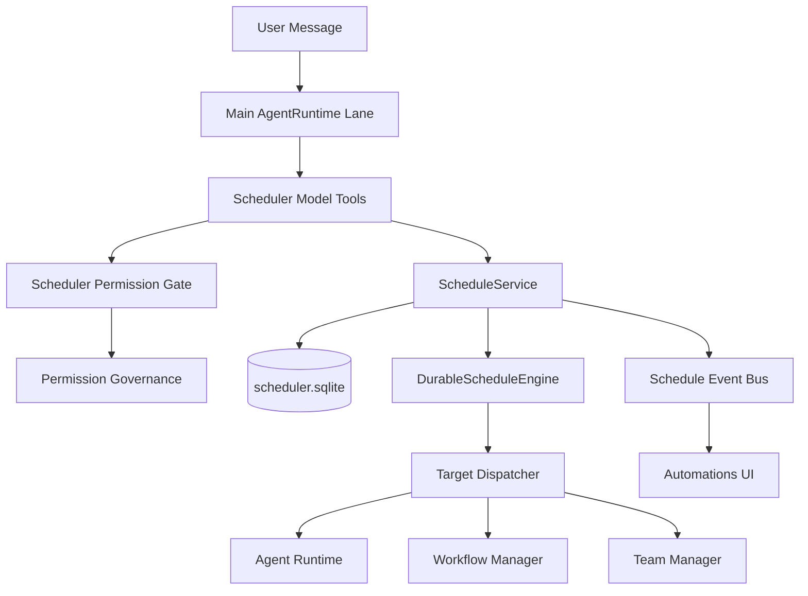
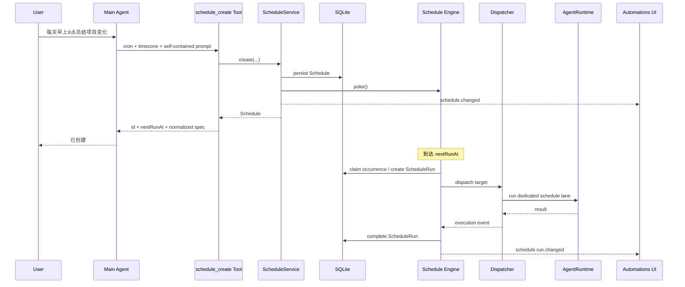

# Jojo Agent：在对话中直接创建 Scheduler 的实现方案

> 仓库：`zxt6991-source/jojo-agent`  
> 代码基线：`main@6310bb82f8e5035ce9d62a2ee0024bc38054c909`  
> 基线日期：2026-08-30  
> 状态：Implementation Design / Code-Aligned  
> 目标：让主对话中的 Agent 能通过原生 Tool 直接创建、查询、修改、暂停、删除和立即运行 Durable Scheduler，并与现有 Automations UI、SQLite Store、Schedule Engine、Permission Governance 共用同一套核心能力。

---

## 1. 结论先行

当前 `jojo-agent` **已经不缺 Scheduler Core**。

最新代码已经具备：

```text
packages/scheduler
├── ScheduleService
├── DurableScheduleEngine
├── ScheduleCalculator
├── SqliteScheduleStore
├── Schedule / ScheduleRun
├── once / interval / cron + timezone
├── misfire
├── overlap / concurrency
├── recovery
└── Target Dispatcher
    ├── Agent
    ├── Workflow
    └── Team Member
```

Desktop 也已经具备完整控制面：

```text
Renderer Automations UI
        │
        ▼
Electron IPC
        │
        ▼
Desktop Worker
        │
        ▼
ScheduleService
        │
        ▼
DurableScheduleEngine
```

真正缺失的是：

```text
User Conversation
       │
       ▼
     Agent
       │
       X   当前没有 schedule_* Tool
       │
       ▼
ScheduleService
```

因此，本次不要再设计新的 Scheduler，也不要让 Agent 调 Electron IPC，更不要让 Tool 直接访问 SQLite。

正确实现是增加一层很薄的 **Conversation Scheduler Adapter**：

```text
User
 │
 ▼
AgentRuntime(Main Lane)
 │
 ▼
schedule_* model-facing tools
 │
 ▼
ScheduleService
 │
 ├───────────────► schedule.changed / run.changed
 │                         │
 ▼                         ▼
Engine / Store        Existing Automations UI
 │
 ▼
Agent / Workflow / Team Member
```

### 推荐最终方案

新增：

```text
packages/scheduler/src/tools.ts
packages/scheduler/src/permission-gate.ts
```

并在 Desktop 主对话 `startTurn()` 中注入 Scheduler Tools。

**不要**把 Scheduler Tools 注入：

- Scheduled Agent；
- Sub-Agent；
- Team Member；
- Workflow Agent Step。

M1 只允许当前用户直接操作的 Main Agent 创建和管理 Scheduler。

---

# 2. 最新代码现状分析

## 2.1 Durable Scheduler 已经落地

当前核心 Contract 位于：

```text
packages/contracts/src/scheduler.ts
```

已经包含：

```ts
ScheduleSpec =
  | once
  | interval
  | cron
```

以及：

```ts
ScheduleTarget =
  | agent
  | workflow
  | team_member
```

并且已经存在：

```text
Schedule
ScheduleRun
revision
misfire
concurrency
nextRunAt
lastRunAt
resultPreview
error
```

所以对话能力应该直接复用这些 Domain Model。

---

## 2.2 ScheduleService 已经是正确的业务入口

文件：

```text
packages/scheduler/src/service.ts
```

当前接口：

```ts
export interface ScheduleService {
  initialize(): Promise<void>;
  list(): Promise<Schedule[]>;
  get(id: string): Promise<Schedule>;
  create(input: CreateScheduleInput, principal: SchedulePrincipal): Promise<Schedule>;
  update(id: string, input: UpdateScheduleInput): Promise<Schedule>;
  setEnabled(id: string, enabled: boolean, expectedRevision?: number): Promise<Schedule>;
  delete(id: string): Promise<void>;
  runNow(id: string, options?: { respectConcurrency?: boolean }): Promise<ScheduleRun>;
  listRuns(id: string, options?: ScheduleRunListOptions): Promise<ScheduleRun[]>;
  getRun(runId: string): Promise<ScheduleRun>;
  cancelRun(runId: string): Promise<void>;
  subscribe(listener: (event: ScheduleEvent) => void): () => void;
  close(): Promise<void>;
}
```

这意味着 Conversation Tool 根本不需要知道：

```text
SqliteScheduleStore
Timer
Lease
Recovery
Occurrence Key
Dispatcher
```

Tool 只应该依赖：

```ts
ScheduleService
```

这是本设计最重要的边界。

---

## 2.3 Desktop 已经组合好了 Scheduler Runtime

文件：

```text
apps/desktop/src/worker/scheduler-runtime.ts
```

当前结构：

```text
SqliteScheduleStore
       │
DefaultScheduleCalculator
       │
ScheduleDispatcherRegistry
       ├── AgentScheduleDispatcher
       ├── TeamMemberScheduleDispatcher
       └── WorkflowScheduleDispatcher
       │
DurableScheduleEngine
       │
DefaultScheduleService
```

因此 Conversation Tool 不应该重新创建 `ScheduleService`。

应该使用已经存在的：

```ts
schedulerReady.then(({ service }) => ...)
```

---

## 2.4 当前 Worker 已经有 Scheduler IPC，但 Agent 看不到它

`worker.ts` 已经处理：

```text
scheduler.list
scheduler.get
scheduler.save
scheduler.delete
scheduler.enabled
scheduler.run-now
scheduler.runs.list
scheduler.run.cancel
```

当前路径是：

```text
Renderer
  ↓
Main Process IPC
  ↓
WorkerCommand
  ↓
ScheduleService
```

但 `startTurn()` 中生成的 Agent Tools 目前只有：

```text
default tools
memory tools
browser tools
orchestration tools
skill tools
MCP tools
```

没有：

```text
schedule_* tools
```

所以缺口非常明确。

---

# 3. 不推荐的实现方式

## 3.1 不要让 Agent Tool 调 Desktop IPC

错误：

```text
Agent Tool
   ↓
ipcRenderer / ipcMain
   ↓
Worker
```

原因：

- Agent 本来就在 Worker 中；
- 绕一圈 IPC 属于反向依赖；
- Headless Server 无法复用；
- 测试复杂；
- 会制造 Renderer/Desktop 专属语义。

正确：

```text
Agent Tool
   ↓
ScheduleService
```

---

## 3.2 不要直接写 `scheduler.sqlite`

错误：

```text
schedule_create Tool
    ↓
SqliteScheduleStore.create()
```

这样会绕过：

```text
ScheduleCalculator
Target Validator
revision
nextRunAt calculation
misfire validation
concurrency validation
ScheduleEvent
engine.poke()
```

必须经过：

```text
ScheduleService
```

---

## 3.3 不要再增加一套 NLP Scheduler Parser

例如不要做：

```text
"明天下午三点提醒我"
        ↓
regex parser
        ↓
cron parser
```

Agent 本身就是自然语言解析层。

正确职责：

```text
自然语言
   ↓ LLM
结构化 schedule_create input
   ↓
Scheduler Core
```

Scheduler Tool 输入应该是强类型的结构化数据，而不是再次接收自然语言时间表达式。

---

# 4. 最终架构



核心原则：

```text
Tool 是 Adapter
Service 是 Domain API
Engine 是 Durable Runtime
```

---

# 5. Model-facing Tool 设计

建议 M1 提供 9 个 Tool：

| Tool | 类型 | 用途 | replay |
|---|---|---|---|
| `schedule_list` | read | 查看当前自动化 | safe |
| `schedule_get` | read | 获取一个自动化完整信息 | safe |
| `schedule_create` | control | 创建自动化 | never |
| `schedule_update` | control | 修改名称、时间、任务等 | never |
| `schedule_set_enabled` | control | 暂停 / 恢复 | never |
| `schedule_delete` | control | 删除自动化 | never |
| `schedule_run_now` | control | 立即运行 | never |
| `schedule_runs` | read/poll | 查看运行历史 | safe |
| `schedule_cancel_run` | control | 取消正在运行的 occurrence | never |

这套 Tool 与当前 Desktop 控制面基本一一对应。

---

# 6. Tool 输入不要直接暴露内部 Target Contract

内部 `AgentScheduleTarget` 需要：

```text
sessionId
providerId
model
budget
lane
```

这些不应该要求模型每次自己填写。

主对话创建 Scheduler 时，上述信息已经存在于当前运行环境中。

因此定义一套更小的 Conversation DTO。

## 6.1 Trigger DTO

```ts
export type ConversationScheduleSpec =
  | {
      kind: 'once';
      /** RFC3339，必须包含 offset 或 Z */
      runAt: string;
    }
  | {
      kind: 'interval';
      everyMinutes: number;
      /** 不传则使用创建时间 */
      anchorAt?: string;
    }
  | {
      kind: 'cron';
      /** 标准 5-field cron */
      expression: string;
      /** 不传时使用当前 Desktop IANA timezone */
      timezone?: string;
    };
```

例子：

```json
{
  "kind": "cron",
  "expression": "0 8 * * *",
  "timezone": "Asia/Shanghai"
}
```

---

## 6.2 Target DTO

M1 推荐：

```ts
export type ConversationScheduleTarget =
  | {
      kind: 'agent';
      prompt: string;
    }
  | {
      kind: 'team_member';
      teamId: string;
      memberId: string;
      task: string;
    }
  | {
      kind: 'saved_workflow';
      name: string;
      args?: Record<string, unknown>;
    };
```

### 为什么 M1 不直接开放 inline workflow

inline workflow definition 可能非常大，并且：

```text
Agent 自己生成 Workflow Definition
        +
Agent 自己生成 Scheduler
```

会一次引入两个复杂的 Durable Artifact。

M1 优先支持：

```text
saved workflow
```

M1.1 再补：

```text
inline workflow
```

---

# 7. schedule_create Schema

推荐模型输入：

```ts
const CreateInput = z.object({
  name: z.string().trim().min(1).max(256),
  description: z.string().max(4_000).optional(),

  spec: ConversationScheduleSpecSchema,
  target: ConversationScheduleTargetSchema,

  enabled: z.boolean().default(true),

  misfire: z.object({
    kind: z.enum(['skip', 'fire_once']),
    graceMinutes: z.number().int().min(0).max(365 * 24 * 60).optional()
  }).optional(),

  concurrency: z.enum(['skip', 'queue']).default('skip')
}).strict();
```

不要向模型暴露：

```text
concurrency = allow
```

因为当前 Scheduler Core 本身已经禁止 Agent persistent lane 使用 `allow`。

---

# 8. Conversation DTO → Core DTO

建议在：

```text
packages/scheduler/src/tools.ts
```

实现转换。

## 8.1 Tool Factory Options

```ts
export type SchedulerToolOptions = {
  providerId: string;
  model: string;

  contextWindowTokens?: number;
  maxOutputTokens?: number;

  principal: SchedulePrincipal;

  defaultTimezone?: string;
  now?: () => Date;
};
```

Desktop 创建时：

```ts
{
  providerId,
  model,
  contextWindowTokens: providerConfig.contextWindowTokens,
  maxOutputTokens: providerConfig.maxOutputTokens,
  principal: {
    id: 'desktop-user',
    type: 'user'
  },
  defaultTimezone: Intl.DateTimeFormat().resolvedOptions().timeZone || 'UTC'
}
```

注意：

```text
createdBy
```

应该仍然是：

```text
desktop-user
```

而不是：

```text
agent
```

因为 Agent 是代表当前用户调用 Tool。

---

## 8.2 转换 Agent Target

```ts
function toAgentTarget(
  input: { prompt: string },
  context: ToolContext,
  options: SchedulerToolOptions
): AgentScheduleTarget {
  return {
    kind: 'agent',
    sessionId: context.sessionId,
    providerId: options.providerId,
    model: options.model,
    input: {
      content: [{
        type: 'text',
        text: input.prompt.trim()
      }]
    },
    lane: {
      mode: 'dedicated'
    },
    budget: {
      ...(options.contextWindowTokens
        ? { contextWindowTokens: options.contextWindowTokens }
        : {}),
      ...(options.maxOutputTokens
        ? { maxOutputTokens: options.maxOutputTokens }
        : {})
    }
  };
}
```

### 为什么默认 dedicated lane

不要默认：

```text
main
```

定时任务应该与用户当前主对话执行状态隔离。

现有 Scheduler 本身已经为 dedicated Agent target 提供：

```text
schedule:<scheduleId>
```

这一类持久 Lane 语义。

推荐保持现有设计。

---

## 8.3 Team Target

```ts
{
  kind: 'team_member',
  teamId: input.teamId,
  memberId: input.memberId,
  task: input.task,
  parentSessionId: context.sessionId,
  providerId: options.providerId,
  model: options.model
}
```

后续仍然由现有：

```text
validateScheduleTarget()
```

检查 Team / Member 是否存在和是否 disabled。

---

## 8.4 Saved Workflow Target

```ts
{
  kind: 'workflow',
  sessionId: context.sessionId,
  workingDirectory: context.workingDirectory,
  providerId: options.providerId,
  model: options.model,
  workflow: {
    kind: 'saved',
    name: input.name,
    ...(input.args ? { args: input.args } : {})
  }
}
```

现有 Desktop Validator 会继续检查：

```text
Saved Workflow 是否存在
workingDirectory 是否与 session 一致
provider/model 是否有效
```

无需 Tool 重复实现。

---

# 9. 时间处理策略

## 9.1 自然语言时间由 Agent 解析

例如用户：

```text
每天早上 8 点帮我总结一下昨天的工作
```

模型转换：

```json
{
  "spec": {
    "kind": "cron",
    "expression": "0 8 * * *",
    "timezone": "Asia/Shanghai"
  }
}
```

不要再写：

```text
ChineseTimeParser
NaturalLanguageCronParser
ReminderParser
```

---

## 9.2 每次 Turn 注入当前时间和时区

这是非常重要的一点。

模型要解析：

```text
明天
今天下午
两小时后
下周一
```

就必须知道“现在”。

在 `startTurn()` 的 `instructions` 中加入：

```ts
const schedulerNow = new Date();
const schedulerTimezone =
  Intl.DateTimeFormat().resolvedOptions().timeZone || 'UTC';

const schedulerInstructions = [
  `Scheduler current UTC time: ${schedulerNow.toISOString()}.`,
  `Scheduler local timezone: ${schedulerTimezone}.`
];
```

更完整的 Prompt 见后文。

---

## 9.3 Once 必须传绝对时间

用户：

```text
两个小时后提醒我提交周报
```

Agent 应计算为：

```json
{
  "kind": "once",
  "runAt": "2026-08-30T07:00:00.000Z"
}
```

Core 已经会拒绝：

```text
runAt <= now
```

所以 Tool 不需要重复实现业务规则。

---

## 9.4 Cron 必须保存 IANA timezone

必须：

```text
Asia/Shanghai
America/Los_Angeles
```

不要只保存：

```text
UTC+8
```

否则 DST 地区会出现错误。

---

# 10. Tool 实现骨架

建议新增：

```text
packages/scheduler/src/tools.ts
```

下面是可以直接按当前代码风格实现的骨架。

```ts
import type {
  Tool,
  ToolContext,
  ToolResult
} from '@desktop-agent/contracts';
import { z } from 'zod';
import type {
  AgentScheduleTarget,
  CreateScheduleInput,
  Schedule,
  SchedulePrincipal,
  ScheduleRun,
  ScheduleService,
  ScheduleSpec,
  ScheduleTarget
} from './index.js';

const SpecInput = z.discriminatedUnion('kind', [
  z.object({
    kind: z.literal('once'),
    runAt: z.string().datetime({ offset: true })
  }).strict(),

  z.object({
    kind: z.literal('interval'),
    everyMinutes: z.number().int().min(1).max(525_600),
    anchorAt: z.string().datetime({ offset: true }).optional()
  }).strict(),

  z.object({
    kind: z.literal('cron'),
    expression: z.string().trim().min(1).max(256),
    timezone: z.string().trim().min(1).max(128).optional()
  }).strict()
]);

const TargetInput = z.discriminatedUnion('kind', [
  z.object({
    kind: z.literal('agent'),
    prompt: z.string().trim().min(1).max(100_000)
  }).strict(),

  z.object({
    kind: z.literal('team_member'),
    teamId: z.string().min(1).max(256),
    memberId: z.string().min(1).max(256),
    task: z.string().trim().min(1).max(100_000)
  }).strict(),

  z.object({
    kind: z.literal('saved_workflow'),
    name: z.string().trim().min(1).max(256),
    args: z.record(z.string(), z.unknown()).optional()
  }).strict()
]);

const CreateInput = z.object({
  name: z.string().trim().min(1).max(256),
  description: z.string().max(4_000).optional(),
  spec: SpecInput,
  target: TargetInput,
  enabled: z.boolean().optional(),
  misfire: z.object({
    kind: z.enum(['skip', 'fire_once']),
    graceMinutes: z.number().int().min(0).optional()
  }).strict().optional(),
  concurrency: z.enum(['skip', 'queue']).optional()
}).strict();

const IdInput = z.object({
  scheduleId: z.string().min(1).max(256)
}).strict();

const EnabledInput = IdInput.extend({
  enabled: z.boolean()
}).strict();

const RunsInput = IdInput.extend({
  limit: z.number().int().min(1).max(100).default(20)
}).strict();
```

---

# 11. Result 输出必须压缩

不要把完整 Schedule Target 每次都塞回上下文。

`schedule_list` 推荐输出：

```json
{
  "schedules": [
    {
      "id": "sch_xxx",
      "name": "每日工作总结",
      "enabled": true,
      "targetKind": "agent",
      "spec": {
        "kind": "cron",
        "expression": "0 8 * * *",
        "timezone": "Asia/Shanghai"
      },
      "nextRunAt": "2026-08-31T00:00:00.000Z",
      "lastRunAt": null,
      "revision": 1
    }
  ]
}
```

只有：

```text
schedule_get
```

返回完整 Target。

这和项目当前“大结果回收 / Context Budget”方向一致。

---

# 12. createSchedulerTools() 推荐实现

```ts
export type SchedulerToolOptions = {
  providerId: string;
  model: string;
  contextWindowTokens?: number;
  maxOutputTokens?: number;
  principal: SchedulePrincipal;
  defaultTimezone?: string;
  now?: () => Date;
};

function result(
  ok: boolean,
  content: unknown,
  code?: string
): ToolResult {
  return {
    callId: '',
    ok,
    content: typeof content === 'string'
      ? content
      : JSON.stringify(content),
    ...(code ? { code } : {})
  };
}

function schedulerErrorCode(error: unknown): string {
  const message = error instanceof Error
    ? error.message
    : String(error);

  return message.match(/^([a-z0-9_]+):/u)?.[1]
    ?? 'scheduler_failed';
}

function failure(error: unknown): ToolResult {
  return result(
    false,
    error instanceof Error ? error.message : String(error),
    schedulerErrorCode(error)
  );
}

export function createSchedulerTools(
  service: ScheduleService,
  options: SchedulerToolOptions
): Tool[] {
  const now = options.now ?? (() => new Date());
  const timezone = options.defaultTimezone ?? 'UTC';

  return [
    // schedule_list
    // schedule_get
    // schedule_create
    // schedule_update
    // schedule_set_enabled
    // schedule_delete
    // schedule_run_now
    // schedule_runs
    // schedule_cancel_run
  ];
}
```

---

# 13. schedule_create 核心实现

```ts
{
  replay: 'never',
  repeatPolicy: 'bounded',
  risk: 'write',
  effects: ['scheduler.write'],

  definition: {
    name: 'schedule_create',
    description:
      'Create a durable future or recurring automation. '
      + 'Use only when the user explicitly asks for a reminder, scheduled task, '
      + 'recurring task, or future execution.',
    inputSchema: {
      type: 'object',
      // 与 CreateInput 对齐
    }
  },

  execute: async (input, context) => {
    const parsed = CreateInput.safeParse(input);
    if (!parsed.success) {
      return result(false, parsed.error.message, 'invalid_input');
    }

    try {
      const spec = toScheduleSpec(
        parsed.data.spec,
        now(),
        timezone
      );

      const target = toScheduleTarget(
        parsed.data.target,
        context,
        options
      );

      const schedule = await service.create({
        name: parsed.data.name,
        ...(parsed.data.description
          ? { description: parsed.data.description }
          : {}),
        enabled: parsed.data.enabled ?? true,
        spec,
        target,
        misfire: parsed.data.misfire?.kind === 'skip'
          ? { kind: 'skip' }
          : {
              kind: 'fire_once',
              graceMs:
                (parsed.data.misfire?.graceMinutes ?? 24 * 60)
                * 60_000
            },
        concurrency: parsed.data.concurrency ?? 'skip'
      }, options.principal);

      return result(true, compactSchedule(schedule));
    } catch (error) {
      return failure(error);
    }
  }
}
```

---

# 14. schedule_update 不要让模型维护 revision

Scheduler Core 已经实现 optimistic revision。

不要要求模型传：

```text
expectedRevision
```

模型不应该承担数据库并发控制。

Tool 内部做：

```ts
const current = await service.get(scheduleId);

const updated = await service.update(scheduleId, {
  ...patch,
  expectedRevision: current.revision
});
```

如果发生：

```text
schedule_revision_conflict
```

返回明确 error code。

Agent 可以：

```text
schedule_get
  ↓
重新理解最新配置
  ↓
schedule_update
```

### 推荐 Update DTO

```ts
const UpdateInput = z.object({
  scheduleId: z.string().min(1).max(256),
  name: z.string().trim().min(1).max(256).optional(),
  description: z.string().max(4_000).optional(),
  spec: SpecInput.optional(),
  target: TargetInput.optional(),
  misfire: z.object({
    kind: z.enum(['skip', 'fire_once']),
    graceMinutes: z.number().int().min(0).optional()
  }).strict().optional(),
  concurrency: z.enum(['skip', 'queue']).optional()
}).strict();
```

暂停/恢复单独使用：

```text
schedule_set_enabled
```

不要把 `enabled` 也塞进通用 update；这样模型意图更稳定。

---

# 15. 关键问题：当前 PermissionGate 会拒绝 Scheduler Tool

这是本功能最容易遗漏的地方。

当前：

```text
DefaultPermissionGate
```

对未知 Tool 的行为是：

```ts
default:
  return {
    decision: 'deny',
    reason: `Unknown tool: ${call.name}`
  };
```

所以仅仅：

```ts
staticTools.push(...schedulerTools)
```

是不够的。

Model 会看到 Tool，但实际调用会被 PermissionGate 拒绝。

---

# 16. 新增 SchedulerPermissionGate

建议新增：

```text
packages/scheduler/src/permission-gate.ts
```

```ts
import type {
  PermissionDecision,
  PermissionGate,
  ToolCall
} from '@desktop-agent/contracts';

export const SCHEDULER_READ_TOOL_NAMES = new Set([
  'schedule_list',
  'schedule_get',
  'schedule_runs'
]);

export const SCHEDULER_CONTROL_TOOL_NAMES = new Set([
  'schedule_create',
  'schedule_update',
  'schedule_set_enabled',
  'schedule_delete',
  'schedule_run_now',
  'schedule_cancel_run'
]);

export const SCHEDULER_TOOL_NAMES = new Set([
  ...SCHEDULER_READ_TOOL_NAMES,
  ...SCHEDULER_CONTROL_TOOL_NAMES
]);

export class SchedulerPermissionGate implements PermissionGate {
  constructor(private readonly inner: PermissionGate) {}

  check(
    call: ToolCall,
    context: {
      sessionId: string;
      workingDirectory: string;
    }
  ): Promise<PermissionDecision> {
    if (SCHEDULER_TOOL_NAMES.has(call.name)) {
      return Promise.resolve({ decision: 'allow' });
    }

    return this.inner.check(call, context);
  }
}
```

这里的 `allow` 只是 Legacy Baseline。

后面仍然会进入：

```text
GovernanceRuntimePermissionGate
```

由统一 Permission Governance 再判断 policy / mode / audit。

---

# 17. Permission Governance 必须认识 schedule_*

当前 Normalizer 已经显式维护：

```text
READ_TOOLS
WRITE_TOOLS
CONTROL_TOOLS
```

Scheduler Tool 应加入分类。

文件：

```text
packages/permission-governance/src/normalization/normalizer.ts
```

修改：

```ts
const READ_TOOLS = new Set([
  // existing...
  'schedule_list',
  'schedule_get',
  'schedule_runs'
]);

const CONTROL_TOOLS = new Set([
  // existing...
  'schedule_create',
  'schedule_update',
  'schedule_set_enabled',
  'schedule_delete',
  'schedule_run_now',
  'schedule_cancel_run'
]);
```

---

## 17.1 ToolSource M1 推荐

当前 ToolSource 只有：

```ts
'native'
'mcp'
'browser'
'memory'
'orchestration'
'skill'
'hook'
```

长期最干净的设计是新增：

```text
scheduler
```

但这样可能要同步：

```text
contracts
policy schema
settings UI
permission rule serialization
```

M1 为了控制改动范围，可以暂时：

```ts
if (call.name.startsWith('schedule_')) {
  return 'orchestration';
}
```

虽然 Scheduler 在架构上独立于 Orchestration，但权限语义都属于：

```text
control execution lifecycle
```

M2 再把：

```text
ToolSource = scheduler
```

正式拆出来。

### 推荐选择

```text
M1: source=scheduler_* → orchestration
M2: source=scheduler
```

---

# 18. Permission 语义建议

建议：

```text
schedule_list          read / low
schedule_get           read / low
schedule_runs          read / low

schedule_create        control
schedule_update        control
schedule_set_enabled   control
schedule_delete        control
schedule_run_now       control
schedule_cancel_run    control
```

### 为什么 schedule_create 不必再弹一次硬确认

用户已经明确说：

```text
“每天 8 点帮我……”
“明天下午提醒我……”
“创建一个自动化……”
```

Agent Tool Call 本身就是用户当前交互指令的直接执行。

如果 Permission Governance 全局 mode / policy 要求审批，它依旧可以上浮审批。

不建议在 Scheduler Tool 自己内部再写一套：

```text
confirm()
approval dialog
```

---

# 19. Desktop Worker 接入

文件：

```text
apps/desktop/src/worker/worker.ts
```

新增 import：

```ts
import {
  createSchedulerTools,
  SchedulerPermissionGate,
  // existing scheduler imports...
} from '@desktop-agent/scheduler';
```

---

## 19.1 startTurn() 中创建 Scheduler Tools

在当前：

```ts
const orchestrationTools = [...];
const memoryTools = [...];
```

之后增加：

```ts
const activeScheduler = await schedulerReady;

const schedulerTimezone =
  Intl.DateTimeFormat().resolvedOptions().timeZone || 'UTC';

const schedulerTools = createSchedulerTools(
  activeScheduler.service,
  {
    providerId,
    model,
    contextWindowTokens: providerConfig.contextWindowTokens,
    maxOutputTokens: providerConfig.maxOutputTokens,
    principal: {
      id: 'desktop-user',
      type: 'user'
    },
    defaultTimezone: schedulerTimezone
  }
);
```

然后：

```ts
const staticTools = [
  ...toolRuntime.tools,
  ...memoryTools,
  ...browserBridge.tools(),
  ...orchestrationTools,
  ...schedulerTools
];
```

---

# 20. Permission Gate 组合顺序

当前大致是：

```text
OrchestrationPermissionGate
  ↓
BrowserPermissionGate
  ↓
ExtensionPermissionGate
  ↓
MemoryPermissionGate
  ↓
DefaultPermissionGate
```

建议修改为：

```text
SchedulerPermissionGate
  ↓
OrchestrationPermissionGate
  ↓
BrowserPermissionGate
  ↓
ExtensionPermissionGate
  ↓
MemoryPermissionGate
  ↓
DefaultPermissionGate
```

代码：

```ts
const legacyPermissionGate =
  new SchedulerPermissionGate(
    new OrchestrationPermissionGate(
      new BrowserPermissionGate(
        new ExtensionPermissionGate(
          new MemoryPermissionGate(
            toolRuntime.permissionGate,
            memoryRoot
          ),
          undefined,
          (call) => mcpManager.describeApproval(call),
          (call) => mcpManager.approvalGrantKey(call)
        ),
        browserSettings,
        describeRecording
      ),
      (call, context) =>
        describeWorkflowRecordingPlan(
          call,
          context.workingDirectory
        )
    )
  );
```

后面仍然：

```ts
const permissionGate =
  new GovernanceRuntimePermissionGate(...);
```

---

# 21. 一个非常重要的安全边界：Scheduled Agent 不获得 Scheduler Tools

当前 `prepareScheduledAgent()` 会重新组装一套后台 Agent Tools。

这里 **不要** 增加：

```ts
...schedulerTools
```

否则出现：

```text
Schedule A
  ↓
Agent Run
  ↓
schedule_create
  ↓
Schedule B
  ↓
Agent Run
  ↓
schedule_create
  ↓
...
```

不仅可能递归，还会使：

```text
后台 prompt injection
```

获得持久化时间执行能力。

### M1 Hard Rule

```text
只有 trigger=user + actor=main
可以获得 Scheduler Mutation Tools
```

当前最简单可靠的实现就是：

```text
仅在 startTurn() 注入 Scheduler Tools
prepareScheduledAgent() 不注入
```

Sub-Agent / Workflow / Team Member 也保持不注入。

---

## 21.1 后续如果需要后台查询 Scheduler

M2 可以只给后台运行：

```text
schedule_list
schedule_get
schedule_runs
```

即 Read-only Tools。

仍然不要开放：

```text
schedule_create
schedule_update
schedule_delete
```

---

# 22. Agent System Instructions

Tool Definition 只能解决结构，不能完全解决模型行为。

建议在 `startTurn()` 的 `instructions` 增加：

```text
Durable Scheduler tools are available through schedule_*.

Current UTC time: <ISO_TIMESTAMP>
Current local IANA timezone: <TIMEZONE>

Use Scheduler tools only when the user explicitly asks for a future,
recurring, reminder, scheduled, automated, or delayed action.
Do not create an automation merely because it might be useful.

Resolve relative times such as "tomorrow", "in two hours", and
"next Monday" using the current time above. If a time is genuinely
ambiguous and the ambiguity changes execution materially, ask the user.

For recurring local-clock schedules, prefer cron plus an IANA timezone.
For one-time schedules, pass an absolute RFC3339 timestamp.
For fixed-duration repetition, use interval.

Scheduled prompts must be self-contained. Rewrite references such as
"the above", "that file", or "what we just discussed" into enough
context for a future run whenever possible.

Use the current conversation's session/provider/model for a normal
agent schedule. Use team_member or saved_workflow only when the user's
request specifically calls for those execution targets.

After creating or changing a schedule, report its name, normalized
schedule, timezone if applicable, enabled state, schedule id, and next
run time. Never claim creation succeeded unless the schedule_* tool
returned success.
```

---

# 23. 为什么 Scheduled Prompt 必须 self-contained

用户当前可能说：

```text
每天早上八点按照上面的格式给我整理一下
```

如果直接保存：

```text
按照上面的格式给我整理一下
```

第二天执行时，“上面的格式”可能已经不可靠。

Agent 应该在创建时转换为：

```text
每天检查……
输出格式：
1. ...
2. ...
3. ...
```

Scheduler 保存的是：

```text
future execution prompt
```

不是用户原句的机械复制。

---

# 24. 对话行为示例

## 24.1 每天固定时间

用户：

```text
每天早上 8 点检查一下这个项目有没有新的 PR，有的话总结给我
```

Agent：

```text
schedule_create
```

参数：

```json
{
  "name": "每日 PR 检查",
  "spec": {
    "kind": "cron",
    "expression": "0 8 * * *",
    "timezone": "Asia/Shanghai"
  },
  "target": {
    "kind": "agent",
    "prompt": "检查当前项目仓库自上次执行后是否有新的 Pull Request。若有，逐个总结标题、作者、主要改动、潜在风险和需要关注的问题；若没有新的 PR，明确说明没有新的 PR。"
  },
  "concurrency": "skip"
}
```

---

## 24.2 两小时后

用户：

```text
两小时后提醒我测试 CAN 升级流程
```

模型结合当前时间计算：

```json
{
  "name": "测试 CAN 升级流程",
  "spec": {
    "kind": "once",
    "runAt": "2026-08-30T07:10:00.000Z"
  },
  "target": {
    "kind": "agent",
    "prompt": "提醒用户测试 CAN 升级流程。"
  }
}
```

---

## 24.3 修改已有任务

用户：

```text
把每天 8 点那个 PR 检查改成 9 点
```

Agent：

```text
schedule_list
   ↓
识别 scheduleId
   ↓
schedule_update
```

参数：

```json
{
  "scheduleId": "sch_xxx",
  "spec": {
    "kind": "cron",
    "expression": "0 9 * * *",
    "timezone": "Asia/Shanghai"
  }
}
```

Tool 自己获取 revision。

---

## 24.4 暂停

用户：

```text
先暂停那个 PR 自动检查
```

调用：

```text
schedule_set_enabled
```

```json
{
  "scheduleId": "sch_xxx",
  "enabled": false
}
```

---

# 25. UI 不需要重新实现

Conversation Tool 调：

```text
ScheduleService.create/update/delete/...
```

现有 Service 已经：

```text
emit schedule.changed
emit schedule.deleted
emit schedule.run.changed
```

Desktop Scheduler Runtime 已经把事件发送到 Worker/Main/Renderer。

所以：

```text
Agent 在对话里创建 Scheduler
       ↓
Automations 页面自动看到同一个 Schedule
```

M1 不需要新增：

```text
Renderer Scheduler CRUD
IPC Schema
Preload API
SQLite Schema
```

它们都已经存在。

---

# 26. 可选 UI 增强：对话内 Automation Card

M1 可以先不做。

M2 可以在：

```text
tool.finished
```

收到：

```text
schedule_create
schedule_update
```

时，用 `structuredResult` 输出：

```ts
{
  kind: 'schedule',
  action: 'created',
  schedule: {
    id,
    name,
    enabled,
    spec,
    nextRunAt
  }
}
```

Renderer 可以渲染：

```text
┌──────────────────────────────┐
│ ✓ 已创建自动化              │
│ 每日 PR 检查                │
│ 每天 08:00 · Asia/Shanghai  │
│ 下次：08-31 08:00           │
│ [查看 Automations]           │
└──────────────────────────────┘
```

但这属于 UX，不应该阻塞 M1。

---

# 27. Replay / 重复调用策略

Scheduler mutation 是持久副作用。

必须：

```ts
replay: 'never'
```

包括：

```text
schedule_create
schedule_update
schedule_set_enabled
schedule_delete
schedule_run_now
schedule_cancel_run
```

Read Tool：

```ts
replay: 'safe'
```

例如：

```text
schedule_list
schedule_get
schedule_runs
```

### 为什么重要

如果 Provider 响应后进程崩溃，Runtime 恢复不能自动重新播放：

```text
schedule_create
```

否则可能重复创建 Durable Schedule。

---

## 27.1 M1 的重复调用保护

建议 mutation tools：

```ts
repeatPolicy: 'bounded'
```

再依赖现有 Runtime 的 duplicate-call 保护。

M1 不建议做危险的“按 name/spec 自动去重”，因为用户有可能真的需要两个完全相同的 Schedule。

M2 如果发现 Provider retry 场景仍然不足，再给 `ScheduleService.create()` 增加 first-class idempotency key。

---

# 28. Error Code 映射

尽量保留 Core error prefix：

```text
schedule_not_found
schedule_invalid_spec
schedule_target_invalid
schedule_target_not_found
schedule_revision_conflict
schedule_conflict
schedule_run_not_found
scheduler_store_failed
```

Tool Result：

```json
{
  "ok": false,
  "code": "schedule_revision_conflict",
  "content": "schedule_revision_conflict: sch_xxx"
}
```

这样 Agent 可以基于 code 决定恢复策略。

例如：

```text
schedule_revision_conflict
        ↓
schedule_get
        ↓
重新 update
```

不要统一吞成：

```text
scheduler_failed
```

---

# 29. Tool Result 示例

## create

```json
{
  "scheduleId": "sch_c9f...",
  "name": "每日 PR 检查",
  "enabled": true,
  "targetKind": "agent",
  "spec": {
    "kind": "cron",
    "expression": "0 8 * * *",
    "timezone": "Asia/Shanghai"
  },
  "nextRunAt": "2026-08-31T00:00:00.000Z",
  "revision": 1
}
```

## run history

```json
{
  "runs": [
    {
      "id": "run_xxx",
      "scheduleId": "sch_xxx",
      "scheduledFor": "2026-08-31T00:00:00.000Z",
      "trigger": "timer",
      "status": "completed",
      "startedAt": "...",
      "finishedAt": "...",
      "resultPreview": "发现 2 个新的 Pull Request..."
    }
  ]
}
```

默认：

```text
limit = 20
```

最大：

```text
100
```

与当前 UI 最近 100 次历史保持一致。

---

# 30. 是否要修改 packages/contracts？

M1：**不需要**。

Conversation Tool Schema 属于：

```text
Model-facing Adapter Contract
```

只在：

```text
packages/scheduler/src/tools.ts
```

内部使用即可。

现有跨进程：

```text
ScheduleContract
ScheduleRunContract
SaveScheduleInputContract
```

已经足够。

只有 M2 做 Conversation Automation Card 时，才考虑新增：

```text
structured tool result contract
```

---

# 31. packages/scheduler/package.json

如果 `tools.ts` 直接：

```ts
import { z } from 'zod';
```

则 `@desktop-agent/scheduler` 应该显式增加：

```json
{
  "dependencies": {
    "@desktop-agent/agent-runtime": "workspace:*",
    "@desktop-agent/contracts": "workspace:*",
    "cron-parser": "^5.4.0",
    "zod": "^4.1.13"
  }
}
```

不要依赖 transitive dependency。

---

# 32. packages/scheduler/src/index.ts

新增：

```ts
export {
  createSchedulerTools
} from './tools.js';

export type {
  SchedulerToolOptions
} from './tools.js';

export {
  SchedulerPermissionGate,
  SCHEDULER_TOOL_NAMES,
  SCHEDULER_READ_TOOL_NAMES,
  SCHEDULER_CONTROL_TOOL_NAMES
} from './permission-gate.js';
```

---

# 33. 建议文件改动清单

## M1 必改

```text
packages/scheduler/
├── package.json                         MOD
└── src/
    ├── index.ts                         MOD
    ├── tools.ts                         NEW
    └── permission-gate.ts               NEW

packages/permission-governance/
└── src/normalization/normalizer.ts      MOD

apps/desktop/src/worker/
└── worker.ts                            MOD

packages/scheduler/test/
├── tools.test.ts                        NEW
└── permission-gate.test.ts              NEW

packages/permission-governance/test/
└── scheduler-normalization.test.ts      NEW / 或加入现有 normalizer test

apps/desktop/src/worker/
└── scheduler-tools-integration.test.ts  NEW
```

## M1 不需要改

```text
packages/scheduler/src/engine.ts
packages/scheduler/src/store.ts
packages/storage/src/sqlite-schedule-store.ts
packages/contracts/src/scheduler.ts
apps/desktop/src/main.ts
apps/desktop/src/preload.ts
apps/desktop/src/renderer/SchedulerSettings.tsx
```

---

# 34. 测试设计

## 34.1 `packages/scheduler/test/tools.test.ts`

### Case 1：创建 Agent Cron

输入：

```json
{
  "name": "daily",
  "spec": {
    "kind": "cron",
    "expression": "0 8 * * *"
  },
  "target": {
    "kind": "agent",
    "prompt": "daily summary"
  }
}
```

断言：

```text
sessionId = ToolContext.sessionId
providerId = factory.providerId
model = factory.model
lane.mode = dedicated
timezone = defaultTimezone
concurrency = skip
misfire = fire_once / 24h
```

---

### Case 2：Interval 转换

```text
everyMinutes=5
```

断言：

```text
intervalMs = 300000
```

anchor 不传：

```text
anchorAt = now().toISOString()
```

---

### Case 3：Saved Workflow

断言：

```text
sessionId = context.sessionId
workingDirectory = context.workingDirectory
provider/model = current
workflow.kind = saved
```

---

### Case 4：Team Member

断言：

```text
parentSessionId = context.sessionId
```

---

### Case 5：Update 自动 revision

准备：

```text
revision = 4
```

Tool 应调用：

```text
service.update(... expectedRevision=4)
```

---

### Case 6：Revision Conflict

Core 返回：

```text
schedule_revision_conflict
```

Tool 保留 error code。

---

### Case 7：Replay Metadata

断言：

```text
schedule_list.replay = safe
schedule_create.replay = never
schedule_delete.replay = never
```

---

# 35. Permission Gate Tests

```ts
it('allows scheduler tools before falling through to default gate')
```

验证：

```text
schedule_create != Unknown tool
```

同时：

```text
unknown_xyz
```

仍然交给 inner gate。

---

# 36. Permission Governance Tests

至少验证：

```text
schedule_list
  source = orchestration (M1)
  operations = ['read']
  risk = low

schedule_create
  source = orchestration
  operations = ['control']
```

同理：

```text
update/delete/run_now/cancel_run
```

均为 control。

---

# 37. Desktop Integration Test

可以扩展当前 E2E Provider。

新增测试 Prompt：

```text
E2E: schedule create
```

E2E Provider 第一次返回：

```ts
{
  type: 'tool_call_completed',
  call: {
    id: 'e2e-schedule-...',
    name: 'schedule_create',
    input: {
      name: 'E2E automation',
      spec: {
        kind: 'interval',
        everyMinutes: 60
      },
      target: {
        kind: 'agent',
        prompt: 'E2E scheduled run'
      }
    }
  }
}
```

第二轮拿到 tool_result 后返回文本：

```text
scheduler created
```

断言：

1. Turn 成功；
2. `ScheduleService.list()` 能看到 Schedule；
3. Automations API 能看到同一个 Schedule；
4. Worker 重启后仍存在；
5. `schedule.changed` event 被发送；
6. `nextRunAt` 正确。

---

# 38. 必须测试：Scheduled Agent 不能创建 Schedule

这是安全回归测试。

创建一个 Schedule，其 target prompt 故意要求：

```text
call schedule_create
```

后台 Scheduled Agent 的 Tool snapshot 中应该：

```text
不存在 schedule_create
```

结果应是模型无法调用该 Tool，而不是创建新的 Schedule。

这条测试建议作为 M1 Blocking Test。

---

# 39. 运行历史闭环

最新代码已经在 Automations 页显示：

```text
resultPreview
error
completed but empty
```

Conversation 侧新增：

```text
schedule_runs
```

后，用户可以直接问：

```text
“今天早上的自动任务跑成功了吗？”
```

Agent：

```text
schedule_list
   ↓
schedule_runs
   ↓
回答用户
```

这会形成真正完整的对话闭环：

```text
Create
Read
Update
Pause
Run
Inspect Result
Delete
```

---

# 40. 运行时序



---

# 41. Restart / Recovery 不需要 Conversation Tool 处理

由于 Tool 最终调用现有：

```text
ScheduleService
```

所以现有 Durable Scheduler 已经承担：

```text
process restart
misfire
lease
claim
occurrence uniqueness
deterministic execution id
interrupted recovery
```

Conversation Tool 不应该有任何：

```text
setTimeout
setInterval
node-cron
```

这是非常重要的边界。

---

# 42. Headless Server 的后续复用

当前 Headless Server 已经直接暴露：

```ts
scheduleService: ScheduleService
```

因此只要：

```text
createSchedulerTools(service, options)
```

放在 `packages/scheduler`，未来 Server Agent Host 也能注入完全相同的 Tool。

这正是为什么 Tool 不应该放在：

```text
apps/desktop
```

Tool implementation 应属于：

```text
packages/scheduler
```

而 Desktop 只负责 Host Composition。

---

# 43. M1 / M2 分阶段

## M1：Conversation CRUD

必须实现：

```text
schedule_list
schedule_get
schedule_create
schedule_update
schedule_set_enabled
schedule_delete
schedule_run_now
schedule_runs
schedule_cancel_run
```

以及：

```text
SchedulerPermissionGate
Permission Governance normalization
Desktop startTurn composition
Scheduler system instructions
Tests
```

M1 完成后用户已经可以：

```text
“明天 3 点……”
“每天 8 点……”
“暂停……”
“改成 9 点……”
“现在跑一次……”
“上一次跑成功了吗……”
“删掉……”
```

---

## M1.1：Inline Workflow Scheduler

增加：

```text
target.kind = inline_workflow
```

并复用：

```text
WorkflowDefinitionSchema
```

---

## M2：Conversation Automation Card

增加：

```text
structuredResult
Renderer Card
Jump to Automations
```

---

## M2：Scheduler Permission Source 独立化

从：

```text
source = orchestration
```

升级为：

```text
source = scheduler
```

同步 Permission Policy / Settings UI。

---

## M2：Read-only Scheduler for Background Agents

可选择开放：

```text
schedule_list
schedule_get
schedule_runs
```

仍禁止 mutation。

---

# 44. Definition of Done

以下全部满足才能算完成。

### Conversation

- [ ] 用户可以在普通对话中创建 `once` Scheduler；
- [ ] 用户可以创建 `interval` Scheduler；
- [ ] 用户可以创建带 IANA timezone 的 `cron` Scheduler；
- [ ] 用户可以查询已有 Schedule；
- [ ] 用户可以修改 Schedule；
- [ ] 用户可以暂停 / 恢复；
- [ ] 用户可以删除；
- [ ] 用户可以立即运行；
- [ ] 用户可以查看最近运行结果；
- [ ] 用户可以取消 active ScheduleRun。

### Durable

- [ ] 对话创建的 Schedule 使用现有 SQLite Store；
- [ ] Desktop 重启后仍存在；
- [ ] Automations 页面可以看到；
- [ ] Automations 页面修改后对话查询能看到最新状态；
- [ ] revision conflict 不被静默覆盖。

### Permission

- [ ] `schedule_*` 不再被 DefaultPermissionGate 当作 Unknown Tool；
- [ ] Permission Governance 正确区分 read / control；
- [ ] Mutation Tool `replay=never`；
- [ ] Scheduled Agent 不拥有 Scheduler Mutation Tools；
- [ ] Sub-Agent / Workflow / Team Member 默认不拥有 Scheduler Mutation Tools。

### Context

- [ ] `schedule_list` 返回 compact summary；
- [ ] `schedule_runs` 默认最多 20 条；
- [ ] Tool 不向上下文倾倒完整历史或巨大 Target。

### Time

- [ ] Main Agent instructions 注入当前 UTC；
- [ ] 注入 Desktop 当前 IANA timezone；
- [ ] relative date 由 Agent 解析为绝对时间；
- [ ] cron 保留 timezone；
- [ ] once 过去时间由 Core 拒绝。

---

# 45. 推荐开发顺序

```text
Step 1
packages/scheduler/src/tools.ts
        │
        ▼
Step 2
packages/scheduler/src/permission-gate.ts
        │
        ▼
Step 3
permission-governance normalizer
        │
        ▼
Step 4
worker.ts startTurn 注入
        │
        ▼
Step 5
scheduler instructions
        │
        ▼
Step 6
unit tests
        │
        ▼
Step 7
Desktop integration / E2E
        │
        ▼
Step 8
background recursion negative test
```

不要先做 UI。

现有 UI 已经够用。

---

# 46. 推荐验证命令

在现有 Scheduler 验证基础上增加新的 Tool / Governance Test：

```bash
pnpm exec vitest run \
  packages/scheduler/test \
  packages/storage/test/sqlite-schedule-store.test.ts \
  packages/permission-governance/test \
  apps/desktop/src/worker/team-schedule-dispatcher.test.ts \
  apps/desktop/src/worker/workflow-schedule-dispatcher.test.ts \
  apps/desktop/src/worker/scheduler-tools-integration.test.ts

pnpm exec vitest run \
  packages/server-protocol/test \
  packages/server-core/test \
  apps/server/src/server-runtime.test.ts \
  packages/server-http/test \
  packages/client/test/e2e.test.ts

pnpm --filter @desktop-agent/desktop build:e2e
pnpm typecheck
pnpm lint
```

---

# 47. 最终目录形态

```text
packages/scheduler/
├── package.json
├── src/
│   ├── index.ts
│   ├── types.ts
│   ├── calculator.ts
│   ├── service.ts
│   ├── engine.ts
│   ├── store.ts
│   ├── events.ts
│   │
│   ├── tools.ts                 ← 新增：Conversation Adapter
│   ├── permission-gate.ts       ← 新增：Agent Tool Permission Adapter
│   │
│   └── dispatch/
│       ├── dispatcher.ts
│       ├── registry.ts
│       └── agent.ts
│
└── test/
    ├── tools.test.ts            ← 新增
    ├── permission-gate.test.ts  ← 新增
    └── ...existing scheduler tests
```

---

# 48. 最终建议

基于当前 `main`，最合理的实现不是“给 Agent 新做 Scheduler”，而是：

```text
把已经成熟的 Durable Scheduler
变成 AgentRuntime 的一等 Tool Capability
```

我建议把边界固定成：

```text
                 ┌────────────────────────┐
                 │  User Interactive Turn │
                 └────────────┬───────────┘
                              │
                              ▼
                    Scheduler Tools
                              │
                              ▼
                      ScheduleService
                              │
            ┌─────────────────┼─────────────────┐
            ▼                 ▼                 ▼
          Agent            Workflow          Team Member
```

同时明确禁止：

```text
Scheduled Agent
    ↓
Scheduler Mutation Tool
```

这样可以同时得到：

- 最小代码改动；
- 与现有 Automations UI 完全一致的数据；
- 不重复实现 Scheduler Domain；
- 不绕过 Permission Governance；
- 不绕过 Durable Recovery；
- Desktop / Headless 可以长期复用；
- 不会把时间调度能力变成后台 Agent 的持久化提权通道。

**M1 的核心工作量，本质上就是：`Tool Adapter + Permission Adapter + Worker Composition + Tests`。**

这条路线最符合当前 `jojo-agent` 已经形成的 Runtime / Orchestration / Scheduler / Governance 分层。
