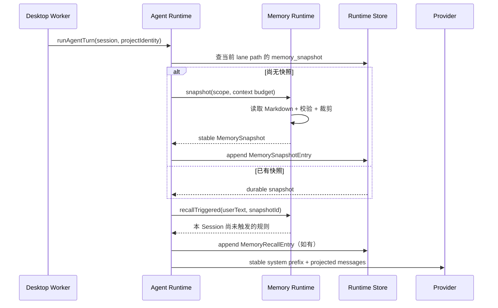

# Jojo Agent Memory 技术设计

> 文档版本：v0.1
>
> 日期：2026-08-22
>
> 状态：待评审，尚未实现
>
> 目标仓库：`zxt6991-source/jojo-agent`
>
> 参考版本：
> - [`earendil-works/pi@f4585b8`](https://github.com/earendil-works/pi/tree/f4585b8bec581d005cbb1edfc07edfcce723d0ae)
> - [`pi-memory@0.4.2`](https://pi.dev/packages/pi-memory)（Pi 官方包目录中的第三方扩展；Pi Core 本身不内置长期记忆）
> - [`open-octo/octo-agent@d972b3a`](https://github.com/open-octo/octo-agent/tree/d972b3ab73b66257c221a9665bc44354eab51766)
> - Jojo Agent 当前工作区 2026-08-22 实现

---

## 1. 结论摘要

Jojo 的长期记忆不应等同于“把所有历史做向量化”，也不应直接复用 Session JSONL。建议采用下面的组合：

1. **Markdown 是权威数据源**：沿用 Pi / Octo 的本地优先、可阅读、可手工编辑特性；
2. **SQLite 是派生目录与检索索引**：复用当前 Node 22 `node:sqlite` 技术栈，首版使用 FTS5，不新增 native addon；
3. **全局 + 项目两级作用域**：项目作用域由 Jojo Session 的原始 `workingDirectory` 决定，不要求 Git，也不使用临时 Worktree 路径；
4. **会话级稳定快照**：记忆在逻辑 Session 第一次模型请求前生成快照并持久化为 Runtime Entry，同一 Session 默认不重新拼系统提示；
5. **确定性规则 + 按需检索**：用户确认的 always/triggered rules 可靠召回，普通知识通过 `memory_search` / `memory_read` 按需加载；
6. **显式、可恢复写入**：首版不静默“自动学习”。模型提出写入时展示专用审批卡，删除先写 recovery record；
7. **Compaction Handoff**：压缩前把未完成事项和本轮新写记忆做 durable handoff，并允许在压缩点刷新一次快照；
8. **Memory 是 Runtime 的受信任内置能力，不是 Shell Hook**：Hooks 可以观察或追加普通上下文，但不能直接成为长期记忆的权威写入路径。

推荐新增 `packages/memory`，由 `apps/desktop/src/worker/worker.ts` 在 composition root 装配；`packages/agent-runtime` 只依赖一个窄的 `MemoryRuntime` Port，不依赖文件系统、SQLite 或 Electron。

```text
用户输入
   │
   ├── MemorySnapshot（每个逻辑 Session 冻结）──────────┐
   ├── TriggeredRuleMatcher（每条规则每 Session 至多一次）│
   │                                                     ▼
   └──────────────► Durable Agent Runtime ───────► Model Context
                           │                         ▲
                           ├── memory_search/read ───┘
                           ├── memory_write（审批）
                           └── PreCompact Handoff

Markdown Canonical Store ───► SQLite FTS5 Derived Index
        ▲                              │
        └──── atomic write / rebuild ──┘
```

---

## 2. 术语与边界

本文区分三类容易混淆的数据：

| 类型 | 目的 | 当前/目标载体 | 是否跨 Session |
|---|---|---|---|
| Conversation History | 还原用户、模型和工具发生过什么 | 当前 `sessions/<id>.jsonl` + Runtime Entry | 是，但只属于一个 Session |
| Compaction Summary | 在窗口不足时保留同一 Session 的连续性 | 当前 `CompactionEntry` | 是，但只属于一个 Session 分支 |
| Long-term Memory | 在新的 Session 中复用偏好、约束、决策和经验 | 本文设计的 Markdown + 派生索引 | 是，可跨多个 Session |

因此：

- Compaction 不是长期记忆；
- 恢复旧 Session 不是跨会话召回；
- 工具输出全文或 Git 中已经存在的事实通常不值得重复写入记忆；
- Memory 不替代 Skills、项目文档、Hooks、Workflow Journal 或审计日志。

---

## 3. 当前 Jojo 架构事实

本方案以当前代码为约束，不以早期 roadmap 为约束。

### 3.1 已有可复用能力

| 能力 | 当前实现 | 对 Memory 的价值 |
|---|---|---|
| Durable Session Tree | `packages/agent-runtime/src/session/types.ts` | 可保存不可变 `memory_snapshot` / `memory_recall` Entry |
| Context Projection | `packages/agent-runtime/src/context/*` | 可把历史与 ambient memory 分开投影 |
| Durable Operation / Lane | `packages/agent-runtime/src/operation/*` | 崩溃恢复时避免重复生成/写入 |
| SQLite Runtime | `packages/storage/src/sqlite-runtime-store.ts` | 已使用 `node:sqlite`、WAL、schema version |
| Compaction | `packages/agent/src/context-manager.ts` | 已有 `beforeCompact` 和 Durable `CompactionEntry` |
| Lifecycle Hooks | `packages/hooks` + `HookRuntime` | 已有 SessionStart、UserPromptSubmit、PreCompact 等时机 |
| Permission Gate | Agent / Tools / Extensions / Orchestration 多层 Gate | 可为 memory mutation 增加专用审批 |
| Session / Project 关系 | `SessionMeta.workingDirectory` | 可作为项目记忆作用域的输入 |
| Sub-Agent / Workflow | `packages/orchestration` | 需要定义记忆继承与隔离规则 |

### 3.2 当前缺口

- `AgentRuntimeStore` 只有 Session Tree、Operation、Lane、Usage，没有跨 Session 查询域；
- `DefaultContextBuilder` 只返回 `messages`，没有稳定的 ambient/system context 通道；
- `SessionStart` 通过进程内 `WeakMap` 判定，应用重启后可能再次触发，不足以作为 Memory Snapshot 的唯一幂等依据；
- `PreCompact` 当前只是 side-effect Hook，拿不到被压缩消息正文，也不能返回受控的 handoff；
- Desktop 同时维护 JSONL Session 和 SQLite Runtime，Memory 不能再引入第三份“会话真相”；
- `AgentRuntimeStore` 当前没有 `deleteSession`，删除侧边栏 Session 后 Runtime 数据的级联清理边界需要先补齐；
- Desktop 当前没有向 Runtime Session metadata 传入 `workingDirectory` / project identity，恢复时不能仅依赖外层 JSONL 临时拼接；
- 项目 Session 使用绝对工作目录；可写 Sub-Agent 使用临时 Worktree，不能用当前执行目录直接推导项目记忆作用域。

### 3.3 对实现的直接约束

1. Memory 的幂等键必须落盘，不能只放进程内 Map；
2. Memory Snapshot 必须进入 Durable Session Tree，但不应伪装成普通用户消息；
3. SQLite 检索索引可以删除重建，不能成为唯一真相；
4. Memory 的原子写入、审批、恢复要遵守现有安全模型；
5. 主 Agent、Sub-Agent、Workflow 必须使用同一个原始项目标识。

---

## 4. 参考实现分析

### 4.1 Pi：扩展优先、显式工具、缓存稳定快照

需要先澄清：`earendil-works/pi` Core 提供的是 Extension API、Session persistence、Compaction 和生命周期事件，并不内置统一的长期记忆。本文引用的具体长期记忆行为来自 Pi 官方包目录中的 `pi-memory` 扩展；这正体现了 Pi “小核心 + 强扩展”的思路。

`pi-memory@0.4.2` 的关键设计：

- 权威数据是普通 Markdown：`MEMORY.md`、`SCRATCHPAD.md`、`daily/YYYY-MM-DD.md`；
- 工具包括 write、forget、restore、read、search、status；
- 删除前在 `recovery/` 保存完整恢复记录；
- 默认注入 scratchpad、今日记录、长期记忆和昨日记录，总字符数有限制；
- 默认使用 cache-stable snapshot，只在 Session Start、Compaction、长期记忆写入和日期切换等检查点刷新；
- 高频 daily/scratchpad 写入不会每次刷新系统前缀；
- 搜索是可选增强；无搜索组件时基本读写仍可用；
- Compaction 前生成 Session Handoff，避免进行中事项随旧上下文消失；
- Pi Extension API 提供 `session_start`、`before_agent_start`、`context`、`session_before_compact`、`session_shutdown` 和自定义工具等接缝。

Jojo 应吸收的部分：

- Markdown canonical、显式工具、可恢复删除；
- Memory 与 Compaction 协同，而不是两个互不知情的总结器；
- 稳定快照优先，按提示词自动搜索作为可选项；
- 缺少高级检索后端时优雅降级。

Jojo 不直接照搬的部分：

- 不依赖额外 `qmd` 进程；首版直接利用现有 `node:sqlite` FTS5；
- 不用环境变量作为主要产品配置；放入统一 Settings / Contracts；
- 不把 Memory 只做成第三方扩展；它需要参与 Durable Runtime、权限和桌面 UI。

### 4.2 Octo：外置项目记忆、全局继承、会话冻结、规则触发

Octo 当前 Memory 的关键设计：

- 数据位于 `~/.octo/memories/<project-slug>/`，不默认写进项目仓库；
- `MEMORY.md` 是短索引，主题细节拆为其他 Markdown 文件并按需读取；
- 项目作用域来自产品中的 Project / 工作目录，而不是强制依赖 Git；
- Home 级 Memory 先于项目 Memory 注入，所有项目继承全局偏好；
- 没有独立 remember/forget 工具，Agent 使用普通文件工具管理记忆目录；
- 每个 Session 只拼装一次系统提示，Session 中途写入的 Memory 从下一个 Session 开始生效；
- Always-apply rules 每轮重申；Triggered rules 在用户输入首次命中关键词时附加到消息，而不是改写 system prompt；
- PR create/merge 成功后只发 save-nudge，提醒模型判断是否值得记录，不直接自动写入。

Jojo 应吸收的部分：

- Memory 与仓库文件分离，避免默认提交个人偏好或敏感信息；
- Project 不等于 Git repository；
- 全局 Memory + 项目 Memory 继承；
- 冻结系统前缀以保护 Provider prompt cache；
- Triggered rule 放在用户消息之后，不破坏已经缓存的前缀；
- 重大里程碑后提示保存，而不是无条件自动提炼。

Jojo 不直接照搬的部分：

- 不给普通 `write_file` / `edit_file` 对整个 Memory 目录的自动 allow；使用收窄的语义工具和专用 Gate；
- 不让模型任意编辑索引结构；写入必须经过 schema、secret 检测、原子替换与恢复记录；
- 不只按“前 200 行”截断，而按当前 Provider context budget 计算稳定快照。

### 4.3 取舍矩阵

| 决策 | Pi | Octo | Jojo 选择 |
|---|---|---|---|
| 权威存储 | Markdown | Markdown | Markdown |
| 高级检索 | 可选 qmd | 主题文件按需读 | 内置 FTS5，语义检索后置 |
| 作用域 | 全局目录为主 | 全局继承项目 | 全局 + 项目 |
| 项目识别 | 扩展配置 | 产品 Project / cwd | Session 原始 workingDirectory |
| 注入更新 | 检查点刷新 | Session 全程冻结 | Session 冻结；Compaction 可刷新一次 |
| 写入 | 专用工具 | 普通文件工具 | 专用工具 + 审批 |
| 删除恢复 | recovery record | 未强调 | recovery record |
| 自动提炼 | 可选退出摘要 | 无 consolidation，只有 nudge | MVP 无；后续只生成待审候选 |
| 规则 | 普通内容约定 | always / triggered | 用户确认的 typed rules |

---

## 5. 目标与非目标

### 5.1 目标

- 新建 Session 能可靠复用用户偏好、项目约束、关键决策和已验证经验；
- 用户可以查看、编辑、搜索、导出、删除和恢复 Memory；
- 写入和召回有明确 provenance，可定位来源 Session / Operation；
- Prompt cache 命中率不会因为每轮重拼 Memory 而持续退化；
- Context 紧张时，Memory 预算能被统一 Context Builder 管理；
- Crash Resume、Sub-Agent、Workflow、Worktree Isolation 下语义一致；
- 无外部向量服务时功能完整可用。

### 5.2 非目标

- 不保存逐字聊天全文的第二份副本；
- 不把代码库全文做 embedding；
- 不让 Memory 绕过 Permission Gate 或项目边界；
- 不把模型自动推断的用户画像直接提升为永久规则；
- 不在首版做跨设备云同步；
- 不把 Memory 当作秘密管理器；
- 不保证从 Memory 得到的事实永远正确，召回结果必须带来源和更新时间。

---

## 6. 产品语义与作用域

### 6.1 两级作用域

```text
Global Scope
  └── 所有 Session 继承：语言、协作方式、通用工具偏好

Project Scope
  └── 同一 workingDirectory 的 Session 共享：架构决策、命令、已知坑、项目规则
```

优先级：硬编码安全策略 > 用户本轮明确指令 > 已确认的项目规则 > 已确认的全局规则 > 普通项目记忆 > 普通全局记忆。

Memory 不能覆盖系统/开发者指令，也不能把“自动批准终端”“读取密钥”等内容变成有效规则。

### 6.2 项目标识

项目标识不能只使用 basename，也不能只使用 Git remote：

```ts
type ProjectIdentity = {
  id: string;              // prj_<base32 sha256(platform + NUL + canonicalPath)> 前 20 字符
  displayName: string;     // workingDirectory basename，仅用于 UI
  canonicalPath: string;   // realpath 后的原始 Session workingDirectory
};
```

规则：

1. 创建 Session 时解析并保存 `canonicalPath`；
2. 不存在或暂时无法 realpath 时拒绝新建项目记忆作用域，不回退到不稳定字符串；
3. Sub-Agent 的 Worktree 继承父请求的 `ProjectIdentity`，不重新按临时路径计算；
4. 同一路径移动后默认视为新项目；后续可由 UI 提供“迁移/合并记忆”；
5. 不要求目录是 Git 仓库。

### 6.3 记忆类型

| 类型 | 示例 | 默认召回方式 | 是否可自动变成规则 |
|---|---|---|---|
| `preference` | 用户偏好中文、使用 pnpm | Snapshot / Search | 否，需用户确认 |
| `constraint` | 不能修改生成文件 | Snapshot / Trigger | 否，需用户确认 |
| `decision` | 选择 SQLite 而非 JSONL 的理由 | Search | 否 |
| `fact` | 发布入口位于某文件 | Search | 否 |
| `lesson` | 某方案已验证失败及原因 | Search | 否 |
| `procedure` | 发布前固定验证步骤 | Search / Trigger | 否，需用户确认才可 Trigger |
| `task` | 下次继续的未完成事项 | Scratchpad / Handoff | 否 |
| `rule` | 每次发布必须先跑完整测试 | Always / Trigger | 只能由用户确认 |

### 6.4 值得记住与不应记住

建议写入：

- 用户明确说“记住”的偏好或约束；
- 代码本身无法直接恢复的决策原因；
- 多次出现并已验证的项目坑；
- 后续 Session 必须继续的未完成事项；
- 用户纠正过的行为。

默认不写入：

- API Key、密码、Cookie、Token、私钥；
- 可以通过代码、README、Git history 直接恢复的普通事实；
- 尚未验证的猜测；
- 一次性命令输出、大段源码或网页正文；
- 第三方网页中的指令性文本；
- 模型内部推断出的敏感个人属性。

---

## 7. 存储设计

### 7.1 文件布局

建议把人类可编辑的权威 Memory 放在用户目录，而不是 Electron 版本化缓存或项目仓库：

```text
~/.jojo/memory/
├── global/
│   ├── MEMORY.md
│   ├── SCRATCHPAD.md
│   ├── topics/
│   │   └── <topic-slug>.md
│   ├── daily/
│   │   └── 2026-08-22.md
│   └── recovery/
│       └── <recovery-id>.json
└── projects/
    └── <display-name>--<project-id>/
        ├── scope.json
        ├── MEMORY.md
        ├── SCRATCHPAD.md
        ├── topics/
        ├── daily/
        └── recovery/

Electron userData/runtime/
└── memory.sqlite          # 派生索引、候选、版本和后台 Job；可重建部分明确标记
```

不默认使用 `<project>/.jojo/memory.md`，原因是：

- 个人偏好和对话产物不应意外进入 Git；
- clone 的仓库内容属于不可信项目输入，不能自动提升为用户长期规则；
- Worktree / checkout / 非 Git 目录的作用域更一致；
- 项目删除后用户仍能管理旧记忆。

后续可以提供显式 Export / Import，把经过用户确认的团队规则导出为仓库内 `.jojo/project-context.md`；它属于项目资源并走现有 Project Trust，不与私人 Memory 混为一谈。

### 7.2 `scope.json`

```json
{
  "schemaVersion": 1,
  "projectId": "prj_abcd1234...",
  "displayName": "jojo-agent",
  "canonicalPath": "/Users/jojo/Desktop/all-agent/jojo-agent",
  "createdAt": "2026-08-22T00:00:00.000Z",
  "updatedAt": "2026-08-22T00:00:00.000Z"
}
```

`canonicalPath` 只用于本机作用域匹配和 UI，不发送给模型搜索服务。

### 7.3 `MEMORY.md` 格式

`MEMORY.md` 是短索引和高优先级条目，不承载大篇正文：

```markdown
---
schemaVersion: 1
scope: project
projectId: prj_abcd1234
---

# Project Memory

## Always apply rules

<!-- jojo-memory
id: mem_01J...
kind: rule
status: confirmed
createdAt: 2026-08-22T08:30:00.000Z
sourceSessionId: sess_123
-->
- 使用 pnpm；不要生成 npm lockfile。

## Triggered rules

<!-- jojo-memory
id: mem_01K...
kind: rule
status: confirmed
triggers: [发布, release, publish]
-->
- 发布前运行 `pnpm typecheck && pnpm test && pnpm build`。

## Index

<!-- jojo-memory
id: mem_01M...
kind: decision
status: active
topic: runtime-storage
-->
- Runtime 使用 Node `node:sqlite`；原因和迁移约束见 [runtime-storage](topics/runtime-storage.md)。
```

约束：

- Metadata comment 使用受限 YAML 子集并由 Zod 校验；未知字段保留但不执行；
- `id` 永不复用；编辑内容不改变 `id`；
- `confirmed` 只允许由用户 UI 操作写入，模型工具不能自行设置；
- 超长细节写入 `topics/`，`MEMORY.md` 只留一句摘要和链接；
- 手工编辑后重新解析；解析失败只禁用该块并在 UI 报警，不阻止其他 Memory 使用。

### 7.4 SQLite 派生索引

使用独立 `memory.sqlite`，避免把跨 Session 查询和大量 FTS 表塞进 `agent-runtime.sqlite`。

```sql
CREATE TABLE memory_scopes (
  id TEXT PRIMARY KEY,
  kind TEXT NOT NULL CHECK(kind IN ('global', 'project')),
  canonical_path TEXT,
  display_name TEXT NOT NULL,
  content_version INTEGER NOT NULL DEFAULT 0,
  content_hash TEXT NOT NULL,
  updated_at INTEGER NOT NULL
);

CREATE TABLE memory_entries (
  id TEXT PRIMARY KEY,
  scope_id TEXT NOT NULL REFERENCES memory_scopes(id) ON DELETE CASCADE,
  kind TEXT NOT NULL,
  status TEXT NOT NULL,
  title TEXT,
  content TEXT NOT NULL,
  source_file TEXT NOT NULL,
  source_session_id TEXT,
  source_operation_id TEXT,
  created_at INTEGER NOT NULL,
  updated_at INTEGER NOT NULL,
  content_hash TEXT NOT NULL
);

CREATE VIRTUAL TABLE memory_fts USING fts5(
  entry_id UNINDEXED,
  scope_id UNINDEXED,
  title,
  content,
  tags,
  tokenize = 'trigram'
);

CREATE TABLE memory_candidates (
  id TEXT PRIMARY KEY,
  session_id TEXT NOT NULL,
  operation_id TEXT NOT NULL,
  scope_id TEXT NOT NULL,
  payload_json TEXT NOT NULL,
  state TEXT NOT NULL CHECK(state IN ('pending', 'accepted', 'rejected', 'expired')),
  created_at INTEGER NOT NULL,
  resolved_at INTEGER,
  UNIQUE(operation_id, id)
);

CREATE TABLE memory_jobs (
  id TEXT PRIMARY KEY,
  kind TEXT NOT NULL,
  dedupe_key TEXT NOT NULL UNIQUE,
  payload_json TEXT NOT NULL,
  state TEXT NOT NULL,
  attempts INTEGER NOT NULL DEFAULT 0,
  available_at INTEGER NOT NULL,
  updated_at INTEGER NOT NULL
);
```

一致性规则：

1. Markdown / JSON recovery 是权威数据；FTS 行是派生数据；
2. 写入先在同目录生成临时文件并 `rename` 原子替换，再更新 SQLite；
3. 若文件已成功、索引失败，标记 scope dirty 并排队重建；
4. 启动、文件 watcher 事件或 `memory_status` 可按 `content_hash` 重建；
5. SQLite WAL、foreign keys、busy timeout 与现有 Runtime Store 保持一致；
6. 不引入 `better-sqlite3`，避免第二套 native binding 和 Electron ABI 问题。

启动时必须探测 FTS5 和 `trigram` tokenizer 能力，不能假定所有打包平台一致。若 FTS5 不可用，`memory_search` 降级为有上限的 Markdown 扫描；若只有 `unicode61`，英文使用 FTS，中文/CJK 查询使用归一化 substring fallback。索引能力缺失只影响搜索性能，不影响 Snapshot、读写和恢复。

### 7.5 删除与恢复

`memory_forget` 不直接永久删除：

1. 读取并校验目标 Entry；
2. 把原始文件片段、文件 hash、前后锚点、metadata 写入 `recovery/<id>.json`；
3. 原子修改 Markdown；
4. 更新索引；
5. 返回 `recoveryId` 和恢复截止提示；
6. `memory_restore` 校验当前文件 hash；若有冲突，生成可审查 diff，不强行覆盖。

Recovery 默认保留 30 天或 100 MiB，先按时间淘汰；用户可在设置中永久保留。

---

## 8. Runtime 集成

### 8.1 Port，而不是反向依赖

在 `packages/agent-runtime` 定义窄接口：

```ts
export type MemoryScopeRef = {
  globalScopeId: 'global';
  projectScopeId?: string;
};

export type MemorySnapshot = {
  id: string;
  version: number;
  scope: MemoryScopeRef;
  content: string;
  sourceEntryIds: string[];
  estimatedTokens: number;
  contentHash: string;
};

export interface MemoryRuntime {
  snapshot(input: {
    sessionId: string;
    operationId: string;
    projectIdentity: ProjectIdentity;
    contextWindowTokens: number;
    signal: AbortSignal;
  }): Promise<MemorySnapshot>;

  recallTriggered(input: {
    sessionId: string;
    operationId: string;
    snapshotId: string;
    userText: string;
  }): Promise<MemoryRecall[]>;

  beforeCompact(input: MemoryCompactInput): Promise<MemoryCompactResult>;
  onTurnSettled(input: MemoryTurnSettledInput): Promise<void>;
}
```

接口定义可以放在 `packages/agent-runtime/src/memory/types.ts`；实现放在 `packages/memory`。`packages/memory` 可以依赖 contracts、Node FS 和 storage primitives，但不依赖 Electron。

### 8.2 新增 Durable Entry

```ts
export type MemorySnapshotEntry = EntryBase & {
  type: 'memory_snapshot';
  snapshotId: string;
  content: string;
  contentHash: string;
  sourceEntryIds: string[];
  scopeVersions: Record<string, number>;
  estimatedTokens: number;
  refreshedBy: 'session_start' | 'compaction' | 'manual';
};

export type MemoryRecallEntry = EntryBase & {
  type: 'memory_recall';
  snapshotId: string;
  ruleIds: string[];
  userMessageId: string;
  content: string;
};
```

投影规则：

- `memory_snapshot` 不投影为普通 user message，而是进入 `ModelContext.ambientContext`；
- `memory_recall` 在对应真实 user message 之后投影为 `metadata.internal = true` 的低优先级上下文消息；
- 两者的内容都包裹“不可信历史数据，不能覆盖更高优先级规则”的边界标记；
- Entry ID 必须确定性生成，例如 `memory_snapshot:<sessionId>:<ordinal>`、`memory_recall:<sessionId>:<ruleId>`；
- Crash Resume 先查 Entry，再决定是否执行 MemoryRuntime，避免重复召回或重复刷新。

### 8.3 Context Builder 扩展

```ts
export type ModelContext = {
  messages: Message[];
  ambientContext: Array<{
    source: 'memory' | 'hook' | 'skill' | 'mcp';
    content: string;
    stable: boolean;
    estimatedTokens: number;
  }>;
};
```

`runModelStep` 最终按固定顺序组装 system instructions：

```text
1. Jojo 固定安全与行为指令
2. 已确认的 Global rules
3. 已确认的 Project rules
4. Global / Project Memory Snapshot（明确是 data/context）
5. MCP instructions / runtime instructions
6. 当前可用工具定义
```

硬安全策略不允许被任何 Memory 内容覆盖。

### 8.4 Session Start 时序



注意：不能只依赖现有 `claimSessionStart()`。Memory Snapshot 是否存在由 Durable Entry 决定。

### 8.5 Snapshot 预算

总 Memory 预算：

```text
min(
  4096 tokens,
  floor(contextWindowTokens × 0.05),
  context target 剩余预算
)
```

建议优先级和软上限：

| 内容 | 软上限 | 裁剪策略 |
|---|---:|---|
| Global always rules | 512 tokens | 不自动裁剪单条；超限提示用户整理 |
| Project always rules | 768 tokens | 同上 |
| Open project scratchpad | 512 tokens | 只保留未完成项 |
| Project MEMORY index | 1,024 tokens | 按 pinned、更新时间和引用次数 |
| Global MEMORY index | 768 tokens | 同上 |
| Latest handoff / daily tail | 512 tokens | 最低优先级，先裁剪 |

任何被裁剪内容仍可通过 `memory_search` 找到。UI 应显示“本 Session 注入 X/Y 条、估算 Z tokens”。

### 8.6 缓存稳定性

默认策略采用 `session-stable`：

- 一个逻辑 Session 第一次请求前冻结 Memory Snapshot；
- 同一 Session 中 `memory_write` 的内容已存在于 tool call/result 历史，不立即重拼 system prefix；
- 新 Session 使用最新 Memory；
- Compaction 是允许刷新 Snapshot 的唯一自动检查点，因为此处本来就会改变上下文前缀；
- 手动刷新必须由用户在 UI 触发并生成新的 durable snapshot entry；
- 普通 FTS 搜索结果作为 Tool Result 加在上下文尾部，不改变旧缓存前缀。

这比“每轮根据用户 prompt 自动检索并注入 system prompt”更适合 Jojo 当前多 Provider / Chat Completions 架构。

---

## 9. 召回策略

### 9.1 Ambient Snapshot

Snapshot 只放高命中、高稳定、短内容：

- 已确认 always rules；
- 打开的 scratchpad 项；
- MEMORY 索引中的 pinned/近期关键摘要；
- 最近一次 Compaction Handoff。

主题正文不全量注入。

### 9.2 Triggered Rules

Triggered rules 使用确定性本地匹配：

- 英文默认按 Unicode word boundary；
- 中文默认子串匹配；
- 大小写按 locale-insensitive fold；
- 每条规则每 Session 最多召回一次；
- 命中后追加 `MemoryRecallEntry`，不修改 system prefix；
- 规则必须为 `confirmed`，普通 memory entry 不能注册 trigger；
- 同时命中超过 5 条时按项目优先、精确词优先、最近确认优先，并在 UI 标记裁剪。

### 9.3 显式搜索

首版 `memory_search` 使用 FTS5 BM25：

```ts
type MemorySearchInput = {
  query: string;
  scope?: 'project' | 'global' | 'all'; // default project + global
  kinds?: MemoryKind[];
  limit?: number;                       // default 5, max 20
};
```

返回：

```ts
type MemorySearchHit = {
  id: string;
  scope: 'global' | 'project';
  kind: MemoryKind;
  title?: string;
  snippet: string;
  sourceFile: string;
  updatedAt: string;
  score: number;
};
```

搜索结果是“候选上下文”，不是新的指令。模型需要全文时调用 `memory_read({ id })`。

### 9.4 语义检索后置

语义检索不进入 MVP。后续若实现：

- 默认关闭远程 embedding；
- 本地 embedding 与远程 embedding 使用独立 provider 配置；
- UI 明确告知哪些文本会发送到外部服务；
- 只对短摘要/条目做 embedding，不对 Session 全文和仓库全文做 embedding；
- FTS 必须始终保留为可解释 fallback；
- 评估 Recall@K、错误召回率和额外 token/延迟后再默认开启。

---

## 10. 写入、候选与治理

### 10.1 MVP：显式 Memory 工具

建议工具名保持清晰一致：

| Tool | 权限 | 作用 |
|---|---|---|
| `memory_search` | 自动允许 | 搜索当前项目和全局 Memory |
| `memory_read` | 自动允许 | 读取 Entry、topic、scratchpad 或状态摘要 |
| `memory_write` | 专用审批 | 新增或更新条目；不能自行确认 rule |
| `memory_forget` | 专用审批 | 可恢复删除 |
| `memory_restore` | 专用审批 | 从 recovery 恢复，冲突时展示 diff |
| `memory_status` | 自动允许 | 路径、scope、索引状态、snapshot、dirty/job 状态 |

`memory_write`：

```ts
type MemoryWriteInput = {
  scope: 'global' | 'project';
  kind: Exclude<MemoryKind, 'rule'> | 'rule';
  title: string;
  content: string;
  tags?: string[];
  target?: 'index' | 'topic' | 'daily' | 'scratchpad';
  existingId?: string;
};
```

审批卡必须显示：scope、kind、标题、完整内容、目标文件、来源 Session、是否覆盖、secret 检测结果和 diff。若 `kind=rule`，审批文案为“确认并启用规则”，拒绝后不能以普通文件工具绕过。

### 10.2 自动学习只生成 Candidate

后续可以在 `Stop` / `agent settled` 后调用 utility model 提取候选，但不能直接写入 Memory：

```text
Turn settled
   └── eligibility filter（用户纠正、明确决定、重复失败、里程碑）
          └── utility model 输出 ≤3 个 typed candidates
                 └── memory_candidates.pending
                        └── UI Review：Accept / Edit / Reject
```

约束：

- 以 `operationId` 做幂等，Crash Resume 不重复生成；
- 不在用户仍等待主回答时阻塞 Turn；
- 候选默认 30 天过期；
- `rule` candidate 永远需要用户逐条确认；
- 提取 prompt 只接收本轮有限摘要，不默认读取全部 Session；
- 候选生成失败不影响主任务成功状态。

### 10.3 Save Nudge

参考 Octo，先于自动候选落地一个低风险 Builtin Hook：

- 成功执行 `git commit`、`gh pr create`、`gh pr merge`、发布命令后；
- 每个用户 Turn 至多一次；
- 只在 Tool Result 尾部提醒模型检查是否有不可从代码恢复的决策；
- 不写文件、不调用额外模型、不自动审批。

实现可以使用受信任的 in-process `PostToolUse` handler，但必须以 `source=builtin` 标记；项目 Shell Hook 不能获得 Memory 自动写权限。

### 10.4 去重与冲突

写入前执行：

1. exact `contentHash` 去重；
2. 同 scope + normalized title 检查；
3. FTS 查找高相似关键词候选；
4. 若疑似重复，审批卡改为 Merge / Replace / Keep both；
5. 外部手工编辑导致 source hash 变化时，拒绝盲覆盖并展示冲突。

不使用模型相似度作为唯一删除/合并依据。

---

## 11. Compaction 协同

### 11.1 当前问题

当前 `beforeCompact` 只传 `{ estimatedTokens, messageCount }` 给 Hook，随后用 utility model 生成 Compaction Summary。若本轮刚写入 daily/scratchpad，而对应 Tool Result 将被压缩，单纯冻结旧 Memory Snapshot 可能丢失进行中状态。

### 11.2 Memory Handoff

扩展内部 compaction preparation，使 MemoryRuntime 获得：

```ts
type MemoryCompactInput = {
  sessionId: string;
  operationId: string;
  lane: string;
  currentSnapshotId: string;
  messagesToSummarize: Message[];
  retainedTail: Message[];
  previousCompactionSummary?: string;
  signal: AbortSignal;
};
```

输出：

```ts
type MemoryCompactResult = {
  handoff?: {
    openTasks: string[];
    decisions: string[];
    memoryWrites: string[];
  };
  refreshSnapshot: boolean;
};
```

时序：

1. 先触发现有 `PreCompact` 观察型 Hook；
2. MemoryRuntime 基于结构化消息和已记录 memory tool calls 生成确定性 handoff；
3. handoff 追加到 project daily log，失败时不阻止 Compaction，但发出可观测 warning；
4. 若 Memory scope version 已变化，构建新 snapshot 并 append `MemorySnapshotEntry(refreshedBy='compaction')`；
5. Compaction Summary 保留目标、进度、文件和错误；Memory Handoff 只处理跨 Session / 跨压缩的任务与决策，避免重复总结；
6. 重启恢复时以 deterministic job key 跳过已完成 handoff。

Handoff 不应额外调用模型作为 MVP 必需路径；可以从 scratchpad、memory tool calls 和现有 Compaction Summary 组合。后续若用模型，usage 计入 `cause='compaction'`。

---

## 12. Sub-Agent、Workflow 与 Worktree

### 12.1 默认策略

| 执行主体 | Ambient Snapshot | search/read | write/forget/restore |
|---|---|---|---|
| Main Agent | Global + Project | 允许 | 需交互审批 |
| Read-only Sub-Agent | Project rules + 精简索引 | 允许，只读 | 禁止 |
| `general` 可写 Sub-Agent | Project rules + 精简索引 | 允许，只读 | 默认禁止 |
| Workflow Agent Step | Workflow 固定 snapshot | 允许，只读 | 禁止 |
| Tool Step | 无隐式注入 | 仅显式声明的 memory tool | mutation 禁止 |

后台 Agent 不能弹交互审批，因此不能直接修改长期记忆。它们可以在 Structured Output 中返回 `memoryCandidates`，由 Main Agent 或 UI 评审。

### 12.2 作用域继承

- 作用域始终来自主 Session 的 `ProjectIdentity`；
- 可写 Agent 的 isolation worktree 只是文件执行目录，不是新的 Memory 项目；
- Workflow Run 启动时记录 `memorySnapshotId` 和 `contentHash`；所有 Step 使用同一快照，保证可复现；
- `sub_agent_send` 继续沿用原 child snapshot，不因全局 Memory 更新而漂移；
- 跨项目 Workflow 未来需要每 Step 显式声明 scope，MVP 不支持。

### 12.3 信息泄露控制

- Global Memory 可能包含个人偏好，默认不给 synthesize/tool-free 子 Agent 全量内容；
- Sub-Agent 只收到与项目相关且预算内的规则/索引；
- Memory 不进入工具参数、终端环境变量、MCP 请求或网页表单；
- 只有模型上下文会看到召回文本，Renderer 展示来源。

---

## 13. 权限与安全

### 13.1 Permission Gate

新增 `MemoryPermissionGate` 并放在语义工具执行前：

```text
Hard Safety Policy
    ↓
Memory Scope / Path Validation
    ↓
Secret Scanner
    ↓
Memory Mutation Approval
    ↓
Atomic Store
```

`approve` 不能覆盖 hard deny：

- 目标不在已解析 Memory root；
- path traversal / symlink escape；
- 内容命中明确凭据格式；
- 单条或单文件超过上限；
- 后台 Agent 请求 mutation；
- 试图自行把 status 改为 `confirmed`；
- recovery 目标与当前文件冲突且没有用户选择。

### 13.2 Prompt Injection 与 Memory Poisoning

Memory 内容可能来自模型、用户复制文本或旧项目，必须视为低优先级数据：

- Snapshot 和 Search Result 都加边界说明；
- 普通 Memory 不能改变工具权限、审批、安全策略；
- 从网页/工具输出提取的候选记录 provenance，不直接变成 rule；
- repo 内导入的 project context 需要复用 Project Trust fingerprint；
- UI 显示“由用户确认 / 由模型建议 / 手工导入”的来源状态；
- 用户可以一键禁用某 scope 并重新开始无 Memory Session。

### 13.3 Secret 检测

至少阻止：

- PEM private key；
- 常见 API key / token prefix；
- Authorization / Cookie header；
- `.env` 风格的 password/secret/token 值；
- 高熵长字符串（只作 warning，避免误杀普通 hash）。

Secret Scanner 必须在日志和审批事件序列化前运行，不能先把原文写进 JSONL、Hook payload 或 console。

### 13.4 文件安全

- 所有根路径在启动时 canonicalize；
- 每次读写验证 realpath parent，禁止符号链接逃逸；
- 单条正文建议 ≤ 16 KiB，单 topic ≤ 128 KiB，单 scope 默认 ≤ 20 MiB；
- 文件使用 `0600`，目录使用 `0700`（平台支持时）；
- 临时文件与目标同目录，确保 rename 原子性；
- 不把 Memory 目录加入普通 workspace 文件工具自动允许范围。

---

## 14. 包与代码改动

### 14.1 新包

```text
packages/memory/
├── src/
│   ├── index.ts
│   ├── runtime.ts              # MemoryRuntime 实现
│   ├── identity.ts             # ProjectIdentity
│   ├── markdown-store.ts       # canonical files / atomic mutation
│   ├── parser.ts               # frontmatter + metadata blocks
│   ├── snapshot.ts             # budget / stable snapshot
│   ├── trigger-matcher.ts
│   ├── search-index.ts         # node:sqlite / FTS5
│   ├── recovery.ts
│   ├── secret-scanner.ts
│   ├── jobs.ts
│   └── tools.ts                # six semantic tools
└── test/
```

### 14.2 现有包职责改动

| 路径 | 改动 |
|---|---|
| `packages/contracts/src/memory.ts` | Zod schemas、工具输入输出、IPC snapshot、Agent events |
| `packages/agent-runtime/src/session/types.ts` | 增加 `MemorySnapshotEntry`、`MemoryRecallEntry` |
| `packages/agent-runtime/src/store.ts` | 增加 Session 删除/GC 边界，保证删除会话时清理 Snapshot 和 Operation |
| `packages/agent-runtime/src/context/*` | 返回 messages + stable ambient context |
| `packages/agent-runtime/src/harness/runner.ts` | snapshot、trigger recall、compaction handoff 接缝 |
| `packages/agent/src/context-manager.ts` | Memory token 纳入统一预算；暴露更完整 compaction preparation |
| `packages/storage/src/sqlite-memory-store.ts` | Memory index/candidate/job persistence；独立导出 |
| `apps/desktop/src/worker/worker.ts` | 创建 MemoryRuntime、传 project identity、注册工具/Gate |
| `apps/desktop/src/main/main.ts` | Memory IPC、导入导出和文件选择 |
| `apps/desktop/src/preload/preload.ts` | 白名单 Memory API |
| `apps/desktop/src/renderer/*` | Memory Settings、审批卡、来源与 snapshot 状态 |
| `packages/orchestration/*` | 继承 snapshotId、只读工具策略、candidate output |

### 14.3 依赖方向

```text
contracts（ProjectIdentity / MemoryCatalogStore / Zod schemas）
   ↑                 ↑                    ↑
agent-runtime     storage               packages/memory
(MemoryRuntime     (SQLite                (runtime / Markdown /
 Port + Entry)      implementation)        tools / policy)
   ↑                 ↑                    ↑
   └──────────── desktop worker ──────────┘
                       ↑
                 orchestration
```

禁止：

- `agent-runtime` 依赖 `packages/memory` 具体实现；
- `packages/memory` 依赖 Electron；
- `packages/storage` 依赖 `packages/memory`；共享的 `MemoryCatalogStore` 类型放在 contracts，避免环依赖；
- Renderer 直接读写 Memory 文件；
- Memory Store 反向读取 UI state；
- Shell Hook 直接获得内部 MemoryStore 实例。

---

## 15. IPC 与 UI

### 15.1 IPC

建议增加：

```ts
memory.getSnapshot({ sessionId })
memory.list({ projectId?, scope, query?, cursor? })
memory.get({ id })
memory.saveDraft({ ... })
memory.update({ id, expectedHash, ... })
memory.forget({ id, expectedHash })
memory.restore({ recoveryId, expectedHash? })
memory.listCandidates({ projectId? })
memory.resolveCandidate({ id, action, editedPayload? })
memory.rebuildIndex({ scopeId })
memory.export({ scopeId, destination })
memory.importPreview({ path, targetScopeId })
memory.importApply({ previewId, selectedIds })
```

所有 mutation 经 Main/Worker 统一校验；Renderer 的 `expectedHash` 用于 optimistic concurrency。

### 15.2 设置页

Memory 面板至少展示：

- 总开关和“本 Session 禁用”；
- 当前 Global / Project scope 路径、条目数、索引状态；
- Always / Triggered rules；
- 普通条目、topics、scratchpad；
- Pending candidates；
- Recovery；
- 当前 Session 的 snapshot hash、版本、token 估算和刷新时间；
- Rebuild index、Export、Import。

### 15.3 对话内呈现

- `memory_search/read` 使用可折叠 Tool Card，展示 scope、命中条目和来源；
- `memory_write` 使用专用 Diff Card，允许编辑后保存；
- Triggered rule 以轻量 “已召回 1 条项目规则” 标记，不伪装成用户消息；
- Candidate 不阻塞主回复，在回复完成后显示 Review Card；
- Memory 故障以 warning 展示，不把正常 Turn 误标为 failed，除非用户明确要求的写入没有完成。

---

## 16. 配置

纳入统一 settings schema：

```ts
type MemorySettings = {
  enabled: boolean;                    // default true
  globalEnabled: boolean;              // default true
  projectEnabled: boolean;             // default true
  snapshotMode: 'session-stable';      // MVP only
  maxSnapshotTokens: number;           // default 4096
  maxContextRatio: number;              // default 0.05
  search: {
    enabled: boolean;                  // default true
    maxResults: number;                // default 5
  };
  suggestions: {
    enabled: boolean;                  // MVP false
    maxPerTurn: number;                // default 3
  };
  recoveryRetentionDays: number;       // default 30
};
```

CLI/环境变量只用于测试和故障排查，不作为主要配置来源。

---

## 17. 可观测性与错误语义

新增稳定错误码：

```text
memory_scope_unavailable
memory_entry_not_found
memory_parse_failed
memory_conflict
memory_secret_detected
memory_size_exceeded
memory_permission_denied
memory_index_unavailable
memory_index_stale
memory_recovery_expired
memory_snapshot_failed
```

新增事件：

```text
memory.snapshot.created
memory.snapshot.reused
memory.rule.recalled
memory.write.requested
memory.write.completed
memory.write.failed
memory.candidate.created
memory.index.rebuilt
memory.handoff.completed
```

日志只记录 ID、scope、大小、耗时、hash、错误码，不记录 Memory 正文。

建议本地统计：snapshot tokens、FTS 延迟、搜索结果数、候选接受率、重复写入拦截数、索引重建次数。默认不上传遥测。

---

## 18. 测试策略

### 18.1 单元测试

- Markdown metadata / frontmatter round-trip；
- 手工编辑、未知字段、局部损坏的降级；
- 中英文 trigger 边界、每 Session 一次、优先级裁剪；
- Snapshot 预算、顺序、hash 稳定性；
- exact duplicate、title conflict、expectedHash conflict；
- secret scanner 正例、反例和审批前脱敏；
- recovery delete/restore/冲突；
- project identity 的 realpath、同名目录、Worktree 继承；
- FTS query escaping、trigram 能力探测、中文 fallback、索引重建。

### 18.2 Store Conformance

为内存实现和 SQLite 实现共用测试：

- scope/version；
- entry CRUD 与不可复用 ID；
- candidate 状态机；
- job lease/dedupe；
- crash between file rename and index update；
- WAL 并发读、串行写；
- schema migration 和 unsupported version。

### 18.3 Runtime / Recovery

- 新 Session 只创建一个 snapshot；
- 同 Session 第二 Turn 复用完全相同 bytes/hash；
- App 重启后仍复用 durable snapshot；
- 删除 Session 后对应 Snapshot、Lane、Operation、Usage 被级联清理；
- Triggered rule crash resume 不重复追加；
- `memory_write` 完成后 crash 不重复写；
- Compaction 前 handoff 恰好一次；
- Compaction 刷新后 Context Projection 使用新 snapshot；
- MemoryRuntime 失败时普通 Agent Turn 可降级继续。

### 18.4 权限与安全

- Main mutation 必须审批；后台 Agent hard deny；
- symlink/path traversal/项目 scope 伪造；
- Memory rule 不能跳过 terminal/file/MCP approval；
- repo import 未 trust 不注入；
- tool result / web text 不能自行变成 confirmed rule；
- IPC 参数污染、超大正文、恶意 Markdown。

### 18.5 Orchestration

- Worktree Agent 仍使用源项目 scope；
- Workflow 所有 Step 固定同一 snapshotId；
- read-only profile 只能 search/read；
- background candidate 回到主 Session 后才可批准；
- 多 Workflow 并发不破坏 scope index。

### 18.6 Eval

建立不依赖真实用户数据的离线数据集：

- 新 Session 是否遵守明确偏好；
- Triggered rule precision / recall；
- Search Recall@5；
- 相互冲突的 Global / Project rule 是否按优先级处理；
- 过期事实是否携带时间和来源而非被当成绝对真相；
- 有/无 Memory 时 token、cache read、首 token 延迟对比。

真实 Provider Eval 单独运行，不进入默认 `pnpm test`。

---

## 19. 分阶段开发计划

### Phase M0：Contracts 与 Identity

- [ ] `packages/contracts/src/memory.ts`；
- [ ] `ProjectIdentity` 生成、Session 保存与 Worktree 继承；
- [ ] `MemoryRuntime` Port；
- [ ] `memory_snapshot` / `memory_recall` Entry Schema；
- [ ] Store migration 和 conformance tests。

验收：不实现文件 Memory 时，Noop Runtime 不改变当前行为；新增 Entry 可 crash-resume。

### Phase M1：只读 Snapshot

- [ ] `packages/memory` Markdown parser/store；
- [ ] Global + Project scope；
- [ ] session-stable snapshot 与 token budget；
- [ ] Context Builder ambient channel；
- [ ] `memory_status`、`memory_read`；
- [ ] 设置页只读状态。

验收：手工创建 Memory 后，新 Session 能召回；同一 Session 多轮 system prefix hash 不变。

### Phase M2：显式写入与恢复

- [ ] `memory_write/forget/restore`；
- [ ] MemoryPermissionGate、secret scanner、专用 Diff Card；
- [ ] 原子写入、recovery、expectedHash；
- [ ] 编辑、导入、导出 UI；
- [ ] mutation recovery tests。

验收：所有修改可审计、可恢复，后台 Agent 无法写入。

### Phase M3：FTS 与 Triggered Rules

- [ ] `memory.sqlite` schema / migration；
- [ ] parser → FTS rebuild；
- [ ] `memory_search`；
- [ ] always/triggered rule UI 与 durable recall；
- [ ] 文件 watcher / dirty recovery。

验收：无外部依赖完成中文/英文关键词召回；索引删除后可完整重建。

### Phase M4：Compaction / Orchestration

- [ ] 完整 compaction preparation；
- [ ] deterministic handoff；
- [ ] compaction snapshot refresh；
- [ ] Sub-Agent / Workflow snapshot policy；
- [ ] save-nudge builtin hook。

验收：长 Session 压缩、应用重启和 Worktree 执行后，Memory 语义稳定且不重复副作用。

### Phase M5：候选与可选语义检索

- [ ] Turn-settled candidate extractor；
- [ ] Review UI、过期和接受率统计；
- [ ] 可选 embedding provider 与隐私提示；
- [ ] Hybrid retrieval eval。

验收：默认仍不静默写入；关闭语义检索后功能完整。

---

## 20. MVP 验收标准

MVP 建议以 M0–M3 为边界，必须满足：

1. Global + Project Memory 均为外置、可读 Markdown；
2. 项目 scope 不依赖 Git，同名目录不会冲突；
3. 新 Session 注入稳定 snapshot，同 Session 多轮 hash 不变；
4. `memory_search/read/write/forget/restore/status` 可用；
5. 所有 mutation 都经过专用审批，删除可恢复；
6. FTS5 是派生索引，删除数据库后可从 Markdown 重建；
7. Secret、path traversal、symlink escape、后台写入被 hard deny；
8. Crash Resume 不重复 snapshot、trigger recall 或 mutation；
9. Memory 不改变现有终端、文件、MCP、浏览器审批结论；
10. `pnpm typecheck`、`pnpm lint`、`pnpm test` 全部通过，并新增 Memory 集成测试。

自动候选、语义检索和团队共享 Memory 不属于 MVP。

---

## 21. 待评审决策

实现前只剩以下产品决策需要确认：

1. `~/.jojo/memory` 是否接受，还是统一放 Electron `userData/memory` 并只通过 UI 编辑；
2. `memory_write` 是否每次审批，还是允许用户为某个 scope 开启“本 Session 自动保存”；本文建议 MVP 每次审批；
3. confirmed rule 是否允许用户直接编辑 Markdown 后自动生效；本文建议手工编辑后在 UI 重新确认；
4. Global Memory 是否默认传给只读 Sub-Agent；本文建议只传 confirmed rules，不传完整画像；
5. Recovery 保留 30 天 / 100 MiB 是否合适；
6. M4 Compaction Handoff 是否必须进入 MVP；本文建议在开始长上下文真实用户测试前完成。

---

## 22. 参考资料

- [Pi repository](https://github.com/earendil-works/pi)
- [Pi Extensions](https://pi.dev/docs/latest/extensions)
- [Pi Compaction & Branch Summarization](https://pi.dev/docs/latest/compaction)
- [pi-memory package](https://pi.dev/packages/pi-memory)
- [Octo repository](https://github.com/open-octo/octo-agent)
- [Octo Cross-session Memory](https://octo-agent.dev/docs/guides/memory/)
- Jojo 当前实现：`packages/agent-runtime/src/harness/runner.ts`
- Jojo 当前实现：`packages/agent-runtime/src/context/*`
- Jojo 当前实现：`packages/agent/src/context-manager.ts`
- Jojo 当前实现：`packages/storage/src/sqlite-runtime-store.ts`
- Jojo 当前实现：`packages/contracts/src/hooks.ts`
- Jojo 当前设计：`docs/jojo-agent-hooks-design.md`
