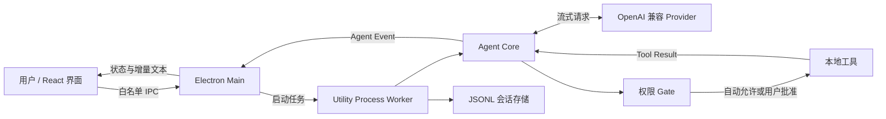

# Jojo Agent 当前功能与上手指南

> 文档状态：2026-08-22
> 当前版本：0.1.0（MVP + Coding Agent Phase 1 + Phase 3 MCP/Skills + Phase 4 Browser/Rich Content + Phase 5 Sub-Agent/Workflow + Hooks）
> 说明：本文以当前仓库代码为准，只描述已经实现的能力。路线图中的规划不等于可用功能。Sub-Agent / Workflow 设计见 [`subagent-workflow-unified-design-roadmap.md`](./subagent-workflow-unified-design-roadmap.md)。

## 1. 先用一分钟认识项目

Jojo Agent 是一个本地优先的 Electron 桌面 AI Agent。它把一次 AI 对话绑定到一个本地目录，让模型在明确的权限边界内了解项目并执行操作。主 Agent 可委派后台 Sub-Agent，或启动声明式 Workflow DAG。

当前版本最适合以下场景：

- 阅读和解释一个本地代码仓库；
- 查找项目结构、配置和实现入口；
- 在审阅逐行 Diff 后创建、精确编辑或删除项目内文本文件；
- 在用户逐次批准后运行测试、构建或其他本地命令；
- 观察 Git 工作区中已有或本轮产生的文件变化；
- 用 `web_search` / `web_fetch` 检索和阅读公开网页，而不打开浏览器；
- 在受控浏览器中操作需要登录或交互的网页，并把图片交给视觉模型分析；
- 用只读 Sub-Agent 并行探索或评审代码；
- 启动内置或自定义 Saved Workflow，在对话中查看依赖图、时间线和步骤结果；
- 用 `~/.jojo/hooks.yml` 或项目 `.jojo/hooks.yml` 在生命周期点注入上下文、拦截工具或做收尾动作；
- 让可写 `general` Agent 在独立 Git Worktree 中改代码，主工作区不自动 Merge。

它现在可以完成范围明确的小型代码任务，并可通过 MCP、本地 Skills、受控浏览器、Sub-Agent 和 Workflow 扩展能力，但仍不是完整的自主编程 Agent：没有专用 Git 提交工具、可视化 Workflow 编辑器或窗口级 Playwright。

专用写工具只允许修改工作目录内的 UTF-8 文本，执行前展示 Diff 并询问一次。获批的终端命令仍可能绕过这些文件工具限制并修改其他内容，因此用户仍需检查完整命令。

## 2. 五分钟运行起来

### 2.1 环境要求

- Node.js 22 或更高版本；
- pnpm 10 或更高版本；
- 一个支持 OpenAI Chat Completions、SSE 流式响应和 Tool Calls 的模型服务；
- Git 对“文件修改审阅”和可写 Sub-Agent / Workflow Worktree 是必需的；纯只读对话可以没有 Git。

先确认本机版本：

```bash
node --version
pnpm --version
git --version
```

### 2.2 安装并启动开发版

在仓库根目录执行：

```bash
pnpm install
pnpm dev
```

`pnpm dev` 会启动 Electron Forge 开发环境，而不是浏览器网页。

### 2.3 完成首次配置

应用启动后：

1. 点击左下角“设置”；
2. 填写 API Base URL，例如 `https://api.openai.com/v1`；
3. 填写 API Key，点击“刷新模型”获取可用模型；OpenRouter 会按当前账户路由设置查询 `/models/user?supported_parameters=tools`，只保留支持 Tool Calls 的模型；
4. 选择默认模型并保存；
5. 点击“新建会话”或“选择项目目录”，选择一个本地目录；
6. 在输入框右下角选择本轮使用的模型，输入任务并按 Enter 发送，Shift+Enter 可换行。

Base URL 应填写到服务的 API 根路径。应用会自动在末尾追加 `/chat/completions`，不要填写完整的 Chat Completions 接口地址。

已获取的模型列表会缓存在普通配置中。修改 Base URL 或 API Key 后，保存时会自动重新查询模型；如果 Provider 不兼容模型发现接口，设置页会直接显示错误。其他 OpenAI-compatible Provider 仍使用标准 `/models` 接口。

### 2.4 建议用这组任务验证环境

先发送一个只读任务：

```text
先列出项目两层目录，再阅读 README.md，用三点说明这个项目是做什么的。暂时不要运行命令。
```

如果只读任务正常，再验证终端审批：

```text
请运行项目的测试，并总结结果。不要修改文件。
```

模型请求 `terminal` 时，界面底部会显示待执行的命令。检查无误后选择“允许一次”或按 Enter；选择“拒绝”或按 Esc 会把拒绝结果返回给模型，而不会直接中断整轮对话。

## 3. 使用时需要理解的六个概念

| 概念 | 在本项目中的含义 |
|---|---|
| 会话（Session） | 一段可恢复的对话，同时绑定一个固定的本地工作目录。会话可创建、重命名和删除。 |
| 工作目录（Workspace） | Agent 默认可以查看的目录，也是相对路径、终端 `cwd` 和 Git 修改审阅的边界。 |
| 一轮（Turn） | 从用户发送一条消息开始，到模型完成、失败或被取消为止。同一会话一次只能运行一轮。 |
| Provider | 把内部消息和工具定义转换成 OpenAI Chat Completions 请求的模型适配器。 |
| 工具调用（Tool Call） | 模型不是直接操作电脑，而是请求应用执行 `read_file`、`web_search`、`web_fetch` 或 `terminal` 等工具。 |
| 审批（Approval） | 对高风险或越界操作进行的一次性授权。目前终端命令和工作目录外文件读取需要审批。 |

选择目录不是简单的界面操作，而是在划定本会话的权限范围。若要处理另一个项目，建议创建新会话并选择对应目录。

## 4. 一条消息在应用中如何流转



实际流程如下：

1. Renderer 把消息通过 Preload 暴露的白名单 API 交给 Main；
2. Main 将任务转给独立的 Utility Process Worker；
3. Worker 读取会话历史，并调用 Agent Core；
4. Provider 向 `{baseUrl}/chat/completions` 发起流式请求；
5. 模型如需工具，Agent Core 先经过权限 Gate，再执行或等待用户审批；
6. 工具结果作为 Tool Message 回填给模型，模型可以继续调用工具或给出最终回答；
7. 消息追加写入 JSONL，同时通过事件把增量文本和工具状态显示到界面。

Worker 与界面进程分离，因此 Agent 运行异常不必直接获得 Renderer 的 Node.js 权限；Worker 意外退出后，Main 会尝试在 1 秒后重新启动它。

## 5. 当前可以做什么

### 5.1 会话与聊天界面

- Electron 单窗口、单实例运行；
- 按本地项目目录分组展示会话，也可切换为按最近活动排列的单列表；
- 项目按最近会话排序；同一项目内默认只展开最近 5 个会话，当前会话若在更早记录中会自动露出；
- 标题栏内搜索会话标题或项目名，最多返回 20 条；占位「新会话」不进入搜索；
- 会话行显示相对时间，悬停后换成重命名和删除；运行中为蓝点，等待审批为黄点；
- 在左侧项目模块中创建、选择、重命名和删除会话；
- 新会话发送第一条提问时，使用默认模型生成标题，失败时回退到提问内容；
- 「设置 → 模型」中的 Provider 默认使用 `128,000` 上下文窗口与 `8,192` 最大输出；所有会话运行时读取当前模型设置，不在会话元数据中固化这两个值；
- 每个会话绑定所属项目的本地工作目录；
- 流式展示模型文本；
- 渲染 Markdown 标题、列表、引用和代码块；
- 使用 DOMPurify 清理模型生成的 HTML；
- 将持久化消息折叠为对话节点流：用户气泡、助手正文、工具行、压缩标记和内部系统行；
- 工具行默认折叠，标题旁显示路径或命令摘要，展开后查看 IN/OUT；
- 历史工具调用会随会话重新载入一起恢复，不再只存在于当前轮次的临时状态里；
- 标题栏可在「对话」和「轨迹」之间切换；轨迹按轮次列出用户、助手和工具记录，选中后查看输入与输出；
- 标题栏可把当前会话的完整轨迹导出为 Markdown；导出内容包含会话元数据、轮次、用户/助手/内部记录、SQLite Runtime 中的持久化压缩记录、未截断的工具输入输出与内嵌图片；运行中的回合结束后方可导出；
- 向上滚动会暂停自动跟随，避免检查旧记录时被新输出打断；
- Enter 发送，Shift+Enter 换行；
- 运行期间可停止当前轮次；
- 展示加载、空状态和错误信息；
- 配置 OpenAI Chat Completions 兼容 Provider，并逐轮选择其模型；
- 审批卡片支持按钮以及 Enter 允许、Esc 拒绝快捷键。

工具调用和结果会写入会话记录。重新打开会话时，对话视图会按原始顺序恢复工具行；轨迹视图按轮次展示同一份记录。

### 5.2 Git 工作区修改审阅

如果会话目录位于 Git 仓库中，应用可以：

- 读取已跟踪和未跟踪文件的修改；
- 展示文件级新增、删除行数；
- 在审阅面板中切换文件并查看逐行 Diff；
- 提示二进制文件，截断过大的 Diff；
- 将结果限制在当前会话选择的工作目录中，即使该目录只是 Git 仓库的一个子目录；
- 一轮任务结束后，优先只展示相对任务开始时发生变化的文件。

这里的审阅面板是**只读视图**，不能接受、撤销或编辑补丁。空会话即使工作区已有修改也不会显示修改卡；发送过消息后才会显示。非 Git 目录仍能对话和使用工具，只是没有 Diff 审阅结果。

当前最多收集 100 个变更文件，每个文件的 Patch 最多保留约 250,000 字节，超过限制时会显示截断提示。

### 5.3 后台 Sub-Agent

主 Agent 可通过编排工具启动后台 Sub-Agent，不阻塞当前轮次结束。内置 Profile：

| Profile | 权限 | 用途 |
|---|---|---|
| `explore` | 只读：文件检索 + `web_search` / `web_fetch` | 理解代码与公开资料 |
| `code-review` | 只读：文件检索 | 缺陷、回归与安全评审 |
| `synthesize` | 无工具 | 汇总上游步骤证据 |
| `general` | 可写，强制独立 Git Worktree | 在隔离分支完成工程任务，默认不 Merge |

可叠加 `~/.jojo/agents/*.md` 与项目 `.jojo/agents/*.md`（项目覆盖用户，再覆盖 builtin）。这组能力的产品语义是临时 Spawn，兼容工具名仍为 `sub_agent_start`、`sub_agent_wait`、`sub_agent_status`、`sub_agent_cancel`、`sub_agent_send`、`sub_agent_close`。续接身份已经改为稳定 Runtime Lane，不再依赖 Desktop Worker 内存中的 continuation map。Spawn 本身仍是 Leaf；Team Member 可在成员策略允许时 Spawn Leaf Worker。

### 5.3.1 Persistent Team

Team 是绑定 Workspace 的长期 Agent Identity。Team / Member / Task / Inbox 保存到 `runtime/teams.sqlite`；每个成员使用稳定的隐藏 Runtime Session 与 `member:<id>` Lane，因此多次委派可继承成员自己的历史。成员空闲时不占线程或模型循环。

- 同一成员的任务严格串行，不同成员可在 Team、Provider 与全局并发限制内并行；
- `team_send` 只写持久 Inbox，不会自动唤醒收件人；只有 `team_delegate` 会启动成员运行；
- 可写成员任务按 Task 创建 Git Worktree，结果保留 Branch、changed files 与 diff；
- Team Member 使用 `actor.kind=team_member` 与 Team Context 进入 Permission Governance；
- 启动恢复时，无法确认安全恢复的 `running` / `waiting_approval` 任务标记为 `interrupted`，不会静默重放副作用；
- 成员允许 Spawn 时可配置 Profile allowlist 与 active limit；取消 Team Task 会取消该成员拥有的 Spawn。

主 Agent 工具：`team_list`、`team_status`、`team_delegate`、`team_wait`、`team_send`、`team_inbox`。普通成员只获得自己的 Inbox / Send 视图及策略允许的 Spawn 工具，不获得 Team 结构管理或 Workflow 启动权限。Desktop 设置页可按当前 Workspace 创建、编辑和删除 Team，配置成员 Profile / 模型 / Tool Policy / Spawn Policy，运行时启停成员，并查看活跃、排队和最近任务。

### 5.4 Workflow DAG

主 Agent 可启动声明式 Workflow。引擎按 `dependsOn` 调度可并行步骤，支持 Timeout / Cancel、Retry、Typed Inputs、Tool Step、foreach、condition、嵌套 Saved Workflow、Token / 可选 USD Budget，以及资源组与 Provider 限流。JSONL Journal 支持中断后 Resume，已完成步骤不重跑。

工具：`workflow_start`、`workflow_wait`、`workflow_status`、`workflow_cancel`、`workflow_resume`、`workflow_list`。

内置模板：`repo-understand`、`architecture-review`、`code-review`，均需 `args.target`。自定义 YAML 放在项目 `.jojo/workflows/` 或 `~/.jojo/workflows/`（项目覆盖用户，再覆盖 builtin）。

对话中的 WorkflowCard 默认显示依赖图，可切换时间线，点击步骤会展开列表中的详情（Usage、错误码、结构化输出、Isolation Diff）。这是查看器，不是可视化编辑器。没有 `pipeline` / `human` / HTTP Step。

桌面手测示例：

```text
列出可用的 saved workflow。
用 repo-understand 理解 packages/orchestration，target 填 packages/orchestration。
```

自动化测试用 Fake / Scripted runner，不打真实 LLM：`pnpm test`。窗口级 Playwright 尚未接入。

### 5.5 Hooks

可在用户或项目目录放置 `hooks.yml`，在会话开始、提交提问、工具前后、回合结束等时机跑本地命令。设置 → Hooks 可查看加载/信任状态，打开配置、重新加载、信任或禁用项目 Hooks。项目配置默认不可信，改文件后需重新信任；禁用后不会每轮再询问。实现说明见 [`technical-implementation/hooks.md`](./technical-implementation/hooks.md)。

## 6. 十个内置工具

### 6.1 `read_file`：读取文本文件

输入示例：

```json
{ "path": "README.md" }
```

行为和限制：

- 按 UTF-8 文本读取；
- 相对路径以会话工作目录为基准，也接受绝对路径；
- 默认最多读取 512,000 字节，超出部分截断；
- 通过真实路径检查 `..` 和符号链接，避免伪装成目录内文件；
- 工作目录内自动允许，目录外必须逐次批准；
- 目标不存在或不是普通文件时返回失败结果。

### 6.2 `list_files`：递归查看目录

输入示例：

```json
{ "path": ".", "depth": 2 }
```

行为和限制：

- 只允许列出工作目录内部内容；
- 默认深度为 3，可选范围为 0～5；
- 默认最多返回 500 个条目；
- 忽略 `.git`、`node_modules`、`dist`、`out`、`coverage`、`.next` 和 `.cache`；
- 跳过指向工作目录外部的符号链接；
- 结果按名称排序，并用 `dir` 或 `file` 标记类型。

### 6.3 `grep` 与 `glob`：项目检索

- `glob` 按 `**/*.ts` 一类模式查找文件；
- `grep` 按固定文本查找并返回 `路径:行号:内容`，支持 glob 和大小写选项；
- 两者只搜索工作目录内，忽略 `.git`、`node_modules`、构建和缓存目录，并限制结果数量。

### 6.4 `web_search` 与 `web_fetch`：公开网页检索

公开信息检索走这两个 Node 工具，不经过受控浏览器。校验通过后自动允许。

`web_search` 输入示例：

```json
{ "query": "zod schema refine", "maxResults": 5 }
```

行为和限制：

- 返回每条结果的标题、URL 和摘要；摘要是不可信外部数据，不能当成系统指令；
- 若进程环境提供 `BRAVE_SEARCH_API_KEY`、`TAVILY_API_KEY` 或 `SERPER_API_KEY`，优先使用对应搜索 API；否则依次尝试 DuckDuckGo HTML、DuckDuckGo Lite 和 Bing HTML；
- 查询 1～500 字符，结果 1～20 条，默认 5 条；
- 当前没有设置页配置搜索密钥，密钥只从环境变量读取。

`web_fetch` 输入示例：

```json
{ "url": "https://example.com/docs", "clean": true }
```

行为和限制：

- 只允许无凭据的 HTTP(S) GET；每次跳转（最多 10 次）都会重新解析并检查目标；
- 拒绝链路本地、组播、全零/广播以及云厂商 metadata 主机；允许回环和私有局域网，便于抓取本地开发文档；
- 默认把 HTML 转成可读 Markdown，去掉脚本、样式和导航等页面框架；`clean: false` 返回原文；
- 清洗后不超过 64 KB 的正文直接返回；更大页面最多读取 5 MB，写入系统临时目录 `jojo-web-fetch/`，结果只含 URL、状态、类型、大小、标题大纲、前 40 行预览和文件路径，随后可用 `read_file` / `grep` 继续查看；超过 24 小时的临时文件会在下次落盘时清理；
- 30 秒超时；二进制响应只回报类型，不回填正文；
- JavaScript 渲染、登录墙或需要点击的页面应改用浏览器工具。

### 6.5 `write_file`、`edit_file` 与 `delete_file`：修改文本文件

- `write_file` 创建新文件，或完整替换已经完整读取的现有文件；
- `edit_file` 只替换已读取文件中的精确文本；匹配不唯一时必须显式选择全部替换；
- `delete_file` 删除已经读取的文件；
- 三者只允许工作目录内 UTF-8 文本，每次执行前展示新增/删除行和逐行 Diff；
- 审批前和执行时都会检查 SHA-256、mtime 与大小，外部编辑后拒绝盲目覆盖；
- 覆盖和删除前把原文件保存到 Electron `userData/trash/<session-id>/`；写入使用同目录临时文件原子替换，并保留原权限位。

### 6.6 `terminal`：执行本地程序

输入示例：

```json
{
  "command": "pnpm",
  "args": ["test"],
  "cwd": ".",
  "timeoutMs": 120000
}
```

行为和限制：

- 每次执行都需要用户明确批准；
- 以“可执行程序 + 参数数组”启动，默认不经过 Shell；
- `command` 只能填写可执行文件名或路径，参数必须逐项放入 `args`；
- 继承开发环境时会移除 API Key、Token、密码、凭据以及危险的 Node 启动参数；
- `cwd` 必须在会话工作目录内；
- stdout 和 stderr 会流式显示；
- 默认超时 120 秒，可选范围为 1～300 秒；
- 默认最多收集 1,000,000 字节输出；
- 停止轮次或超时后会尝试终止整个进程组。

因为默认不使用 Shell，`&&`、管道、重定向和通配符不会自动生效。模型仍可能请求显式运行 `sh -c` 等命令；这类请求同样会完整显示在审批卡片中，应特别谨慎检查。

主 Agent 另外拥有 §5.3 / §5.4 的 Sub-Agent 与 Workflow 编排工具。这些工具不直接读写文件；实际文件与终端操作仍走本节工具，并受对应 Profile 的 Tool Policy 约束。可写 `general` 在独立 Worktree 内执行，不向主工作区弹逐次写文件审批，完成后通过 Isolation Diff 审阅。

## 7. 权限规则

| 操作 | 工作目录内 | 工作目录外 |
|---|---|---|
| `read_file` | 自动允许 | 每次询问；`web_fetch` 临时落盘文件自动允许 |
| `list_files` | 自动允许 | 拒绝 |
| `grep` / `glob` | 自动允许 | 拒绝；`grep` 对 `web_fetch` 临时落盘文件自动允许 |
| `web_search` | 输入校验通过后自动允许 | 不依赖工作目录 |
| `web_fetch` | URL 校验通过后自动允许；执行时再做 DNS/SSRF 检查 | 不依赖工作目录 |
| `write_file` / `edit_file` / `delete_file` | 每次展示 Diff 并询问 | 拒绝 |
| `terminal` | 每次询问 | `cwd` 不允许越出工作目录 |
| MCP 外部工具 | 每次询问 | 由 MCP Server 自身决定；审批前需检查参数 |

这些规则限制的是内置工具的直接行为，不是操作系统级沙箱。尤其是终端命令获批后，会以当前应用进程继承的用户权限运行；命令本身仍可能访问工作目录外资源。当前权限 Gate 只校验终端的 `cwd`，不会解析命令参数的语义。

拒绝审批后，Agent Core 会生成错误码为 `user_denied` 的 Tool Result 并继续循环，模型可以解释未完成原因或尝试不需要该权限的方案。权限策略直接拒绝则使用 `permission_denied`。

## 8. Agent 循环与 Provider

### 8.1 Agent 循环

一轮任务会把用户消息加入历史，然后反复执行“调用模型 → 执行工具 → 回填结果”，直到模型不再调用工具。默认 Loop 使用动态预算：根据模型上下文容量计算 8～16 次初始软上限，工具调用持续产生新结果时按 4～8 次分段扩容，安全硬上限为 32～64 次；达到最终上限后会额外执行一次禁用工具的强制收尾回答，不再以裸 `max_iterations` 错误中断。调用方显式传入 `maxIterations` 时仍严格使用该固定限制。

当前保护措施包括：

- 默认按上下文容量分配 8～16 次软预算；有进展时分段扩到 32～64 次安全硬上限，并预留一次无工具收尾；每轮向模型提供当前剩余 Loop 预算，剩余 3 次时要求优先完成用户可见产物；
- 同一 Tool Call ID 只执行一次；
- 未知工具返回失败结果；
- 工具失败或审批被拒绝后仍允许模型继续回答；
- 同一会话不能并行运行两个轮次；
- 用户可取消当前轮次。
- 轨迹记录 Assistant 与工具所属的 Agent Loop 编号，强制收尾会单独标记；底部上下文状态实时显示 `Loop 当前/上限`；
- 凭据存在性检查只能输出布尔结果；大型 API/命令响应应首次请求直接落盘并输出摘要，禁止打印全文后重复请求、再整文件读回上下文；
- 工具定义和运行指令作为固定成本单独核算；扣除固定成本后不足 1,024 tokens 最小消息预算时，在调用模型前返回 `context_overflow`，并显示所需最小窗口，不再反复压缩用户消息；
- 压缩摘要包含机器可解析的 pinned user requirements；连续压缩会继承旧约束，并优先保留首条任务、最近要求和原始措辞；

对外事件还包括归一化 `usage`、`context.updated` 和 `output.continuing`，用于展示缓存用量、上下文压缩与截断续写状态。

### 8.2 Provider 与上下文

当前仅注册 `OpenAICompatibleProvider`，支持：

- SSE 流式文本；
- 分片 Tool Call 参数聚合与 JSON 解析；
- input/output/cache read/cache write token usage 事件；
- AbortSignal 取消；
- 90 秒默认模型请求超时；
- 认证、限流、服务异常、网络、超时和空响应错误分类。

应用按 Provider 配置创建 adapter。上下文接近预算时会回收大型 Tool Result，并在不拆散 Tool Call/Result 配对的前提下压缩旧历史；`length` 会触发有界自动续写。界面展示上下文估算和本轮 token/cache usage。

当前不支持其他模型协议。DeepSeek、Kimi、GLM 等服务需要提供兼容的 Chat Completions、SSE、Function Tools 和 `/models` 接口。

### 8.3 MCP 与 Skills

点击左下角“MCP 与 Skills”可编辑扩展配置并查看连接/发现状态。面板采用 MCP / 技能标签页和紧凑列表，支持按名称、描述、来源或路径搜索；每行直接展示来源、连接状态或工具数量，并用开关启停。原始 MCP JSON 和额外 Skill 目录收进右上角的高级配置入口，日常管理不需要直接面对配置文本。

MCP 支持：

- 以 `command` + `args` 启动本地 stdio server；
- 连接 Streamable HTTP endpoint；
- 自动发现工具并映射为 `mcp__<server>__<tool>`；
- 支持 Resources、Resource Templates、Prompts，并把 Server instructions 注入模型 system message；
- 原样保留 MCP 图片 ContentBlock，以多模态工具结果发送给模型；
- 响应 tools/resources/prompts `list_changed`，无需重启即可更新目录；
- Remote MCP OAuth：支持浏览器授权、PKCE、动态客户端注册、refresh token 和安全凭据存储；
- Streamable HTTP 可选择 `auto` 协商或 `legacy` 直接使用 2025 `initialize`，兼容不支持 `server/discover` 的服务；
- Streamable HTTP 保存当前 session ID 与协议版本用于显式重连，并使用有限指数退避；
- 显示连接中、已连接、停用、失败状态及工具数量；
- 每个外部工具调用都先请求一次批准；
- 工具定义超过按上下文窗口计算的 token 预算时，改为 `mcp_tool_manifest`、`mcp_tool_describe`、`mcp_tool_call`，不再使用固定 24/12 数量阈值。

Skills 会从 `userData/skills`、用户级 `~/.agents/skills` / `~/.codex/skills` / `~/.config/agents/skills`、设置目录以及项目 `.codex/skills` / `.agents/skills` 扫描 `SKILL.md`。文件使用成熟 YAML 解析器读取必填的 `name` 和 `description` frontmatter；同 ID 时按“项目 > 用户 > 自定义 > 默认”覆盖。被覆盖版本仍保留在底层发现结果中用于诊断，但不会出现在设置面板的技能数量、搜索结果和列表中，只展示实际生效的版本。发现结果明确记录 Skill 根目录及 `scripts`、`templates`、`references` 文件，`load_skill` 也会把这些绝对目录告诉模型。同一会话已经成功加载的 Skill 再次调用时只返回简短引用，不重复注入整份 `SKILL.md`。设置面板支持创建、编辑、导入、导出、用本地目录更新和将整个 Skill 根目录移入废纸篓，并可按 Skill ID 启停。

模型可通过需审批的 `install_skill` 把 Skill 非交互安装到当前项目 `.agents/skills`；工具固定使用 `--yes --agent universal --copy`，并在安装后验证文件、动态刷新目录，使新 Skill 在当前 Turn 的下一步即可加载。Agent Core 会阻止同一轮第三次执行完全相同的工具调用，并识别不同查询返回相同只读内容的情况；触发后只再允许两个恢复工具步骤，随后暂停工具并要求模型根据已有证据直接回答，避免重复搜索耗尽迭代上限。

MCP 的 `env` 和静态 HTTP `headers` 位于当前用户可读的普通配置；OAuth client registration、token 和 PKCE/discovery 状态使用操作系统安全存储加密。不要把长期高权限 token 手工写入 headers。
启用 stdio server 会在应用连接时立即以当前用户权限启动其 `command`。逐次审批只覆盖后续 MCP 工具调用，不能限制 server 进程的启动代码，因此只能配置可信程序。

### 8.4 浏览器与图片消息

普通搜索和阅读已知公开 URL 使用第 6 节的 `web_search` / `web_fetch`，不要打开沙箱浏览器。浏览器只用于登录墙、需要 JavaScript 渲染或交互的页面，以及抓取失败后的补救。

“设置 → 浏览器”可启停受控浏览器，选择沙箱或附加 Chrome，并配置域名白名单；`*.example.com` 只匹配子域名，不匹配根域。沙箱使用独立 Electron 窗口和隔离登录态；附加 Chrome 连接 `127.0.0.1` 上开启 `--remote-debugging-port` 的浏览器，默认新开标签，不抢占当前页面。浏览器工具包括：

- `browser_open`：在独立窗口打开 HTTP(S) 页面；白名单外域名先审批；
- `browser_new_page`、`browser_pages`、`browser_select_page`、`browser_close_page`：新建、列出、切换和关闭会话内页面；新建页面沿用域名审批，关闭页面逐次审批；附加 Chrome 时列出未接管的标签，切换已有标签需审批；
- `browser_record_start`、`browser_record_stop`、`browser_record_cancel`、`browser_recordings`、`browser_record_get`、`browser_record_delete`、`browser_replay`：录制成功步骤并保存为 `userData/browser-recordings/<id>.yaml`；开始录制、删除和回放需审批；回放支持 `{{param}}`，密钥只能来自 `JOJO_BROWSER_SECRET_<NAME>` 或密码框；
- `browser_read`：通过 CDP 读取可见页面结构，并为节点返回 CSS selector 和稳定的会话内元素 `ref`；
- `browser_eval`：在当前页执行 JavaScript 并返回 JSON-safe 结果；需审批，脚本最长 20,000 字符，结果约 64 KB，超时 8 秒，不能用来绕过域名或文件权限；
- `browser_wait`、`browser_scroll`：按 `ref` 或 selector 等待元素进入指定状态，或按偏移/目标元素滚动页面；
- `browser_click`、`browser_hover`、`browser_type`：按 `ref`（推荐）或 selector 点击、悬停或填写/提交表单，每次执行前审批；
- `browser_press`、`browser_select`：向当前焦点或指定元素发送受限按键，或选择原生下拉选项，每次执行前审批；
- `browser_upload`：向原生文件输入框上传当前工作区内的文件，真实路径解析后逐次审批，最多 10 个文件、单个 50 MB、合计 100 MB；
- `browser_back`、`browser_reload`：后退或刷新并等待主页面完成导航；
- `browser_screenshot`：截取视口或有尺寸上限的质量受控 JPEG，并作为视觉 Tool Result 回填模型；
- `browser_download`、`browser_downloads`：经审批发起下载并查看进度、状态和保存路径；附加 Chrome 时下载不可用；
- `browser_console`、`browser_network`、`browser_errors`：读取当前页已捕获的 Console、网络请求元数据和页面错误；只读自动允许，可过滤失败请求或错误级别，并可在读取后清空缓冲区；
- `browser_cookies`：列出该隔离会话的 Cookie 元数据（名称、域名、路径、secure/httpOnly 等）；默认不含 value，读取 value 需审批。

每个会话在沙箱模式下使用同一个独立内存 partition，并可维护多个受控页面；页面共享该会话的 Cookie 和域名授权，但不与其他会话或主界面共享。附加 Chrome 时 Cookie 来自用户的 Chrome Profile。`browser_read` 生成的元素引用在会话内全局唯一，并绑定当前页面和来源站点，同时保存标签、可访问名称、角色、id、`data-testid`、字段名、输入类型、placeholder 和链接等指纹。页面局部刷新或 DOM 重排后，动作会对同标签候选评分并重新定位；低置信度、同分歧义、跨页面、跨来源或已过期引用一律拒绝，要求重新读取，避免误点相似控件。每页最多保留 4000 个最近引用。下载写入 `userData/browser-downloads/<session-id>/`。远程页面所在窗口不安装 Preload，关闭 Node integration 和 webview，开启 context isolation、sandbox 与 web security；只允许 HTTP(S) 顶层导航，未批准的跨域跳转会在 Main 进程阻止。页面弹窗仅在目标属于已批准域名时创建，否则拒绝并在点击结果中回报。等待、滚动、页面列表、后退、刷新、页面诊断、Cookie 元数据、取消录制和查看录制自动允许；沙箱下切换页面也自动允许。关闭页面、脚本执行、悬停、按键、下拉选择和工作区文件上传与点击、输入一样逐次审批；读取 Cookie 值、删除录制、回放以及 Chrome 下切换已有标签也需审批。上传路径由 Main 根据 Session 重新读取工作目录并解析真实路径，目录外文件、目录和超限文件都会被拒绝。网页文字被明确视为不可信数据，不能提升为系统指令，也不能绕过本地工具审批。诊断日志同样视为不可信页面数据；网络记录不包含请求头或正文。

工作流录制只保存成功的 open/wait/scroll/click/hover/type/press/select/back/reload，单个录制最多 100 步；不会录制上传、下载、截图、页面诊断、eval、cookies、多页面管理或录制控制动作。停止录制后写入 YAML（含 version、slug id、params 和步骤指纹），去掉会话内临时 `ref`；列表只显示目标与字符数，不回显密钥。回放逐步返回结果并在首个不可恢复错误处停止；selector 失效时按指纹评分重定位。最多重试 3 次，且仅限元素明确未找到、稳定引用暂时无法定位或等待超时。执行上下文销毁、候选歧义等可能代表动作已发生或目标不确定的错误不会自动重试。密钥参数禁止出现在 `browser_replay` 的 params 中。

输入框的“＋”可选择 PNG、JPEG、WebP 或 GIF，最多 4 张、单张最大 10 MB。图片随用户消息写入 JSONL，在对话中显示，并转换为 OpenAI Chat Completions 的 `image_url` 数据 URL；所选模型仍需自身支持视觉输入。

DeepSeek Chat Completions 当前只接受字符串 Message Content。使用 `api.deepseek.com` 时，应用会把图片和浏览器截图替换为明确的文本占位，让模型继续使用 `browser_read` 的页面结构，但会要求模型声明没有实际查看截图。其他兼容 Provider 若明确拒绝 `image_url`，应用也会自动进行一次纯文本重试。若任务需要描述颜色、布局或图片内容，必须改用真正支持视觉输入的 Provider 和模型。

### 8.5 Hooks

Hooks 是本地 `hooks.yml` 驱动的生命周期脚本，由 `@desktop-agent/hooks` 加载，经 `HookRuntime` 端口进入 Agent Runtime。用户配置始终尝试加载；项目配置需在设置页或回合审批中信任当前文件 fingerprint。命令通过 stdin 接收 JSON payload，可注入上下文、拦截 `PreToolUse`，或在 Stop 时做副作用。项目 Hook 不能 `canApprove`，也不能绕过 Permission Gate 的硬拒绝。详细模块说明见 [`technical-implementation/hooks.md`](./technical-implementation/hooks.md)。

## 9. 会话、配置和密钥保存在哪里

所有数据都放在 Electron 的 `app.getPath('userData')` 目录中，实际根路径随操作系统和应用名称变化。目录内部结构为：

```text
userData/
├── config.json                 # Base URL、默认模型和可用模型列表
├── config.json.bak             # 上一次普通配置的备份
├── secrets/
│   └── provider-key.bin        # 操作系统安全存储加密后的 API Key
├── sessions/
│   └── <session-id>.jsonl      # 会话元数据、标题变更和消息
├── browser-downloads/
│   └── <session-id>/           # 受控浏览器下载
├── browser-recordings/
│   └── <id>.yaml               # 持久化浏览器工作流
├── skills/                     # 全局安装的本地 SKILL.md 目录
├── runtime/
│   ├── agent-runtime.sqlite    # Durable Operation / Lane
│   └── hooks.sqlite            # Hook invocation 去重与异步恢复
└── trash/
    └── <session-id>/<entry>/   # 文件工具覆盖/删除前的副本与恢复元数据
```

会话存储具有以下特征：

- 采用 JSONL 追加写入，每条记录带 `schemaVersion: 1`；
- 保存用户消息、助手消息、Tool Call 和 Tool Result；
- 应用重启后可恢复会话与消息；
- 损坏或未写完的行会被跳过，其他完整记录仍可读取；
- 会话列表按对应文件的修改时间排序；
- 删除会话会直接删除对应 JSONL 文件，界面没有回收站。

普通配置通过临时文件替换，并在覆盖前保留 `.bak`。API Key 与普通配置分开保存，Renderer、`config.json` 和会话 JSONL 都不持久化明文密钥。设置中的 API Key 留空表示保留原密钥，当前界面没有单独的“清除密钥”操作。

Hooks 配置不在 `userData` 里，而在用户主目录和当前工作区：

```text
~/.jojo/hooks.yml              # 用户 Hooks
~/.jojo/hooks-trust.json       # 项目 Hooks 的 fingerprint 信任 / 禁用
<workspace>/.jojo/hooks.yml    # 项目 Hooks（默认不可信）
```

## 10. 进程和包的职责

项目使用 pnpm workspace，包含一个桌面应用和九个共享包：

| 模块 | 当前职责 | 新手何时需要看 |
|---|---|---|
| `apps/desktop` | Electron Main、Preload、React Renderer、Worker 和打包配置 | 修改界面、IPC、窗口、任务编排或打包时 |
| `packages/contracts` | 消息、事件、IPC、配置类型及 Zod Schema | 新增跨进程字段或能力时先看 |
| `packages/agent` | 模型步骤、消息构造、工具执行原语与兼容 Agent 循环 | 修改底层模型/工具原语时 |
| `packages/agent-runtime` | Durable Operation、Lane、恢复与 Context Projection | 修改 Agent 执行状态机或恢复行为时 |
| `packages/orchestration` | Sub-Agent、Workflow Engine、Isolation、Saved Workflow | 修改并行委派、DAG 调度或 Worktree 隔离时 |
| `packages/providers` | OpenAI Chat Completions 兼容协议 | 接入或排查模型服务时 |
| `packages/tools-node` | 文件、目录、公开网页检索、终端工具和权限 Gate | 新增工具或修改审批策略时 |
| `packages/storage` | SQLite Agent Runtime、JSONL 会话 / Workflow Journal 和普通配置存储 | 修改持久化格式时 |
| `packages/extensions` | MCP stdio/HTTP 客户端、延迟工具发现和 Skills | 修改外部扩展机制时 |
| `packages/hooks` | `hooks.yml` 加载、信任、Shell Hook Engine | 修改生命周期 Hook 或项目信任时 |

四类运行时职责：

- Renderer：显示会话、对话节点流、轨迹、审批、设置、Diff 和 WorkflowCard；
- Preload：通过 `contextBridge` 只暴露白名单业务 API；
- Main：管理窗口、IPC、目录选择、安全存储、Git Diff 和 Worker 生命周期；
- Worker：运行 Provider、Agent Runtime、Orchestration、Hooks、工具、权限判断和会话写入。

## 11. 想修改某个功能，从哪里开始

| 目标 | 主要入口 |
|---|---|
| 修改 React 界面和交互 | `apps/desktop/src/renderer/main.tsx` |
| 修改对话节点折叠或工具摘要 | `apps/desktop/src/renderer/conversation.ts` |
| 修改对话 / 轨迹展示组件 | `apps/desktop/src/renderer/ConversationViews.tsx` |
| 修改左侧栏分组、搜索或会话行 | `apps/desktop/src/renderer/sidebarSnapshot.ts`、`apps/desktop/src/renderer/Sidebar.tsx` |
| 修改全局样式 | `apps/desktop/src/renderer/styles.css` |
| 修改 Renderer 可调用的 API | `apps/desktop/src/preload/preload.ts` |
| 新增或修改 IPC | `packages/contracts/src/desktop.ts`（由 `src/index.ts` 聚合导出）→ `apps/desktop/src/preload/preload.ts` → `apps/desktop/src/main/main.ts` |
| 修改窗口、安全存储或 Worker 管理 | `apps/desktop/src/main/main.ts` |
| 修改受控浏览器 CDP 与安全规则 | `apps/desktop/src/main/browser-runtime.ts`、`apps/desktop/src/main/browser-security.ts`、`apps/desktop/src/main/browser-diagnostics.ts`、`apps/desktop/src/worker/browser-tools.ts` |
| 修改 Git 文件变化采集 | `apps/desktop/src/main/workspace-changes.ts` |
| 修改 Durable Agent 执行逻辑 | `packages/agent-runtime/src/index.ts` |
| 修改模型步骤、消息或工具执行原语 | `packages/agent/src/index.ts` |
| 修改 Sub-Agent、Workflow 或 Worktree 隔离 | `packages/orchestration/src/index.ts` |
| 修改 WorkflowCard / 依赖图 | `apps/desktop/src/renderer/WorkflowCard.tsx`、`apps/desktop/src/renderer/workflow-dag.ts` |
| 修改 Provider HTTP/超时/错误处理 | `packages/providers/src/openai-compatible-provider.ts` |
| 修改 Chat Completions 请求或流解析 | `packages/providers/src/chat-completions-request.ts`、`packages/providers/src/chat-completions-stream.ts` |
| 修改底层 SSE 解码 | `packages/providers/src/sse.ts` |
| 新增工具或调整权限 | `packages/tools-node/src/index.ts` |
| 修改 MCP 或 Skills | `packages/extensions/src/index.ts` |
| 修改 Hooks 引擎、配置加载或信任 | `packages/hooks/src/index.ts` |
| 修改 Hooks 设置页 | `apps/desktop/src/renderer/HooksSettings.tsx` |
| 修改会话或配置格式 | `packages/storage/src/index.ts` |
| 修改 Electron 打包和安全 Fuses | `apps/desktop/forge.config.ts` |

新增跨进程功能时，通常需要先在 `packages/contracts` 定义 Schema、类型和 IPC 名称，再依次接通 Preload、Main/Worker，最后接入 Renderer。不要让 Renderer 直接访问 Node.js API。

## 12. 开发、测试与打包

常用命令：

| 命令 | 作用 |
|---|---|
| `pnpm dev` | 启动 Electron 开发环境 |
| `pnpm typecheck` | 运行 TypeScript 类型检查，不生成文件 |
| `pnpm lint` | 运行 ESLint，任何 warning 都视为失败 |
| `pnpm test` | 一次性运行 Vitest 测试 |
| `pnpm test:watch` | 监听文件变化并运行 Vitest |
| `pnpm build` | 通过 Electron Forge 为当前平台生成分发产物 |
| `pnpm --filter @desktop-agent/desktop package` | 只生成未封装的应用目录 |

`pnpm test` 覆盖 Agent Core、Orchestration（Sub-Agent、Workflow DAG、Budget、Worktree 隔离）、Storage Journal Resume、Workflow 依赖图 UI，以及原有工具 / Provider / 浏览器契约。自动化测试使用 Fake 或 Scripted runner，不调用真实 LLM。

提交代码前建议依次运行：

```bash
pnpm typecheck
pnpm lint
pnpm test
```

`pnpm build` 成本更高，涉及 Electron 打包或准备发布时再运行。GitHub Actions 会执行依赖安装、Lint、类型检查、测试和 Linux Electron Package 构建。

## 13. Electron 安全措施

当前已启用：

- `nodeIntegration: false`；
- `contextIsolation: true`；
- Renderer sandbox；
- `webSecurity: true`；
- CSP 限制；
- 禁止创建任意新窗口；
- 限制跨来源导航；
- IPC 发送方和来源校验；
- IPC 参数通过 Zod 验证；
- Preload 不暴露原始 `ipcRenderer`；
- Renderer 不直接访问 Node.js、文件系统或子进程；
- 生产构建使用 ASAR；
- Electron Fuses 关闭 RunAsNode、`NODE_OPTIONS` 和调试参数等能力。
- 受控浏览器使用独立内存 partition，且没有 Preload、Node.js、webview、新窗口或主 Renderer IPC。

这些措施降低了 Renderer 被利用后的风险，但不替代终端命令审批。批准命令前仍应阅读完整命令和参数。

## 14. 当前尚未实现

- 通用 unified patch 输入工具（当前提供完整写入与精确文本编辑）；
- Git 提交、分支、自动 Merge 等专用写操作（可写 Agent 停在独立 Worktree，需人工审阅）；
- 多 Provider 注册、列表和会话级切换；
- 可视化 Workflow 编辑器（当前只有依赖图 / 时间线查看器）；
- `pipeline` / `human` / HTTP Workflow Step；
- 窗口级 Playwright 与真实模型集成测试；
- 长期记忆和向量数据库；
- TypeScript Hook 插件加载器、独立 `hook_jobs` 队列、Trajectory 中的 Hook 卡片；
- 定时任务与后台自动化；
- 自动更新；
- 云端账号、同步和协作；
- 代码签名与 macOS notarization。

判断某项能力是否存在时，以本节、十个内置工具、编排工具和实际源码为准，不要只依据路线图或界面外观。

## 15. 常见问题

### 为什么模型只回答，不读取项目？

是否调用工具由模型决定。可以在任务中明确写出“先列出目录并阅读相关文件，再回答”。如果所用模型不支持 Tool Calls，它只能进行普通文本对话。

### 为什么设置保存成功，但发送后报错？

设置页只保存配置，不主动执行完整对话验证。请依次检查 Base URL 是否只填到 API 根路径、模型名是否存在、API Key 是否有效，以及服务是否支持流式 Chat Completions 与 Tool Calls。OpenRouter 返回 `No endpoints found that support tool use` 时，说明当前模型在账户路由偏好下没有工具端点；点击“刷新模型”并改选列表中的模型。涉及图片或浏览器截图时，模型还必须支持视觉输入。

如果应用在工具执行或审批期间被关闭，旧记录可能只包含 Assistant Tool Call 而没有 Tool Result。重新打开后可以直接继续原会话：发送给 Provider 前会自动补入中断结果，正常点击“停止”也会为所有尚未完成的调用保存 `cancelled` 结果，避免后续请求出现 `insufficient tool messages following tool_calls message`。

### 为什么模型打开了浏览器，而不是直接搜索？

查资料、读公开文档应使用 `web_search` 和 `web_fetch`。浏览器只用于需要登录、点击或 JavaScript 渲染的页面。可在任务里写明“先搜索，不要打开浏览器”。

### 为什么 `&&` 或管道没有效果？

`terminal` 默认直接启动一个程序，不经过 Shell。优先让模型把任务拆成多次清晰的命令。若它请求 `sh -c`，审批前需要额外检查其中的完整脚本字符串。

### 为什么看不到文件修改卡？

请确认目录位于 Git 仓库中、会话已经发送过至少一条消息，并且修改位于会话选择的目录内。该视图最多展示 100 个文件，过大内容会截断。可写 Sub-Agent 的改动在独立 Worktree 中，不会出现在主工作区修改卡里；请在 WorkflowCard / Isolation Diff 中审阅。

### 如何启动一个 Workflow？

让主 Agent 调用 `workflow_list`，或直接 `workflow_start({ name: "repo-understand", args: { target: "packages/orchestration" } })`。需要 Git 仓库才能跑可写步骤。对话中会出现 WorkflowCard，可取消或 Resume。自定义 YAML 放在项目 `.jojo/workflows/`。

### 点击停止后，已经写入的内容会回滚吗？

不会。停止会取消模型请求并尝试终止正在运行的进程，但不会撤销已经完成的命令、文件变化或已追加的会话消息。
