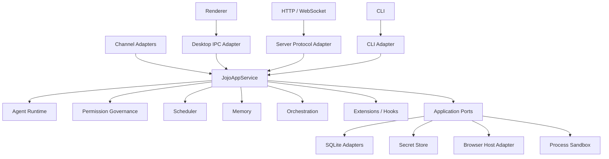
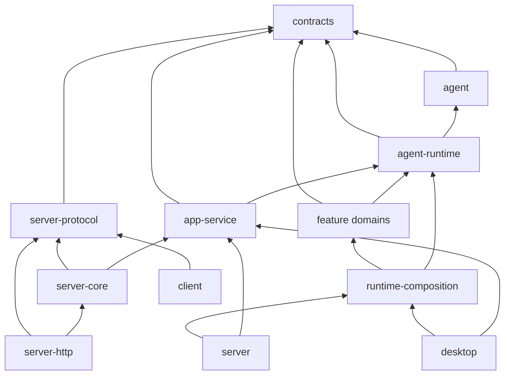

# jojo-agent 架构收口、跨层一致性与发布级验证优化方案

> 仓库：`zxt6991-source/jojo-agent`  
> 审计基线：`main @ 8d9d02497c2f713dcce88b09b6cb46595ab37863`  
> 基线提交时间：2026-09-18 16:42:17 UTC  
> 当前产品版本：`0.1.0`  
> 文档目标：在不推翻现有 Runtime / Permission / Scheduler / Channel / Memory 能力的前提下，把项目从“功能已经很多、工程边界基本形成”收口到“只有一套事实源、一套应用语义、一套跨 Host 契约，并具备可发布、可升级、可回滚的验证体系”。

---

## 1. 结论摘要

jojo-agent 当前已经不是一个简单的 Electron Agent MVP，而是一个包含 Desktop、Headless Server、CLI、Client SDK、Agent Runtime、Workflow、Scheduler、Channel、Memory、MCP、Hooks、Browser、Permission Governance、SQLite/JSONL Storage 的完整本地 Agent 平台。

现阶段最需要解决的并不是继续增加能力，而是进行一次 **Architecture Closure（架构收口）**。

建议把接下来一个阶段的目标收敛为：

```text
一个 Runtime
一个 Application Service
一个事实源
一套 Capability Manifest
一套 Domain Contract
多个 Transport Adapter
多个 Host Adapter
一套 Release Gate
```

当前优先级最高的风险有 6 个：

| 优先级 | 问题 | 当前表现 | 风险 |
|---|---|---|---|
| P0 | 会话数据双事实源 | Desktop 同时维护 JSONL Conversation 与 Runtime SQLite，并通过 `legacy-projection.ts` 双向补偿 | 崩溃恢复、Scheduler/Channel 投递、删除/恢复时可能出现数据不一致 |
| P0 | Desktop 与 Server 应用语义仍未完全统一 | Desktop Worker 自己组织大量业务流程，Server 使用 `JojoAppService` | 同一功能可能在两个 Host 上形成两种状态机 |
| P0 | Application 层依赖 Transport 层 | `@desktop-agent/app-service` 依赖 `@desktop-agent/server-protocol` | Application Service 被 Server API DTO 反向绑定，阻碍 Desktop/Server 共用 |
| P1 | Desktop Main/Worker 组合根过重 | `worker.ts` 约 95 KB、`main.ts` 约 86 KB、`browser-runtime.ts` 约 158 KB | 修改一项能力容易跨层扩散，测试和回归成本持续上升 |
| P1 | Contract/Feature/Docs 已产生漂移 | README 中仍描述旧协议版本，而源码 `JOJO_SERVER_PROTOCOL_VERSION = 3`；部分技术文档与当前 Worker runtime validation 状态不一致 | 用户、开发者、Client SDK、Server 和 Desktop 对“当前能力”理解不同 |
| P1 | CI 仍是开发级而非发布级 | 当前 CI 主要在 Ubuntu 上 lint/typecheck/test/Electron E2E/package | 无 Windows/macOS 安装验证、升级验证、签名验证、产物完整性和发布回滚 Gate |

总体建议：**不要再平行扩展新的大功能，先用 8～12 个 PR 完成架构收口。**

---

# 2. 当前架构判断

## 2.1 已经做对的部分

项目已经具备比较成熟的基础：

- `packages/agent-runtime` 已形成独立 Runtime Facade；
- `packages/runtime-composition` 已开始抽离 Host-independent Runtime Composition；
- `packages/app-service` 已出现真正的应用服务层；
- `packages/server-protocol` 已有版本化 Zod Protocol；
- `packages/server-core` / `server-http` / `client` 已经按协议层、核心层、Transport、SDK 分拆；
- `packages/permission-governance` 已把权限事实、策略、Grant、Hard Floor、Audit 独立；
- Scheduler、Channel、Memory、Hooks、MCP 等已经开始使用独立领域包；
- Runtime 有公共 Contract Suite；
- Desktop Main ↔ Worker 已经使用 `WorkerCommandSchema` / `WorkerMessageSchema` 进行运行时校验；
- Electron E2E 使用离线 Scripted Provider，具备可重复性；
- SQLite/JSONL 都已经考虑 Crash Recovery、删除竞态、Workflow Resume 等场景；
- Electron Fuses、Renderer Sandbox、IPC Sender 校验、MCP SSRF、Process Sandbox 等安全边界已经明显超过普通 MVP。

因此本方案不是建议重新设计，而是：

> **把已经存在的正确方向彻底执行到底。**

---

# 3. 代码证据与主要问题

## 3.1 P0：Desktop 仍存在两个会话事实源

关键文件：

```text
apps/desktop/src/runtime/legacy-projection.ts
apps/desktop/src/worker/worker.ts
apps/desktop/src/main/main.ts
packages/storage/src/index.ts
packages/storage/src/sqlite-runtime-store.ts
```

`legacy-projection.ts` 已经明确写出：

```text
Runtime storage is authoritative;
this projection can be deleted once the Renderer reads Runtime session snapshots directly.
```

当前流程实际上仍然是：


同时 `main.ts` 的 Artifact 读取又会把：

```text
JSONL messages
+
Runtime lane messages
```

合并后返回。

这说明当前仍存在：

- Runtime 是逻辑事实源；
- JSONL 又是 Desktop UI/Session 的历史事实源；
- Scheduler/Channel 为了 Renderer 关闭时持久化，又可能优先写 legacy store；
- Main 读取时再进行 merge；
- Worker 启动 Turn 前还要 seed；
- Runtime 完成后再 project 回 legacy。

这是当前最应该删除的“过渡架构”。

### 风险

最危险的不是普通聊天，而是以下边界：

1. Turn 执行过程中 Electron 崩溃；
2. Scheduler 在 Renderer 关闭时写消息；
3. Channel 入站触发后台 Run；
4. Session Delete 与 Runtime Commit 并发；
5. Runtime 已提交，legacy projection 未完成；
6. legacy 已写入，Runtime seed 尚未完成；
7. Compaction 只存在 Runtime，而 UI 又读 JSONL；
8. Artifact/Export 需要把两个 store 合并。

长期保留后，所有新能力都会被迫回答：

> “这个状态到底写 JSONL、Runtime SQLite，还是两边都写？”

### 收口目标

```text
Runtime Store = 唯一 Conversation / Lane / Run / Transcript 事实源
Session Metadata Store = Session title / favorite / project binding 等元数据
JSONL = 旧版本导入 + 显式导出格式，不再参与在线状态
```

### 推荐迁移

#### Step 1：增加 Migration Marker

例如：

```text
runtime_migrations
- migration_id
- session_id
- source
- source_hash
- completed_at
```

第一次打开旧 Session：

```text
Legacy JSONL
    ↓
validate
    ↓
import Runtime entries
    ↓
verify transcript hash
    ↓
mark migrated
```

必须保证：

```text
重复执行迁移 = 无副作用
```

#### Step 2：Renderer 直接读取 Runtime Snapshot

Renderer 不再读取：

```text
JsonlSessionStore.messages()
```

改为：

```text
JojoAppService.getSession()
JojoAppService.getTranscript()
```

#### Step 3：停止 Runtime → JSONL 在线 Projection

删除：

```text
projectRuntimeMessagesToLegacy()
seedRuntimeLaneFromLegacy()
```

#### Step 4：JSONL 只保留

```text
importLegacySession()
exportSessionAsJsonl()
```

#### Step 5：删除 Main 中的双 Store merge

类似：

```ts
const messages = new Map(await sessionStore.messages(...))
const runtimeStore = new SqliteAgentRuntimeStore(...)
...
messages.set(...)
```

应全部删除。

### P0 验收标准

- `apps/desktop/src/runtime/legacy-projection.ts` 删除；
- Runtime 过程中不再写 Conversation JSONL；
- Scheduler、Channel、主对话都走同一个 Runtime transcript；
- Artifact/Export 只读 Runtime；
- 旧数据迁移具备 fixture 测试；
- 强制 Kill 后重启不存在重复 Message；
- Session Delete 后旧 JSONL 无法“复活” Session。

---

# 4. P0：把 JojoAppService 变成 Desktop 与 Server 的唯一应用入口

## 4.1 当前问题

目前已经有：

```text
packages/app-service/
  approval-service.ts
  jojo-app-service.ts
  persistence.ts
  recovery-coordinator.ts
  runtime-app-service.ts
```

Server 正在朝正确方向走：

```text
HTTP
  ↓
Server Core
  ↓
JojoAppService
  ↓
Agent Runtime
```

但 Desktop Worker 仍然直接组合大量能力：

```text
Provider
Permission
Memory
Hooks
MCP
Scheduler
Channel
Workflow
Team
Browser
Storage
Runtime
```

从 `apps/desktop/src/worker/worker.ts` 顶部依赖即可看到，它实际上同时扮演：

- Composition Root；
- Session Service；
- Run Service；
- Scheduler Host；
- Channel Host；
- Approval Broker；
- Memory Host；
- MCP Host；
- Workflow Host；
- Team Host；
- Desktop IPC Controller。

这会导致 Desktop 与 Server 即使共享 Runtime，也可能不共享完整应用状态机。

---

## 4.2 目标结构

建议最终形成：



核心原则：

> Desktop 和 Server 不应该拥有两套“如何创建 Session / 开始 Run / 恢复 Run / 处理 Approval / Scheduler Dispatch”的逻辑。

它们只允许不同在：

```text
Transport
Host Capability
OS Integration
Secret Backend
Browser Backend
UI Interaction
```

---

# 5. P0：解除 App Service → Server Protocol 反向依赖

当前 manifest：

```text
@desktop-agent/app-service
  ├── @desktop-agent/agent-runtime
  ├── @desktop-agent/contracts
  └── @desktop-agent/server-protocol
```

这是一个明显的架构信号。

理想依赖应该是：

```text
Domain Contracts
      ↑
App Service
      ↑
Server Protocol Mapper
      ↑
Server Core / HTTP
```

而不是：

```text
Server Protocol
      ↑
App Service
```

因为 Application Service 不应该知道自己最终会被 HTTP、Desktop IPC、CLI 还是未来 Mobile Client 调用。

---

## 5.1 建议拆法

将以下概念放入中立 Application Contract：

```text
CreateSessionInput
PatchSessionInput
StartRunInput
RunSnapshot
TranscriptQuery
PendingApprovalSnapshot
ApplicationError
```

推荐位置：

```text
packages/contracts/src/application/
```

或者单独：

```text
packages/app-contracts/
```

如果不希望增加包数量，优先前者。

之后：

```text
app-service
    depends contracts

server-protocol
    depends contracts
    maps application DTO <-> network envelope

desktop-ipc
    depends contracts
    maps application DTO <-> IPC envelope
```

### 验收

`packages/app-service/package.json` 中彻底删除：

```text
@desktop-agent/server-protocol
```

---

# 6. P1：把 Runtime Composition 从“工具组装器”升级为“产品 Composition Root”

当前 `packages/runtime-composition` 已经有：

```text
createJojoRuntime()
RuntimeEnvironmentBuilder
RuntimeCapability
RuntimeEnvironmentRegistry
```

这个方向是正确的。

但目前大量产品级能力仍在 Desktop Worker 与 Server Host 各自 wiring。

建议不要再建立第三套 Composition，而是扩展现有 `runtime-composition`。

---

## 6.1 引入 ProductRuntimeFactory

建议：

```ts
type ProductHostAdapters = {
  secretStore: SecretStore
  attachmentAccess: AttachmentAccessResolver
  browser?: BrowserHost
  terminal: ProcessHost
  approvals: ApprovalHost
  telemetry: TelemetrySink
}

type ProductFeatures = {
  memory: boolean
  scheduler: boolean
  channels: boolean
  workflows: boolean
  teams: boolean
  browser: boolean
  mcp: boolean
  hooks: boolean
}

createProductRuntime({
  host,
  stores,
  adapters,
  features
})
```

返回：

```ts
{
  runtime,
  appService,
  scheduler,
  channelManager,
  capabilityManifest,
  dispose
}
```

### Desktop Worker 以后只做

```ts
const product = await createProductRuntime({
  host: { kind: 'desktop' },
  adapters: desktopAdapters,
  stores: desktopStores
})

bridgeWorkerIpc(product.appService)
```

### Server 以后只做

```ts
const product = await createProductRuntime({
  host: { kind: 'server' },
  adapters: serverAdapters,
  stores: serverStores
})

createServerCore(product.appService)
```

这样才能真正解决：

```text
Desktop 能跑
Server 也能跑
但两边 wiring 不完全相同
```

---

# 7. P1：建立 Capability Manifest，消除能力描述漂移

当前已经存在明显的能力描述漂移。

例如源码：

```ts
export const JOJO_SERVER_PROTOCOL_VERSION = 3
```

而仓库 README 中仍存在旧的 Protocol 描述。

`docs/technical-implementation/contracts.md` 还写有：

```text
Main↔Worker 消息目前只有静态类型约束，后续需要补运行时校验。
```

但当前 `main.ts` 已经实际执行：

```ts
WorkerCommandSchema.safeParse(...)
WorkerMessageSchema.safeParse(...)
```

这说明现在的文档模式属于：

```text
代码改动
→ 人工记得改文档
→ 有时遗漏
```

随着 Scheduler、Channel、Memory、Permission、Browser 能力越来越多，这种方式会持续失效。

---

## 7.1 建议建立单一 Capability Registry

例如：

```ts
type CapabilityDescriptor = {
  id: 'memory' | 'scheduler' | 'channels' | 'browser' | ...
  version: number
  desktop: CapabilitySupport
  server: CapabilitySupport
  cli: CapabilitySupport
  requiredAdapters: string[]
  permissionDomain?: string
  healthProbe?: string
}
```

示例：

```ts
{
  id: 'scheduler',
  version: 2,
  desktop: {
    supported: true,
    targets: ['agent', 'workflow', 'team_member']
  },
  server: {
    supported: true,
    targets: ['agent']
  }
}
```

然后自动生成：

```text
ServerCapabilities
Desktop feature visibility
CLI doctor output
Client SDK feature detection
docs/current-features.generated.md
README capability table
```

### 原则

```text
能力是否存在，不再由 README 决定。
README 只展示 Manifest 生成结果。
```

---

# 8. P1：统一跨层 Contract，不再让 Desktop IPC 与 Server Protocol 平行演化

目前有两套明显的 Transport Contract：

```text
packages/contracts/src/desktop-ipc.ts
packages/server-protocol/src/index.ts
```

两者都包含：

```text
Session
Run
Approval
Scheduler
Channel
Team
Memory
```

当前虽然大量复用了 contracts schema，但 Transport command 本身仍然平行维护。

风险是：

```text
Desktop 新增字段
Server 忘记新增

Server 新增 revision
Desktop 继续使用旧语义

Desktop approval scope
Remote approval decision
出现差异
```

---

## 8.1 推荐建立 Command / Query Registry

例如：

```ts
defineOperation({
  id: 'session.create',
  kind: 'command',
  input: CreateSessionInputSchema,
  output: SessionSnapshotSchema,
  idempotent: true,
  permission: 'session:create'
})
```

再由不同 Transport 包装：

```text
Desktop IPC:
{ type, requestId, payload }

HTTP:
POST /api/v1/...
headers + body

Client SDK:
client.createSession()

CLI:
jojo ...
```

最终：

```text
业务输入 Schema 只有一个
Transport Envelope 可以不同
```

---

# 9. P1：增加统一错误模型

当前源码中仍存在大量：

```ts
throw new Error('runtime_environment_unavailable')
throw new Error('server_data_directory_busy')
throw new Error('runtime_lane_not_found')
```

而 Server 层又有：

```ts
ProtocolErrorSchema {
  code
  message
  retryable
  details
  requestId
}
```

建议建立内部统一：

```ts
class JojoError extends Error {
  code: JojoErrorCode
  retryable: boolean
  safeMessage: string
  details?: JsonValue
  cause?: unknown
}
```

错误链：

```text
Domain / Runtime
      ↓
JojoError
      ↓
Desktop Error Mapper
Server Protocol Error Mapper
CLI Exit Code Mapper
Channel Error Mapper
```

必须保证同一错误：

```text
runtime_environment_unavailable
```

在 Desktop、Server、CLI 都具有相同：

```text
code
retryability
user-safe message
telemetry category
```

---

# 10. P1：Desktop Main / Worker 拆成真正的薄 Host

当前大文件：

| 文件 | 大小 |
|---|---:|
| `apps/desktop/src/worker/worker.ts` | 约 95 KB |
| `apps/desktop/src/main/main.ts` | 约 86 KB |
| `apps/desktop/src/main/browser-runtime.ts` | 约 158 KB |
| `packages/contracts/src/desktop.ts` | 约 40 KB |
| `packages/contracts/src/orchestration.ts` | 约 40 KB |

大文件本身不是错误，但这些文件都位于跨层边界上，因此它们的增长会显著提高变更扩散率。

---

## 10.1 Worker 目标

建议：

```text
worker/
  index.ts
  bootstrap.ts
  ipc-controller.ts
  desktop-host-adapters.ts
  capabilities/
    browser.ts
    approvals.ts
    secrets.ts
```

Worker entry 应只负责：

```text
read env
create host adapters
createProductRuntime
bind IPC
dispose
```

不再直接 new：

```text
MemoryService
Scheduler
ChannelManager
PermissionGovernanceEngine
WorkflowEngine
...
```

---

## 10.2 Main 目标

建议：

```text
main/
  bootstrap/
  ipc/
    session-ipc.ts
    settings-ipc.ts
    memory-ipc.ts
    channel-ipc.ts
    browser-ipc.ts
  security/
  secrets/
  browser/
  windows/
```

`main.ts` 最终只保留：

```text
app lifecycle
BrowserWindow lifecycle
IPC module registration
Worker lifecycle
global dispose
```

---

# 11. P1：建立 Architecture Test，而不是依靠约定

当前 `eslint.config.mjs` 已经对 Agent Runtime 和 Composition 做了一些 `no-restricted-imports`，这是很好的起点。

但目前规则还不完整。

建议增加：

```text
pnpm test:architecture
```

至少验证：

### 11.1 Package Dependency Direction

允许：

```text
contracts
   ↑
agent-runtime
   ↑
app-service
   ↑
transport
   ↑
apps
```

禁止：

```text
app-service -> server-protocol
agent-runtime -> storage implementation
contracts -> feature implementation
renderer -> node package
server-protocol -> electron
```

### 11.2 禁止跨包内部路径

目前已有少量：

```text
@desktop-agent/storage/sqlite-runtime-store
@desktop-agent/contracts/runtime
@desktop-agent/agent-runtime/spi
```

这些应全部明确归类：

```text
public subpath
or
forbidden internal import
```

不能处于“能 import 就先用”的状态。

### 11.3 Circular Dependency

CI 中加入 package graph cycle check。

### 11.4 Composition Root Rule

只有：

```text
apps/*
packages/runtime-composition/*
```

允许直接依赖多个 Feature Implementation。

---

# 12. P1：版本与 Schema 统一管理

当前项目至少存在：

```text
npm package version = 0.1.0
Server protocol version = 3
Server state schema version = 2
Desktop config schema = 4
Session record schema = 1
Workflow journal version
Browser recording version
Worker IPC schema
```

这些版本分散在不同文件。

建议增加：

```text
packages/contracts/src/version-manifest.ts
```

或者 build-time 生成：

```ts
export const BUILD_COMPATIBILITY = {
  appVersion: '0.1.0',
  serverProtocol: 3,
  desktopWorkerProtocol: 1,
  configSchema: 4,
  sessionSchema: 1,
  serverStateSchema: 2,
  workflowJournalSchema: 1
}
```

---

## 12.1 增加 Compatibility Matrix

```text
tests/compatibility/
  fixtures/
    0.1.0/
    0.2.0/
```

每次发布至少验证：

```text
N-1 data → N
N data → N
N 不允许被 N-1 打开时给出明确错误
```

---

# 13. P1：Storage 收口

当前 `@desktop-agent/storage` 已经同时包含：

```text
JSONL Session
JSON Config
SQLite Runtime
SQLite Server State
SQLite Permission
SQLite Scheduler
SQLite Team
SQLite Memory
SQLite MCP Trust
Workflow Journal
```

这使 `storage/index.ts` 越来越像“所有持久化实现的总仓库”。

建议短期不要为了纯洁度拆十几个 npm workspace，而是先进行：

```text
storage/
  ports/
  legacy/
  sqlite/
    runtime/
    server-state/
    permissions/
    scheduler/
    memory/
    team/
```

并要求：

```text
feature service 不 import storage implementation
composition root 负责注入 implementation
```

中期再视稳定性决定是否拆包。

---

# 14. 跨层一致性专项方案

建议建立一套 **Cross-Layer Contract Suite**。

目标不是测试某一个函数，而是验证：

> 相同业务动作，无论从 Desktop、Server、Scheduler、Channel 进入，都得到相同的 Runtime 和持久化语义。

---

## 14.1 Session 一致性

测试矩阵：

| 场景 | Desktop | Server | 预期 |
|---|---|---|---|
| 创建 Session | ✓ | ✓ | 相同 Runtime Session |
| 修改 title | ✓ | ✓ | revision 语义一致 |
| 删除 Session | ✓ | ✓ | Runtime + metadata 原子消失 |
| 重启恢复 | ✓ | ✓ | Transcript 一致 |
| Crash during run | ✓ | ✓ | Run 进入 interrupted/recoverable |

---

## 14.2 Run 一致性

统一：

```text
accepted
starting
running
completed
failed
cancelled
interrupted
```

Desktop UI 不应该再使用另一套隐式状态，例如：

```text
loading / stopped / done
```

而应该只做 projection。

---

## 14.3 Approval 一致性

构造 Golden Matrix：

```text
Actor:
main
subagent
team_member
workflow
scheduler
channel_user

Mode:
ASK
AUTO
YOLO

Action:
read
workspace write
outside-workspace write
terminal
network
secret
browser interaction
MCP
hook
```

同一个 ActionFact：

```text
PermissionNormalizer
      ↓
PermissionGovernance
```

无论从哪个 Host 进入，都必须得到同一：

```text
decision
locked
reason
risk
audit actor
```

---

## 14.4 Scheduler 一致性

允许 Host 能力不同，但必须是显式 Capability 差异：

```text
Desktop:
agent + workflow + team_member

Headless:
agent
```

不允许靠代码路径“恰好不支持”。

Server 在收到不支持 target 时应返回：

```text
capability_not_supported
```

而不是：

```text
unknown error
```

---

## 14.5 Channel 一致性

Channel 入站最终必须转换为标准：

```text
RunRequest {
  actor
  trigger
  session
  lane
  provider
  model
  input
}
```

而不是自己拥有一套 Agent Run 状态机。

---

# 15. 发布级验证：当前缺口

当前 CI：

```text
ubuntu-latest

pnpm install --frozen-lockfile
pnpm lint
pnpm typecheck
pnpm test
xvfb Electron E2E
electron-forge package
```

这个 CI 对开发阶段很好，但还不是 Release Gate。

主要缺口：

1. 只有 Linux CI；
2. `package` 只生成 unpacked app，不等于验证真正分发安装包；
3. 没有 macOS；
4. 没有 Windows；
5. 没有安装后启动 Smoke；
6. 没有升级测试；
7. 没有代码签名验证；
8. 没有 notarization 验证；
9. 没有 installer uninstall/reinstall 验证；
10. 没有 SBOM；
11. 没有产物 SHA256；
12. 没有 artifact provenance；
13. 没有 release workflow；
14. 没有 dependency/license/security gate；
15. 没有 schema N-1 → N migration gate；
16. macOS Strong Sandbox 仍主要依赖人工实机测试；
17. 当前 package step 带 3 次 retry，可能把偶发构建问题隐藏成“最终成功”。

---

# 16. 推荐 CI 分层

不要把所有验证全部放入每个 PR。

建议四级。

---

## Gate A：PR Fast Gate

目标：5～10 分钟内发现结构问题。

```text
install --frozen-lockfile
format/check
lint
typecheck
architecture test
unit tests
contract tests
schema snapshot tests
```

新增：

```text
pnpm test:architecture
pnpm test:contracts
pnpm test:migrations
```

---

## Gate B：PR Integration Gate

Linux：

```text
runtime contract
server/client e2e
storage crash/recovery
workflow resume
scheduler recovery
channel outbox
permission golden matrix
Electron scripted-provider E2E
```

必须保持：

```text
无真实 API Key
无公网依赖
完全 deterministic
```

---

## Gate C：Main Nightly Matrix

```yaml
matrix:
  - ubuntu-latest
  - windows-latest
  - macos-14
  - macos-15
```

建议重点：

### Windows

```text
Electron launch
Squirrel installer
install
first launch
workspace file tool
terminal
restart
uninstall
```

### macOS

```text
arm64 package
launch
safeStorage
sandbox
browser
utility process
ZIP
sign validation
```

如未来支持 x64：

```text
macos x64 独立 Runner
```

### Linux

```text
Deb install
Xvfb launch
runtime
headless server
CLI systemd definition
```

---

# 17. Release Gate

只有 Tag/Release 才执行。

```mermaid
flowchart LR
    TAG[Version Tag]
    BUILD[Clean Build]
    TEST[Release Tests]
    SIGN[Sign]
    NOTE[macOS Notarize]
    INSTALL[Clean VM Install]
    UPGRADE[N-1 Upgrade]
    SBOM[SBOM + SHA256]
    PUB[Publish Draft]
    SMOKE[Post-publish Smoke]

    TAG --> BUILD --> TEST --> SIGN
    SIGN --> NOTE
    NOTE --> INSTALL
    INSTALL --> UPGRADE
    UPGRADE --> SBOM
    SBOM --> PUB
    PUB --> SMOKE
```



---

## 17.1 macOS Release Gate

必须验证：

```text
codesign --verify --deep --strict
spctl --assess
notarytool history/info
first launch
quit/relaunch
safeStorage encryption
utility process
browser sandbox
```

并在“全新用户目录”执行。

---

## 17.2 Windows Release Gate

必须验证：

```text
Squirrel installer
install path
Start Menu
first launch
safeStorage
utility process
terminal process tree
update/reinstall
uninstall
```

---

## 17.3 Upgrade Gate

最重要的发布测试之一。

准备上一个正式版本 fixture：

```text
userData/
~/.jojo/
```

包含：

```text
Sessions
Config v1/v2/v3/v4
Memory
Permission
MCP Trust
Scheduler
Team
Channel
Workflow Journal
Browser Recording
```

流程：

```text
安装 N-1
生成测试数据
退出
安装 N
启动
自动迁移
运行一轮
重启
重新读取
验证数据 hash
```

---

# 18. Fault Injection / Crash Validation

Agent 产品最重要的不是 happy path，而是中断路径。

建议增加：

```text
tests/fault-injection/
```

对以下 commit point 人工 kill：

### Session

```text
create metadata 后
runtime open 前
runtime open 后
metadata active 前
```

### Run

```text
accepted
starting
provider request
tool call
approval pending
tool side effect complete
runtime append
run result update
```

### Scheduler

```text
lease acquired
dispatch before run
run started
delivery pending
delivery sent
outbox update
```

### Channel

```text
inbound dedup write
session resolve
run start
reply send
delivery receipt
```

### Migration

```text
migration halfway
```

每个位置都验证：

```text
restart 后数据不能重复
不能丢 durable side effect record
不能产生两个 active owner
```

---

# 19. Release Security Gate

当前安全实现已经不错，建议把它正式变成发布 Gate。

---

## 19.1 Dependency Gate

加入：

```text
pnpm audit
license allowlist
dependency diff
```

对 Electron / Fastify / React / Zod / xlsx 等关键依赖做显式跟踪。

---

## 19.2 Secret Scan

CI：

```text
gitleaks
```

至少扫描：

```text
repo
build output
packaged resources
test fixture
```

---

## 19.3 SBOM

生成：

```text
CycloneDX JSON
```

随 Release Artifact 发布。

---

## 19.4 Artifact Integrity

每个产物输出：

```text
SHA256SUMS
```

未来可以增加 Sigstore provenance。

---

# 20. Real Provider Validation 的正确位置

不建议在 PR Gate 中调用真实模型。

原因：

```text
成本
网络不稳定
Provider 行为变化
Rate Limit
不可重复
```

推荐：

```text
PR:
Scripted Provider

Nightly:
1～2 个真实 Provider 超小配额 Smoke

Release Candidate:
OpenAI-compatible endpoint
Tool Call
Streaming
Vision optional
Embedding optional
```

真实 Provider 测试失败时应区分：

```text
product regression
provider outage
network failure
```

---

# 21. Documentation as Code

当前文档已经发生漂移，因此建议把以下内容从手写改成生成：

```text
Protocol version
Capability matrix
Package graph
Available tools
IPC operations
Server routes
Config schema version
Storage schema version
Supported scheduler target
```

命令：

```text
pnpm docs:generate
pnpm docs:check
```

CI 中：

```text
pnpm docs:generate
git diff --exit-code
```

如果代码变了但文档未更新，CI 直接失败。

---

# 22. 推荐 Package Boundary

最终可以收口为：

```text
packages/
├── contracts
│   └── 纯 Domain / Application Contract
│
├── agent
│   └── Provider/Tool loop primitives
│
├── agent-runtime
│   └── Session/Lane/Run authoritative runtime
│
├── runtime-composition
│   └── Product runtime composition
│
├── app-service
│   └── Session/Run/Approval 应用用例
│
├── permission-governance
├── orchestration
├── scheduler
├── memory
├── extensions
├── hooks
├── channel-*
│
├── storage
│   └── 持久化 Adapter
│
├── server-protocol
│   └── Network DTO + Envelope
│
├── server-core
├── server-http
└── client
```

依赖方向：



重点：

```text
app-service 不依赖 server-protocol
contracts 不依赖 feature implementation
domain 不依赖 transport
```

---

# 23. 建议 PR 拆分

不要一个 PR 做完。

---

## PR-01：Architecture Guard

新增：

```text
scripts/check-architecture.mjs
pnpm test:architecture
```

检查：

- package graph；
- forbidden imports；
- cycle；
- internal subpath；
- app-service → server-protocol 禁止。

**风险：低**

---

## PR-02：Version / Capability Manifest

新增：

```text
BUILD_COMPATIBILITY
CapabilityManifest
docs:generate
docs:check
```

解决 README / source 漂移。

**风险：低**

---

## PR-03：Application Contract 下沉

把 App Service 使用的：

```text
Session DTO
Run DTO
Approval DTO
Transcript DTO
```

从 server-protocol 移到 neutral contracts。

删除：

```text
app-service -> server-protocol
```

**风险：中**

---

## PR-04：统一 Operation Registry

统一：

```text
Session
Run
Approval
Scheduler
Channel
```

Domain Schema。

Desktop IPC 与 Server Protocol 只保留 Envelope。

**风险：中**

---

## PR-05：Runtime 唯一 Transcript 事实源

实现 Legacy JSONL → Runtime migration。

Renderer 查询 Runtime。

暂时保留 legacy projection feature flag。

**风险：高**

---

## PR-06：彻底删除 Legacy Projection

删除：

```text
legacy-projection.ts
dual-write
artifact dual-read
```

**风险：高**

---

## PR-07：Desktop 使用 JojoAppService

Worker 的 Session/Run/Approval 主链路改为调用 App Service。

保持 Browser、Secret 为 Desktop Adapter。

**风险：高**

---

## PR-08：统一 Product Composition

Desktop 与 Server 调用同一个：

```text
createProductRuntime()
```

**风险：中高**

---

## PR-09：拆 Worker/Main

只做代码移动和边界调整，不改变行为。

**风险：中**

---

## PR-10：Cross-Host Conformance Suite

加入：

```text
Desktop host
Headless host
```

共同 Contract Suite。

重点：

```text
Session
Run
Approval
Recovery
Permission
Scheduler
```

**风险：低中**

---

## PR-11：Release Matrix

增加：

```text
Windows
macOS
Linux
```

真正的 `make` + launch smoke。

**风险：低**

---

## PR-12：Release Workflow

加入：

```text
tag
sign
notarize
installer test
upgrade
SBOM
SHA256
draft release
```

**风险：中**

---

# 24. 具体 CI 建议

根 `package.json` 增加：

```json
{
  "scripts": {
    "verify": "pnpm verify:fast && pnpm verify:integration",
    "verify:fast": "pnpm lint && pnpm typecheck && pnpm test:architecture && pnpm test:contracts",
    "verify:integration": "pnpm test && pnpm test:runtime-smoke && pnpm test:e2e:electron",
    "verify:release": "pnpm verify && pnpm test:migrations && pnpm test:packaged"
  }
}
```

注意：

> 这是建议结构，具体可以继续沿用 Vitest 的现有配置，不需要为了命令形式重复跑同一批测试。

---

# 25. 不建议的做法

## 25.1 不建议再建立一套新的 Runtime

已有 `agent-runtime` 足够。

应该继续收口，不要新增：

```text
desktop-runtime-v2
server-runtime-v2
```

---

## 25.2 不建议仅靠 README 维护能力矩阵

因为已经出现漂移。

必须生成。

---

## 25.3 不建议 Desktop 为了“更方便”继续绕过 App Service

否则 Server 和 Desktop 会持续分叉。

---

## 25.4 不建议一次性把 Storage 拆成十几个 Workspace

短期收益不够。

先完成：

```text
事实源
接口
依赖方向
```

之后再物理拆包。

---

## 25.5 不建议把真实 LLM 测试作为 PR Blocker

PR 必须 deterministic。

---

# 26. 收口后的关键主链路

## 26.1 Desktop

```text
Renderer
  ↓
Preload
  ↓
Desktop IPC Adapter
  ↓
JojoAppService
  ↓
Agent Runtime
  ↓
Runtime Store
```

---

## 26.2 Headless

```text
Client SDK
  ↓
HTTP / WebSocket
  ↓
Server Protocol Adapter
  ↓
JojoAppService
  ↓
Agent Runtime
  ↓
Runtime Store
```

---

## 26.3 Scheduler

```text
Scheduler
  ↓
Application Run Command
  ↓
JojoAppService
  ↓
Agent Runtime
```

不是：

```text
Scheduler
  ↓
自己调用 Desktop startTurn
```

---

## 26.4 Channel

```text
Telegram / Feishu
  ↓
Channel Runtime
  ↓
Application Run Command
  ↓
JojoAppService
  ↓
Agent Runtime
```

---

# 27. 最终验收清单

## Architecture

- [ ] `app-service` 不再依赖 `server-protocol`
- [ ] Desktop / Server 使用同一个 Product Composition
- [ ] Desktop Session/Run 主链路通过 JojoAppService
- [ ] Worker 不再直接实现应用状态机
- [ ] package graph 无未批准环依赖
- [ ] Architecture Test 进入 CI

## State

- [ ] Runtime Store 是唯一 Transcript 事实源
- [ ] `legacy-projection.ts` 删除
- [ ] Artifact/Export 不再 merge 两份消息
- [ ] JSONL 只作为 Migration / Export
- [ ] Session Delete 无复活
- [ ] Crash Recovery 无重复消息

## Contract

- [ ] Desktop IPC 与 Server Protocol 共用 Domain Operation Schema
- [ ] Error Code 统一
- [ ] Worker IPC 有 protocol handshake/version
- [ ] 所有 Transport 输入都 runtime validate
- [ ] Capability Manifest 是唯一能力事实源

## Permission

- [ ] Main/SubAgent/Workflow/Scheduler/Channel 使用同一 Normalizer
- [ ] Golden Matrix 覆盖 ASK/AUTO/YOLO
- [ ] Audit actor/origin 一致
- [ ] Hard Deny 在所有 Host 上一致

## Version

- [ ] App/Protocol/Config/State/Session Schema 有 Compatibility Manifest
- [ ] N-1 → N migration 自动验证
- [ ] docs:check 阻止版本文档漂移

## Release

- [ ] Linux packaged smoke
- [ ] Windows installer smoke
- [ ] macOS signed smoke
- [ ] macOS notarization
- [ ] Clean profile first launch
- [ ] Upgrade test
- [ ] SBOM
- [ ] SHA256SUMS
- [ ] Secret scan
- [ ] Dependency/license gate
- [ ] Release rollback procedure

---

# 28. 推荐优先级

如果只做一轮架构治理，建议顺序：

```text
P0-1 Runtime 唯一事实源
      ↓
P0-2 Desktop / Server 共用 JojoAppService
      ↓
P0-3 App Service 与 Server Protocol 解耦
      ↓
P1-1 Capability / Version Manifest
      ↓
P1-2 Operation Contract Registry
      ↓
P1-3 Worker/Main 拆薄
      ↓
P1-4 Cross-Host Conformance
      ↓
P1-5 Release Matrix + Upgrade Gate
```

其中真正决定项目未来维护成本的是前三项。

---

# 29. 最终目标状态

完成本轮后，jojo-agent 应达到下面的工程状态：

```text
新增一个功能时：

1. 定义 Domain Contract
2. 实现 Feature Service / Runtime Capability
3. 注册 Capability
4. App Service 暴露 Use Case
5. Desktop / Server Transport 自动获得同一 Schema
6. Contract Suite 自动验证两个 Host
7. docs 自动生成能力描述
8. Release Matrix 自动验证安装与升级
```

而不是现在潜在的：

```text
改 contracts
改 worker
改 main
改 preload
改 renderer
改 server protocol
改 server core
改 client
改 docs
再人工确认两边语义是否一致
```

这就是本次“架构收口”的核心价值：

> **把系统复杂度从“调用方数量 × 功能数量”降低为“功能数量 + Adapter 数量”。**

---

# 30. 本次审计主要依据

本方案基于以下仓库代码与配置进行：

```text
package.json
.github/workflows/ci.yml
eslint.config.mjs

apps/desktop/package.json
apps/desktop/forge.config.ts
apps/desktop/playwright.electron.config.ts
apps/desktop/scripts/build-e2e.mjs
apps/desktop/src/main/main.ts
apps/desktop/src/worker/worker.ts
apps/desktop/src/runtime/legacy-projection.ts

apps/server/src/index.ts

packages/contracts/package.json
packages/contracts/src/desktop-ipc.ts
packages/contracts/src/desktop.ts

packages/agent-runtime/package.json
packages/agent-runtime/test/public-runtime.test.ts

packages/runtime-composition/package.json
packages/runtime-composition/src/runtime.ts
packages/runtime-composition/src/environment-registry.ts
packages/runtime-composition/test/headless-runtime.test.ts

packages/app-service/package.json
packages/app-service/src/jojo-app-service.ts

packages/server-protocol/package.json
packages/server-protocol/src/index.ts

packages/server-core/package.json
packages/server-http/package.json

packages/storage/package.json
packages/storage/src/index.ts
packages/storage/src/server-state-schema.ts
packages/storage/src/server-data-ownership.ts
packages/storage/test/config-migration.test.ts

packages/permission-governance/package.json

docs/technical-implementation/README.md
docs/technical-implementation/contracts.md
docs/current-features.md
README.md
```

审计基线提交：

```text
8d9d02497c2f713dcce88b09b6cb46595ab37863
权限设置页 UX 优化
```

---

## 一句话总结

**jojo-agent 现在最应该做的不是继续堆功能，而是让 Runtime 成为唯一数据事实源、让 JojoAppService 成为唯一应用语义入口、让 Desktop/Server 只剩 Host/Transport 差异，再用 Capability Manifest、Contract Suite 和多平台 Release Gate 把这种一致性锁死。**
