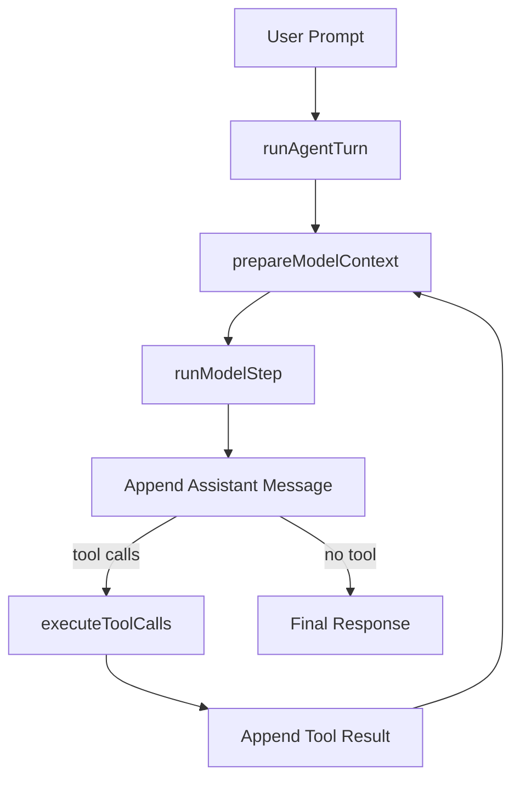
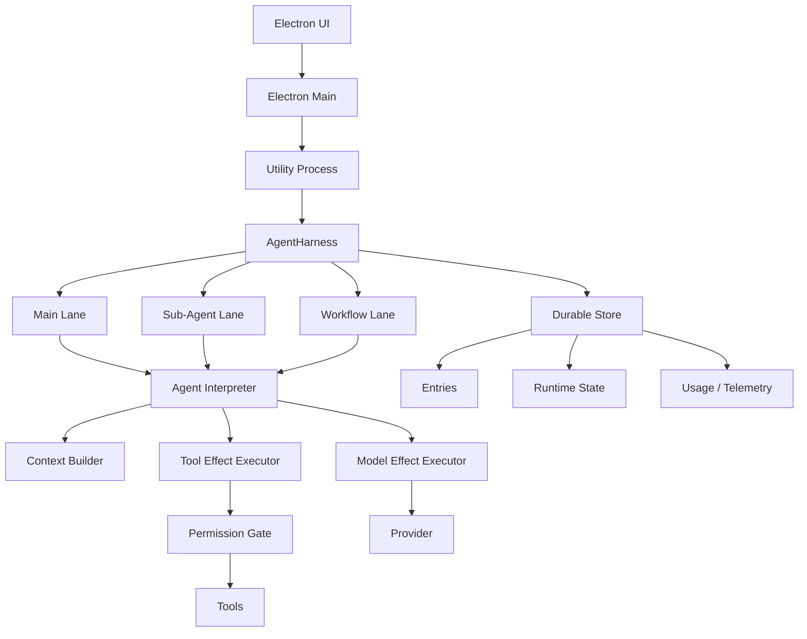
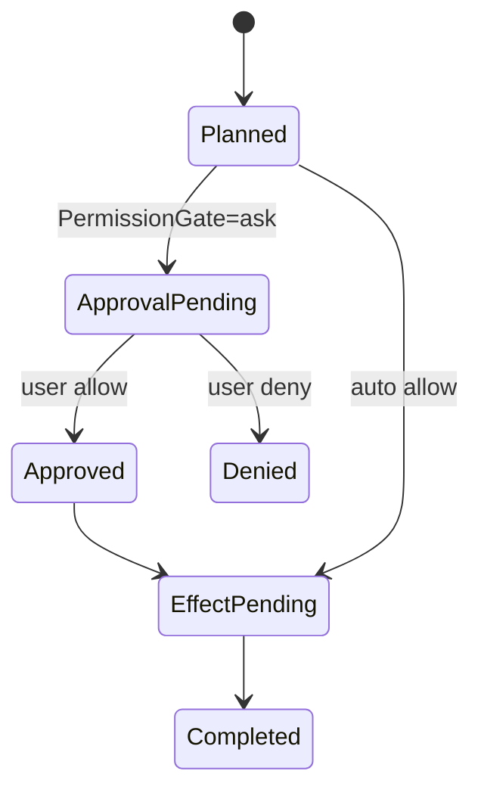
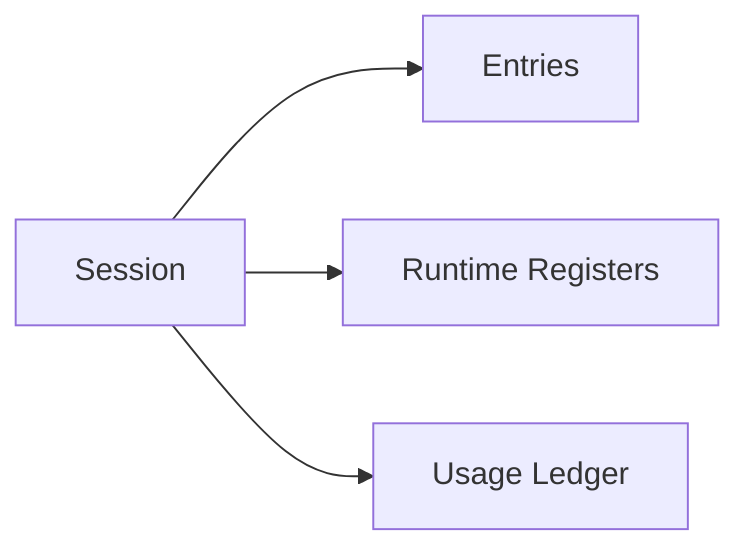
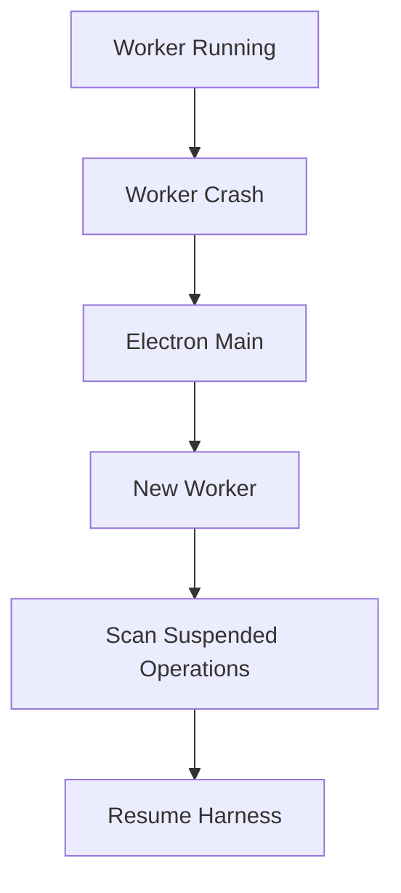
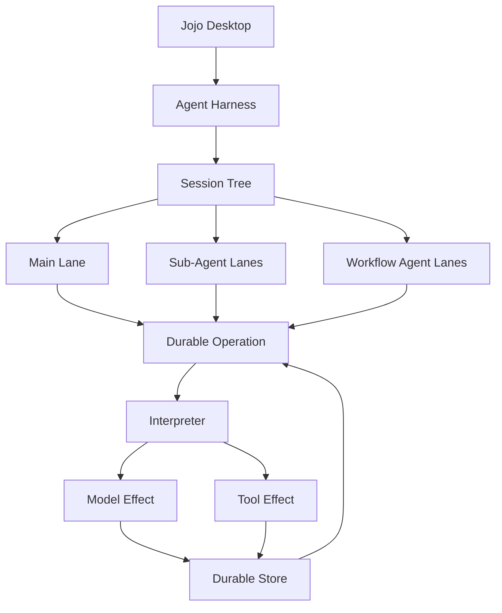

# Jojo Agent 借鉴 Pi Harness 的完整技术方案

> 文档版本：v1.0  
> 日期：2026-08-18  
> 目标仓库：`zxt6991-source/jojo-agent`  
> 参考仓库：`earendil-works/pi`  
> 文档定位：架构设计 + 落地方案 + 分阶段改造计划  
> 核心目标：在不推翻 Jojo Agent 现有 Agent Core、Sub-Agent、Workflow、Permission Gate、Worktree 等能力的前提下，引入可持久化、可恢复、可测试的 Agent Harness / Durable Runtime。

---

## 1. 摘要

Jojo Agent 当前已经具备较完整的 Coding Agent 能力：

- Electron Main / Preload / Renderer / Utility Process；
- OpenAI Chat Completions 兼容 Provider；
- 主 Agent 多轮 Tool Loop；
- 上下文估算、Tool Result 回收、历史压缩；
- 文件 / Terminal / Web / Browser / MCP / Skills；
- Permission Gate 与逐次审批；
- Sub-Agent；
- Workflow DAG；
- Git Worktree 隔离；
- Workflow JSONL Journal / Resume；
- Usage / Structured Output / Budget 等能力。

因此，Jojo 当前真正缺失的并不是“Agent 会不会调用工具”，而是：

> **主 Agent 的执行过程仍主要是进程内状态，消息虽然被持久化，但“Agent 当前执行到了哪一步”没有被完整、可靠地持久化。**

当前 `packages/agent-core/src/run-agent-turn.ts` 本质仍然是：

```text
user
  ↓
LLM
  ↓
assistant
  ↓
tool
  ↓
tool result
  ↓
LLM
  ↓
...
```

其核心状态如：

```ts
type TurnState = {
  messages: Message[];
  toolsByName: Map<string, Tool>;
  toolDefinitions: ToolDefinition[];
  executedCallIds: Set<string>;
  toolCallCounts: Map<string, number>;
  observationFingerprints: Set<string>;
};
```

主要存在于当前 Worker 进程中。

一旦发生以下场景：

```text
assistant 已输出 write_file tool call
            ↓
write_file 已真实修改文件
            ↓
Worker / Electron 崩溃
            ↓
tool result 尚未持久化
```

重启后仅凭消息历史无法可靠判断：

```text
write_file：
1. 根本没执行
2. 执行了一部分
3. 已经成功
4. 成功但结果没落盘
```

这正是 `pi` Harness 设计最值得 Jojo 借鉴的地方。

本方案建议 Jojo 不直接复制 Pi 的完整实现，而是吸收其最关键的架构思想：

1. **Operation State：把一次 Agent Run 建模为可持久化状态机；**
2. **Durable Program Counter：持久化“完整当前状态”，而不是靠消息猜执行位置；**
3. **Effect Sandwich：所有 Provider / Tool 外部副作用都夹在 intent 和 settlement 两次 durable commit 之间；**
4. **Replay Policy：明确 Tool 在崩溃后能否安全重放；**
5. **Interpreter：从 `state -> action` 推导下一步，而不是把所有逻辑写死在 for-loop；**
6. **Session Tree + Lane：后续统一 Main Agent、Sub-Agent、Workflow 的会话 lineage；**
7. **Durable Compaction：压缩改变模型上下文，但不破坏原始历史；**
8. **Harness / Effects / Storage 分层：把“决策”和“真实副作用”彻底拆开。**

建议整体分两阶段：

```text
第一阶段：Durable Execution
OperationState
Interpreter
Effect Sandwich
Replay Policy
Crash Resume

第二阶段：Durable Conversation
Entry Tree
Lane
Durable Compaction
Sub-Agent / Workflow lineage 统一
```

第一阶段完成后，Jojo 主 Agent 就可以真正具备：

> **进程崩溃后恢复 Agent 执行，而不是只恢复聊天记录。**

---

# 2. 参考仓库与现状

## 2.1 Jojo Agent

仓库：

```text
https://github.com/zxt6991-source/jojo-agent
```

当前核心目录：

```text
apps/desktop/
packages/
├── agent-core/
├── contracts/
├── extensions/
├── orchestration/
├── providers/
├── storage/
└── tools-node/
```

其中：

```text
packages/agent-core/
```

负责：

- 多轮 Agent Loop；
- Model Step；
- Tool Execution；
- Context Preparation；
- No Progress；
- Abort；
- Tool 去重。

当前主要文件：

```text
packages/agent-core/src/
├── context-manager.ts
├── errors.ts
├── messages.ts
├── model-step.ts
├── run-agent-turn.ts
├── scripted-provider.ts
├── tool-execution.ts
└── types.ts
```

当前 `packages/storage` 已经具备：

```text
JsonlSessionStore
JsonConfigStore
JsonlWorkflowStore
```

Workflow 已经实现：

```text
workflow.started
workflow.updated
step.started
step.completed
step.failed
step.retrying
workflow.completed
...
```

并保存完整 `WorkflowRunSnapshot`。

这说明 Jojo 实际上已经掌握了一部分 Durable Runtime 思路，只是目前主要用于 Workflow，而没有下沉到主 Agent Runtime。

---

## 2.2 Pi

参考仓库：

```text
https://github.com/earendil-works/pi
```

重点参考：

```text
packages/agent/docs/harness.md

packages/agent/src/harness/
├── agent-harness.ts
├── reducer.ts
├── events.ts
├── types.ts
├── compaction/
└── session/
    ├── context.ts
    ├── session.ts
    ├── state.ts
    ├── types.ts
    ├── memory.ts
    └── jsonl/
```

Pi Harness 的核心目标可以概括为：

> A durable runtime for agent conversations.

其关键思想包括：

```text
Entry Tree
Facts / Registers
Lanes
Operation
Durable State
Effect Sandwich
Crash Recovery
Compaction
Navigation
Queue
Usage Ledger
Hooks / Events
```

需要特别注意：

Pi 当前代码和最新 Harness 设计文档仍存在演进状态。

因此 Jojo 应：

```text
借鉴设计原则
        ≠
直接复制 Pi 当前代码
```

---

# 3. Jojo 当前架构分析

## 3.1 当前主 Agent 执行链

当前主 Agent 的核心链路可以简化为：



当前设计的优点非常明显：

- Agent Core 与 Electron 解耦；
- Provider 抽象清晰；
- Tool 抽象清晰；
- Permission Gate 在 Tool 边界；
- 支持动态 Tool 刷新；
- 支持 AbortSignal；
- 支持上下文压缩；
- 已有 Tool Call 重复检测；
- 已有 No Progress Recovery。

因此：

> **不建议推翻 `runAgentTurn()` 中已有的 Agent 行为。**

需要改的是“执行模型”，不是“Agent 能力”。

---

## 3.2 当前主要问题

### 问题 1：执行位置没有 durable state

当前消息被写入 JSONL：

```text
message
message
message
```

但磁盘不知道：

```text
当前 iteration = ?
当前正在 request model？
还是执行第 2 个 tool？
当前 tool 是否已经发生真实副作用？
approval 是否已经同意？
崩溃后能不能重新执行？
```

---

### 问题 2：消息历史承担了过多职责

当前 `Message[]` 同时承担：

```text
聊天历史
模型 Context
工具执行记录
恢复依据
UI Trace
```

长期来看会导致耦合。

应拆成：

```text
Conversation History
Runtime State
Provider Context
UI Event
```

四个不同概念。

---

### 问题 3：Workflow 比 Main Agent 更“Durable”

当前：

```text
Main Agent
  ↓
Session JSONL
  ↓
message append
```

而：

```text
Workflow
  ↓
Workflow Journal
  ↓
Snapshot / Resume
```

形成：

```text
Main Agent       → 非 durable execution
Workflow Engine  → durable execution
```

这两个运行时应该逐步统一。

---

### 问题 4：Sub-Agent 上下文 lineage 未来会越来越复杂

当前 Sub-Agent 有独立生命周期和上下文。

随着未来：

```text
Main
├── Explore
├── Review
├── General
└── Workflow
    ├── Agent Step
    └── Agent Step
```

如果继续复制 `Message[]`，会带来：

- 历史重复；
- lineage 不清晰；
- 上下文压缩重复；
- Debug 困难；
- Fork / Branch 困难。

因此第二阶段需要 Session Tree + Lane。

---

# 4. 改造目标

## 4.1 功能目标

完成本方案后，主 Agent 应支持：

```text
1. Agent Operation 可持久化
2. Worker 崩溃后可 Resume
3. Tool effect 可区分 safe / never replay
4. Provider request 有明确 pending 状态
5. Approval 状态可恢复
6. Tool batch 执行位置可恢复
7. Compaction 可 durable
8. Main/Sub-Agent/Workflow 可共享统一 Session Tree
9. UI 可获得稳定 Runtime Snapshot
10. 测试可以纯状态机测试，不依赖真实 LLM
```

---

## 4.2 非目标

V1 不建议实现：

```text
完整 Event Sourcing
Postgres
多进程同时写同一 Session
跨机器 Resume
Provider Stream 断点续传
Exactly Once 外部副作用
自动 Merge Sub-Agent Branch
完整 Navigation UX
完整 Hook Marketplace
```

尤其：

> **Exactly Once 外部副作用不是现实目标。**

正确目标应该是：

```text
At-most-once for unsafe replay tools

+

explicit uncertainty
```

---

# 5. 目标总体架构



长期目录建议：

```text
packages/agent-core/src/

harness/
├── harness.ts
├── types.ts
├── operation.ts
├── state.ts
├── actions.ts
├── interpreter.ts
├── reducer.ts
├── recovery.ts
├── events.ts
│
├── effects/
│   ├── model-effect.ts
│   ├── tool-effect.ts
│   └── approval-effect.ts
│
├── context/
│   ├── builder.ts
│   ├── estimator.ts
│   └── compaction.ts
│
└── session/
    ├── entries.ts
    ├── lane.ts
    └── tree.ts
```

现有：

```text
model-step.ts
tool-execution.ts
context-manager.ts
messages.ts
```

第一阶段继续保留。

Harness 只负责重新组织它们。

---

# 6. 核心术语

## 6.1 Session

Session 表示：

```text
一个用户工作会话
+
一个 Workspace
+
一棵 Conversation Tree
+
多个 Lane
+
Usage
```

---

## 6.2 Entry

Entry 是 durable conversation object。

例如：

```text
message
compaction
branch_summary
model_change
active_tools_change
custom
```

Entry：

```ts
type EntryBase = {
  id: string;
  seq: number;
  parentId: string | null;
  createdAt: string;
};
```

---

## 6.3 Lane

Lane 是：

> Session Tree 上的一个命名游标。

例如：

```text
main
subagent:abc
workflow:wf01:step-review
```

Lane 只需要知道：

```ts
type LaneState = {
  name: string;
  leafId: string | null;
  currentOperationId: string | null;
};
```

---

## 6.4 Operation

Operation 表示：

> 一次可恢复的 Runtime 工作。

V1：

```ts
type OperationKind =
  | 'run'
  | 'compaction';
```

未来：

```ts
type OperationKind =
  | 'run'
  | 'compaction'
  | 'navigation';
```

---

## 6.5 Action

Action 是：

> Interpreter 根据 durable state 推导出的“下一步应该做什么”。

例如：

```ts
type AgentAction =
  | { type: 'request_model' }
  | { type: 'request_approval'; callId: string }
  | { type: 'execute_tool'; callId: string }
  | { type: 'settle_tool'; callId: string }
  | { type: 'compact_context' }
  | { type: 'finish' };
```

---

## 6.6 Effect

Effect 指真正不可纯计算完成的外部行为：

```text
LLM Request
Tool Execute
Approval UI Wait
Filesystem Change
Terminal Command
Network Request
Browser Action
```

---

# 7. Operation State 设计

这是整个方案的第一核心。

---

## 7.1 推荐 V1 类型

```ts
export type OperationState =
  | ReadyState
  | ModelPendingState
  | ToolsState
  | CheckpointState
  | FinalResponseState
  | CompletedState
  | FailedState
  | AbortedState;
```

### Ready

```ts
export type ReadyState = {
  phase: 'ready';

  operationId: string;
  lane: string;

  iteration: number;

  inputEntryIds: string[];

  outputContinuations: number;
  noProgressRecoveryRemaining: number | null;
};
```

---

### Model Pending

```ts
export type ModelPendingState = {
  phase: 'model_pending';

  operationId: string;
  lane: string;

  iteration: number;

  responseEntryId: string;
  usageId: string;

  request: {
    model: string;
    toolNames: string[];
    maxOutputTokens: number;
  };

  attempt: number;
};
```

这里的：

```text
responseEntryId
usageId
```

应在调用 Provider 前预先生成。

---

### Tools

```ts
export type ToolsState = {
  phase: 'tools';

  operationId: string;
  lane: string;

  iteration: number;

  assistantEntryId: string;

  calls: ToolCallExecutionState[];

  currentIndex: number;
};
```

---

### ToolCallExecutionState

```ts
export type ToolCallExecutionState = {
  toolIndex: number;

  callId: string;
  name: string;
  input: unknown;

  resultEntryId: string;

  replay: 'safe' | 'never';

  permission:
    | 'not_required'
    | 'pending'
    | 'approved'
    | 'denied';

  status:
    | 'planned'
    | 'effect_pending'
    | 'completed'
    | 'interrupted';

  result?: ToolResult;
};
```

---

### Checkpoint

```ts
export type CheckpointState = {
  phase: 'checkpoint';

  operationId: string;
  lane: string;

  iteration: number;

  outputContinuations: number;
  noProgressRecoveryRemaining: number | null;
};
```

表示：

```text
前一步已经完整 settle
现在可以安全推导下一步
```

---

### Final Response

```ts
export type FinalResponseState = {
  phase: 'final_response';

  operationId: string;
  lane: string;

  iteration: number;

  reason:
    | 'no_progress'
    | 'max_iterations'
    | 'tool_disabled';
};
```

进入该状态后：

```text
tools = []
```

只允许模型输出最终文本。

---

### Completed

```ts
export type CompletedState = {
  phase: 'completed';

  operationId: string;
  lane: string;

  stopReason: string;
  finalEntryId: string | null;
};
```

---

### Failed

```ts
export type FailedState = {
  phase: 'failed';

  operationId: string;
  lane: string;

  error: {
    code: string;
    message: string;
  };
};
```

---

### Aborted

```ts
export type AbortedState = {
  phase: 'aborted';

  operationId: string;
  lane: string;

  reason: string;
};
```

---

# 8. Agent Interpreter

这是第二个核心。

当前：

```ts
for (...) {
  runModelStep();
  executeToolCalls();
}
```

未来：

```text
State
  ↓
Interpreter
  ↓
Action
  ↓
Executor
  ↓
State'
```

---

## 8.1 Interpreter 必须是纯逻辑

接口：

```ts
export interface AgentInterpreter {
  peekAction(
    state: OperationState,
    context: InterpreterContext
  ): AgentAction | undefined;
}
```

最好：

```text
不访问磁盘
不调 Provider
不执行 Tool
不弹 Approval
```

这样非常容易测试。

---

## 8.2 示例

```ts
function peekAction(
  state: OperationState
): AgentAction | undefined {

  switch (state.phase) {

    case 'ready':
      return { type: 'request_model' };

    case 'model_pending':
      return {
        type: 'resume_or_recover_model_request'
      };

    case 'tools': {
      const call = state.calls[state.currentIndex];

      if (!call) {
        return { type: 'checkpoint' };
      }

      if (call.permission === 'pending') {
        return {
          type: 'request_approval',
          callId: call.callId
        };
      }

      if (call.status === 'planned') {
        return {
          type: 'prepare_tool_effect',
          callId: call.callId
        };
      }

      if (call.status === 'effect_pending') {
        return call.replay === 'safe'
          ? {
              type: 'execute_tool',
              callId: call.callId
            }
          : {
              type: 'synthesize_interrupted_tool_result',
              callId: call.callId
            };
      }

      return {
        type: 'advance_tool'
      };
    }

    case 'checkpoint':
      return { type: 'request_model' };

    case 'final_response':
      return { type: 'request_model_without_tools' };

    case 'completed':
    case 'failed':
    case 'aborted':
      return undefined;
  }
}
```

---

# 9. Effect Sandwich

这是本方案最重要的 Crash Safety 原则。

任何外部副作用：

```text
Provider
Tool
Browser
Terminal
Filesystem
```

执行方式统一为：

```text
Commit Intent
     ↓
Execute Effect
     ↓
Commit Settlement
```

---

## 9.1 Tool Effect

例如：

```text
write_file("a.ts")
```

不能直接：

```text
执行 Tool
↓
保存 result
```

应：

```text
TX1
persist:

status = effect_pending
args = {...}
resultEntryId = xxx
replay = never

       ↓

真正执行 write_file

       ↓

TX2
persist:

tool result
status = completed
next state
```

---

## 9.2 为什么必须先保存 intent

如果：

```text
执行 Tool
↓
进程崩溃
↓
还没持久化
```

重启后完全无法知道 Tool 是否执行。

而如果先保存：

```text
effect_pending
```

重启至少知道：

> “该副作用可能已经发生，但还没有 durable settlement。”

这就是明确的不确定状态。

---

# 10. Tool Replay Policy

所有工具必须增加：

```ts
type ReplayPolicy =
  | 'safe'
  | 'never';
```

V1 不建议做太复杂。

---

## 10.1 Safe

表示：

> 即使之前可能已经执行，再执行一次也不会造成危险副作用。

建议：

```text
read_file
list_files
grep
glob
load_skill

mcp_tool_manifest
mcp_tool_describe
mcp_list_resources
mcp_list_prompts

web_search
web_fetch
```

默认：

```ts
replay: 'safe'
```

---

## 10.2 Never

表示：

> 崩溃后不能自动重放。

建议：

```text
write_file
edit_file
delete_file
terminal
browser click
browser submit
任何可能产生远程写操作的 MCP tool
```

默认：

```ts
replay: 'never'
```

---

## 10.3 MCP 工具默认策略

未知 MCP Tool：

```text
默认 never
```

只有服务器或用户配置显式声明：

```text
readOnly / idempotent
```

才允许：

```text
safe
```

原则：

> 宁愿不自动重放，也不要误执行两次外部副作用。

---

# 11. Tool Crash Recovery Matrix

| 崩溃位置 | durable state | replay=safe | replay=never |
|---|---|---|---|
| intent 前 | planned | 正常执行 | 正常执行 |
| intent 已写，effect 未执行 | effect_pending | 可执行 | 不知道是否执行，不自动重放 |
| effect 执行中崩溃 | effect_pending | 重放 | synthetic interrupted |
| effect 完成，settlement 前崩溃 | effect_pending | 重放 | synthetic interrupted |
| settlement 完成后 | completed | 不重放 | 不重放 |

对于：

```text
replay = never
```

恢复时生成：

```ts
{
  ok: false,
  code: 'interrupted_uncertain_effect',
  content:
    'This tool may have executed before the previous process stopped. ' +
    'It was not replayed automatically because the tool is not safe to replay.'
}
```

然后继续让模型根据当前 Workspace 状态判断。

---

# 12. Coding Agent 特有的恢复增强

对于 Jojo，单纯使用：

```text
safe / never
```

还可以增加 Coding Agent 特有能力。

例如 `write_file`：

```ts
type WorkspaceEffectEvidence = {
  beforeHash?: string;
  afterHash?: string;
  targetPath?: string;
};
```

intent 时保存：

```text
beforeHash
```

恢复时：

```text
重新检查目标文件 hash
```

如果发现文件已经等于预期目标：

```text
可以推断 Tool 很可能已经成功
```

但注意：

> 这个只能作为 recovery evidence，不能替代 effect_pending 状态。

---

# 13. Permission / Approval 设计

当前 Approval 是 Tool Execution 中的运行时等待。

未来应让 Operation State 能看到：

```text
permission = pending
```

推荐：

```ts
type ToolPermissionState =
  | 'not_required'
  | 'pending'
  | 'approved'
  | 'denied';
```

流程：



对于 approval：

```text
用户是否批准
```

本身也应该 durable。

否则：

```text
用户已经允许 terminal
↓
Worker 崩溃
↓
重启重新弹一次批准
```

UX 会混乱。

---

# 14. Model Effect

Provider Request 同样是 Effect。

流程：

```text
persist model_pending
↓
request provider
↓
stream
↓
完整 response 获得
↓
persist assistant entry + usage + next state
```

---

## 14.1 Stream 不做 durable resume

不建议持久化 token-by-token stream。

原因：

```text
成本高
恢复复杂
Provider 通常无法从某个 token 断点续传
```

因此：

```text
Partial Stream
=
process-local UI state
```

只有完整 Assistant Message：

```text
settlement
```

后才 durable。

---

## 14.2 Model Crash

如果：

```text
model_pending 已写
↓
Provider 已收到请求
↓
Worker 崩溃
```

重启后不能确定：

```text
请求有没有被 Provider 计费？
Provider 有没有完整生成？
```

V1 建议：

```text
Model Request 默认可 retry
```

但要明确：

```text
可能产生重复计费
```

并在 telemetry 中记录：

```ts
recovery: {
  recoveredFromPendingRequest: true
}
```

未来 Provider 如果支持 request id / deferred handle，可增强。

---

# 15. Context 与 Conversation History 分离

必须建立：

```text
Storage History
≠
Model Context
```

---

## 15.1 Storage History

保存完整：

```text
User Message
Assistant Message
Tool Result
Compaction
Model Change
...
```

---

## 15.2 Provider Context

由：

```text
Session Tree
    ↓
Context Builder
    ↓
Context Transform
    ↓
Compaction
    ↓
Provider Messages
```

动态生成。

---

# 16. Durable Compaction

当前 `context-manager.ts` 已经具备：

```text
token estimation
tool result reclaim
summary
recent message keep
```

这部分算法应保留。

但 Compaction 结果未来应成为 Entry。

---

## 16.1 CompactionEntry

```ts
export type CompactionEntry = EntryBase & {
  type: 'compaction';

  summary: string;

  retainedTail: Message[];

  tokensBefore: number;

  model?: string;

  usage?: {
    inputTokens: number;
    outputTokens: number;
  };
};
```

---

## 16.2 Context Builder

例如树：

```text
A
│
B
│
C
│
COMP1
│
D
│
E
```

构建 Context 时：

```text
COMP1.summary
+
COMP1.retainedTail
+
D
+
E
```

而不是：

```text
物理删除 A/B/C
```

因此原始历史永远还在。

---

# 17. Session Tree

第二阶段引入。

---

## 17.1 Entry

```ts
export interface EntryBase {
  id: string;

  seq: number;

  parentId: string | null;

  createdAt: string;
}
```

Conversation：

```text
A
│
B
├─────────┐
│         │
C         D
│         │
E         F
```

---

## 17.2 为什么不用普通 Message[]

如果 Sub-Agent 从 B 开始：

当前可能：

```ts
subAgentHistory = [
  ...mainHistoryUntilB
];
```

以后：

```text
10 个 Sub-Agent
×
数百条 History
```

会产生大量复制。

Tree：

```text
B
├── main
├── explore
├── review
└── workflow
```

共享前缀。

---

# 18. Lane

Lane：

```ts
export type LaneState = {
  name: string;

  leafId: string | null;

  currentOperationId: string | null;
};
```

示例：

```text
main

subagent:sa_123

workflow:wf_456:step_explore

workflow:wf_456:step_review
```

---

## 18.1 Main Lane

```text
name = main
```

代表 UI 当前主会话。

---

## 18.2 Sub-Agent Lane

启动：

```text
sub_agent_start
```

时：

```text
create lane at current main leaf
```

例如：

```text
main:
A → B → C

subagent:
        B → D → E
```

---

## 18.3 Workflow Agent Step

未来 Workflow Agent Step 可以：

```text
创建 workflow:<runId>:<stepId> lane
```

继承：

```text
operation anchor
```

这样 Workflow Agent 的上下文 lineage 就自然存在。

---

# 19. Storage 总体设计

长期建议采用三类数据：

```text
Entries
Runtime Registers
Usage Ledger
```

即：



---

## 19.1 Entries

Immutable / append-only：

```text
message
compaction
branch_summary
model_change
active_tools_change
custom
```

---

## 19.2 Runtime Registers

Mutable current state：

```text
lane/<lane>

operation/<operationId>/meta

operation/<operationId>/state

operation/<operationId>/tool/<callId>

queue/...
```

---

## 19.3 Usage Ledger

Append-only：

```text
provider usage

tool duration

model cost

recovery adjustment
```

---

# 20. V1 Storage：继续 JSONL

第一阶段不建议立即换 SQLite。

当前 Jojo 已经大量使用 JSONL：

```text
SessionStore
WorkflowStore
```

因此 V1 可新增：

```text
runtime/
```

例如：

```text
userData/

sessions/
  <sessionId>.jsonl

runtime/
  <sessionId>.runtime.jsonl

workflows/
  <workflowId>.jsonl
```

---

## 20.1 Runtime Record

```ts
type RuntimeRecord =
  | {
      schemaVersion: 1;
      type: 'operation.started';
      operationId: string;
      lane: string;
      state: OperationState;
      createdAt: string;
    }

  | {
      schemaVersion: 1;
      type: 'operation.state';
      operationId: string;
      lane: string;
      state: OperationState;
      createdAt: string;
    }

  | {
      schemaVersion: 1;
      type: 'operation.completed';
      operationId: string;
      lane: string;
      state: CompletedState;
      createdAt: string;
    };
```

关键：

> 每个 `operation.state` 保存 complete current state，而不是仅保存 delta。

---

## 20.2 为什么 Snapshot 比纯 Journal 更适合 V1

纯 Event Sourcing：

```text
started
tool_planned
tool_started
approval_requested
approval_approved
...
```

恢复必须：

```text
从第 1 条 replay 到最后
```

而 Snapshot：

```text
最后一条合法 OperationState
```

就是当前程序计数器。

更简单、更适合 Jojo 当前阶段。

---

# 21. JSONL 写入安全

JSONL 本身不是数据库事务。

V1 应保证：

```text
每一行都是完整 JSON
append only
末尾损坏可忽略
```

Jojo 当前 Session / Workflow 已有类似损坏尾恢复逻辑，可以继续使用。

但对于真正需要“多个对象原子更新”的阶段，JSONL 会出现局限。

因此路线建议：

```text
V1：
JSONL Snapshot Journal

V2：
SQLite Durable Store
```

---

# 22. V2 Storage：SQLite

当 Session Tree + Lane + Register 正式落地后，建议 SQLite。

表：

```sql
CREATE TABLE entries (
    id TEXT PRIMARY KEY,
    session_id TEXT NOT NULL,
    seq INTEGER NOT NULL,
    parent_id TEXT,
    type TEXT NOT NULL,
    payload_json TEXT NOT NULL,
    created_at INTEGER NOT NULL
);

CREATE TABLE registers (
    session_id TEXT NOT NULL,
    namespace TEXT NOT NULL,
    key TEXT NOT NULL,
    value_json TEXT NOT NULL,
    updated_seq INTEGER NOT NULL,

    PRIMARY KEY(session_id, namespace, key)
);

CREATE TABLE usage (
    id TEXT PRIMARY KEY,
    session_id TEXT NOT NULL,
    operation_id TEXT,
    entry_id TEXT,
    payload_json TEXT NOT NULL,
    created_at INTEGER NOT NULL
);
```

然后：

```text
BEGIN

insert entry
update operation state
update lane leaf
insert usage

COMMIT
```

真正实现 atomic settlement。

---

# 23. AgentStore 接口

为了避免 Agent Core 绑定 JSONL / SQLite：

```ts
export interface AgentRuntimeStore {

  startOperation(
    input: StartOperationInput
  ): Promise<void>;

  loadOperation(
    operationId: string
  ): Promise<OperationState | null>;

  saveOperationState(
    state: OperationState
  ): Promise<void>;

  completeOperation(
    input: CompleteOperationInput
  ): Promise<void>;

  appendEntry(
    lane: string,
    entry: ProvisionedEntry
  ): Promise<Entry>;

  getLane(
    lane: string
  ): Promise<LaneState>;

  moveLane(
    lane: string,
    entryId: string | null
  ): Promise<void>;
}
```

---

# 24. Harness API

V1 推荐：

```ts
export interface AgentHarness {

  prompt(
    input: AgentPromptInput
  ): Promise<AgentRunResult>;

  resume(
    operationId: string
  ): Promise<AgentRunResult>;

  abort(
    operationId: string
  ): Promise<void>;

  getOperation(
    operationId: string
  ): Promise<OperationState | null>;

  getLane(
    lane: string
  ): Promise<LaneSnapshot>;

  runToCompletion(
    operationId: string
  ): Promise<AgentRunResult>;
}
```

---

## 24.1 Internal API

内部：

```ts
peekAction(
  state
): AgentAction | undefined

executeAction(
  operationId,
  action
): Promise<void>
```

未来测试 / debug 也可以暴露 manual drive。

---

# 25. Harness 主循环

未来：

```ts
async function runToCompletion(
  operationId: string
): Promise<AgentRunResult> {

  while (true) {

    const state =
      await store.loadOperation(operationId);

    if (!state) {
      throw new Error('operation missing');
    }

    if (
      state.phase === 'completed' ||
      state.phase === 'failed' ||
      state.phase === 'aborted'
    ) {
      return resultFromState(state);
    }

    const action =
      interpreter.peekAction(
        state,
        buildInterpreterContext()
      );

    if (!action) {
      throw new Error(
        `No action for phase ${state.phase}`
      );
    }

    await executeAction(
      operationId,
      action
    );
  }
}
```

核心变化：

```text
for-loop 驱动状态

        ↓

durable state 驱动 interpreter
```

---

# 26. 如何复用现有 runAgentTurn

不要一步删除。

---

## Phase 1

先抽：

```text
run-agent-turn.ts

↓ 拆

interpreter.ts
action-executor.ts
```

但暂时 state 仍内存。

---

## Phase 2

增加：

```text
RuntimeStore
```

每次 state transition 持久化。

---

## Phase 3

`runAgentTurn` 变成 Harness facade：

```ts
export async function runAgentTurn(
  options: AgentRunOptions
): Promise<AgentRunResult> {

  const harness =
    createEphemeralCompatibleHarness(options);

  return harness.prompt(...);
}
```

保持上层调用兼容。

---

# 27. Existing File Mapping

| Jojo 当前文件 | 后续职责 |
|---|---|
| `run-agent-turn.ts` | 逐步变成 Harness compatibility facade |
| `model-step.ts` | 保留，作为 Model Effect 内部执行器 |
| `tool-execution.ts` | 保留低层 Tool Execute，durability 提升到 ToolEffectExecutor |
| `context-manager.ts` | 拆成 estimator / compaction / context builder |
| `messages.ts` | 逐步变为 Entry/Message builder |
| `types.ts` | 分成 public harness types 与 low-level agent types |
| `storage/index.ts` | 保留 Session / Config，新增 Runtime Store adapter |
| `workflow-store.ts` | 保留，并逐步复用 Runtime Snapshot 思路 |

---

# 28. Tool Execution 分层

当前：

```text
executeToolCall()
```

包含：

```text
duplicate
unknown tool
permission
approval
tool.execute
error
no progress
```

建议拆成：

```text
Tool Planner
     ↓
Permission
     ↓
Durable Intent
     ↓
Raw Tool Executor
     ↓
Observation Processor
     ↓
Durable Settlement
```

---

## 28.1 Raw Tool Executor

应尽量只负责：

```ts
tool.execute(...)
```

而不负责：

```text
operation state
crash recovery
persist
```

---

## 28.2 ToolEffectExecutor

负责：

```text
Permission
Replay
Intent
Execute
Settlement
Recovery
```

---

# 29. No Progress 机制如何保留

Jojo 当前：

```text
MAX_IDENTICAL_TOOL_CALLS
observationFingerprints
NO_PROGRESS_RECOVERY_TOOL_STEPS
finalResponseOnly
```

这些都值得保留。

只是状态需要从内存：

```ts
toolCallCounts
observationFingerprints
recoveryToolStepsRemaining
```

逐步变成 OperationState 可恢复数据。

例如：

```ts
type ProgressState = {
  toolCallCounts: Record<string, number>;

  observationFingerprints: string[];

  recoveryToolStepsRemaining: number | null;
};
```

如果体积担心过大，可以单独 register。

---

# 30. Output Continuation

当前 Jojo 支持：

```text
length / max_tokens
↓
Continue exactly where...
```

也应持久化：

```ts
outputContinuations: number;
```

否则：

```text
模型被截断
↓
追加 continuation message
↓
崩溃
```

重启后 continuation 次数可能丢失。

---

# 31. Abort

Abort 分成两类：

```text
Soft Abort
Hard Process Crash
```

---

## 31.1 Soft Abort

用户点击停止：

```text
abort requested
↓
AbortController.abort
↓
当前 effect 尽量取消
↓
settle aborted state
```

---

## 31.2 Tool 正在执行时 Abort

如果：

```text
terminal
write_file
browser
```

并不能保证 Abort 时完全没有副作用。

因此：

```text
effect_pending
+
abort
```

恢复依然按 replay policy。

---

# 32. Close / Worker Restart

当前 Worker 意外退出后 Main 会重启 Worker。

这是非常适合 Harness Resume 的基础设施。

新流程：



重启后：

```text
scan session runtime

找到：
lane.currentOperationId != null

↓
load OperationState

↓
resume()
```

---

# 33. Suspended Operation

UI 应能够看到：

```ts
type SuspendedOperation = {
  operationId: string;

  lane: string;

  phase: OperationState['phase'];

  reason:
    | 'process_crash'
    | 'effect_uncertain'
    | 'approval_pending';

  startedAt: string;
};
```

---

# 34. UI 改造

第一阶段 UI 不需要大改。

增加：

```text
恢复中
中断等待恢复
工具执行状态不确定
```

即可。

---

## 34.1 Trace View

轨迹视图未来可以从：

```text
仅 Message
```

提升成：

```text
Operation
Model Step
Tool Intent
Approval
Tool Settlement
Compaction
Recovery
```

---

# 35. Events

Pi 的 Events 思路可以借鉴，但不要优先复杂化。

V1：

```ts
type HarnessEvent =
  | {
      type: 'operation.started';
      operationId: string;
    }

  | {
      type: 'operation.state_changed';
      operationId: string;
      phase: string;
    }

  | {
      type: 'model.started';
      operationId: string;
    }

  | {
      type: 'model.finished';
      operationId: string;
    }

  | {
      type: 'tool.started';
      callId: string;
    }

  | {
      type: 'tool.finished';
      callId: string;
    }

  | {
      type: 'operation.recovered';
      operationId: string;
    }

  | {
      type: 'operation.completed';
      operationId: string;
    };
```

事件：

> 用于观察，不作为 durable truth。

Durable truth 永远来自 Store。

---

# 36. Hooks

Pi 有大量 Hook。

Jojo 暂时不建议全搬。

V1 只保留必要扩展点：

```text
beforeModelRequest
afterModelResponse

beforeTool
afterTool

transformContext
```

并明确：

```text
Hook effect 不保证 exactly once
```

如果 Hook 自身产生副作用，应自行幂等。

---

# 37. Usage / Telemetry

建议统一：

```ts
type UsageEvent = {
  id: string;

  sessionId: string;

  operationId: string;

  lane: string;

  cause:
    | 'model'
    | 'tool'
    | 'compaction'
    | 'recovery';

  inputTokens?: number;

  outputTokens?: number;

  costUsd?: number;

  durationMs?: number;

  createdAt: string;
};
```

未来 Workflow / Sub-Agent / Main Agent 都可统一汇总。

---

# 38. Sub-Agent 整合

当前 `LeafAgentRunner`：

```ts
run(request, signal, onEvent)

continue(...)

close(...)
```

长期可以变成 Harness Lane Adapter。

---

## 38.1 V1 不动 Sub-Agent

第一阶段：

```text
Main Agent 使用 Harness
Sub-Agent 继续现有 LeafAgentRunner
```

---

## 38.2 V2

Sub-Agent：

```text
创建独立 Lane
+
独立 Operation
```

而不是复制完整 history。

例如：

```text
main leaf = E10

start sub-agent

lane:
subagent:sa1

at:
E10
```

---

# 39. Workflow 整合

Workflow 不应被 AgentHarness 取代。

职责保持：

```text
Workflow Engine
=
DAG Scheduler

Agent Harness
=
单个 Agent Operation Runtime
```

正确关系：

```text
Workflow Engine
      ↓
Agent Step Executor
      ↓
Agent Harness
```

---

## 39.1 Workflow Agent Step

当前：

```text
AgentStepExecutor
↓
LeafAgentRunner.run()
```

以后：

```text
AgentStepExecutor
↓
Harness.createLane()
↓
lane.prompt()
```

Workflow 仍负责：

```text
dependsOn
retry
timeout
foreach
condition
budget
resource group
```

Harness 负责：

```text
LLM
tools
context
durable tool effects
agent crash recovery
```

两者职责不会冲突。

---

# 40. Workflow Runtime 与 Agent Runtime 统一方向

长期：

```text
Durable Runtime

├── Agent Operation
└── Workflow Operation
```

但不要强制让：

```text
WorkflowStepState
```

和：

```text
Agent OperationState
```

变成同一个类型。

应共享：

```text
Store Primitive
Event Primitive
Usage Primitive
Cancellation Primitive
```

而不是共享业务状态机。

---

# 41. Worktree Integration

Jojo 已经有非常好的：

```text
write Agent
↓
Git Worktree Isolation
```

Harness 应记录：

```ts
type OperationWorkspace = {
  workingDirectory: string;

  isolation?: {
    type: 'worktree';

    path: string;

    branch: string;

    baseCommit?: string;
  };
};
```

这样恢复时不会误回主工作区。

---

# 42. Structured Output

Structured Output 属于：

```text
Run Acceptance / Completion Contract
```

不应该塞进 Tool Runtime。

Operation Meta：

```ts
type OperationMeta = {
  operationId: string;

  lane: string;

  kind: 'run';

  model: string;

  maxIterations: number;

  outputSchema?: Record<string, unknown>;

  startedAt: string;
};
```

Operation 完成时：

```text
assistant final
↓
validate structured output
↓
completed / failed
```

---

# 43. Operation Meta 与 State 分离

建议：

```text
OperationMeta
=
immutable

OperationState
=
mutable
```

例如：

```ts
type OperationMeta = {
  id: string;
  sessionId: string;
  lane: string;
  startedAt: string;

  originalPrompt: Message[];

  initialModel: string;

  maxIterations: number;
};
```

而 State：

```text
不断覆盖
```

这样恢复逻辑更清晰。

---

# 44. Identity

所有 durable object 应在 effect 前生成 ID。

例如：

```text
operationId
assistantEntryId
toolResultEntryId
usageId
```

不要 effect 完成后才生成。

原因：

```text
Intent 必须明确知道
未来 settlement 对应哪个对象
```

---

# 45. State Transition 原则

任何 State Transition 必须：

```text
old state
    ↓
validate
    ↓
new complete state
    ↓
persist
```

禁止：

```text
A 写一点
B 写一点
C 靠推断
```

---

# 46. State Invariants

必须定义以下 invariant：

### 46.1 一个 Lane 最多一个 Active Operation

```text
lane.currentOperationId

最多一个
```

---

### 46.2 completed Tool 必须有 result

```text
status = completed

⇒

result != undefined
```

---

### 46.3 effect_pending 必须有 replay policy

```text
status = effect_pending

⇒

replay ∈ {safe, never}
```

---

### 46.4 Tool Result ID 在 effect 前生成

```text
effect_pending

⇒

resultEntryId exists
```

---

### 46.5 Completed Operation 不得继续 transition

```text
completed
failed
aborted

都是 terminal
```

---

### 46.6 Lane Leaf 只能指向已存在 Entry

---

# 47. Recovery Algorithm

启动：

```ts
async function recoverSession(
  sessionId: string
) {

  const lanes =
    await store.listLanes(sessionId);

  for (const lane of lanes) {

    if (!lane.currentOperationId) {
      continue;
    }

    const state =
      await store.loadOperation(
        lane.currentOperationId
      );

    await recoverOperation(state);
  }
}
```

---

## 47.1 Recovery Dispatcher

```ts
switch (state.phase) {

  case 'ready':
  case 'checkpoint':
    resumeNormally();
    break;

  case 'model_pending':
    retryModelWithRecoveryFlag();
    break;

  case 'tools':
    recoverToolBatch();
    break;

  case 'final_response':
    resumeFinalOnly();
    break;
}
```

---

# 48. Tool Batch Recovery

```ts
for (const call of state.calls) {

  if (call.status === 'completed') {
    continue;
  }

  if (call.status === 'planned') {
    executeNormally();
    continue;
  }

  if (
    call.status === 'effect_pending' &&
    call.replay === 'safe'
  ) {
    executeAgain();
    continue;
  }

  if (
    call.status === 'effect_pending' &&
    call.replay === 'never'
  ) {
    appendSyntheticInterruptedResult();
    continue;
  }
}
```

---

# 49. Context Recovery

OperationState 不应保存整个 Context。

只保存：

```text
lane
entry ids
config
```

Context 重启后重新：

```text
Session Tree
↓
Context Builder
```

构造。

否则 State 会巨大且容易和 history 不一致。

---

# 50. Dynamic Tools

当前 Jojo 支持：

```text
getTools()
```

动态刷新。

Operation Meta 不应把完整 Tool Object 序列化。

只持久化：

```text
active tool names
tool replay classification
必要 identity
```

重启时重新从 registry 解析。

如果缺 Tool：

```text
missing tool identity
```

Operation 进入：

```text
suspended
```

而不是随便继续。

---

# 51. Provider Identity

同理：

```text
provider object
```

不能持久化。

只保存：

```ts
{
  providerId: string;
  model: string;
}
```

恢复时通过 Provider Registry 重新解析。

如果 Provider 不存在：

```text
operation suspended
```

---

# 52. Runtime Registry

推荐：

```ts
type RuntimeRegistry = {
  getProvider(
    providerId: string
  ): ModelProvider | undefined;

  getTool(
    name: string
  ): Tool | undefined;
};
```

---

# 53. Error Model

Expected Runtime Error：

```ts
type OperationErrorCode =
  | 'provider_missing'
  | 'tool_missing'
  | 'permission_denied'
  | 'user_denied'
  | 'provider_error'
  | 'tool_error'
  | 'interrupted_uncertain_effect'
  | 'max_iterations'
  | 'context_overflow'
  | 'operation_corrupted';
```

不要所有预期错误都 throw 到 Worker 顶层。

---

# 54. Result Type

可以借鉴 typed Result：

```ts
type Result<T, E> =
  | {
      ok: true;
      value: T;
    }

  | {
      ok: false;
      error: E;
    };
```

尤其适合：

```text
Harness public API
Session
Recovery
```

但内部 invariant violation 仍可 throw。

---

# 55. Backward Compatibility

现有 Session JSONL：

```text
meta
message
message
```

不能直接废弃。

迁移方案：

### V1

老 Session：

```text
没有 runtime file
```

视为：

```text
idle session
```

新消息开始时才创建 Runtime State。

无需迁移历史。

---

## 55.1 Tree Migration

等第二阶段引入 `parentId` 时：

对于旧线性 Session：

```text
message1.parent = null
message2.parent = message1
message3.parent = message2
```

可以 lazy migrate。

---

# 56. Schema Version

所有 durable payload 必须：

```ts
schemaVersion: 1
```

未来：

```text
read old
↓
migrate in memory
↓
write new
```

不要让 Runtime 类型直接依赖未经版本化的 JSON。

---

# 57. 安全边界

Harness 不能削弱当前 Jojo 安全能力。

必须继续保证：

```text
Permission Gate
Workspace boundary
Symlink check
Diff approval
Terminal approval
Worktree isolation
MCP policy
Browser policy
```

Harness 只是改变：

```text
这些安全检查发生时
它们的结果如何持久化
崩溃后如何恢复
```

---

# 58. 推荐分阶段实施

建议不要一次性大重构。

---

# PR 1：Interpreter 化

目标：

> 不改变任何用户可见行为，只把 for-loop 改成 state → action。

新增：

```text
packages/agent-core/src/harness/

state.ts
actions.ts
interpreter.ts
```

暂时：

```text
State 仍只在内存
```

---

## PR 1 验收

必须通过现有：

```text
pnpm typecheck
pnpm lint
pnpm test
```

并新增：

```text
interpreter.ready.test.ts
interpreter.tools.test.ts
interpreter.final.test.ts
```

---

# PR 2：Tool Replay + Effect Boundary

新增：

```text
ReplayPolicy
ToolEffectExecutor
```

Tool Definition 增加：

```ts
replay?: 'safe' | 'never';
```

默认：

```text
never
```

明确标记 read-only tool 为：

```text
safe
```

---

## PR 2 验收

测试：

```text
safe tool effect_pending → reexecute

never tool effect_pending → synthetic interrupted result

completed tool → never reexecute
```

---

# PR 3：RuntimeStore + Agent Operation Resume

新增：

```text
packages/storage/src/runtime-store.ts
```

V1 JSONL。

支持：

```text
start operation
save complete state
load latest state
complete operation
list suspended
```

---

## PR 3 验收

必须做真正 Crash Simulation：

### Case 1

```text
ready
↓
crash
↓
resume
```

### Case 2

```text
model_pending
↓
crash
↓
resume
```

### Case 3

```text
read_file effect_pending
↓
crash
↓
resume
↓
safe replay
```

### Case 4

```text
write_file effect_pending
↓
crash
↓
resume
↓
must not replay
```

---

# PR 4：Approval Durable State

把：

```text
approval.required
```

变成 OperationState 的一部分。

Worker 重启后：

```text
approval pending
```

可以恢复 UI。

---

# PR 5：Durable Compaction

把：

```text
context-manager
```

拆为：

```text
context estimator
tool result reclaim
compaction planner
compaction entry
context builder
```

Compaction durable。

---

# PR 6：Session Tree + Main Lane

引入：

```text
Entry.parentId
Lane.leafId
```

先只给 Main Agent 使用。

---

# PR 7：Sub-Agent Lane

Sub-Agent 从：

```text
独立历史
```

逐步转成：

```text
Session branch + lane
```

---

# PR 8：Workflow Agent Lane

Workflow Agent Step：

```text
LeafAgentRunner
```

适配到：

```text
AgentHarness Lane
```

---

# PR 9：SQLite Durable Store

等前面语义稳定以后，再换 SQLite。

不要先数据库重构再做状态机。

---

# 59. 推荐实施顺序

```text
PR1 Interpreter
        ↓
PR2 Tool Effect
        ↓
PR3 Resume
        ↓
PR4 Approval
        ↓
PR5 Compaction
        ↓
PR6 Tree/Lane
        ↓
PR7 Sub-Agent
        ↓
PR8 Workflow
        ↓
PR9 SQLite
```

其中真正改变 Jojo 稳定性的关键点是：

```text
PR1 + PR2 + PR3
```

---

# 60. 测试策略

Harness 需要比普通 Agent Loop 更重视状态机测试。

---

## 60.1 Unit Test

纯函数：

```text
State → Action
```

测试全部 phase。

---

## 60.2 Transition Test

测试：

```text
Action
↓
State'
```

---

## 60.3 Store Conformance

任何 Store 实现：

```text
JSONL
Memory
SQLite
```

都必须跑同一套测试。

例如：

```ts
runRuntimeStoreConformance(
  createStore
);
```

---

## 60.4 Fault Injection

这是最重要的 Harness 测试。

故意在每个 durable transition 之间 throw：

```text
T0
start operation
T1
model intent
T2
model settlement
T3
tool intent
T4
tool execution
T5
tool settlement
T6
completion
```

每一个 crash point：

```text
restart
↓
resume
↓
验证 invariant
```

---

# 61. Crash Test Matrix

| 场景 | 预期 |
|---|---|
| user entry 后崩溃 | resume model |
| model intent 后崩溃 | retry provider |
| assistant settlement 后崩溃 | continue tools |
| safe tool intent 后崩溃 | replay |
| never tool intent 后崩溃 | synthetic interrupted |
| tool settlement 后崩溃 | 不重复执行 |
| final assistant 后崩溃 | operation completed |
| approval pending 后崩溃 | 恢复 approval |
| abort 后崩溃 | 保持 aborted |
| compaction pending 后崩溃 | resume compaction |

---

# 62. Property / Invariant Test

可以增加：

```text
random state transitions
```

验证：

```text
Terminal state never leaves terminal

No completed tool without result

No active lane with 2 operations

No tool result without matching tool call

No duplicate settlement
```

---

# 63. E2E

真实 E2E 建议：

```text
Fake Provider
+
real filesystem temp dir
```

测试：

```text
write_file
crash
restart
resume
```

而不是一开始打真实 Provider。

---

# 64. Telemetry 验收

至少记录：

```text
operation duration
model attempts
tool attempts
recovered operations
unsafe effects interrupted
provider retries after crash
```

将来可以回答：

```text
Harness Resume 实际发生多少次？
有多少 never-replay 工具进入 uncertain？
恢复成功率是多少？
```

---

# 65. 性能考虑

## 65.1 不要每 token 持久化

只保存：

```text
state transition
settled message
usage
```

---

## 65.2 OperationState 不保存完整 History

否则：

```text
每次 state write
=
复制几十万 token
```

OperationState 只存：

```text
ids
small counters
small config
current tools
```

---

## 65.3 大 Tool Result

继续复用 Jojo 当前：

```text
Tool Result reclaim
```

长期可以：

```text
Entry 保存完整结果

Context Projection 截断
```

Storage 和 Provider Context 分离后会更加自然。

---

# 66. 并发模型

V1：

```text
one active operation per lane
```

不同 Lane 可以并行。

例如：

```text
main lane
explore lane
review lane
```

同时运行。

但同一个 Lane：

```text
不能同时 prompt 两次
```

---

# 67. Single Writer

第一阶段仍建议：

```text
一个 Session 同时只有一个 Worker writer
```

Sub-Agent 并发通过同一 Runtime 协调。

未来 SQLite 可加：

```text
lease
owner id
heartbeat
```

但暂时不需要。

---

# 68. Queue

Pi 有：

```text
steer
followUp
nextRun
```

Jojo V1 不建议立即复制。

优先保持当前：

```text
send
continue
workflow/subagent send
```

当用户真正需要：

```text
运行中补充指令
```

时再引入 durable queue。

---

# 69. Navigation / Branch Summary

Session Tree 建成以后再考虑：

```text
navigateTree
branch summary
fork
```

当前不属于 Harness 第一阶段必需功能。

---

# 70. 为什么不建议直接复制 Pi AgentHarness

原因 1：

```text
Pi Harness 当前仍在快速演进
```

原因 2：

Jojo 已经有：

```text
Permission Gate
MCP
Browser
Workflow
Sub-Agent
Worktree
Electron IPC
```

直接复制会产生大量重复抽象。

原因 3：

Jojo 当前 Workflow Runtime 已经有成熟的：

```text
JSONL Snapshot / Resume
```

应该复用自己的经验。

因此正确方式是：

```text
Pi 设计思想
+
Jojo 当前工程边界
=
Jojo Durable Runtime
```

---

# 71. Jojo 相比 Pi 可以增强的部分

Jojo 是 Coding Agent，不是通用 Agent SDK。

可以加入 Coding 特有信息。

---

## 71.1 Workspace Evidence

```ts
type WorkspaceEvidence = {
  path?: string;
  beforeHash?: string;
  afterHash?: string;

  git?: {
    head?: string;
    branch?: string;
  };
};
```

---

## 71.2 Diff Evidence

write tool settlement：

```text
result
+
diff summary
```

---

## 71.3 Worktree Identity

恢复 Sub-Agent 时：

```text
必须重新绑定原 worktree
```

不能重新创建一个不同 worktree 后继续。

---

# 72. 建议最终包结构

长期：

```text
packages/

agent-core/
├── low-level model/tool loop primitives
└── model/message utilities

runtime/
├── harness
├── operation
├── interpreter
├── context
├── session
└── effects

orchestration/
├── subagent
└── workflow

storage/
├── jsonl
└── sqlite

tools-node/

providers/

extensions/

contracts/
```

不过第一阶段：

> 不建议立即创建 `packages/runtime`。

先放：

```text
packages/agent-core/src/harness
```

语义稳定后再拆包。

---

# 73. 推荐的第一版目录

```text
packages/agent-core/src/

harness/
├── index.ts
├── types.ts
├── state.ts
├── actions.ts
├── interpreter.ts
├── runner.ts
├── recovery.ts
│
├── effects/
│   ├── model-effect.ts
│   ├── tool-effect.ts
│   └── approval-effect.ts
│
└── context/
    └── builder.ts
```

Storage：

```text
packages/storage/src/

runtime-store.ts
```

---

# 74. 第一版 RuntimeStore 数据示例

```json
{
  "schemaVersion": 1,
  "type": "operation.started",
  "operationId": "op_123",
  "sessionId": "session_1",
  "lane": "main",
  "createdAt": "2026-08-18T15:00:00.000Z",
  "state": {
    "phase": "ready",
    "operationId": "op_123",
    "lane": "main",
    "iteration": 0,
    "inputEntryIds": [
      "msg_1"
    ],
    "outputContinuations": 0,
    "noProgressRecoveryRemaining": null
  }
}
```

然后：

```json
{
  "schemaVersion": 1,
  "type": "operation.state",
  "operationId": "op_123",
  "sessionId": "session_1",
  "lane": "main",
  "createdAt": "2026-08-18T15:00:01.000Z",
  "state": {
    "phase": "model_pending",
    "operationId": "op_123",
    "lane": "main",
    "iteration": 0,
    "responseEntryId": "msg_2",
    "usageId": "usage_1",
    "request": {
      "model": "gpt-x",
      "toolNames": [
        "read_file",
        "edit_file"
      ],
      "maxOutputTokens": 8192
    },
    "attempt": 1
  }
}
```

---

# 75. Tool Intent 示例

```json
{
  "phase": "tools",
  "operationId": "op_123",
  "lane": "main",
  "iteration": 0,
  "assistantEntryId": "msg_2",
  "currentIndex": 0,
  "calls": [
    {
      "toolIndex": 0,
      "callId": "call_1",
      "name": "edit_file",
      "input": {
        "path": "src/a.ts"
      },
      "resultEntryId": "msg_3",
      "replay": "never",
      "permission": "approved",
      "status": "effect_pending"
    }
  ]
}
```

Worker 此刻崩溃。

重启：

```text
replay=never
+
effect_pending
```

所以：

```text
不重新 edit_file
```

而是生成：

```text
interrupted_uncertain_effect
```

---

# 76. 迁移 run-agent-turn.ts 的具体方法

当前：

```ts
for (
  let iteration = 0;
  iteration < maxIterations;
  iteration++
) {
  ...
}
```

第一步不要直接写 Store。

先改成：

```ts
let state =
  createInitialOperationState(...);

while (!isTerminal(state)) {

  const action =
    peekAction(state, context);

  const result =
    await executeEphemeralAction(
      state,
      action,
      options
    );

  state =
    reduceActionResult(
      state,
      action,
      result
    );
}
```

行为应与当前完全一致。

---

# 77. PR1 关键原则

必须保证：

```text
旧测试不改期望
```

也就是说：

```text
架构变化
≠
行为变化
```

这样容易 Review。

---

# 78. PR2 再引入 persist

将：

```ts
state = nextState;
```

改成：

```ts
await store.saveState(nextState);

state = nextState;
```

然后：

```text
effect 前保存
effect 后保存
```

---

# 79. 与现有 commitMessage 的关系

当前：

```ts
commitMessage?: (
  message: Message
) => Promise<void>
```

第一阶段可以继续使用。

但长期应替换：

```ts
appendEntry()
```

因为以后不仅有 Message：

```text
compaction
model_change
custom
```

---

# 80. Session Store 与 Runtime Store 是否合并

第一阶段：

```text
不合并
```

保持：

```text
session.jsonl
runtime.jsonl
```

减少风险。

第二阶段 SQLite 后再统一 Transaction。

---

# 81. Max Iterations

`maxIterations` 属于：

```text
OperationMeta
```

`iteration` 属于：

```text
OperationState
```

恢复后不能重新从：

```text
iteration = 0
```

开始。

---

# 82. Dynamic MCP Tools

当前 MCP Tool 可按需发现。

恢复时：

```text
Tool 不一定立即存在
```

需要：

```text
refresh tool registry
↓
resolve required tools
```

如果无法解析：

```text
operation suspended
```

并显示：

```text
Required tool is unavailable after restart.
```

---

# 83. Skills

Skills 属于：

```text
Prompt Resource
```

不应成为 Durable Tool Effect。

只需要在 Operation Meta 保存：

```text
本次显式 skill invocation
```

或可由 entries 推导。

---

# 84. Browser

Browser Tool 大部分默认：

```text
replay = never
```

例如：

```text
click
type
submit
download
```

只有：

```text
snapshot
read page
get current url
```

等明确 read-only 操作才能考虑：

```text
safe
```

---

# 85. Terminal

Terminal 默认：

```text
never
```

即使：

```text
git status
ls
cat
```

理论上 read-only，也不建议自动从命令字符串静态推导。

以后可以增加：

```text
TerminalIntent.classification
```

但 V1 保守默认 `never` 最安全。

---

# 86. File Tools

建议：

```text
read_file      safe
list_files     safe
grep           safe
glob           safe

write_file     never
edit_file      never
delete_file    never
```

---

# 87. Web Tools

```text
web_search     safe
web_fetch      safe
```

如果以后支持：

```text
HTTP POST
```

则默认 never。

---

# 88. Context Compaction 与 Tool Result Reclaim 的顺序

建议继续保持：

```text
1. Tool Result projection / reclaim
2. Estimate
3. Find latest compaction
4. Decide if new compaction required
5. Build final provider context
```

不要修改 durable Tool Result 本身。

只修改：

```text
Provider Context Projection
```

---

# 89. Runtime Snapshot

UI 获取：

```ts
type LaneSnapshot = {
  lane: string;

  leafId: string | null;

  operation:
    | null
    | {
        id: string;
        phase: string;
      };

  pendingApproval?: {
    callId: string;
    toolName: string;
  };

  recovering: boolean;
};
```

---

# 90. Watch

Pi 的 `watch()` 思路可以后续借鉴。

V1：

```text
snapshot
+
future events
```

解决：

```text
UI 订阅之前已经发生了状态变化
```

常见 race。

---

# 91. Runtime 与 UI 的 Source of Truth

必须规定：

```text
Store / Runtime Snapshot
=
truth

UI Events
=
notification
```

UI 不应靠：

```text
收到多少个 event
```

自己重建完整 Runtime。

---

# 92. Security Recovery

恢复一个 never-replay Tool 时：

```text
不能再次自动弹 approval 然后执行
```

因为：

```text
approval != proof that previous effect did not happen
```

正确：

```text
synthetic uncertain result
```

让 Agent：

```text
重新检查状态
```

---

# 93. Workspace Verification Recovery

例如 `edit_file` 崩溃。

Model 下一步可能：

```text
read_file
```

看到修改已经存在。

然后模型即可：

```text
继续任务
```

这比盲目重放 edit 更安全。

---

# 94. Failure UX

建议 UI 明确区分：

```text
Tool failed

vs

Tool execution state uncertain after restart
```

后者可以显示：

```text
该操作在应用异常退出前可能已经执行。为避免重复修改，Jojo 没有自动再次执行，Agent 将检查当前项目状态后继续。
```

---

# 95. Compatibility Layer

为了让现有上层代码改动最小：

```ts
runAgentTurn()
```

先保留 export。

内部：

```ts
export async function runAgentTurn(
  options: AgentRunOptions
) {
  return createHarnessCompat(
    options
  ).run();
}
```

后续 Worker 再直接使用 Harness。

---

# 96. Fake Harness

测试可以提供：

```text
InMemoryRuntimeStore
ScriptedProvider
FakeTool
```

组合：

```ts
const harness =
  createHarness({
    store: new MemoryRuntimeStore(),
    provider: scriptedProvider(...),
    tools: [...]
  });
```

---

# 97. Deterministic IDs

测试环境最好允许注入：

```ts
IdGenerator
Clock
```

而不是全部直接：

```ts
crypto.randomUUID()
new Date()
```

这样 Snapshot Test 更稳定。

---

# 98. Recommended Dependencies

不建议引入大型 workflow/state-machine framework。

当前 TypeScript 足够：

```text
discriminated union
switch
zod
```

已经可以很好表达。

例如：

```ts
switch (state.phase) {
  ...
}
```

简单、透明、便于 Crash Audit。

---

# 99. 为什么不建议 XState

虽然 XState 可以描述状态机，但 Harness 最大问题不是：

```text
怎么画状态机
```

而是：

```text
durable commit
effect boundary
crash recovery
storage invariant
```

因此自己用 discriminated union 更容易控制。

---

# 100. Review Checklist

每个 Harness PR Review 时检查：

```text
[ ] effect 前是否已有 durable intent
[ ] effect 后是否 settlement
[ ] crash 在任意两个 commit 之间是否有明确恢复策略
[ ] unsafe tool 是否可能自动执行两次
[ ] terminal state 是否还会继续执行
[ ] 是否把完整 Message History 复制进 state
[ ] Runtime event 是否被误当 Source of Truth
[ ] 是否破坏 Permission Gate
[ ] 是否破坏 Worktree Isolation
[ ] 是否有 fault injection test
```

---

# 101. 最终推荐路线

Jojo 当前不需要重新设计成 Pi。

应采用：

```text
现有 Jojo Agent Core
        +
Pi Durable Harness 核心思想
        +
Jojo Workflow Resume 经验
        =
Jojo Durable Agent Runtime
```

核心第一阶段：

```text
OperationState
     ↓
Interpreter
     ↓
Action
     ↓
persist intent
     ↓
Effect
     ↓
persist settlement
     ↓
OperationState'
```

第二阶段：

```text
Session Tree
+
Lane
+
Durable Compaction
```

第三阶段：

```text
Main Agent
Sub-Agent
Workflow Agent Step

统一到同一个 Agent Harness Runtime
```

但：

```text
Workflow DAG Engine
```

继续作为独立 Orchestrator 存在。

---

# 102. 最终目标形态



最终 Jojo 的 Agent 不再是：

```text
一个调用 Tool 的 while / for loop
```

而是：

> **一个拥有 Durable Program Counter、可在任何 checkpoint 后恢复、对外部副作用具有明确 replay policy 的 Agent Runtime。**

这才是借鉴 Pi Harness 对 Jojo 最有价值的部分。

---

# 103. 建议立即开始的第一刀

第一步只改：

```text
packages/agent-core/src/run-agent-turn.ts
```

目标：

```text
现有行为完全不变
```

但内部从：

```text
for-loop
```

变成：

```text
OperationState
↓
peekAction
↓
executeAction
↓
reduce
```

新增：

```text
packages/agent-core/src/harness/

state.ts
actions.ts
interpreter.ts
runner.ts
```

等这个结构经过现有测试验证后，再进入：

```text
Effect Sandwich
RuntimeStore
Crash Resume
```

这是风险最低、收益最高的落地路线。

---

# 104. 一句话决策

如果只保留本技术方案的一条原则，应是：

> **不要让消息历史承担“程序执行到哪里”的职责；把 Agent Run 本身建模为一个可持久化状态机，并让每个真实副作用都位于 durable intent 与 durable settlement 之间。**

