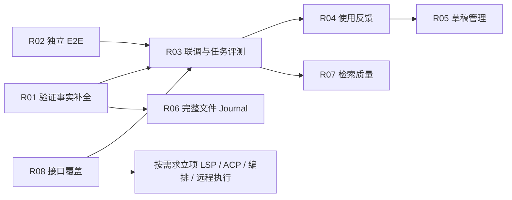

# OpenCode / Hermes 路线待完成项：具体实现方案

日期：2026-10-07。状态：第一批核心代码已实现，路线尚未全部完成。依据：[比较报告](./jojo-opencode-hermes-comparative-analysis.md)、[已实现功能与验证记录](./jojo-opencode-hermes-implementation.md)及当前代码。

各节保留原设计目标；已落地部分及实现差异以下表和第 2.4 节为准，其余新增类型、Operation、工具、模块和命令仍属拟议设计。数值上限是首版建议配置，不是已验证的性能结论。本文不修改当前权限或承诺自动启用阶段 D。

## 本轮实现状态（2026-10-07）

| 项目 | 已交付 | 尚需完成 |
| --- | --- | --- |
| R01 | V2 Profile/范围指纹；连续检查共同有效；最终报告及 Skill 证据按需重采集；持久批次/deadline；verification_run 子调用逐项治理/审批/Hook/原始输出；父 Run 预算；批次状态与 current/stale/unknown UI | watcher 优化、完整崩溃/断线与显式新批次矩阵；身份/Run 关联继续复用原 Session 分支与 Operation 账本，未新建独立批次表 |
| R02 | 新增验证批次、长日志回读、历史原文定位、Patch Undo/Redo、Skill 草稿预览与拒绝激活；完整 Electron 31/31；关闭请求入口与 Renderer generation/错误消费修正 | Responses 本地 SSE 的独立 Electron spec；失败→修复、取消、分支隔离、Skill 编辑/回滚、Patch 部分写入恢复等复杂组合仍须补齐；完整 Host 状态机未替换 |
| R08 | 22 个 Operation 的机器绑定清单；HTTP → Core、WS dispatch、SDK 方法、声明的 IPC 共享解析检查；缺口原因显式记录；CI 与生成文档；V2 IPC 合同回归 | Desktop 中立 DTO 全量统一及剩余权限/幂等/恢复行为矩阵；静态检查不能证明这些行为 |
| R03 | 离线 Runtime runner 已覆盖七类任务；独立评分、负向验证、V2 缺测统计、完整任务标准及源码一致性检查已实现 | reconnect 的真实传输 fixture、真实 Responses 矩阵及 A/B；需固定 Provider、模型、费用上限及 baseline/experiment checkout |
| R04、R05、R07 | 保留原有 Skill 草稿、词法检索基础 | 本文相应完整目标尚未实现 |
| R06 | 共用 Journal 已接入 write_file/edit_file/delete_file；支持审批后 Undo/Redo、Run/actor 来源及旧回收站 | V2 blob/身份范围、Run 合成撤销、恢复管理 UI、保留策略与双 Host 锁尚待完成 |
| R09～R12 | 扩展入口仍按原门槛保持未启用 | 需指定 LSP/IDE/执行目标与实际任务证据 |

绑定报告：[current-bindings.generated.md](./current-bindings.generated.md)。第一批使用方式与边界见[实现记录](./jojo-opencode-hermes-implementation.md#2026-10-07待完成方案第一批核心实现)。这不是全路线完成声明。

## 1. 范围、优先级与依赖

| 编号 | 待完成项 | 最小交付 | 启动条件 | 顺序 |
| --- | --- | --- | --- | --- |
| R01 | 验证版本识别与累计预算 | 工作区内容指纹、外部修改失效、持久验证批次 | 当前版本补全 | 1 |
| R02 | 新功能独立 E2E 与关闭生命周期 | 覆盖验证/检索/Skill/Patch；关闭时无未处理请求异常 | 当前版本补全 | 1 |
| R03 | Responses 真实联调与任务 A/B | 脱敏联调记录、隔离任务 runner、可重复报告 | 固定 Provider/模型、费用上限和基线 | 2 |
| R04 | Skill 使用反馈与修正候选 | revision 级使用证据、显式修正候选、去重与拒绝冷却 | R01、R03 | 3 |
| R05 | Skill 草稿管理与资源包 | 草稿页面、版本 Diff、references、用户级受控安装 | R04；用户级安装单独决定 | 3 |
| R06 | 单文件 Journal 与撤销管理 | 普通文件写入可撤销、Run/actor 关联、恢复页面、保留策略 | R01、R02 | 3 |
| R07 | 历史索引补全与质量评测 | 来源归类、词法召回集、可选授权子 Lane | R03；语义检索须另通过质量门槛 | 4 |
| R08 | API/SDK/IPC 全量一致性检查 | 机器可校验的绑定清单、合同/权限/恢复测试 | 当前版本补全 | 2 |
| R09 | 按需 LSP 诊断 | 一个语言服务器、版本化诊断、超时降级 | 指定语言/服务器；证明 CLI 诊断不足 | D1 |
| R10 | ACP IDE adapter | 一个 IDE、一种固定协议版本、会话/取消/审批映射 | 指定 IDE；R08 | D2 |
| R11 | 程序化工具编排 | 隔离的只读变换、受限内部 RPC、调用账本 | 真实任务证明 Workflow 不足；R03、R08 | D3 |
| R12 | 一个远程执行 Backend | 建议先 SSH；执行对账、断线取消与结果引用 | 明确目标与隔离策略；R06、R08 | D4 |

第一批只推进 R01、R02、R08；第二批推进 R03；第三批推进 R04～R07。R09～R12 分别立项，不互相捆绑。语义检索、自动生成可执行脚本和用户级安装属于扩展项，不能拿未启动项计算为版本故障。

## 2. R01：验证版本识别与预算

### 2.1 当前缺口与目标

现有 `packages/contracts/src/verification.ts` 使用工具调用 ID 标记变更；任意后续 Terminal 都会让早期检查过期。lint → typecheck → test 即使没有改代码，也可能无法共同证明同一版本。外部进程的代码修改无法被该标识检测。Profile 的 `budgetMs` 目前只是提示。

目标是区分“命令已通过”和“当前被检查的代码仍与当时一致”，并在整个验证批次约束累计时间。代码指纹相同的多个检查可以同时有效；无法可靠采集指纹时明确显示 unknown，不能退化为通过。

### 2.2 拟议数据合同

`VerificationProfileV2` 增加 `inputs.include/exclude`（相对路径 glob）、`maxFiles`、`maxBytes`。默认跟踪 Git tracked + 未忽略的 untracked 文件，并明确排除 `.git`、`.jojo` 元数据、Journal、依赖和构建缓存；非 Git 项目要求显式输入范围。记录范围本身也参与哈希。

`WorkspaceRevision`：`id`、canonical `workspaceId`、`scopeHash`、`capturedAt`、`fileCount`、`byteCount`、`captureStatus: complete|unknown`、`reason?`。`id` 对排序后的“相对路径、文件内容 SHA-256、可执行位、存在/删除状态”列表求哈希。不可只用 mtime 或 Git HEAD：必须覆盖工作区未提交修改。

`VerificationBatch`：`id/sessionId/runId/profileHash/revision/deadlineAt/status/checkIds`，状态 `pending|running|completed|cancelled|budget_exhausted|interrupted`。

`VerificationRecordV2` 保留现有字段，增加 `batchId`、`revisionBefore`、`revisionAfter`；状态仍表达执行结果，另用 `validity: current|stale|unknown` 表达证据有效性。通过条件是退出码 0；当前有效条件是完整 before=after=current 指纹及相同 scopeHash。检查中改写代码时仍保留 passed，但 validity=stale。默认不因构建生成的已排除文件而失效。

### 2.3 实现步骤

1. 在 Contracts 定义 V2 和兼容解析：旧记录继续显示执行结果，其版本有效性保留旧保守策略并标注 legacy。
2. 在 tools-node 增加只读 `WorkspaceRevisionService`；真实路径必须在 scope 内。逐个流式哈希、排序、限制数量/大小；扫描前后核对文件状态，竞争变化时有限重试，仍不稳定则 unknown。缺少读取权限时失败关闭；不可扩大授权。
3. Runtime 将批次存入共享 store，并把指纹采集能力由 Host 注入，不让 Runtime 引入文件系统实现。使用 watcher 标记 dirty 仅作为优化；最终报告、激活 Skill、Undo 前仍按需重新核对。
4. 增加 `verification_run` 拟议工具：按 Profile 运行选定 checkIds；每个子命令继续调用现有 Terminal Tool 管线、Governance 和审批。父审批不能授权未披露的后续命令。实际子调用拥有独立 callId、审计和原始输出引用。
5. 第一版预算定义为“从批次创建起的墙钟时间，包含等待审批”。持久 `deadlineAt`；每条命令 timeout=min(单条 timeout, 剩余预算)。到期取消活动进程，余项 skipped/budget_exhausted。其他预算语义后续用新模式表达，不静默改变。
6. 重启后不自动重跑 running 检查；标 interrupted，复核当前 revision 后允许显式新建批次。新增 Desktop 批次行与有效性提示。

入口：现有 `verification.ts`、`verification-profile-tool.ts`、`terminal-tool.ts`、`agent-runtime/src/store.ts`、`harness/runner.ts`、`conversation.ts`。

验收：无代码变更时三种检查同时有效；外部改文件立即/最终复核失效；包含未提交和未跟踪代码；排除缓存的范围可追溯；扫描不完整不显示已验证；审批等待及进程执行均可消耗预算；取消、断线重连、重启得到同一批次事实；配置命令不能扩大 cwd/网络/密钥权限。

### 2.4 已落地实现与设计差异

- `WorkspaceRevisionService` 已加入 `packages/tools-node/src/workspace-revision.ts`，Git/显式 paths 模式、流式哈希、两次一致扫描、最多三次扫描、文件状态复核、符号链接拒绝和数量/字节上限均生效。没有文件或扫描不完整为 unknown。canonical workspace 与 include/exclude/限制也参与证据比较。
- Profile V1 保留；V2 必须指定 inputs。执行记录通过 revisionBefore/revisionAfter 区分 V2，无新增强制 schemaVersion；V1 继续保守失效策略。
- 批次配置、初始 revision 与绝对 deadline 存在原始 ToolResult 中，生命周期由当前分支的调用/结果推导，没有第二份可漂移的可变状态表。session/Run/actor 继续由现有分支和 Operation 账本关联。没有完成结果且无活跃调用的批次显示 interrupted；未知副作用不自动重跑。
- 新工具 `verification_run` 只接受持久批次中的 checkIds；每条 Terminal 都经过权限、单独审批、Pre/PostToolUse、输出持久化、重复调用保护和父 Run 工具数/墙钟上限。子 trace 不作为新的模型工具消息发送，父结果携带输出引用，避免破坏 Provider 调用/结果配对。
- 指纹在最终模型请求及 Skill 证据判断前按需重采集。最后一次观测未覆盖的范围不能复用旧观测宣布 current。当前最多复核最近 20 个范围；其余显示 unknown。尚未安装 filesystem watcher，空闲期间的外部编辑会在下一次复核后更新有效性。

## 3. R02：独立 Electron 场景与生命周期

### 3.1 新功能交互覆盖

现有 26 项 E2E 已通过，但尚未分别覆盖本轮全部新入口。新增拟议 spec：

| 场景文件 | 操作与断言 |
| --- | --- |
| `verification.spec.ts` | 加载 Profile、运行三个检查、失败→修复→重验；UI 与原记录一致；变更后旧证据失效；取消和 skipped 可见；重启保留事实 |
| `result-read.spec.ts` | 长日志中段注入错误；触发真实上下文压缩投影；按原 callId 回读；其它分支结果不可读 |
| `session-history.spec.ts` | 当前项目搜索、点击命中定位；scheduler 噪声排序；项目外/private/废弃分支不可见；删除后重启不复活 |
| `skill-drafts.spec.ts` | 显式保存→预览→编辑→审阅 Diff→激活；拒绝不改 active；旧 revision 回滚后下一 Turn 正确加载 |
| `patch-undo.spec.ts` | 多文件审批、审批后外部编辑、取消部分写入、Undo/Redo、模拟中断恢复；用户后续编辑保留 |
| `provider-protocol.spec.ts` | Models 切换协议、保留配置与模型元数据、重启仍走选定 adapter；用本地脱敏 SSE server 验证工具和 usage |

E2E 使用隔离 `JOJO_E2E_DATA_DIR` 与确定性 Provider；真实 Provider 只进入 R03。断言可见状态、持久事实和副作用，不只断言最终答案文字。禁止测试分支绕过真实 Governance/IPC/Runtime。

### 3.2 生命周期补全

现有 `apps/desktop/src/main/bootstrap.ts` 在关闭/重启附近仍记录 Runtime unavailable；部分 Renderer 请求出现未处理 Promise。将正常关闭与运行中 Worker 故障分开处理：

- Host 状态 `starting|ready|closing|closed|failed`。进入 closing 先停入口、通知 Renderer 停止轮询，再取消/排空已有请求，最后关闭 Worker 和 Store。
- session transcript/workspace 请求必须持有 generation；旧 generation 返回只作废，不更新新页面。
- 预期关闭返回受约束 `runtime_closing`，Renderer 消费并终止刷新；真正的 Worker 非预期退出继续展示错误与恢复状态。
- 日志按错误类别和阶段分级，不能通过吞掉所有异常“修复”日志；CSP 拒绝、模拟 503 和删除中拒绝保留可解释事件。

验收：重复启动/退出、硬崩溃、删除活跃 Session 后不出现未处理 rejection；非预期故障仍可见；窗口关闭不制造假 turn.failed；关闭不丢已持久化审批/结果；所有新增场景无 IPC protocol violation。

## 4. R03：真实 Responses 联调与 A/B 任务 runner

### 4.1 联调输入与输出

开始执行前固定：Provider 配置 ID、协议、模型精确 ID、基线 checkout、实验 checkout/构建哈希、fixture 哈希、设置哈希、每任务重复次数、整体预算和终止条件。密钥引用 Host SecretStore，不进入参数文件、trace 或文档。

首先建立单个 Provider 的联调矩阵：文本、图片、并行工具、多轮 call ID 配对、加密 reasoning 回放、取消、超时、usage/cache、模型切换、上下文溢出、流中断。每项输出 passed/failed/unsupported 与 evidence；不能把模型不支持图片归类为 adapter 已支持。真实图片使用无个人信息 fixture。

重点补测现有 `openai-responses-provider.ts`：只有 reasoning 而无文本/工具的 assistant 回放、重复 item/call ID、已完成 arguments 与 delta 不一致、未知 incomplete reason、reasoning 残缺、usage 缺字段。只保存允许字段，凭据和原始 reasoning 明文禁止进入答案/调试日志。

### 4.2 任务执行器

拟议新增 `evals/agent-tasks/fixtures/<taskId>`、`scripts/run-agent-task-evals.mjs`、`evals/agent-tasks/evaluation-plan.json`。现有 tasks.json 和 evaluate-agent-tasks.mjs 继续作为任务/汇总入口。

执行流程：隔离目录复制 fixture → 创建 runtime/session → 固定 provider/model → 执行提示和取消/冲突/重连操作 → 保存完整受控 trace → 独立验证器检查结果 → 清理会话和临时资源 → 生成评分。基线与实验在各自已固定的 checkout 运行；未提交实现必须保存补丁/文件清单哈希，不能把同一个 Git HEAD 误称两个版本。

评分分层：自动检查文件与权限边界；人工或独立审阅检查解释、来源和错误报告。无法自动判断的标准写 unresolved，不能默认 passed。按 taskId/variant/provider/model/settings/checkout 分组，成对比较；总分必须披露各任务数量，避免任务构成不同造成误导。

扩展评分 schemaVersion=2：未知 token/cache/cost 用 `null` + 原因；与已测量的 0 区分。汇总同时输出 knownSamples、missingSamples；仅已知样本累加，不能把不完整成本报告当完整总费用。cost 来自 Provider usage 或固定时间/版本的价格表计算，后者标 estimated。兼容现有 V1，不重写历史评分。

### 4.3 门槛与交付

先用离线 runner 自测故障分类和资源账本；再锁定真实实验计划。建议首轮每任务每变体至少 5 次，次数和阈值在开跑前记录；小样本结果只作探索，不能声称统计显著。安全 fixture 的跨身份泄漏、重复外部副作用、用户改动覆盖、虚报验证必须 0 次；任务成功率与费用目标由基线确定，禁止跑完再选择有利阈值。

输出：版本化联调报告、每次 run/trace/evidence、逐任务比较、失败分类、usage/cost 缺测率。可取消；到达任务超时或总费用上限停止新增请求。失败运行留在分母，基础设施错误单列。

## 5. R04：Skill 使用反馈 → 修正候选

### 5.1 合同与存储

拟议 `SkillUseRecord`：`id/sessionId/runId/actor/skillId/revision/loadCallId/sourceScope/verificationRefs/outcome/failureCategory/createdAt`。outcome 为 `verified_success|verified_failure|user_corrected|unverified`；加载成功不等于任务成功。只有 R01 版本匹配的验证证据可产生 verified_success。

拟议 `SkillCandidate`：`id/projectId/topicKey/targetSkillId?/baseRevision?/sourceUseIds/proposal/reason/state/fingerprint/createdAt/expiresAt/resolvedAt?`；state 为 `pending|drafted|rejected|expired|superseded`。一条 topicKey 在同 scope 仅保留一个 pending；更新候选关联当前 active revision，冲突时需重新生成 Diff。

在 `packages/contracts` 新建合同；候选生命周期由拟议 `packages/extensions/src/skill-candidates.ts` 负责；Storage 增加 SQLite 候选/使用表。复用现有 `packages/memory/src/candidates/evidence.ts` 的证据裁剪/脱敏设计和 Secret Scanner；不把 Skill 可执行程序写进 Markdown Memory，也不让 memory 包依赖 extensions。必要的通用纯函数可拆至共同依赖，不移动业务归属。

### 5.2 触发与审核流程

1. load_skill 后固定确切 revision 和正文；Run 完成收集该 revision 的使用与验证证据，幂等键为 Run + Skill revision。
2. 首版只开放“生成改进草稿”的显式动作；同主题已有 Skill 优先提议更新。用户纠正可以附着为证据，失败原因不直接改写原文。
3. 低频自动候选默认关闭；启用后建议每 project 每日最多 1 次提取、每次最多 3 个候选；同 fingerprint 拒绝冷却 7 天、pending 30 天过期。首次值为配置默认，可调整并审计。
4. 外部网页/工具返回仅作不可信来源摘要，不能单独产生可执行流程；验证不足则 unverified，保留明确提示。
5. 用户接受候选只生成独立 draft；仍需格式/依赖检查和既有激活 Diff。拒绝不改变当前可用 Skill、Memory、Team/Provider 配置或权限。
6. 多次成功使用也不能自动激活；自动生成候选的模型调用计入资源预算，可取消，失败不阻塞主 Run。

验收：相同运行重放不重复；失败绑定正确版本；同主题去重且不复制到多个归宿；被拒候选冷却有效；隐私字段与注入指令被隔离；接受只产生草稿；旧基线激活竞争被拒；回滚后下一 Turn 和使用证据一致。

## 6. R05：草稿页面、资源包与用户级安装

### 6.1 页面与 API

Skills 设置页增加“待审核 / 草稿 / 已激活 / 使用记录”，显示版本、来源、检查状态和针对现有版本的 Diff。动作：预览、删除草稿、生成修正、激活指定版本、回滚。预览结果不是激活授权；已有写入审批仍是提交入口。

拟议 Operations：`skill.candidate.list/reject`、`skill.draft.list/read/delete`、`skill.draft.activate`、`skill.usage.list`。列表分页、项目过滤、单项访问均校验 principal；activation 使用 `expectedActiveRevision`，给定旧版本时返回 revision_conflict。变更请求携带幂等键；重复请求不能执行两次安装。

App Service 注入 Extension/Skill 管理端口；Desktop/HTTP/WS/SDK 绑定同一 Zod。涉及文件路径的 Node 操作留在 Host/Extension 服务，Renderer 只接收脱敏描述和 Diff。

### 6.2 Skill 资源包

拟议 manifest V2：`files[{relativePath,sha256,kind,bytes}]`、`manifestHash`、`entryRevision`、`baseRevision?`、`provenance`。SHA-256 revision 覆盖整个包，避免 SKILL.md 未变但 references 被替换。

首版仅支持 SKILL.md + references 的受限 UTF-8 文本；禁止绝对路径、`..`、符号链接、二进制、重名 canonical 路径和过大资源。建议最多 50 文件/合计 2 MB；具体上限进入合同测试。依赖检查只报告本地可发现状态，不自动下载安装依赖。

激活预览整个包；用 R06 Journal 或目录 staging + 明确恢复日志处理部分失败。必须证明 discovery 看不到半成品；可通过 active manifest 指向已完成版本实现快照。V1 单文件 Skill 继续兼容。脚本作为将来单独审批的资源类型，不因包内出现 scripts/ 就获得执行权限。

### 6.3 用户级安装

默认只保存/激活 workspace Skill。用户级安装是独立显式动作，Host 提供固定目标目录，模型不能传任意绝对路径。调用既有安装/写入治理并展示目标 scope 和完整 Diff；不覆盖用户定制内容，不把项目授权迁移成用户级授权。共享目录锁、expectedRevision 和引用相同 manifestHash；回滚同样审批。外部 skills CLI 的项目安装与草稿提升是两个清晰入口，不能混用参数绕过范围。

验收：草稿删除不删除 active；包改一字 revision 即变；部分激活不被发现；并发更新冲突；跨身份不读草稿；项目权限不足不能写用户目录；回滚整个包且下一 Turn 使用正确版本。

## 7. R06：完整文件 Journal 与恢复 UI

### 7.1 整合现有写入

将现有 patch-tools.ts 内的 Journal 功能抽为拟议 `FileMutationJournalService`，apply_patch 与 write_file/edit_file/delete_file 共用一个 `prepare → approve → validate → journal intent → stage → apply → commit` 管线。移除重复锁/恢复实现，保留现有读前快照和回收站兼容。

`JournalV2` 增加 `runId/operationId/toolCallId/actor/workspaceId/schemaVersion/parentJournalId`；内容从大 JSON 分离成 Host 私有 content-addressed blob，Journal 存 beforeRef/afterRef/hash/mode。Ref 不能被当作任意路径读取；访问绑定 principal + Session + workspace。V1 只读恢复适配不可丢失。

初版 undo 单个 Journal；再提供“撤销某 Run”的 Journal 集合预览。对同一路径按实际应用顺序合成 before→最终 after；一处用户冲突则整批拒绝，不能先撤销无冲突文件再悄悄停下。忙碌 workspace 不提供 Undo，直到原生变更停止并持有锁；Terminal 尚在运行时明确告知其副作用不在撤销范围。

### 7.2 崩溃与多实例

启动扫描只做对账：按 attempted/write intent 比较 current/before/after，分类 applied/rolled_back/needs_recovery/unknown。不能自动执行状态未知的外部副作用。prepared 且没写无需反向写；一处冲突展示具体路径和预期 hash，不提供无审批的强制覆盖。

现有进程内 workspace queue 保留；如果允许多 Host 写同一 workspace，增加 Host ownership lock，无法获得锁则只读/拒绝，不能假设内存锁跨进程有效。写日志和文件都使用 fsync/rename，并按平台验证实际保证；不支持的持久保证需降级为明确 capability，而非成功承诺。

### 7.3 UI 与保留策略

拟议 Operations：`workspace.journals.list/read`、`workspace.undo.preview/apply`、`workspace.redo.preview/apply`、`workspace.recovery.list`。preview 返回 revision/fingerprint，apply 重新核对且审批；客户端不能把 preview 当锁定文件。

Workspace 页面显示可撤销文件、Run/actor、状态、内容保留期和冲突；支持打开完整 Diff。Journal 清理采用先标记→检查引用→删除 blob→回收元数据的幂等流程。建议默认保留 30 天/1 GB，needs_recovery、活跃审批及当前可撤销链不自动删除；容量不足拒绝新增可恢复写入并提示用户清理，不能先删保护数据。

验收：三种普通文件工具均可撤销；内容/权限一致；用户后续编辑保留；同路径多次变更可合成；每个写入边界杀进程均可对账；双 Host 不重入；过期清理不破坏恢复；旧 Journal 和回收站仍可读取。Terminal/API/数据库变更保持明确不可统一 Undo。

## 8. R07：历史来源、子 Lane 与检索质量

当前词法检索已可用；语义检索是可选增强，不是已承诺接口的替代。先解决来源和可测质量。

1. 从可信 Runtime actor/trigger 映射 main/scheduler/team/spawn，明确区分“主 Session 中的一条 scheduler 消息”和“独立 team Session”；禁止从模型文本推断来源。
2. 搜索 scope 的 canonical projectId 固定到 Host 身份，旧 workingDirectory 元数据可迁移。重命名目录和软链接别名需明确身份语义；不能因宽松字符串匹配越过项目。
3. 首版保持 main 路径。启用子 Lane 时新增显式 includeLanes 和 hit.laneId；先按 principal 过滤允许 Lane，再执行查询；点击原文必须进入对应 Lane，不能在 main 找不到时静默失败。废弃/孤立条目默认继续排除。
4. 独立构建中文、错误码、简称、同义词、长摘要和 scheduler 噪声的带正确 entryId 召回集。记录 Recall@k、MRR、无结果率、越权率、p95 延迟、索引体积及删除一致性；测试集不用于调参。
5. SQLite FTS 保持可重建的派生索引：旧索引版本不匹配时回填，断点恢复、Session tombstone 和更新事务一起验证。限制候选集合再遍历主路径，避免无关 Session 大量扫描。
6. 只有词法召回不足的具体任务才进入 embedding 实验；新增索引前锁定模型/维度/版本，索引也继承删除、身份与项目边界。远程 embedding 需要明确外发文本治理，不能把所有私人会话默认上传。

验收：来源可回溯；已授权子 Lane 点击原文成功；未授权 Lane 不参与排名；索引中断可重建；删除同步；语义实验有独立对照，质量收益与索引成本足以支持启用决定。

## 9. R08：全量合同与接口绑定校验

现有新增历史接口的合同/SDK 测试已通过；待完成的是把这类检查系统化，减少漏掉 Electron 严格 IPC 字段的问题。

建立拟议 `APPLICATION_BINDINGS` 派生/绑定清单：`operationId → shared input/output schema → App Service method → HTTP method/path → WS command → SDK method → Desktop adapter? → permission → idempotency`。有意不公开的接口标 internal 和理由。清单不制造第二套 Operation 定义；APPLICATION_OPERATIONS 继续权威，Host 绑定补充各端差异。

校验分三层：

- 静态覆盖：每个公开 Operation 有绑定或明确豁免；无重复 route/command；生成文档包含同一输入输出与权限。
- 合同矩阵：相同 valid/invalid 样本跨 HTTP/WS/Desktop 与 SDK 得到一致默认值、边界和错误码；新增 ToolResult 字段同时经过普通消息、AgentEvent、IPC envelope 和 Renderer 投影 round-trip。
- 行为 conformance：真实身份授权、禁止跨会话、幂等重复、Lease 冲突、审批后篡改、断线快照、取消与恢复；不能靠 Schema 相同替代授权测试。

生成脚本扩展现有 `scripts/generate-docs.mjs`，增加机器可读 coverage report；CI 跑 docs:check + architecture + conformance。协议字段变化按 BUILD_COMPATIBILITY 明确兼容性；无法兼容时升级版本，记录最低客户端版本。不得以放宽 strict()/无限 JSON 大小解决契约漏项。

验收：故意删除 route、SDK 方法或 IPC 可选字段，检查必须失败；添加新 Operation 缺绑定时失败；输出和错误映射亦被验证；文档漂移被阻止。

## 10. R09：按需 LSP 诊断服务

### 10.1 启动门槛和最小功能

先选一个确需编辑后诊断的语言和固定服务器版本。初版只做诊断查询，不建设完整 IDE 补全/重构系统。CLI lint/typecheck/test 仍是验证入口；语言服务器未返回诊断不能被当作检查通过。

按固定规范实现初始化、文档同步和诊断生命周期；可将 3.17 作为首版协议基线，实际版本在 lockfile/fixture 固定。规范参考：[Microsoft LSP](https://microsoft.github.io/language-server-protocol/specifications/lsp/3.17/specification/)。协议以 JSON-RPC 通信；诊断与文档版本相关，服务端差异必须在 adapter 内处理。

### 10.2 服务与合同

拟议 Host `LanguageDiagnosticService`：按 canonical workspace + language + serverVersion 管理进程，提供 `start/open/change/diagnose/stop`。Runtime 注入只读查询端口，tools-node 提供 `diagnostics_read`；服务不修改文件。

拟议配置：enabled=false、language、executable/args、trustedServerHash、startTimeoutMs=10s、requestTimeoutMs=5s、idleTimeoutMs=5min、maxProcesses=1/workspace、maxDiagnostics=200。资源值为建议；内存/进程上限必须由后端实际执行，不能只写配置。不能保障必要隔离的 Host 返回 unsupported，不自动转无约束启动。

诊断记录：workspaceId/path/contentHash/documentVersion/serverVersion/severity/range/message/source/complete。未命中当前内容版本的迟到结果丢弃；没有 version 的推送只能在当前同步周期和稳定内容下接收，仍标能力限制。崩溃、超时、退出返回 unavailable 并指导调用项目 CLI。

服务器可执行文件与依赖安装由用户/Host 信任配置决定；不从项目配置自动下载和执行任意服务器。server→client 请求不自动执行 shell、写文件或调用外部网络。

验收：同一文件改两次的迟到诊断不覆盖新版本；进程超时/崩溃不阻塞 Run；idle 退出释放资源；禁止越界路径和未知可执行文件；诊断不代表最终测试通过；真实指定语言 fixture 与 CLI 结果一致性有报告。

## 11. R10：ACP adapter

### 11.1 协议选择与架构

立项前指定目标 IDE、平台和协议版本。拟议首版固定公开 ACP v1 的协商与 Schema/SDK 版本，不同时追随 v2 或所有 unstable 扩展。参考 [ACP v1 会话设置](https://agentclientprotocol.com/protocol/v1/session-setup) 和 [Prompt Turn](https://agentclientprotocol.com/protocol/v1/prompt-turn)。创建前先协商；加载会话需要显式声明能力并按协议回放历史。

拟议新增 `packages/server-acp`，依赖 Contracts/App Service/官方固定版 ACP SDK；禁止依赖 Agent Loop 内部实现。transport 首版 stdio。连接 principal 由 Host 验证并绑定许可 workspace；来自 IDE 的 cwd/mcpServers/模式是未可信输入，经过现有 scope、MCP 信任和 Governance。

### 11.2 映射表

| ACP 消息 | jojo 拟议映射 |
| --- | --- |
| `initialize` | 协议协商 + 仅声明已实现 capability |
| `session/new` | App Service createSession；canonical scope 与身份映射持久化 |
| `session/load` | 校验 owner/scope，getTranscript 原文回放，随后恢复已持久 Run/审批快照 |
| `session/prompt` | startRunHandle，订阅 AppServiceEvent，按顺序转换消息与工具状态 |
| `session/update` | runId/callId 对应的文本、Tool 更新和最终状态 |
| `session/cancel` | cancelRun；终止 Provider、工具和活动等待，原 prompt 以取消完成 |
| `session/request_permission` | 现有 approvalId ↔ 本次权限请求映射；选择仅能落到当前有效审批 |

标准方法和方向以锁定版本 Schema 为准；表是 jojo adapter 设计，不取代外部规范。只提供 Governance 当前可接受的选项，未知/取消 outcome 按未授权处理。没有 jojo 对应授权语义的“永久允许”不广告也不实现。

client MCP stdio 定义要接现有信任/审批链；若首版未实现该标准要求，不标“ACP 完整兼容”，并以目标 IDE 的受限试验方式记录缺口。客户端 file/terminal 能力不另开绕过 Tool Runtime 的副作用入口。

断线策略固定为取消本连接活跃请求，并保留事实；下一次 load 获取状态，不重放未知工具副作用。无法表达的 jojo恢复字段放受约束 metadata/本地映射，失联审批失效。并发控制复用 Lease；一个 IDE 不能抢占另一个身份的会话。

验收：实际指定 IDE 跑创建、加载、消息、工具、拒绝/允许、取消、断线重载；伪造 approvalId/过期选择被拒；越界 cwd 被拒；停止 adapter 不丢持久结果；兼容矩阵明确 unsupported，不能声称全面 IDE 支持。

## 12. R11：受限程序化工具编排

先用 R03 的一个真实批量数据任务比较现有 Workflow Tool Step 与动态脚本；只有调用轮数/费用/延迟确有可重复收益且质量不回退时立项。

首版脚本仅纯数据变换 + 明确只读工具 allowlist。模型生成脚本在 Host 子进程沙箱运行，不使用 Node vm 作为安全隔离；无 filesystem/network/process/env 任意访问，无包安装。输入/输出序列化有字节和深度上限。沙箱必要能力不可用时拒绝。

拟议 `execute_tool_script`：输入 code、inputs、requestedTools、maxCalls、timeoutMs；Host 缩减为“请求集合 ∩ actor Profile ∩ 当前授权”，不能扩大工具。建议首版 timeout≤30s、调用≤20、输入/输出各≤1MB，并计入父 Run 的 walltime/token/cost/tool-call 限额。

内部 RPC 使用不可猜测、短期、单 Run/actor/process 绑定 token，经隔离 socket/pipe；只接受工具名称、严格输入和 invocationId，不能传 approved=true/principal/cwd。每次调用走现有工具执行、权限、审计和结果持久化，记录 parentCallId/childCallId/资源；不能通过直接调用 Tool.execute 绕过管线。

父取消同时撤销 token、停止脚本、取消全部子调用并终止进程树。恢复只读调用也需新授权与重建环境；未知状态不盲目重跑。后续若支持写工具，每个具体副作用继续审批，首版不以脚本预览授予无限执行权。

验收：伪造/跨 Run/过期 token 不可用；并发子调用不能绕过总预算；无授权工具不可见；文件/网络/进程访问被隔离；取消无残留进程；所有调用可对账；与 Workflow 对照有完整资源和质量报告。

## 13. R12：单一远程 Backend

初版建议 SSH，具体由用户目标决定；OCI 若更适合则独立替换该选择，不同时实现多个环境矩阵。ProcessSandbox 的现有 spawn/wait/terminate 语义可参考，但 SSH 登录本身不等于沙箱。

拟议 `ExecutionBackend` 端口：`probe/start/status/cancel/readOutput/close`。请求包含 executionId/Run/actor/后端配置 ID/批准资源策略；不得直接把模型指定的任意 SSH host、key 或目录作为目标。Host 将已批准配置解析为远端固定 workspace/container mapping；Host key 固定校验，私钥/agent 接口由 SecretStore 管理。

远端 runner 持久账本按 executionId 幂等：prepared/running/exited/cancel_requested/cancelled/unknown，记录真实 exitCode、进程组和分块输出 offset/hash。断线后 status 对账同一执行，不重新启动；状态不确定时标 unknown，不能伪报 cancelled。

资源/网络/mount 限制必须在远端实际生效并由 capability probe 验证。共享 SSH 用户无隔离能力时不开放模型任意命令；采用远端受约束 runner/容器或拒绝。父 Run 超时/断线策略必须能通知远端并杀进程组；网络失联时显示取消待确认，提供对账恢复。

文件同步采用批准的 manifest 与哈希、受限相对路径和字节上限；密钥、宿主 Home、私有数据默认不传。远端文件变更进入该 Backend 的 Journal/恢复机制，不与本地 Undo 混为一谈。结果返回 Artifact/有限输出引用，回读保持身份与 Session 范围。

验收：Host key 变化拒绝；连接/执行/回传各阶段断网都不重复执行；远端进程真实停止有证据；路径和资源隔离可验证；密钥不出现在日志；已有执行恢复后仍绑定原 actor/配置版本；未通过 probe 不得显示 strong。

## 14. 每批交付与完成判据

每个 R 项进入开发时先锁定 scope/配置/协议/fixture，在独立 PR 或可审阅变更中交付：合同与迁移、Host/Runtime/Tool 接线、UI/SDK 入口、权限及预算、失败恢复、测试、使用文档。无需改代码的真实联调项交付原始证据和报告，不能用“已有单测”替代。

最低检查：`pnpm lint`、`pnpm typecheck`、相关 Vitest、`pnpm test:architecture`、`pnpm docs:check`；触及公共执行/持久合同后跑完整 Vitest，触及 Desktop 交互跑对应新 E2E 与既有回归。真实 Provider、ACP IDE、LSP 和远程环境测试分别保留独立报告。

允许的状态只有：未启动、进行中、代码完成待实测、验收通过、需求门槛未满足。状态必须附 evidence 或未满足条件；阶段 D 的“需求门槛未满足”不等于已经实现。首版交付不自动包含发布/部署。

建议下一批从 **R01 + R02 + R08** 开始，先补证据有效性与接口/交互覆盖，再固定 R03 的真实实验输入；之后推进 Skill 反馈和完整文件撤销。

## 14. 第二批已落地范围（2026-10-07）

### R03 离线评测基础

入口 `pnpm eval:offline`，默认读取 `evals/agent-tasks/evaluation-plan.json`。当前支持七类任务（Patch 冲突、长输出回读、验证取消、历史决策回查、自动日报噪声、TypeScript 修复、Skill 压缩）；每类重复 2 次、每次 30 秒、scripted Provider、费用上限 0。不同 checkout 应分别运行本入口，再将 runs.json 合并交给汇总器；当前结果不能称为 baseline/experiment 比较或真实模型成功率。

每次创建隔离 workspace 和私有临时 store，经公开 AgentRuntime Session/Lane、真实 PermissionGate、审批及原生 Read/Patch 工具执行。审批回调引入用户修改；独立判定器检查原始 tool result 的冲突代码、两文件最终内容。临时 Runtime/目录在结束后清理。持久输出为每次 trace、runs.json、summary.json、plan.json 和 source-manifest.json，默认位于忽略的 test-results/agent-evals。脚本拒绝未实现任务及付费 Provider 配置。

源身份记录 Git HEAD 和 tracked + 非忽略 untracked 的路径、权限、内容哈希（含 tracked 删除标记）；运行前后检查一致。仅保存哈希清单，不保存整个源码正文。不同任务、fixture、设置、脏源树不混合统计。评分 V2 的未知 token/cache 为 null + metricReasons；离线成本明确实测为 0。汇总输出 knownSamples/missingSamples，无已知样本时总值为 null；unresolved 标准不允许 passed。V1 评分继续接受。

仍待：reconnect 的真实传输隔离 fixture、真实 Provider 联调及正式成对 A/B。真实调用需要之前列出的 Provider/模型、费用预算和两个 checkout 输入。

### R06 共用原生文件 Journal

`FileMutationJournalService` 抽离原有 Patch Journal；write_file/edit_file/delete_file 与 apply_patch/file_undo 共用审批指纹、工作区锁、内容冲突预检、持久 intent、文件应用、提交和保守回滚。普通文件工具继续保存原有回收站备份；文件提交和删除补充父目录 fsync。Skill draft/activation 通过 WriteFileTool 写入时保留 Journal 引用。

每个普通文件变更返回 structuredResult.journalId，可通过 file_undo 审批反向 diff，再 undo/redo。Journal 新记录保存可信 Runtime 的 runId/operationId/actor 和 toolCallId；V1 字段扩展为可选，旧记录仍可恢复。新建、覆盖、编辑和删除均有测试，恢复执行权限，重启后使用新的 SnapshotRegistry 也可 Undo/Redo；用户后续修改导致冲突并保留其内容。增加三个 Electron 单文件审批/Undo/Redo 用例。

这是 R06 的第一段实现，尚未升级为 JournalV2 blob 存储，也没有 Run 集合撤销、恢复页面、容量清理或跨 Host 锁；本轮不能宣称 R06 全部完成。

第二批验证结果：完整 Vitest 1298 passed / 2 skipped（65.13s）；完整 Electron E2E 34/34 passed（56.4s）；evals Node 测试 7/7，离线 Patch 冲突 fixture 2/2。lint、typecheck、architecture、application bindings、docs:check 和 diff whitespace 检查通过。首次沙箱全量测试因本地端口 listen EPERM 失败，在获准环境重跑后通过；没有用跳过这些测试来获得通过结果。

## 15. 离线评测场景扩展（2026-10-07）

默认计划现为 7 个任务 × 2 次，所有任务都使用公开 AgentRuntime Session/Lane、真实工具和权限管线。固定 Provider 仅给出工具决策；独立评分器检查持久原始记录和实际副作用。没有凭据或付费模型调用。

| 任务 | 独立评分证据 |
|---|---|
| patch-conflict | 审批期间外部编辑引发真实冲突；被编辑文件保留、其他文件不写入 |
| middle-failure | Terminal 非零退出；模型上下文已回收且看不到中段 marker；result_read 返回同一原始 call 的指定窗口，最终报告包含回读 marker |
| verification-cancel | 真实子进程输出启动标记后用户取消；取消 Run 和子检查记录一致，无 passed；延后副作用和第二检查均未发生 |
| decision-recall | 真实 SQLite 索引和原始窗口；entry/time 精确匹配；另一项目会话读取被拒绝 |
| scheduler-noise | 100 条真实 scheduler 来源消息参与检索，main 决策排名第一；读回原文，保留项目权限边界 |
| ts-repair | 已安装 TypeScript 编译器先失败；审批编辑后重新执行编译；文件内容正确，独立输入哈希确认最后验证 current |
| skill-compaction | 真实项目 Skill discovery/load；指定内容 SHA-256；10 次文件读取触发实际 context.compacted；压缩后仍保留原 Skill 和只读约束 |

新增独立 fixture 测试覆盖七类正常路径，以及错误窗口、超时、未修复的类型错误、没有实际压缩、只找到自动日报的负向路径。评分器要求 tasks.json 每一条标准都有结果；遗漏项为 unresolved，不能默认为通过。Runtime 异常保留已采集事件、原始结果和已测量调用数，未知 token/cache 继续 null + 原因。

运行中的 runs.json 源码状态为 pending；只在前后 HEAD/内容清单一致后升级为 verified。检测到源码改变时，记录归为 source_changed 基础设施错误并保存前后身份；汇总器拒绝 pending 或虚报成功的 invalid 源身份。输出目录必须新建，避免旧 summary 在失败重跑后被误认为新结果。

reconnect 尚未加入离线注册表；未用取消或卸载 Runtime 监听器替代真实传输断开重连。真实模型矩阵和 A/B 的固定输入要求不变。本轮的七类成功率只证明离线基础设施/功能协议，不能作为模型质量比较。

本轮还修复了评测暴露的真实 macOS Seatbelt 问题：Node 从工作区文件启动时需要读取父目录元数据。profile 现在仅对显式挂载目录和私有临时目录的父目录增加 exact literal 的 file-read-metadata，不授予父目录列表、子文件内容或写入权限。真实测试确认工作区脚本成功加载、父目录 listing 和未挂载 sibling 读取被拒绝；没有关闭强沙箱来使评测通过。TypeScript fixture 先将已安装编译器复制到自己的工作区，依赖包同属验证输入范围，避免隐式读取宿主 repo。

本次最终回归：`JOJO_STRONG_SANDBOX_TEST=1 pnpm test` 为 1313 passed / 1 skipped（71.62s），包含两个真实 macOS Seatbelt 测试；完整 Electron E2E 34/34 passed（59.6s）；fixture 回归 12/12；报告格式/计划 Node 回归 9/9；typecheck、lint、architecture、docs:check 通过。七类默认离线计划为 14 次运行，单独验证通过；最终 trace 与来源清单使用新的输出目录保存。
