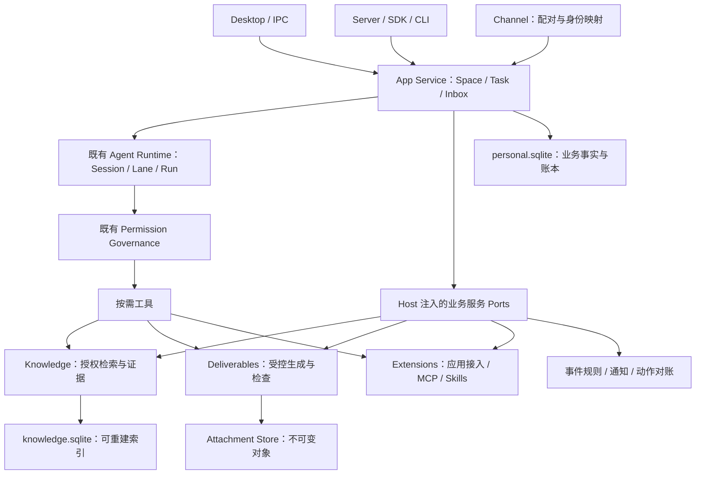

# Jojo 通用个人 Agent 技术实现方案

> 状态：拟议实施方案，尚未实现本文新增能力。  
> 日期：2026-10-10。代码基线：`dba07b381257f2dd9092c952a7aa99ac010eecdb`。  
> 范围：以“连接个人资料 → 跨来源分析 → 生成可修改、可核对的报告”为首个交付场景，逐步扩展长期任务和常驻服务。  
> 阅读约定：下文的新增类型、表、工具、Operation 与模块均为建议；已有能力以本节代码证据为准。容量与质量门槛是待实测的初始建议，不代表性能或模型成功率。

## 1. 目标和首期交付

首期用户能够选择一个个人领域，连接一个本地知识目录和一个已有 MCP 文档来源，附加若干文件，要求 Agent 生成带来源的 HTML 报告和 XLSX 汇总；继续提出修改时生成同一产物的新版本，保留来源与检查记录。

采用两个固定验收场景：

1. **资料研究**：本地笔记与已授权远端文档共同回答问题，报告中每项主要结论可回到原始资源和位置。
2. **账单汇总**：三份 CSV/XLSX 账单形成统一数据模型，生成 XLSX 和 HTML 报告；合计、币种、去重与分类检查可重复执行。用户修改分类后得到新 revision。

PDF 转换、Word/PPT 编辑、事件触发、长期等待、后台 Workflow 分批推进。PDF 原文件的读取与下载继续沿用当前能力。首期的远端来源以已连接 MCP Server 为准，不将飞书消息 Channel 当作飞书日历、任务或文档 API。

### 1.1 当前已有基础与需要补齐的行为

| 领域 | 已有基础 | 本方案新增行为 | 代码证据 |
|---|---|---|---|
| 会话与执行 | 无项目聊天；统一 Product Runtime；workspace/none/custom Scope | 个人领域绑定、任务来源与输出能力分离 | [会话创建](../packages/app-service/src/session-metadata-service.ts)、[Scope](../packages/contracts/src/execution-scope.ts)、[Product](../packages/runtime-composition/src/product.ts) |
| 模型与角色 | Chat Completions/Responses；instructions 注入 | 新执行采用应用层通用角色，旧执行保持原提示词语义 | [Chat 请求](../packages/providers/src/chat-completions-request.ts)、[Responses](../packages/providers/src/openai-responses-provider.ts) |
| 扩展 | MCP/OAuth、Skills、工具清单与资源读取 | 声明式应用接入、连接状态和依赖检查 | [MCP](../packages/extensions/src/mcp-manager.ts)、[Skills](../packages/extensions/src/skills.ts) |
| 记忆与资料 | global/project Memory；候选治理；FTS/语义；多格式附件 | 稳定个人领域、授权范围内的跨来源检索 | [Memory](../packages/contracts/src/memory.ts)、[提取器](../packages/attachment-extractors/src/index.ts) |
| 产物 | HTML 创建；workspace/conversation Artifact；内容 revision | 不可变二进制登记、结构与数字检查、版本修改 | [Artifact](../packages/contracts/src/artifact.ts)、[内容合同](../packages/contracts/src/artifact-content.ts) |
| 自动化 | Durable Scheduler、Channel 入站、持久 Outbox | 事件订阅、降噪、跨天等待、动作对账 | [Scheduler](../packages/contracts/src/scheduler.ts)、[Outbox](../packages/channel-runtime/src/outbound/outbox.ts) |
| 运行质量 | 内部资源 guard、离线 fixture、发布候选和备份脚本 | 预算贯通、真实个人任务评测、首次连接与安装验收 | [预算 guard](../packages/agent/src/loop/guards.ts)、[评测](../evals/agent-tasks/README.md)、[发布](./release-runbook.md) |

## 2. 总体结构与模块边界

沿用现有 Runtime；业务生命周期在 App Service，具体来源和产物处理在能力服务，SQLite/文件适配在 Storage/Attachments，Host 只提供进程、凭据、浏览器和传输资源。



上图是服务调用关系，不是 npm 包依赖图。必须满足已有架构 Guard：

- `packages/app-service` 仅依赖 `contracts` 和 `agent-runtime`，通过构造参数注入 Source、Deliverable、Event、Budget 等端口。
- `contracts` 保存 Zod Schema、DTO 和跨包端口定义，不依赖实现包。
- 建议新增 `packages/knowledge` 与 `packages/deliverables`，两者不依赖 Electron，也不互相依赖；MCP 访问、对象存储、索引与授权通过端口注入。
- `packages/storage` 实现新增 SQLite 适配器；`runtime-composition` 负责生命周期装配；Host 设置和实际秘密存储继续由 Desktop/Server 提供。
- Renderer 仅消费 `contracts` 与 Preload API，不直接导入知识、数据库、产物生成或 Node 模块。
- 工具执行均继续经过 Domain Gate 和 Governance；接入应用、绑定领域或选择资源不能自动扩大权限。
- 不增加任意第三方 TypeScript Loader。首批接入使用内置声明式 Manifest、已安装 Skill 与既有 MCP 配置。

### 2.1 建议增加的文件与责任

| 位置（拟新增） | 责任 |
|---|---|
| `contracts/src/personal-space.ts`、`knowledge.ts`、`resource-ref.ts` | 领域、来源、资源、证据、权限端口 |
| `contracts/src/agent-role.ts`、`capability-pack.ts`、`assistant-task.ts` | 应用接入、连接、任务、等待状态 |
| `contracts/src/deliverable.ts`、`action-receipt.ts`、`budget.ts`、`app-event.ts` | 产物检查、动作回执、预算、业务事件 |
| `app-service/src/personal/` | SpaceService、TaskCoordinator、Inbox 查询和业务用例 |
| `automation/src/` | 纯 Node 规则、事件消费和通知状态机；通过端口执行 |
| `extensions/src/packs/` | 内置接入 Manifest、配置适配、探测和工具选择 |
| `knowledge/src/` | 来源适配端口、抽取/分块、检索与证据读取 |
| `deliverables/src/` | 数据模型、模板、生成器、检查器、产物登记 |
| `storage/src/sqlite-personal-store.ts` | 领域、连接、任务、等待、事件命中、预算和动作账本 |
| `storage/src/sqlite-knowledge-store.ts` | 资源/片段/FTS 索引及版本水位 |
| `runtime-composition/src/personal-features.ts` | 服务装配、恢复顺序、可用能力声明 |
| `desktop/src/renderer/personal/` | 领域选择、连接向导、任务收件箱、产物检查状态 |

### 2.2 身份与权限的共同合同

下文统一使用 epoch 毫秒时间戳；货币预算采用整数微美元。`ResourceRef = { resourceId: string; revision: string }` 为 Host 登记的稳定资源引用；`DeliverableRef = { artifactId: string; revision: string }` 指向特定产物字节版本，不能单独授予读取权限。

`spaceId`、`taskId`、`sourceId`、`connectionId` 都采用稳定随机 ID。目录路径和显示名不参与个人领域身份；内容摘要用于 revision，不作为读取权限。

首期是单所有者产品。网络 Token scope 只表示可调用的操作；Channel 配对身份、会话/领域/来源归属仍需分别校验。群聊默认只读取明确绑定的领域和来源，不能继承所有者的全部全局记忆。共享多用户模式不纳入首期。

模型提供的资源 ID 表示访问请求；Host 从当前 Principal、Actor、Session、Task 和配置中计算有效权限。工具参数不得接收 `approved=true`、任意 Principal、完整秘密值或可自行扩权的路径清单。

统一错误至少包含 `code`、`retryable`、安全的 `details`，例如 `source_access_revoked`、`resource_revision_changed`、`task_wait_expired`、`budget_measurement_unavailable`、`action_result_unknown`。错误不回显密钥、未授权来源标题或任意原文。

## 3. 通用角色与受控输出

角色、个人领域和文件系统授权分别建模；Task 上线前以 Session/Run 记录成果，上线后以 taskId 聚合多个 Run。

### 当前基础与实际改动入口

- 无项目聊天已经存在：`ExecutionScopeSchema` 已支持 `none`，欢迎页已有“新建对话”。见 `packages/contracts/src/execution-scope.ts:14`、`apps/desktop/src/renderer/main.tsx:1729`。
- 产品身份仍藏在 Provider 层：`packages/providers/src/chat-completions-request.ts:6` 硬编码 coding assistant，`toChatMessages():55` 注入，`createChatCompletionBody():136` 再拼接；`packages/providers/src/openai-responses-provider.ts:42` 也引用同一默认 prompt。这使普通研究、文档任务以及直接使用 Provider 的辅助任务都继承 coding 身份。
- 内置子 Agent profile 偏工程，`general` 明确要求 Git worktree：`packages/orchestration/src/subagent/profile-registry.ts:121`。可写 Agent 强制隔离是有意的底层政策：`packages/orchestration/src/isolation/policy.ts:10`。本方案保留该政策，不给所有可写子 Agent 增加 `isolation: none` 特例。
- 会话 HTML 已可不写工作区而生成：`packages/tools-node/src/create-document-tool.ts:19` 返回 conversation artifact。因此第一阶段的普通研究、总结、HTML 交付不需要先建 Git 仓库。

### 角色合同与指令组合

新增 `packages/contracts/src/agent-role.ts`，应用角色与 orchestration 执行 profile 分开。角色影响工作方式和默认工具选择，不能自行授予权限。

```ts
type ProductRoleId = 'personal' | 'research' | 'document' | 'coding';
type InvocationPurpose =
  | 'main' | 'subagent' | 'team' | 'workflow'
  | 'title' | 'compaction' | 'memory_candidate' | 'browser_heal';
interface AgentRoleDefinition {
  id: ProductRoleId; revision: string;
  instructionBlocks: readonly string[];
  suggestedToolGroups: readonly string[];
  defaultOutput: 'conversation' | 'artifact' | 'workspace';
}
// 以下是 App Service 内部组合结果，引用 agent-runtime 的 ExecutionInstructionBlock。
// 不放入 contracts，避免 contracts → agent-runtime 的反向依赖。
interface InstructionComposition {
  version: 2;
  roleId: ProductRoleId; roleRevision: string; purpose: InvocationPurpose;
  blocks: readonly ExecutionInstructionBlock[];
  fingerprint: string;
}
```

在 `packages/app-service` 新增指令组合器：产品基线 → purpose 指令 → 用户选择的角色 → 受信任 Host instruction block；外部页面、附件、MCP resource 保持数据上下文，不能成为高优先级指令。用户请求保留 user role，不提升为 system 指令。系统基线保留“只依据实际工具结果声称完成”、授权边界、交付证据等通用规则，coding 角色再追加工程约束。角色允许工具集与可用工具、session scope、profile 和 Governance 的交集决定最终可用工具；角色切换不扩大 Global/Workspace/Grant 的授权。
Provider 最终只负责协议序列化。重构 `toChatMessages` 为纯历史投影，不再偷偷 prepend 产品 prompt；Chat 请求显式添加应用组合后的 system message，Responses 的 `instructions` 使用同一份组合。不能只删 `SYSTEM_PROMPT` 而继续保留 `.slice(1)`，否则会丢失第一条历史消息。同步调整附件、tool result、tool image、opaque reasoning replay 的协议测试。
所有直接调用 Provider 的路径都要通过一个 `AuxiliaryCompletionService.complete({ purpose, ... })`：目前 `apps/desktop/src/worker/bootstrap.ts:648` 的 utilityCompletion 没传 instructions，`:306` 的 summarizer 和 `:740` 的 title 文案也偏 coding。标题只生成标题，压缩只保存事实与未完成项，memory candidate/browser heal 延续各自输出和不可信数据约束，不能继承 main 的宽工具集。Embedding 没有聊天 prompt，不做角色注入。
将角色及 composition revision 冻结到新的 execution snapshot。新会话默认 personal；已有会话只在明确的工程角色/项目绑定或可识别的旧配置下迁移为 coding，不以本机任意目录存在推断角色；没有角色字段的旧会话用 legacy resolver 保持原语义，用户下次新 Run 可显式切换。V1 运行恢复不能被新基线重写：为已确认使用旧内置 Provider 的 V1 运行保留 legacy adapter，恢复原来隐式 coding baseline，直到旧 operation 结束；V2 才使用应用指令。保持旧 instruction fingerprint，不就地改写未完成 operation。其他扩展 Provider 不可一律补旧 coding prompt。建立 V1 Chat/Responses 暂停于 model/tool/approval 的恢复 fixture，验证指令和已执行副作用不变。新版本快照读 V1/V2，写 V2；compositionVersion 变更独立于角色配置迁移。

### 首期输出能力与后续非 Git 隔离

首期增加 Host 受控的产物生成服务。HTML 沿用 conversation artifact；XLSX 在明确授权的 output workspace 生成，详见第 7 节。生成器使用固定模板、参数 schema、字节/文件配额和原子发布，不向模型开放任意 Node/Python 执行。

建议内部输出租约：

```ts
interface ArtifactOutputGrant {
  grantId: string; sessionId: string; ownerRunId: string;
  taskId?: string; outputRootId: string;
  expiresAt: number; maxBytes: number; maxFiles: number;
}
```

Host 解析 outputRootId、绑定当前 Run/session，输入附件使用既有只读 attachment lease。模型不能指定宿主路径或构造 grant。Desktop 复用无项目会话的受控工作目录；Server 的 none Scope 不因新工具出现而自动拥有文件写权限。对象存储阶段由 Host producer 写应用内对象，用户文件写入仍需独立授权。

生成器只有产物服务能力。realpath、symlink/硬链接逃逸检查、配额、取消后 lease 失效、session 删除屏障和恢复引用均需验证。后续固定转换器使用 Process Sandbox 的参数数组、只读输入、可写临时输出、默认无网络/密钥，不临时安装脚本。

若需要任意非 Git 可写子 Agent，另行设计 typed artifact scope、隔离 backend、目录快照/副本、Journal、提交与冲突审查；不能借现有 custom.data 或 isolation:none 放宽 Worktree 政策。该扩展不属于首批 HTML/XLSX 交付前置条件。

**验收：**无项目研究/HTML；Chat/Responses 指令一致；辅助任务使用各自 purpose；V1 恢复保留隐式提示词；XLSX 输出仅在受控范围；普通 writable Sub-Agent 的 none 隔离仍被拒绝。

## 4. 应用接入与首次连接

### 复用范围

现有 `packages/extensions/src/mcp-manager.ts` 已有 trust、OAuth、server fingerprint、tool loading，`mcp-security/secret-broker.ts` 有 secret lease；`packages/contracts/src/integrations.ts:4` 定义 SecretReference，并拒绝敏感 env/header 明文；`packages/extensions/src/skill-installer.ts:38` 已提供受审批的 Skill 安装。能力包将这些资源组合成“日历、笔记、文档、健身”等用户任务入口，不替代 MCP、Skill、CLI，也不将文案或只读 hint 当作授权。
建议新增 `packages/contracts/src/capability-pack.ts` 与 `packages/app-service/src/capability-packs/`；首版只支持随包发布的 builtin declarative manifest。App Service 仅依赖 contracts+agent-runtime，通过 contracts 的 `CapabilityPackPorts` 注入 inspect/install/connect/revoke 操作；实际 Extensions/SecretBroker/ProcessSandbox/SQLite adapter 在 runtime-composition/Host 装配，不能在 App Service 直接 import extensions/storage，继续通过 architecture gate。

```ts
interface CapabilityPackManifest {
  schemaVersion: 1;
  id: string; version: string; displayName: string; description: string;
  components: Array<
    | { kind: 'mcp'; configTemplateId: string }
    | { kind: 'skill'; bundledPath: string; contentHash: string }
    | { kind: 'cli'; driverId: string; requiredVersion?: string }
  >;
  auth: { kind: 'none' | 'secret_reference' | 'mcp_oauth' | 'cli_managed' };
  requestedCapabilities: string[];
  healthCheckId: string;
  examples: Array<{ id: string; prompt: string; requiredCapabilities: string[] }>;
  contentHash: string;
}
interface Connection {
  connectionId: string; packId: string; packVersion: string; bindingIds: string[];
  secretRefs: SecretReference[];
  state: 'needs_setup' | 'needs_trust' | 'needs_auth'
    | 'checking' | 'ready' | 'degraded' | 'revoked';
  lastCheck?: { checkedAt: number; code: string };
}
```

`cli` component 只是已注册 driver 引用；manifest 不接受任意 shell string。CLI driver 复用 terminal 的参数数组、Secret Broker、Process Sandbox、超时/脱敏与 Governance。已经由外部 CLI 管理的凭据保留在原凭据管理器，不读取后复制到应用配置。包安装先构建计划和 diff，验证依赖、版本、来源 hash，再经过既有 install/trust 审批。包配置改变底层 MCP 安全身份时自动失效旧 trust；应用 connection 的 ready 状态不替代 server fingerprint trust。
MCP OAuth 继续使用现有 `DesktopMcpOAuthProvider` 的 PKCE、state、resource origin 校验与 credential callback；`apps/desktop/src/main/secrets/desktop-secrets.ts:58` 已用 safeStorage 加密 OAuth credentials。manifest/connection/SQLite/日志只保存账户显示信息与引用，不保存 access token、refresh token、client secret、PKCE verifier。OAuth token 走现有安全存储和 runtime broker；Server 无安全 provider 时使用显式 env/secret provider 或返回 `secure_storage_unavailable`，不能 fallback 明文。首版非 MCP 的通用 OAuth 暂不另造实现：需要时定义独立认证 adapter，经同一 broker 持久化；账户连接不自动授予发送消息/修改日历等工具权限。
Connection revoke 使下游 lease 失效、断开 MCP/CLI binding、清理本应用安全存储中的授权材料；是否同时调用远端 revoke 由 adapter 能力明确显示。断网/过期/权限不足提供有限状态和修复动作。健康检查先发现本地依赖和 MCP tool manifest，再做最小只读请求；没有用户授权时不能发送测试消息或创建测试日程。

### 首次模型连接与首任务闭环

目前模型设置已支持两协议，但依赖手工 Base URL/Key/模型发现，见 `apps/desktop/src/renderer/main.tsx:1873`。新增首次向导的状态 `choose_provider → credentials → test_connection → select_task → first_result`。Provider preset 是展示层和配置模板，基础 `createProvider` 和模型 metadata resolver 继续复用。预设包含 URL/protocol/auth requirements/model discovery capability；价格来自可更新的用户配置或带 revision 的目录，不把当前价格写死成永远有效。
连接测试分开显示“凭据/连接成功、发现模型、聊天能力、工具调用、视觉能力”，测试模型调用需明确可见且有小额度 reservation。发现 API 成功不代表模型支持工具；失败保留自定义模型 ID 的显式入口，并标注未验证能力。本地服务应允许 `auth: none`（当前 Worker 依赖有 API Key，需要改 Provider auth contract 和检查路径），不能发一个伪造 Key 来绕过登录判断。远程请求沿用网络安全边界。
向导可选“总结附件、研究问题、生成报告”，使用无项目 session 和已有 attachment/artifact；一项真实可核查结果后再推荐连接某个能力包。模型更换/测试采用现有 generation 和 cancelModelRefresh 机制，避免晚到响应覆盖新选择。用户跳过向导后设置页仍可继续；保存 setup version 与完成步骤，不能因已有用户没有该字段再次强迫 onboarding。
配置迁移统一加入新 app settings version；`packages/storage/src/index.ts:258` 的 JsonConfigStore 与 `packages/contracts/src/persistence.ts:116` 一起演进。现有 provider/utilityModel/ASK-AUTO-YOLO/extension trust 原样保留，新应用 connection 默认空、onboarding 标记旧用户已具备连接配置而首任务可选。`apps/cli/src/config/schema.ts:14` 当前只支持 openai-compatible，新增与桌面一致的 protocol 字段并兼容旧 `type`，更新模板/merge/env/doctor；不要仅改桌面 UI 后宣称跨入口 provider 支持一致。

同时修改实际 CLI Factory：`apps/cli/src/bootstrap/runtime-dependencies.ts` 的构造、describe、resolveLimits、auth 检查和 fingerprint。其当前强制 Key 并直接 new OpenAICompatibleProvider，必须改为共享 createProvider 才能支持 Responses/auth:none。旧 type=openai-compatible 已参与 V1 provider fingerprint；新配置归一化不能改写未结束运行的绑定。V1 使用 legacy binding resolver 保存旧 adapter 名与 fingerprint，重建不了原配置则明确 interrupted/重新开始；V2 使用新规范化字段。增加 CLI 两协议、无 Key 本地模型、旧 YAML、V1 fingerprint 恢复 fixture。

**阶段验收：**B1 两个内置能力包完整走通 setup/trust/auth/check/ready/revoke；B2 模拟 token 过期与断网可修复，磁盘配置/日志/模型上下文不出现明文 secret；B3 5–8 名非开发者从干净安装完成首任务，采集完成率和中位时间，失败按具体步骤归因。80%/5 分钟仅作为早期设计目标，达到后仍需更大样本验证，不作为已有产品指标。

## 5. 个人领域上下文

### 1. 当前基线与设计目标

现有 `packages/memory` 已提供 Markdown 真源、SQLite FTS、可选语义索引、候选确认、遗忘恢复、会话稳定快照及编排绑定。需要扩展的是作用域和身份，不是另起一个自动记忆系统。

- `packages/contracts/src/memory.ts`：`MemoryScopeKind` 只有 `global | project`。
- `packages/memory/src/identity.ts`：项目身份由 platform + canonicalPath 的哈希确定。
- `packages/memory/src/store/markdown-store.ts`：只有 global 与当前 project 两种目录布局。
- `packages/memory/src/snapshot/builder.ts`：快照只组合 global/current project，带固定预算。
- `packages/memory/src/recall/index.ts`：`memory_scopes.kind` 有 `CHECK(kind IN ('global', 'project'))`。
- `packages/contracts/src/memory-candidate.ts` 和 `packages/agent-runtime/src/memory/runtime.ts`：候选与工具事件也写死了 global/project，必须一并升级。

新增 Personal Space 表示“旅行、运动、家庭、工作”等长期事项，身份不依赖目录。文件权限继续由资源授权和 ExecutionScope 决定；选择 Space 只选择上下文，不授予目录写权限或连接器权限。

### 2. 最小合同

建议新增 `packages/contracts/src/personal-space.ts`：

```ts
type PersonalSpace = {
  schemaVersion: 1;
  spaceId: string;                    // space_<UUID>，名称/路径变化不改 ID
  title: string;                      // 1..120 字符
  state: 'active' | 'archived';
  revision: number;                   // 编辑用 optimistic concurrency
  createdAt: number;
  updatedAt: number;
};

type PersonalContextBinding = {
  version: 1;
  spaceId?: string;                   // 首期每个会话至多一个领域
  revision: number;                   // 会话绑定版本
};

type ResolvedPersonalContext = {
  binding: PersonalContextBinding;
  spaceRevision?: number;
  authorizedMemoryScopeIds: string[];
  authorizationRevision: number;
  fingerprint: string;               // 不含凭据、目录全文或资料正文
};
```

最小操作：`space.create/list/update/archive`、`session.bindSpace`。所有 mutation 带 `expectedRevision`；操作由 App Service 执行，通过 Desktop IPC 和 Server 同一套严格 Zod schema 暴露。首期不让模型自行创建、切换领域；用户选择后模型可以读写当前领域内已授权的记忆。

Memory 合同扩为 `global | project | space`，`MemoryScope` 增加可选 `spaceId`；`MemoryScopeRef` 增加可选 `spaceScopeId`。现有 `ProjectIdentity`、旧 `prj_*` ID 不改。

`memory_read/search/write/forget/restore` 支持 `scope: 'space'`，Space ID 由 host 注入的绑定解析，不能由模型任填 ID 扩大访问。`scope: all` 含 global、当前 space 和当前 project，而非所有领域。候选的目标作用域可以是 space，但不能直接自动保存；沿用已有用户确认流程。

### 3. 持久化与快照

新增 `packages/storage/src/sqlite-personal-store.ts`，放入 `<dataDir>/runtime/personal.sqlite`，使用 WAL、busy_timeout、版本化迁移和 revision CAS。最小表：

```sql
personal_spaces(id PRIMARY KEY, title, state, revision, created_at, updated_at)
session_space_bindings(session_id PRIMARY KEY, space_id, revision, updated_at)
space_project_links(space_id, project_id, canonical_path, PRIMARY KEY(space_id, project_id))
```

`session_space_bindings` 是绑定权威源。Runtime Session metadata 可存一份展示/恢复镜像，但不从请求任意 metadata 字段采纳有效权限。单机跨 DB 使用幂等操作 ID + outbox 更新镜像，失败重试，不假设跨 SQLite 文件的 ACID transaction。Session 删除沿用现有 lifecycle/tombstone，禁止晚到的绑定操作复活会话。

领域记忆真源放 `~/.jojo/memory/spaces/<spaceId>/`，复用 `MEMORY.md`、`SCRATCHPAD.md`、`topics/`、`daily/`、`recovery/`；不复制到项目仓库，也不与项目配置文件共同授权。Space 对目录的关联作为参考元数据，仅能由用户管理入口更新，不由文件系统发现自动生成授权。

快照预算仍受 `maxSnapshotTokens/maxContextRatio` 控制，顺序为：用户已确认的规则（标明 global/space/project 来源）→ 当前领域与项目的未完成事项 → 与本轮相关的领域/项目条目 → 通用偏好。首期保留确定性的 session-stable 模式，Space 切换必须在无运行状态执行，并在下一轮重新构建快照。用户当前指令优先；相互冲突的确认规则显式附带冲突标记，不偷偷覆盖或将候选当成规则。

Runtime 增加可信 `personalContext` 解析结果，写入新的 OperationExecutionSnapshot 版本；修改 `public/execution.ts`、`operation/execution-snapshot.ts`、`public/runtime.ts` 和 MemoryRuntime 输入。恢复时对照绑定 fingerprint 与当前授权：Space 已变、已撤权或已归档则返回 `personal_context_changed`，要求重新开始运行。不能只新增 Session metadata 而遗漏严格 execution snapshot schema/恢复检查。

Sub-Agent、Team、Workflow 只继承父运行明确允许的 scope IDs，允许进一步收窄，不自动纳入其他领域。Workflow 保存不可变 context binding 快照，Scheduler 使用其保存的 Space ID，在执行前重新授权。

### 4. 授权与撤销

Space ACL 使用 Host ResourceAuthorizationPort 的 principal + actor + trigger + session context，Desktop principal 为当前本机用户；Server principal 使用服务端已认证身份，不能用模型参数或 Channel 昵称充当身份。Channel binding 可关联一个 Space；陌生群聊成员不会因此得到领域记忆。

`memory_search` 的 FTS/向量候选集合必须仅含已授权 scope IDs。`memory_read`、候选接受、规则 recall、快照构建和压缩前交接再复核当前授权。授权 revision 变化立即清除对应 snapshot/recall cache。持久历史中的 memory snapshot 也有 scope provenance；撤权后新运行不能复用旧领域快照。已有发送到模型或用户手动复制的文字无法被撤回，产品不能承诺撤销会消除过去所有文本副本。

### 5. 迁移与失败处理

- 老会话没有绑定，保持 global + 原 project；无项目聊天继续只有 global，除非用户主动选择领域。
- 旧项目记忆保持原目录与 ID。目录移动后由用户执行“重新关联项目路径”，建立显式 alias，不以 basename 猜测合并，更不自动迁移到全局。
- 扩展 MemoryIndex 的 kind CHECK 需版本化迁移；因为这是派生索引，可先生成含新 CHECK 的临时表/FTS，在 transaction 内替换或安全重建，保留 Markdown 真源。迁移前检查旧数据库版本，失败时停止索引 mutation，读取可降级为已授权 Markdown，报告 `memory_index_migration_failed`。
- 语义索引和候选表合同同步扩展；旧候选默认旧 scope，不能自动改成新领域。
- Space 归档只停止新绑定/自动使用，不删记忆；删除需独立流程，不能把 archive 等同于硬删除。
- CAS 冲突返回 `space_revision_conflict`；领域不存在/未授权返回同一外部 `scope_unavailable`，不泄露其他用户空间名。

### 6. 改动路径与验收

新增：`packages/contracts/src/personal-space.ts`、`packages/app-service/src/personal/space-service.ts`、`packages/storage/src/sqlite-personal-store.ts`。

修改：`packages/contracts/src/{memory.ts,memory-candidate.ts,application/operations.ts}`；`packages/memory/src/{store/markdown-store.ts,recall/index.ts,snapshot/builder.ts,runtime.ts,tools/memory-tools.ts}`；`packages/agent-runtime/src/{memory/runtime.ts,public/execution.ts,operation/execution-snapshot.ts,public/runtime.ts}`；`packages/runtime-composition`；Desktop 会话绑定/Memory 页、Server App Service 接入。

验收：跨聊天沿用旅行预算；运动领域不进入工作聊天；目录移动经用户重新关联后 ID 不变；Sub-Agent 和 Channel 无权读取未绑定领域；执行恢复遇到绑定变化停止；旧项目记忆、候选及无项目聊天回归通过。

## 6. 跨来源知识检索

### 1. 当前基线与首期范围

复用 `packages/attachments` 的流式保存、摘要校验和只读对象；复用 `packages/attachment-extractors`，已支持 PDF/Excel/DOCX/PPTX 等；复用 `packages/attachment-access` 的 host projection；复用 `packages/extensions/src/mcp-manager.ts` 中已有 `mcp_list_resources` 和 `mcp_read_resource`。当前 `grep/glob/list_files` 的 workspace 边界保持原样。

第一批只接本地知识目录与现有 MCP resource，不同时造邮件、日历、网盘、企业搜索 API。第一批关键词 FTS 为基线；语义索引后续接入已授权分区，不能先做全库 ANN top-k 再过滤。

Memory 保存偏好、规则、决策；Knowledge 保存有来源的原始文档及其派生索引。文档全文不能因被检索就自动变成全局事实记忆。

### 2. 最小合同

建议新增 `packages/contracts/src/knowledge.ts`：

```ts
type KnowledgeSource = {
  sourceId: string;                   // ks_<UUID>
  spaceId?: string;
  kind: 'local-directory' | 'mcp-resource';
  title: string;
  state: 'enabled' | 'disabled';
  revision: number;
  accessRevision: number;
  locator:                         // 仅 host 持久化；模型看不到敏感配置
    | { kind: 'local'; canonicalRoot: string; include: string[]; exclude: string[] }
    | { kind: 'mcp'; serverId: string; serverFingerprint: string; resourceUris: string[] };
};
type KnowledgeLocation =
  | { kind: 'lines'; start: number; end: number }
  | { kind: 'page'; page: number; section?: string }
  | { kind: 'sheet'; sheet: string; range: string }
  | { kind: 'paragraph'; ordinal: number }
  | { kind: 'document' };             // 没有结构信息时不编造页码
type KnowledgeHit = {
  sourceId: string; documentId: string; chunkId: string;
  resource: ResourceRef;              // resourceId/revision，由 host 登记
  title: string; sourceRevision: string; contentRevision: string;
  citationId: string; location: KnowledgeLocation; snippet: string;
  indexedAt: number; freshness: 'current' | 'stale' | 'unknown';
  coverage: 'complete' | 'partial';
};
type KnowledgeEvidenceRef = {
  sourceId: string; documentId: string; chunkId?: string;
  resource: ResourceRef;
  sourceRevision: string; contentRevision: string;
  citationId: string; location: KnowledgeLocation;
};
```

首期工具：`knowledge_search({query, sourceIds?, limit})`、`knowledge_read({documentId, chunkId?, expectedRevision})`。sourceIds 只是用户/模型请求收窄的筛选条件，不是授权。host 解析 caller 身份、空间绑定、actor、trigger；工具输入不接受 `allowedSourceIds`、principal 或“跳过审批”标志。

read 结果返回正文、证据引用、新鲜度、覆盖范围、结构化 warning。模型可引用的 citationId 是 host 生成并存于本轮证据集合的 ID，Renderer 将其解析为被授权文档的位置，拒绝模型自己编造的 citation。

### 3. 持久化与导入

新增 `packages/knowledge` 负责 导入、切块、query、evidence；source registry/ACL 通过 PersonalStore 端口读取；新增 `packages/storage/src/sqlite-knowledge-store.ts`，使用 `<dataDir>/runtime/knowledge.sqlite` 保存派生索引。来源配置和权限事实放 personal.sqlite，索引仅保存可重建的 source ID/revision 投影：

```sql
-- personal.sqlite：权威来源配置/授权
knowledge_sources(id PRIMARY KEY, space_id, kind, state, locator_json, revision, access_revision)
knowledge_source_grants(source_id, principal_id, actor_scope, capability, revision)
-- knowledge.sqlite：派生文档/片段和导入任务
knowledge_documents(id PRIMARY KEY, source_id, relative_locator, source_revision,
  content_revision, attachment_id, indexed_at, coverage, state)
knowledge_chunks(id PRIMARY KEY, document_id, source_id, content_revision,
  location_json, text, ordinal)
knowledge_jobs(id PRIMARY KEY, source_id, state, cursor_json, attempts, error_code)
knowledge_fts USING fts5(chunk_id UNINDEXED, source_id UNINDEXED, text)
```

source locator 与授权表由用户管理入口维护，存放于 host 数据目录；不从 `.jojo` 项目配置自动导入为授权。目录 Enrollment 通过 native picker 或受鉴权 API 明确指定，进行 canonicalRoot/realpath 校验，保存只读能力。不将 user HOME 作为缺省可索引根。

本地 importer 在有界 worker 中按允许 include/exclude 扫描，拒绝越界 symlink，忽略隐藏/依赖/构建目录，记录已扫描大小与文件数。使用 file handle 验证 inode、stat 前后变化与内容 SHA256，再生成只读快照；导入中源文件变化则重试或 `source_unstable`，不发布错配 revision。增量任务按照内容摘要与 extractor/chunkingVersion 幂等运行，成功后在同一 SQLite transaction 内发布 document + chunk + FTS；上一次完整版本可保留但标记 stale。

现有 Preview 上限为 20 MiB 输入/50,000 字符且 XLSX 只提取部分行列；这不是完整文档索引合同。建议向 Extractor 另加可选 `extractSections()` 返回有界结构分片与 location/coverage，旧 `extract()` 保持预览兼容。未实现结构化 extractor 的格式只能以 partial/document-location 纳入，禁止把截断 Preview 当完整语料。首期 Markdown/TXT/HTML 分行/标题，XLSX 按 sheet/range；DOCX/PDF 的结构解析分阶段复用已有解析依赖。扫描 PDF 无 OCR 时 `no_text`，不生成看似成功的空索引。

MCP 首期使用用户选择的精确 resource URI 列表，模板 URI 需先展开并验证，不能将所有已连接 server 默认为知识来源。Source 绑定已信任 server fingerprint；新读取/刷新通过现有 MCP trust、permission、大小限制与 SSRF/transport 层完成。无稳定远端 revision 的资源保存 fetchedAt + 内容 SHA256，freshness 为 unknown，不能凭缓存摘要宣称源仍为 current。无必要不复制 MCP 远程图片/二进制资源。

### 4. ACL 必须进入召回查询

Query 顺序固定：

1. host 从当前认证 principal、active Space、actor/profile、trigger 和 source ACL 解析允许来源集合，取用户请求筛选的交集；无集合时立即返回空，不查询任何全文或标题。
2. 对需要审批的 MCP cached/new content 执行既有 domain gate + Governance。只读 cache 不能把原先需审批的 MCP resource 降级成普通 native read。用户显式配置的 source grant 也不能覆盖现有 Hard Floor/Mandatory Approval。
3. 建立本次查询的 `authorized_sources` 临时表，在 knowledge.sqlite 的一致性视图中执行 `knowledge_fts JOIN knowledge_chunks JOIN authorized_sources`，在该限制内算候选、排序和 top-k。snippet、命中计数、标题、rerank、向量计算都只能处理授权候选。
4. 返回前复核 accessRevision。期间撤权则丢弃整个已变化来源结果；允许重试一次，不返回撤权前的 snippets。
5. `knowledge_read` 根据 documentId 再查 source ACL、server fingerprint/source revision。结果 ID 或 citationId 不是权限票据；猜测 ID 无法读正文。

后续 vector backend 必须接受允许 source IDs/等价 ACL partition，并在取候选前过滤；不能提供此保证的插件不可用于该 query。首期本地线性向量搜索可只对上述 SQL 授权行计算 cosine。不要把全库 top-k 后过滤视为安全且正确的实现。

混合权限来源首期只支持 source 级 ACL；同一 MCP resource 内不同段落有不同权限时，adapter 必须提供原生 ACL partition 或在 source enrollment 时拆成独立 source；没有此保证则不索引该 resource。Chunk 权限继承 document/source，不能事后修正。

PersonalStore 授权事务递增 accessRevision，由 outbox/启动 reconciliation 失效索引投影；即使派生清理尚未完成也不得读取。Source 更新/停用/撤权递增 accessRevision，失效 query cache、evidence 与未来 prompt 中的检索内容。保存 provenance 到 ToolResult/Message metadata；Provider 组装前检查这些来源仍授权。受限制来源参与过的压缩摘要也带 source dependencies，撤权后丢弃该摘要并从剩余授权消息重建，不能仅阻止下一次工具读取而继续复用泄露来源的摘要。运行中撤权先中断相关运行，再清理缓存。无法撤回已经发送的正文，这是权限撤销的时间边界。

### 5. 新鲜度、失败与生命周期

`knowledge_read(expectedRevision)` 在内容变更时返回 `knowledge_revision_changed` 与可授权的新 revision，模型需重读，不能静默把新内容套到旧 citation。文档被删除返回 `source_missing`；超限返回 `index_partial` 并展示覆盖说明；取消不发布半成品；单个来源出错返回结构化部分失败，不宣称已检索全部资料。

FTS 索引是派生数据可重建；embedding 默认关闭、远端 embedding 需沿用显式隐私 opt-in。记录 metrics：authorized source count、index coverage、freshness、citation resolution failures、latency；日志不含文档正文、token、Cookie 或完整秘密路径。

若 document 快照存 AttachmentStore，必须给 GC 增加 typed `knowledge-store` 引用扫描器、数据库版本检查与完整 backup roots。当前 `packages/attachments/src/lifecycle.ts` 的 SQLite reader 只认 Runtime schema，不能直接把 `knowledge.sqlite` 作为现有 `--source`。来源登记/导入 pending 记录同样参与保留。无法读取任一引用来源时 apply GC fail closed；首期继续 offline GC，不上来做在线清理。

### 6. 路径与验收

新增 `packages/contracts/src/knowledge.ts`、`packages/knowledge/src/{service,authorization,local-source,mcp-source,chunker,evidence}.ts`、`packages/storage/src/sqlite-knowledge-store.ts`。

修改 `packages/attachment-extractors/src/{types,registry,...}`；`packages/extensions/src/mcp-manager.ts` 提供受控内部 resource accessor；`packages/runtime-composition` 注入 caller/source authorizer；`packages/contracts/src/{messages,agent,application/operations}.ts`；`packages/agent-runtime` prompt/compaction provenance；`packages/attachments/src/lifecycle.ts` typed reference scanner；Desktop 来源管理和引用跳转。

验收重点：未授权来源的高相关 chunk 不进入 FTS/向量候选、snippet、排名或模型输入；撤权发生在 query/read/compaction/恢复期间均 fail closed；本地越界 symlink 被拒；MCP 指纹变化需要重新信任；已截断资料明确 partial；更新后的计划不能复用旧引用；由本地笔记 + 已授权 MCP 会议记录得到的结论可跳回精确证据；索引失败保留旧可标识 stale 版本且可取消重建。

## 7. 非代码产物

### 1. 当前基线与明确分期

已实现 `create_document`（conversation HTML）、`show_artifact`、workspace 文件自动登记、Artifact Panel、HTML/Markdown/Image/Text preview、下载、SHA256 修订检查。`packages/contracts/src/artifact.ts` 当前 storage 只有 conversation/workspace；PDF/Office 可归类但 renderer 落到 download-only；`artifact-content.ts` v2 的 storageType 也只有这两种。附件允许 512 MiB，不代表可提高当前 `MAX_ARTIFACT_BYTES = 20 MiB`。首期仍维持 Artifact 20 MiB、HTML content 2,000,000 字符、IPC/event 各自大小边界。

分两步，不能把未实现 object 存储当成首期已有能力：

- **M0：受控 task output + 既有 workspace Artifact**。先交付 XLSX/HTML 内容生成、真实文件读回与质量检查。Desktop 无项目聊天已有 host 维护的内部 workingDirectory，可在该目录下输出；输出路径必须仍受其 workspace gate 保护。Headless `executionScope:none` 继续可生成 conversation HTML；XLSX 仅在明确获得 task output workspace 后生成，否则返回 `artifact_output_scope_required`。task output 根由 host 分配，不能将 HOME 或任意路径作为隐式目录。
- **M1：不可变 object Artifact + 新内容合同**。新生成的二进制无需绑定用户项目，持久化到 app object store；旧 conversation/workspace 仍可读。此阶段必须同时完成安全登记、授权、版本读回、GC 引用扫描与协议兼容。

PDF 首期不承诺直接生成/预览；后续引入固定版本、可检测的受控 HTML→PDF/Office 转换 adapter，能力缺失返回 `converter_unavailable`，不临时从网络安装/执行工具。Word/PPT 也放在同一交付架构后续扩展。

### 2. M0：模板、生成器与检查合同

新增 `packages/deliverables`，不把 Office 依赖和逻辑继续堆到 `tools-node`。可复用仓库已使用的固定版本 SheetJS 依赖，但从该包显式声明；生成 native XLSX 不要求随意 npm/pip install 或终端联网。

首期统一工具为 `deliverable_create`（spec 区分 spreadsheet/report）与 `deliverable_check`；内部复用 spreadsheet generator 和既有 create_document。保留已有 create_document 兼容，不新增同义工具。Spreadsheet 输入是有界的声明式数据，不是任意 JS/Python：

```ts
type SpreadsheetSpec = {
  name: string;                       // .xlsx，不能包含目录
  sheets: Array<{
    name: string;
    columns: Array<{ key: string; title: string; type: 'text'|'number'|'date'|'boolean' }>;
    rows: Array<Record<string, string|number|boolean|null>>;
    totals?: Array<{ column: string; operation: 'sum'|'count'|'average' }>;
  }>;
  evidence: KnowledgeEvidenceRef[];   // host 核对属于本运行的已读证据
  sourceDatasets?: SourceDatasetRef[];
  lineage?: DatasetCellLineage[];
};
type DeliverableCheck = {
  id: string; kind: 'open'|'structure'|'formula'|'reconciliation'|'render';
  status: 'passed'|'failed'|'skipped';
  expected?: string; observed?: string; reason?: string;
};
type DeliverableValidation = {
  artifactId: string; artifactRevision: string;
  inputEvidence: KnowledgeEvidenceRef[];
  validatorVersion: string; validatedAt: number;
  checks: DeliverableCheck[];
  state: 'passed'|'failed'|'partial';
};
```

M0 输入上限建议 10 张 sheet、50 列、10,000 行/书、单 cell 8,000 字符、总序列化输入 1 MiB；输出 20 MiB。严禁宏、DDE、外部数据链接；以 typed cell 写字符串，不能将源文本以 `=` 开头自动当公式。合计公式由生成器依据 totals 产生，首期仅支持受控 SUM/COUNT/AVERAGE。独立的确定性数据模型按来源行与明确货币单位计算期望合计，再读回检查受限公式及缓存值；XLSX read-back 只是结构/缓存验证，不是公式重算。SheetJS CE 不会自动计算公式，通用重算须后续引入指定 calculator/converter 并单独过能力与授权门禁；未执行时为 skipped。实施 PR 显式声明仓库已锁定的 SheetJS 版本；不在用户运行任务时安装依赖。参见 [SheetJS 公式说明](https://docs.sheetjs.com/docs/csf/features/formulae/)。

生成流程：规范化 spec → 核对本轮证据 revision/授权 → 在受控 output 子目录中写独占临时文件 → 由独立读回步骤重新打开 XLSX，检查 sheet、header、数据类型、行数、目标公式与缓存值 → 对聚合结果与声明的来源数字做 reconciliation → atomic publish → 用现有 `produceWorkspaceArtifact` 读真实字节/摘要登记 → ToolResult 返回 artifact + validation，不将二进制 Base64 回填模型正文。生产与检查必须读发布的实际字节；不能只检验输入 spec。

Validator 在读回时计算 `checkedRevision = SHA256(被检查字节)`；发布后的登记 reader 再计算 `artifactRevision`，仅在二者严格相等时关联 passed 记录。不同则返回 `CONTENT_UNSTABLE`，保留草稿并重新检查，不能给后来读到的版本继承旧 passed。Object M1 使用不可变对象的同一摘要执行此比较；M0 下载/再检查继续使用 expectedRevision，阻止其他程序改写后展示旧检查状态。

账单场景先产生可持久化的标准行：`{source: ResourceRef, location, sourceRowId, transactionId?, date, amountMinor, currency, minorUnitScale, category}`。金额解析由确定性 adapter 执行，使用明确币种的最小货币单位整数和舍入规则；歧义日期/小数分隔符、金额溢出或未知币种返回需补充信息。只有已验证的原生 transactionId/来源 ID 可自动去重；仅日期/金额相同的行标为疑似重复，不能自动删除。不同币种分别合计，跨币种比较须有用户指定、带来源和日期的汇率。分类可由模型建议，源行、金额与确定性汇总不可被模型自由重写。

`SourceDatasetRef = { datasetId, resource: ResourceRef, location: KnowledgeLocation, parserVersion, coverage }` 指向 Host 在已授权真实附件/资源字节上解析出的不可变数据集，不接收模型自建数据集作为来源事实。`DatasetCellLineage = { outputSheet, outputRow, outputColumn, datasetId, sourceRowId, sourceColumn, transformId? }` 绑定输出单元格与数据集行/列；transformId 只引用已注册的有界确定性变换。Host 校验数据集属于当前 Run 的已读资源、revision 一致，并从来源数值计算 reconciliation 期望值。模型传入 expected 只表示用户的目标/约束，不作为事实来源；仅有 evidence 引用或相同的模型输入/输出值不能通过“来源一致”检查。不可结构解析、覆盖不完整的网页/PDF/文案分别标 skipped/partial，用户估计值保留独立 provenance。

`deliverable_check` 不信任模型传入“已通过”的 check；只允许内置 validator 和声明式期望值。Verification 仍保留代码 lint/typecheck/test，产物检查另加 `deliverableValidation` 字段，不让代码测试通过被解释成表格核对通过。修改 artifact 后 revision 不匹配即显示“需重新检查”。HTML 继续经 DOMPurify/CSP 预览；自动 screenshot/layout validator 后续接受控 renderer，仅当实际执行才标记 render passed。

数据事实核对是可验证的范围检查，不宣称机器能证明任意报告论述正确。展示哪些 check 通过/跳过、覆盖了哪些证据与数字；模型没有已读来源时可生成模板/草稿，但 reconciliation 为 skipped，不标记资料已核对。

工具执行创建 app 管理新文件的 baseline 由资源 gate 判定，仅限 output lease；不会因此获得用户目录修改能力。导出到用户指定位置继续使用 native 保存对话框和 `expectedRevision`；外部发送另走已有审批。M0 更新同一文件沿用 snapshot/conflict/atomic write 机制，不能覆盖变化中的真实文件。

### 3. M1：object 存储最小合同及安全登记

复用 AttachmentStore 的不可变 SHA256 对象、流式写入、v1/v2 兼容和 strict open；不要把 binary 编成 conversation.content 字符串，也不要伪造 workspace path 指向存储根。

扩展 ArtifactDescriptor.storage，保持旧两个 union member：

```ts
{ type: 'object'; attachmentId: string; digest: `sha256:${string}` }
```

source 沿用已有 `generated`。增加 typed `DeliverableValidation` 和 evidence 关联；描述符 size/kind/name/MIME 都从 host 实际字节/生成器输出派生，不采纳客户端随意声明。`artifactRevision` 继续使用现有裸 64 位 SHA256，与 attachment.digest 的 `sha256:` 表示显式转换，避免比较不同格式字符串。

在 personal.sqlite 新增 `artifact_registrations` 与不可变 `artifact_revisions`，复用 PersonalStore，不另建独立 artifacts.sqlite：

```sql
artifact_registrations(artifact_id, session_id, operation_id, producer_call_id,
  logical_name, head_revision, state, created_at, UNIQUE(session_id, producer_call_id))
artifact_revisions(artifact_id, version, revision, attachment_id, digest,
  size, mime_type, validation_json, provenance_json, state,
  PRIMARY KEY(artifact_id, version))
```

生产过程：写入 AttachmentStore staging/object → 登记 pending revision → append 带 object descriptor 的真实 Runtime ToolResult → 登记 committed。跨 DB 用幂等 producer_call_id 与 recovery 对账，只有 Runtime 已记录且 session active 的版本可公开；崩溃后 pending 先对账，不能直接宣布成功。Content-address dedupe 不意味着不同会话共享读取授权。

`show_artifact` 仍只接真实 workspace 文件；如需将其固定为不可变交付版本，增加内部 ArtifactPublishPort，由 deliverable_create 调用，从已授权文件 handle 读取，复核 stat/revision，通过 stream 导入，再登记到当前 session。首批不增加 artifact_publish 模型工具；内部 port 不能接任意 attachmentId 或磁盘绝对路径绕过来源检查。

### 4. M1：读回、导出与兼容

新增 ObjectArtifactReader 注入到共享 Artifact Service，Main、Server HTTP、Client 都使用同一 reader：

1. 根据可信 principal 校验 session ownership/lifecycle，核对该 artifact/revision 出现在该会话的已持久 Runtime 结果与 committed registry 中。
2. 核对 registry 的 attachmentId/digest/version，客户端请求的 ID/描述符不提供权限；只按服务端 registry 查存储对象。
3. 调用 `AttachmentStore.openFile(id, {strict:true})` 并在 Artifact 20 MiB 上限内读取，计算实际裸 SHA256/大小；与登记 revision 不同返回 `CONTENT_CORRUPTED`，不能“更新 currentRevision”后当正常新版交付。
4. `expectedRevision/If-Match` 精确匹配；version 指向不可变历史 revision，默认 head。Metadata 请求同样需授权，不泄露别的 session 产物名或尺寸。
5. 导出前授权并固定字节，native dialog 结束后再次检查 session 状态/注册 revision，再保存同一批已核验字节；保存路径只能来自 host UI/明确授权 API，不能来自 artifact metadata。

内容协议新增 v3，包含 storageType object、可选 version、检查状态；保留现有 v2 的 conversation/workspace 形状。v2 无法表达 object 时返回其已有可解释的 FORBIDDEN/不支持响应，旧客户端不能把 object 当 workspace 解析。新 Client 能读取旧产物；旧 Renderer 不接收新 storage union。必须升级 `BUILD_COMPATIBILITY` 的 Runtime/Server 能力并做启动握手 feature negotiation；未协商支持时仅提供 M0，不在旧协议推送 object descriptor。旧 IPC read/save 与 v1 HTTP 也显式处理 object，不走路径回退。

旧 JSONL/Runtime artifact 不改写，不自动快照全部旧 workspace 文件。新登记 `version` 与 `detectArtifacts` 的 replay version 需统一：object identity 按 artifactId 分组，版本来自不可变 registry；重复重放同一 producer 不能加版，真正新 revision 才加版。老 workspace identity/path 与旧 replay 规则保留。

### 5. GC、失败与检查展示

Runtime JSON payload 中的 `storage.object.attachmentId` 会被现有递归 mark 识别，但这不够覆盖“已经写对象、尚未 append Runtime”的 pending 登记、保留历史版本、删除会话宽限期和备份。

新增 typed artifact registry scanner，与 typed knowledge scanner 一样核对 SQLite application/schemaVersion/表结构；禁止把 personal.sqlite 直接传给现有只识别 Runtime schema 的 reader。CLI 的 GC 引用来源清单包括 Runtime、registry、pending、retained/deleted session 历史与显式备份根，任一源不可读 fail closed。原有 `--offline` + 宽限期保持，在线 GC 另行设计并发协议。

取消/超时：清理 producer staging，未 committed object 不展示；对象已保存但登记失败由 pending/recovery 保护，在对账与宽限期之后才能清理。超限返回 `artifact_too_large`，不能提高 20 MiB 假装成功。检查失败保留可下载草稿并标明 failed，不能产生“检查通过”。导出 revision 冲突要求刷新预览再导出；对象损坏隔离相关 artifact 并报错，不能回退到同名 workspace 文件。

UI 在现有 ArtifactCard/Panel 增加“来源/版本/检查状态”，XLSX 首期提供有界只读 sheet/table preview，不执行宏、公式或外部链接。显示的是实际 object/workspace revision 的解析结果，不是生成 spec；超行显示截断；下载原始文件维持。PDF 仍 download-only，直到受控转换/预览 adapter 实现与测试完成。

### 6. 路径、依赖与验收

M0 新增 `packages/deliverables/src/{spreadsheet-generator,validators,templates}.ts` 与 `packages/contracts/src/deliverable.ts`；修改 `packages/tools-node/src/{index,default-permission-gate,...}`、`packages/contracts/src/{messages,agent}.ts`、Runtime composition 注入、`apps/desktop/src/renderer/artifacts/{ArtifactCard,ArtifactPanel,ArtifactRenderer}.tsx`；共享 renderer 读取真实文件的表格 projection。

M1 在 `packages/storage/src/sqlite-personal-store.ts` 实现 artifact registry adapter，并新增共享 object reader/registry service；修改 `packages/contracts/src/{artifact,artifact-content,build-compatibility}.ts`、`packages/tools-node/src/artifact-storage.ts`、`apps/desktop/src/main/{artifact-export.ts,ipc/transcript-ipc.ts}`、`packages/server-http/src/server.ts`、Client/IPC schema、`packages/attachments/src/lifecycle.ts` 与 CLI 引用来源管理。

验收按分期：

- M0：三份账单生成 XLSX + HTML，合计/行数和来源对应，金额精度使用明确币种的最小货币单位整数避免浮点误差；文件读回正常；恶意公式文本不执行；修改分类后产生新 revision 并使旧检查失效；无目录 Desktop 聊天可在 host 内部 task output 交付，Server none 未配置 output capability 时返回明确限制。
- M1：Server none 可交付二进制 object；其他会话猜 artifactId/attachmentId 读取被拒；相同 bytes dedupe 保持独立授权；保存过程三处崩溃后不出现虚假成功/被 GC 错删；Object digest 损坏不可读；历史 version 读回字节不变；v2 客户端退化到 M0 或清楚提示，不误解 storage；超过 20 MiB 被拒；GC 完整引用与备份保护验证。

## 8. 长期任务、事件、动作对账与常驻服务

### 8.1 长期 Task 与单次 Run

#### 已有基础与明确边界

- `packages/app-service/src/jojo-app-service.ts` 已提供 `startRunHandle`、`resumeRun`、审批和事件订阅；Runtime Run 保留现有生命周期。
- `packages/contracts/src/capability-manifest.ts:28-30` 当前声明 `durableSuspend=false`；`packages/app-service/src/recovery-coordinator.ts:38-44` 重启中断未决 ToolApproval。
- 首版 用应用层 Task 串联多个 Run。等待用户、事件或时间时，当前 Run 必须先终止；恢复创建一个新的 Run。Task 继续不意味着旧 Run 原地恢复，也不修改 `durableSuspend` 声明。

#### 契约与存储

在 `packages/contracts/src/assistant-task.ts` 定义 Zod schema，在 `packages/app-service` 增加 `TaskService` 与 `TaskCoordinator`；`app-service` 继续只依赖 contracts/agent-runtime，通过 ports 调用 Event/Notification/Action 服务，不直接 import automation/channel/storage；所有新增 Task/Wait/Commands/Event/Notification/Budget/Action 业务事实统一保存到个人 sidecar `<dataDir>/runtime/personal.sqlite`，由 `packages/storage` 实现 `PersonalStore` 并经 ports 注入；不扩写 `SqliteServerStateStore`。Task/checkpoint/续接命令在 personal.sqlite 内同一事务提交。既有 Runtime/application/Scheduler/Channel 数据库保持现有职责，Channel 分片与 batch 继续在既有 channels.sqlite。内存实现保持相同契约。

```ts
type AssistantTask = {
  taskId: string; ownerPrincipalId: string; sessionId: string; laneId: string;
  goal: string; acceptanceCriteria: string[];
  state: 'queued' | 'running' | 'waiting_input' | 'waiting_approval'
    | 'waiting_event' | 'waiting_time' | 'needs_attention'
    | 'completed' | 'failed' | 'cancelled';
  activeRunId?: string; checkpointVersion: number; revision: number;
  budget: { maxRuns: number; deadlineAt: number | null; rootBudgetId: string };
};
type TaskCheckpoint = {
  taskId: string; version: number; previousRunId: string;
  boundary: 'run_terminal'; completedStepIds: string[];
  summary: string; artifacts: DeliverableRef[];
  pendingEffects: string[]; nextStep: { id: string; instructions: string };
  waitId?: string;
  sourceEntryIds: string[]; permissionPolicyRevision: string;
  createdAt: number;
};
type TaskWait = {
  waitId: string; taskId: string; checkpointVersion: number;
  kind: 'input' | 'approval' | 'event' | 'time';
  state: 'pending' | 'answered' | 'expired' | 'revoked';
  questionOrPlan: TaskWaitPayload; expiresAt?: number; allowedPrincipalId: string;
  expectedInputSchema?: BoundedAnswerSchema; revision: number;
};
```

首版阶段输出和回答使用受限 schema：

```ts
type BoundedAnswerSchema =
  | { type: 'text'; maxLength: number }
  | { type: 'choice'; options: Array<{ id: string; label: string }> }
  | { type: 'resource'; acceptedKinds: string[]; maxItems: number };
type TaskWaitPayload =
  | { kind: 'input'; question: string; answer: BoundedAnswerSchema }
  | { kind: 'approval'; planRef: string; planHash: string }
  | { kind: 'event'; authorizedSubscriptionId: string; expiresAt: number }
  | { kind: 'time'; wakeAt: number };
type StageOutcome = {
  summary: string; artifacts: DeliverableRef[];
  evidence: KnowledgeEvidenceRef[];
} & (
  | { kind: 'done' }
  | { kind: 'continue'; nextStep: { id: string; instructions: string } }
  | { kind: 'wait'; wait: TaskWaitPayload; nextStep: { id: string; instructions: string } }
);
```

Zod 使用 strict discriminated union，限制摘要/指令各 8,000 字符、引用各最多 50 项；回答不含任意 $ref、正则或 executable schema。planRef/subscriptionId 必须已由 Host 为当前 owner/task 登记，客户端或模型不得用 ID 自行创建授权。

`assistant_tasks`、`task_waits`、`task_checkpoints`、`task_run_links`、`task_commands` 与 `task_inputs` 为建议新表。约束：`UNIQUE(task_id, checkpoint_version)`、`UNIQUE(task_id, continuation_key)`、`UNIQUE(task_id, client_request_id)`；Task 同时最多一个活跃 stage Run。`task_commands` 保存 `runId/inputHash/expectedRevision/claimOwner/claimUntil/fencingToken`，不是只在内存挂 Promise。

#### 等待状态机与旧 Run 边界

```text
queued → running → completed / failed / cancelled
                 → waiting_input / waiting_approval / waiting_event / waiting_time
waiting_* → queued → 新 Run（同 Task，同专用 lane，新的 runId）
任意不确定外部效果或恢复冲突 → needs_attention → 对账/用户决定 → queued
```

1. 公共 `RunRequest/RunResult` 当前没有 `outputSchema/structuredResult`（`contracts/src/runtime.ts:46`），不能直接使用主 Run 结构化结果。首版 新增 Host 绑定的安全幂等工具 `task_stage_result`：输入为严格 `StageOutcomeSchema`，只写应用记录，不执行业务外部动作；结果为 `done|continue|wait`、证据引用、下一步及问题/授权计划。
2. 该 tool factory 从可信 `RuntimeResolutionContext.runId` 查 `task_run_links`，闭包绑定 taskId、stageId、stageRevision、owner，模型不能填写这些 ID。personal.sqlite 原子写 `StageResult(stageId UNIQUE,inputHash,runId,validatedOutcome,state=sealed)`；同 stage 同 hash 返回已有记录，不同 hash 显式冲突，标 `replay=safe`、`risk=write`、`effects=[task.stage_result]`，ToolResult 返回可信 stageResultId/hash。严格校验 schema、artifact 引用与输出大小，并禁止模型声称移除未知外部效果。
3. StageResult 提交后只表示阶段已申报结束。Host tool-source 和执行包装器查询 sealed 状态，阻止同一 Run 后续新写入/外部动作（包括同批次后续 tool call）；允许 idempotent 重读 stage result 与生成最后回复。真正进入 waiting 必须等待旧 `RunResult` 终止且其 terminal 记录/工具结果已 durable；TaskCoordinator 从 PersonalStore 取 StageResult，并与旧 Run 的 durable tool receipt 对账，再提交 checkpoint。旧 Run 仍活跃时不提交 waiting、不新建续接 Run；超时取消后进入 needs_attention，不能伪装冻结。
4. 缺少 StageResult、已密封后尝试新副作用、终态 failed/cancelled 或存在不确定效果时，阶段进入 needs_attention。将主 Run 结构化结果合同/端口作为后续单独变更，不依靠解析 finalText 猜测结构。
5. 最初不提供“调用 wait tool 后就假装冻结内核”的捷径。若以后增加 `task_request_wait`，其调用只能记录 handoff intent；只有旧 Run 终止且该调用结果已入 durable transcript 才能提交等待状态。取消发生在其他外部动作中间时，必须进入 `needs_attention`，不得自动续接。
6. TaskCoordinator 校验 outcome 与实际工具结果：`pendingEffects` 不能由模型自行抹掉，artifact/version 引用必须可解析；失败、cancelled、`interrupted_uncertain_effect` 不得被模型包装为正常等待。
7. 新 Run 的输入 = 用户新答案/授权 + 引用证据的 checkpoint + 尚未完成的下一步，不重放整段历史或已经执行的副作用。`task_run_links` 显示 lineage，UI 可以准确说明“第 2 次执行从这里继续”。
8. 用户回答先在事务中写 `task_inputs`，CAS 消费 wait 版本、插入唯一 continuation command 并转 queued；过期问题、重复回答、旧卡片回答分别返回明确状态。Task 取消使未领取 command 失效、撤销未消费 consent、取消活跃 Run；已经发生的外部动作仍保留收据。

#### 审批与权限重校验

区分 `TaskConsent`（批准下一阶段的明确动作）和现有 `ToolApproval`（当前 Run 某次调用）。首版 推荐在有界规划阶段正常结束后产生应用层 TaskConsent：记录 action plan、resource/recipient、inputHash、policyRevision、expiry、allowedPrincipal、maxUses=1。允许决定和 continuation command 同事务提交；deny 默认结束该动作或等待替代方案。

每次续接重新解析 Provider、工具和 credentials，重新执行 Permission Governance，校验 workspace scope、当前 policy revision、资源版本及 plan/input hash。Consent 只能作为本次匹配调用的用户授权证据，不能作为 `allow all` 或永久 session grant。参数、收件人、工作目录、文件版本或策略变更需要重新确认。

Consent 匹配须进入真实执行路径：新增 Host-only `TaskAuthorizationContextPort`，从 runId/laneId 的持久 binding 解析 task/stage/logicalAction，不信任 prompt 或模型传 consentId。在 Governance normalizer/请求合同新增可选 trusted authorization evidence；仍先执行 baseline deny、hard floor 和用户显式 deny，只有当前请求 fingerprint、inputHash、resource scope、policyRevision 与 consent 完全匹配时，才可满足那一次 ask 的用户决定。未支持 TaskConsent 的任意 CLI/MCP wrapper 继续走原审批，不笼统放行。

Governance check 只验证候选授权，不提前花掉一次次数。执行包装器在实际 effect 开始前调用 `PersonalStore.authorizeAction`：同一事务 CAS 校验 task/stage 未sealed、Consent 未过期/撤销/已用、budget可用和plan版本，插入唯一 ActionReceipt/EffectIntent、将 consent 绑定 consumedActionId，并预占预算。仅事务成功返回的可信 authorization token 可调用 adapter；同 action 重试返回原 intent 不再次扣 consent，其他 action 被拒绝。执行前再核当前策略；若个人事务成功后、业务发送前进程崩溃，恢复凭 intent 对账，不把 consumed consent 当作已经完成副作用。工具自带 approved=true 也不能绕过此包装器。

已有 Run 在 ToolApproval 中等待时仍遵循现有恢复策略：重启后原 approval interrupted；不能把旧按钮当作恢复已中断 Run 的授权。Task 层记录未完成阶段后重新规划/核验并发出新 TaskConsent，旧审批 token 作废。统一待办页展示这两种来源及是否可续接，避免伪称所有已有审批都能跨重启恢复。

#### 原子领取与重启恢复

PersonalStore 在 personal.sqlite 用短事务 `BEGIN IMMEDIATE` + 条件 `UPDATE ... WHERE revision=? AND (claim_until IS NULL OR claim_until < now)` 原子领取 command；每次获得递增 fencing token，写结果与 Task CAS 时必须验证 token。runId 使用既有可接受格式的稳定随机 ID，在首次 command 建立时持久化；continuationKey 与该 ID 的映射唯一，输入 hash 冲突显式报错。

personal.sqlite 与 application DB、runtime DB、scheduler.sqlite、channels.sqlite 是独立提交域，不能假定跨 DB 原子性。重启扫描 personal command：先 `appService.getRun` / `runtime.inspectRun` 查稳定 runId，存在则追踪或读取结果；不存在才尝试派发。为 `startRunHandle` 增加应用层 `ensureRunStarted` 幂等门面，在创建前查询并验证完整请求 hash；复用已有 accepted/starting/running 状态与 Runtime id 检查。已有 startRun 不应被宣称天然提供端到端重入幂等。发现 lease 失效但旧 Runtime Run 仍活跃时先接管观察，不创建另一 Run；无法证明旧 Run 停止时置 `needs_attention`。

验收：待用户回答期间重启；两入口同时回答；答案写入后派发前崩溃；Run 已开始但 Task 尚未更新崩溃；撤权后续接；副作用未知时禁止续接。每项验证一个 Task 版本最多一个 continuation Run，且不会重复外部动作。

### 8.2 事件触发与通知

#### 事件控制面与 durable journal

当前 Scheduler 是时间层，`spec` 仅 once/interval/cron，`trigger` 仅 timer/misfire/manual。新增 `AutomationRule`，不要把每条业务事件硬塞 cron。建议纯 Node 包 `packages/automation` 提供 EventJournal/RuleEvaluator/TriggerDispatcher；执行仍通过已有 Scheduler dispatcher registry 或 TaskService。首版 先接已验证 Channel/webhook 与文件变更事件，再接连接器增量同步。

```ts
type AppEvent = {
  eventId: string; sequence: number; source: string; sourceEventId: string;
  type: string; subject: string; occurredAt: number; receivedAt: number;
  principalId: string; trust: 'verified' | 'local'; payloadRef: string;
};
type AutomationRule = {
  id: string; revision: number; ownerPrincipalId: string; enabled: boolean;
  source: string; eventTypes: string[]; filter: PredicateAst;
  target: ScheduleTarget | { kind: 'task'; taskTemplateId: string };
  cooldownMs: number; debounceMs: number; concurrency: 'skip' | 'queue';
  startsAtSequence: number; replayMode: 'new_only' | 'bounded_backfill';
};
```

`personal.sqlite.automation_events(sequence INTEGER PRIMARY KEY AUTOINCREMENT, source, source_event_id, ...)` 加 `UNIQUE(source, source_event_id)`；`automation_subscriptions(rule_id, last_sequence, claim_owner, claim_until, fencing_token)`；`automation_matches(rule_id, event_id, rule_revision, execution_key, state)` 加 `UNIQUE(rule_id,event_id,rule_revision)`。Rule 更新默认只作用于后续事件；用户显式重跑由独立 manual replay ID 去重，不能通过改 revision 无意重复处理历史事件。

生产者先鉴权、绑定 owner、校验数据与大小，再写 journal 后 ack，随后异步执行；事件 payload 是不可信来源，只是输入材料，不授予工具权限。过滤器用 allowlist AST（比较/集合/存在/and/or），不运行任意 JS；日期/金额/枚举由 schema 校验后比较。文件系统事件使用稳定文件 identity/version/hash 合并，避免每次 watcher 通知触发 Agent。

消费者从 cursor 按序读批次；单一事务插入 match 与执行 intent、推进 cursor。命中处理先持久化再 ack，故障重读由 match 唯一约束去重；领取执行 intent 采用上节 CAS lease/fencing，执行 ID 稳定。达到预算、cooldown、禁用规则仍写明 `suppressed` 原因并推进 cursor，不能无穷重复读同一事件。debounce 是持久 coalesce bucket，桶里每个事件先标 `coalesced` 再推进 cursor，到 dueAt 生成唯一 bucket execution。

现有 `app.subscribe` 及 Channel runtime subscribe 是实时通知端口，不能直接充当可回放 journal。canonical AppEvent 和 source ingestion cursor 一律在 personal.sqlite。application/Runtime adapter 将通知当唤醒，通过正式 ReadProjection/Replay port 重读既有 Run 状态和 durable tool/result；用 `source+sourceRecordId+sourceVersion` 去重投影。跨 DB 源提交后 sidecar 尚未写入的窗口由启动/周期 reconciliation 补齐，只保证可由持久快照重建的状态事件。

Channel inbound 表当前只存处理/去重元数据，不含完整消息 payload，不能宣称重读此表即可恢复所有事件。新增可信 inbound ingestion port：通过 sender/绑定/签名检查后，将完整 AppEvent payloadRef 和来源去重键写 personal.sqlite，再 ack/推进 polling cursor；journal 写失败必须传播至 adapter，不能被既有 receive catch 当处理失败后吞掉并 ack。Webhook 在 journal 提交后返回成功；来源重投由 sidecar唯一键去重。不能延迟 ack 或没有 native replay 的渠道/瞬时事件明确 best_effort。外部连接器以 native cursor 重读；可选 source forwarding outbox 仅为技术传输 intent，不成为第二份个人业务事件事实。

必须调整既有 `manager.receive → claimInbound` 的顺序：验证真实来源后先执行幂等 journal ingestion，再执行 Channel claim/业务路由；重复 Channel claim 也不能跳过尚未完成的 journal ingestion。否则 Channel 去重表已提交、personal journal 尚未提交的崩溃窗口会永久吞掉来源重投。只有已持久化的去重键可以作为 ingestion 成功证据，不能把旧 processed 标志等同于 AppEvent 已记录。

持久 cursor 的最早有效 sequence 必须公开。journal 清理先比较所有订阅 watermark；cursor 已过期返回 `cursor_expired`，要求 bounded resync，不能默默跳到最新。规则创建默认从当前 sequence 开始，backfill 提供范围与预览；事件风暴限定每 owner 队列、每日 runs/cost、payload retention，并记录可查询的抑制原因。

#### NotificationPolicy 与持久抑制状态

当前 ScheduleDelivery.notification 只有 enabled。扩展 backward compatible policy：`mode=always|on_change|on_failure|on_action_required`、`quietHours`（IANA timezone）、`minIntervalMs`、`digestWindowMs`、`maxPerDay`、`severityThreshold`、destinations。所有结果仍存 history，通知只决定是否主动打扰。

在 personal.sqlite 的 notification_state 中每 rule/task + destination 保存 `lastObservedFingerprint`、`lastDeliveredFingerprint`、`lastNotificationAt`、`lastStatus`、`lastFailureCode`、`pendingNotificationId`、`dailyCounter/dayKey`、`revision`。Fingerprint 首选连接器的资源版本/任务 acceptance evidence/结构化结果字段；纯自然语言输出不能直接 hash 作为“真实变化”，首版 无稳定字段就明确采用 always，或显式配置比较字段。

状态机：`evaluated → suppressed(reason) / queued → sending → delivered / retry_pending / failed / unknown`；quiet hours/cooldown 内保留一个持久最新待发摘要，到期重新比较，避免丢掉有意义变化；daily digest 保存事件引用以便展开。原子事务评估 state、预占限额、创建唯一 notification intent；交付失败或 unknown 不推进 lastDeliveredFingerprint，按下述条件处理原 intent，不创建第二份通知。送达后按 intent 内 fingerprint 更新 delivered，若期间 observed 已变化则保留新摘要。限额按 owner timezone 的自然日计算；紧急审批是否绕 quiet hours 是显式配置。

上述重试仅适用于确定未送达的可重试失败，或 adapter 有明确的原生幂等保证。unknown 保持原 intent 并先 reconcile，禁止自动重发；confirmed_absent 且当前授权有效才允许再派发。无法对账时保留未知状态和用户核对入口。通知 intent 的稳定 ID 不等于远端服务必然去重。

最低验收：相同业务结果连续五次只通知一次；真实变化第二次通知；重启不重发；失败恢复后产生恢复通知；静默期间三次变化合并一个摘要；DST quiet hours；不同目标有独立 delivery 状态。

### 8.3 Channel 投递与外部动作收据

#### 先修复 pending 被报送达、仅观察首分片的问题

现有 `packages/channel-runtime/src/outbound/outbox.ts:50-75` 为格式化后的每片段创建 outbox，但只返回首片段回执；`packages/channel-runtime/src/scheduler/delivery.ts:23-30` 仅排除 failed/unknown，pending 也会返回 delivered。修复需要同时覆盖分片、目标、最终回执。

1. Channel schema 升级：增加 `channel_delivery_batches(batch_id,idempotency_key UNIQUE,content_hash,expected_parts,status,...)`，outbox 增加 `batch_id/part_index` 与 `UNIQUE(batch_id,part_index)`；`deliver` 在一个事务里创建 batch 和所有分片。固定格式化后的 parts 清单并存 hash，后续因 adapter limits 变化重试仍沿用原清单，防止多出/漏掉分片。
2. `ChannelDeliveryReceipt` v2 返回 DeliveryBatch(batchId)、aggregateStatus、partReceipts；老 deliveryId 可以保留为兼容字段，但不得继续把首条状态当整个批次。稳定 idempotencyKey 绑定 target/contentHash，复用同键不同请求报 `delivery_conflict`。
3. 分片先后发送；前一片 pending/sending 暂缓后续，unknown 阻止后续并等待对账。前一片确定终态 failed 后，在同一事务将尚未派发的后片转为 `blocked` 终态（记录 blockedByPartId），避免批次永远 pending；显式重试可重开 failed/blocked，保留已 delivered 片段。原子 claim `pending→sending`（lease/CAS）后才能调用 adapter；恢复遗留 sending 按现有保守政策变 unknown。外部服务支持 idempotency 时映射稳定 request ID，不支持时不承诺 exactly-once。
4. part 状态增加 blocked，并同步严格 Schema/迁移。batch 聚合：任一 unknown 为 unknown（附 pending/failed/blocked 计数）；否则有 pending/sending 为 pending；全部 delivered 才 delivered；无在途且有 failed/blocked 为 failed。保留 deliveredParts/totalParts，不把部分成功解释为成功。retry 完成后事务更新 part/batch；事件只作为唤醒，重启按 DB 扫描补聚合。
5. 增加 `personal.sqlite.schedule_delivery_targets(schedule_run_id,destination_key,batch_id,state,...)` 与 `UNIQUE(schedule_run_id,destination_key)`；Scheduler delivery 使用稳定 `schedule:<runId>:<bindingId>`。同一 Run 多目标分别跟踪，再汇总为 pending/delivered/failed/unknown/skipped；只有所有 enabled targets 真正 delivered 才 delivered。部分成功保留明细，failed targets 可单独重试，已 delivered 不再次发送。
6. 扩充 ScheduleDeliveryResult/Store/Schema 支持 pending/unknown，并提供 `getDelivery` 或 `subscribeDelivery` port。`engine.deliverRun` 若 pending 就登记引用而非终态；on delivery.changed 查询实际 DB 并更新聚合；启动扫描 pending 引用。conversation append 和 desktop notification 也提供稳定 intent ID 的 receipt adapter，CompositeDelivery 不再只 Promise.all 得出一次性结论。

回归应覆盖：第一片已发、第二片 retry pending；第二片最终 failed；多目标一个成功一个 pending；batch 成功后聚合更新前 crash；网络超时 unknown；同 idempotencyKey 不同内容；两个 flush 并发；Schema v1→v2 migration。将当前 pending→delivered 的测试改为 pending，并等待最终 event 后断言 delivered。

#### 把收据扩展到通用外部动作

保留现有 `Tool.replay='safe'|'never'` 与 `interrupted_uncertain_effect`，新增 Host-only `ExternalEffectAdapter`，不将 reconcile/compensate 能力默认交给模型：

```ts
type ActionReceipt = {
  actionId: string; taskId?: string; runId: string; toolCallId: string;
  logicalActionKey: string; inputHash: string; resourceId?: string;
  status: 'prepared' | 'authorized' | 'executing' | 'confirmed' | 'failed' | 'unknown';
  adapterId: string; nativeReceipt?: unknown; revision: number;
};
interface ExternalEffectAdapter {
  prepare(input: unknown, context: EffectContext): Promise<EffectIntent>;
  execute(intent: EffectIntent, key: string): Promise<ActionReceipt>;
  reconcile(intent: EffectIntent): Promise<
    { status: 'confirmed'; receipt: ActionReceipt }
    | { status: 'confirmed_absent' }
    | { status: 'unknown'; reason: string }>;
  compensate?(receipt: ActionReceipt, expectedVersion?: string): Promise<ActionReceipt>;
}
```

ActionReceipt/EffectIntent 与 Consent/Budget 在 personal.sqlite 中提交，effect intent 在调用外部服务前提交，保存 owner/task/run/toolCall、stable key、canonical input hash、target resource/recipient、permission evidence/consent ID、expected resource version。`prepared→authorized→executing→confirmed|failed|unknown`；撤销独立 `compensation_prepared→compensating→compensated|compensation_failed`，关联原 receipt，不覆盖事实。临时可重试错误与无法确认是否已发生必须区分。

稳定 effect key 属于业务动作（如 task+logicalStep+actionRevision），跨 Run 续接保持；toolCallId 只是发生在哪次 Run 的追踪 ID。新的动作或改变内容要显式 actionRevision。每次执行前重检权限、consent、参数 hash 和版本；原子领取 intent 时检查 fencing，网络请求前再检一次 lease。lease 能防本地并发，无法取消已在途网络请求；服务端不支持 key 时 stale lease 的 intent 只能 reconcile，不能自动再发。

恢复先 reconcile。只有 confirmed_absent 且适配器声明可安全重试、当前权限仍允许，才重用同 key；unknown 留给用户核对，不能以模型猜测证明“没执行”。优先接 Channel（已有 outbox）、日历创建（resource/event ID）、外部文档创建；通用 terminal 和任意 CLI 不具备可对账声明，继续保守 never。reconcile 是读取实际资源，仍需读取权限；compensate 是新的副作用，必须走当前权限和授权，不能把删除已发邮件当成普遍可用的撤销。

action receipt 与 TaskCheckpoint/Workflow step 关联后，续接会引用已确认成果而跳过重复动作；UI 给出实际 resource link、状态、时间、授权来源、可核对/可重试/可撤销动作，secret 与原始凭据只存引用不进入 receipt。

### 8.4 Headless feature 与实际可用性

#### 迁移顺序与结构

已有 `createHeadlessServer` 本身不依赖 Electron，`createJojoRuntime` 接受 capabilities 与 `memory` 注入；`HeadlessBrowserHost` 也已经存在。缺口是 Server 内置 feature composition。新增 host-independent feature factory，由 Desktop Worker 和 Server 都传端口组合，保留现有 Runtime/WorkflowEngine/Manager。

1. Memory 先行：组合已有 `MarkdownMemoryStore`、索引与 `DurableMemoryRuntime`，配置 dataDir、project identity resolver 和 memory tools；应用状态单 owner，并用现有 scope write queue/atomic writer。Server credentials/config 由 SecretResolver 提供，不能读取 Electron keychain/Renderer store。
2. Workflow：将 `apps/desktop/src/worker/workflow-schedule-dispatcher.ts` 纯适配器迁到共享包（不从 Server 反向 import desktop worker）；组合已有 WorkflowEngine/WorkflowManager、JsonlWorkflowStore、SavedWorkflowRegistry、PermissionGate/ToolRuntime/LeafAgentRunner。leaf agent 通过 appService 和 Runtime lane 调用，不直接实例化另一执行内核。先开放 agent/tool step，browser step 由 feature 条件开启。
3. Browser：组合既有 `HeadlessBrowserHost`、BrowserSessionManager、录制执行器、工作区政策、独立 userDataDir、credentials；Chrome binary/driver/session policy 作为 Host 配置。隔离到允许的 project roots，browser 登录状态按 owner/site 分区。启动探测 binary、端口与驱动可用性；首次启动失败变 degraded，不能向用户宣称成功启用。
4. Team 后置：只有 TeamManager、member profiles、resource limiter、storage 和恢复策略均注入成功后，Server 才增加 team_member scheduler target。Workflow/browser/memory 不需要一次迁移全部 Desktop UI。

`packages/runtime-composition` 放工厂，业务 ports 在 contracts/app-service 定义，具体持久实现仍在 `storage`/`memory`/`browser-automation`；进程 lifecycle 由 host 管。初始化顺序：ownership→stores/secrets→Runtime/application recovery→memory/workflow/browser readiness→Task/Event projection recovery→Scheduler/Event dispatch。关闭先停新触发与领取，再排空/中断 executor、flush receipts、关闭 stores，最后释放 ownership。

#### capability 不等于静态代码存在

静态 `CAPABILITY_MANIFEST` 保留 build availability；增加运行时 `FeatureStatus`：`unsupported|disabled|initializing|ready|degraded`、version、requiredAdapters、reasonCode。实际 API capability = build availability AND config enabled AND adapters initialized AND current readiness；Scheduler targets 来自已注册且 ready 的 Dispatcher，不再静态填 server:['agent']。契约严格区分 “此 host 包含功能” 与 “此实例当前能使用功能”。Browser runtime degradations 发 capability.changed，目标启动时再次校验；无法满足依赖的既有自动化标需要操作，保存计划但不盲目执行。

REST/WebSocket/Client/IPC 一起增加 feature/status 和新的 Task/Automation/receipt schema；按协议兼容策略升级，旧客户端仅看到已理解字段。提供 `tasks:read/write/continue`、`automations:*`、`effects:read/reconcile/compensate` scopes，保留 session ownership/实际资源权限检查，不能只有 token scope 检查。跨入口一个 Task/consent/receipt ID；移动端 Channel 操作绑定真实 sender 与版本。

验收：纯 Node 进程没有 Electron module import；同 Workflow fixture 在 Desktop/Server 返回相同 snapshot/permission decisions；未配置 Memory capability disabled；缺 Chrome browser degraded 且拒绝录制任务；启用 Workflow 后 Server target 列表真实增加；重启恢复顺序一致；两个进程争用相同 dataDir 被 ownership 拒绝。

## 9. 预算与用量

### 现状与必须贯通的链路

已有 guard 和持久 runner：`packages/agent/src/loop/guards.ts:52` 有 token/cost/time/tool-call guard；`packages/agent-runtime/src/harness/runner.ts:565` 合并 loopBudget，`:614` 从 meta.config 恢复资源限制。然而公共 `RunBudget`（`public/run.ts:6`）、App Service `StartRunInputSchema`（`contracts/application/index.ts:93`）、Agent schedule（`contracts/scheduler.ts:26`）只暴露四个字段；`agent-runtime/src/public/runtime.ts:637` 没有注入资源 loopBudget；Desktop `StartTurnInputSchema`（`contracts/desktop.ts:61`）还只 pick providerId/model。预算优化必须贯穿这些入口，不只是多写一个 guard。
用量也有未知被写成零的问题：`apps/desktop/src/worker/bootstrap.ts:667` 的 utilityCompletion 初始化 costUsd=0，缺成本数据时仍持久化 0；`agent-runtime/src/harness/runner.ts:311` 做 `event.costUsd ?? 0`；内置 Chat/Responses 主要报 token、不报账单价格。主界面只显示本轮 token（`renderer/main.tsx:1010`、`:1703`）。

### 建议统一合同

新增 `packages/contracts/src/budget.ts`，所有输入 Schema 复用同一 `RunBudgetSchema`。以下是建议类型，金额使用整数微美元，避免浮点累计误差；对外已有 USD 字段经校验转换，禁止两个字段同时指定但值冲突。

```ts
interface ResourceLimits {
  maxWallTimeMs: number | null; maxTotalTokens: number | null; maxToolCalls: number | null;
  maxModelCostMicrousd: number | null; maxExternalCostMicrousd: number | null;
}
interface PublicRunBudget {
  maxIterations?: number; allowPartialOnLimit?: boolean;
  contextWindowTokens?: number; maxOutputTokens?: number;
  limits?: Partial<ResourceLimits>; // 省略继承；null 明确不限
  unknownCostPolicy?: 'deny' | 'allow_with_notice';
}
interface EffectiveBudget {
  model: { maxIterations: number; contextWindowTokens: number;
    maxOutputTokens: number; allowPartialOnLimit: boolean };
  limits: ResourceLimits;
  unknownCostPolicy: 'deny' | 'allow_with_notice';
  rootBudgetId: string; deadlineAt: number | null;
}
type MonetaryMeasurement =
  | { status: 'known'; amountMicrousd: number; source: 'provider_report' }
  | { status: 'estimated'; amountMicrousd: number;
      pricingRevision: string; assumptions: string[] }
  | { status: 'unknown'; reason: string };
```

输入可选字段不直接变成 `Required<RunBudget>`，不使用 Infinity 写 JSON。旧 `maxOutputTokens` 是单次请求上限，不能改造成整任务输出总量；总额使用独立字段。有效限制来自 Host policy、用户默认、任务限制及 parent remaining 的交集；子任务的 null 不能取消有限 parent/Host 上限。金额有限但报价不可上界约束时，`deny` 拒绝付费请求；`allow_with_notice` 只提供估算预算保护，界面明确无法保证实际账单上限。后台自动任务默认采用可预测的小预算；为旧任务迁移加默认限额前要展示版本行为变化，不静默改变已有任务结果。
必须改动链路：Contracts budget → application operation → Server protocol → SDK `RunInput` → Desktop startTurn/preload/main/worker → Runtime RunRequest/normalizeExecutionBudget → execution snapshot → harness runner `loopBudget` → orchestrated requests/Workflow/Scheduler/Team/Channel → auxiliary/embedding completion service。`packages/client/src/client.ts:550` 使用 StartRunInput，因此应更新共享 Schema 而非在 SDK 再抄一套；版本 handshake/capability 宣告新的预算语义，旧 Server 不支持时拒绝有限预算任务或明确由用户选择兼容运行，不能丢字段。
`operation/execution-snapshot.ts:39` 是 strict V1 budget Schema，并且 restore 校验依赖旧字段。新增 `OperationExecutionSnapshotV2`，以 V1/V2 union 读取；新写 V2 freezes EffectiveBudget、角色 composition、报价 revision、rootBudgetId，恢复继续使用冻结限制而不是新默认。V1 恢复从旧 meta.config 恢复已有时间/token/cost/tool 限制，缺项按旧语义兼容，不伪造过去金额。SQLite/JSONL migration 保留 original snapshot 与迁移 provenance；schema/build compatibility、生成 docs、SDK handshake、跨 Host conformance 同步更新。桌面 config、CLI YAML、schedule/team/workflow 持久字段分别建立旧版 fixture，先备份后迁移。

### 原子 reserve / settle 与 parent-child 共享额度

新增 contracts 的 `BudgetLedger` port，SQLite adapter 可放 `packages/storage/src/sqlite-budget-ledger.ts`，表和事务归属 PersonalStore/personal.sqlite，authorizeAction 可原子使用同一账本，经 Host/runtime-composition 注入；App Service 不依赖 storage。model/tool 调用通过共享 runtime gateway 使用，首期 root budget 关联 Run，Task 上线后关联 taskId；同一 Task 续接不重置累计预算。

```ts
interface BudgetInvocation {
  id: string; // 每实际 attempt 唯一；重放沿用同一 id
  taskId?: string; rootBudgetId: string; parentRunId?: string; runId: string;
  cause: InvocationCause;
}
interface BudgetQuote {
  pricingRevision?: string;
  maxTokens: number | null;
  maxModelCostMicrousd: number | null;
  maxExternalCostMicrousd: number | null;
  certainty: 'upper_bound' | 'estimate' | 'unknown';
}
interface BudgetLedger {
  reserve(invocation: BudgetInvocation, quote: BudgetQuote): Promise<{
    reservationId: string; admitted: boolean; reason?: string;
  }>;
  markDispatched(reservationId: string): Promise<void>;
  settle(reservationId: string, usage: UsageSettlement): Promise<void>;
  releaseUndispatched(reservationId: string): Promise<void>;
  snapshot(rootBudgetId: string): Promise<BudgetSnapshot>;
}
```

`InvocationCause` 在 contracts 定义共享枚举 `model|tool|compaction|recovery|memory_candidate|memory_embedding|browser_heal|title|external_tool`。当前 UsageCause 位于 agent-runtime；新增合同不得反向 import。实施时将公共枚举迁入 contracts，Runtime 用 alias/re-export 兼容旧入口，并以严格 reader 保持旧 UsageRecord 可读。

1. 独立 Run 接受时创建 root budget；Task 续接复用已有 root，不重置累计额度。子 Agent/Team/Workflow step 由可信 runtime 继承 rootBudgetId，模型不能指定其他账户绕额度。对 parent 的结果聚合只引用同一 invocation 账目，不重复计费。独立 schedule 运行创建新 root，同时受用户/Host 每日账户约束。
2. 每次模型请求、重试 attempt、压缩/标题/memory 候选/browser heal/embedding，以及可报价付费外部工具调用，派发前在一个 SQLite 事务中检查 root 和日账户的 settled+pending+requested≤limit 并写 reservation。并发兄弟任务共享 reserve，不能各自拿同一 remaining。同一次调用的 reservationId/settlementId 唯一，断线重连事件不重复累计。
3. 先 reserve，再持久化 dispatch intent，随后调用 provider。有确定 token/cost 上界时按输入界限与 maxOutputTokens 预留；估算值不能冒充 upper bound。预留 closing response 的小额度并从总额扣除；额度为零时从 durable evidence 生成应用侧“已完成/未完成”说明，不能偷偷再请求一轮模型。
4. terminal usage 后 settle，按 provider report 或冻结价格估算，返还差额；流中 usage 更新是同一 invocation 的 provisional，不能既算事件又算最终值。模型失败/取消不等于免费：缺 usage 时标 unknown/pending，保留已派发 reservation 直到对账，或按有证据的有限保守上界记估算。仅未派发 reservation 可立即 release。
5. crash recovery 分清 reserved/dispatching/dispatched/settled。lease 超时只防止重复 owner，不证明请求没有被服务端计费，不能凭过期直接返还并重试；已派发却状态不明的外部写操作仍遵循既有 replay policy。无服务端对账能力时保留未知项，strict monetary budget 不再追加付费请求。
6. `BudgetLedger` 持久化与 usage/event 写入具备事务或幂等 outbox 对账。不同 Desktop/Server 实例若用各自 dataDir，每日额度只能保证各 Host 范围；真正跨 Host 的用户总额需共用权威 ledger 服务，不能用多个独立 SQLite 宣称全局预算。

外部 API、搜索、OCR、云存储、发送短信等收费不在 LLM token 账单里。工具 adapter 可实现 `quote/settle`，费用类别分列；无法报价的工具在有限总费用 strict 策略下不自动执行，使用未知策略及既有审批解释。浏览器内第三方购买/计费行为无法只靠 Runtime 硬限制，不能声称该预算控制全部外部账单。
时间预算分为 Run 的 maxWallTimeMs 与 Task 的 deadlineAt。Run 从首次开始计时，包含本 Run 的审批等待及停机时间，恢复不重置；跨 Run 的 Task 等待由固定 deadlineAt 管理。各 provider/terminal/tool timeout、Signal 与子任务 cancel 收紧到适用的剩余时间。超时可能发生服务端已受理，不保证撤销副作用或退款。金额 overshoot 的保证范围仅限报价正确、请求上界受控、所有派发经过 ledger 的类别；实时价格变化、缺计费数据和未受控第三方收费必须标注。在途有限上界已 reservation 时可阻止新调用，但停止流并不能追回已计费输出。

### 用量呈现、迁移与验收

持久化 `UsageRecordV2`，加入 invocation/root/parent ids、cause、缓存 token 明细、monetary measurement、pricing revision、settlement 状态。历史 cost=0 且无法证明确实免费，转换成 unknown 并保留 legacy 原值；合法 provider_report=0 或已知免费模型保持 known zero。输入/输出/缓存价格独立，且输入 token 是否包含 cached tokens 由 provider normalizer 明确，防重复估算。报表显示已知金额+估算金额+未知调用数量，不能相加后当成精确总账单。
UI 提供每任务预算、本轮和历史累计、后台支出、费用来源及停止原因；预算修改只影响下一 run，增加当前 frozen limit 要走显式 revision 扩额事件。敏感账户/Provider 凭据不进入报表。模型选择显示价格 revision 和验证能力，不按名字猜能力。

**阶段验收：**C1 公共 budget 从 Desktop/SDK/Server/Scheduler 进入 runner 且恢复不清零；C2 两个子任务并发抢同一剩余额度，仅允许一项通过，失败/取消/重连 settle 不重复；C3 标题/压缩/候选/embedding 外部费用都归因，未知不显示 $0；C4 价格上界缺失时 strict 拒发、soft 明确估算，quota exhausted 不追加 closing 请求；C5 old config/snapshot/schedule fixture 和跨 Host contract suite 通过；C6 故障注入 reserve 后、intent 后、请求后、settle 前，各点验证额度和外部效果安全恢复。

## 10. 应用 API、工具与传输的一致性

所有新操作在 `contracts/application/operations.ts` 注册输入、输出、permission 和幂等语义，同步 `bindings.json`、Server Core、HTTP、SDK 与 Desktop IPC。资源 ID 属于路由；输入 body 保留 expectedRevision，避免多处定义近似 DTO。

| Operation（拟新增） | HTTP 建议 | 权限 scope | 行为要点 |
|---|---|---|---|
| `space.create/list/get/update` | `/api/v1/spaces` | `spaces:read/write` | 更新用 revision CAS；目录改名不改变 spaceId |
| `space.bind-session` | `POST /api/v1/spaces/:spaceId/sessions/:sessionId` | `spaces:write` + 会话写权限 | 两边归属均校验；活跃 Run 的上下文绑定不原地修改 |
| `source.attach/revoke` | `/api/v1/spaces/:spaceId/sources` | `sources:write` | 更新授权 revision；撤销同步阻止未来读取 |
| `connection.list/create/check/disconnect` | `/api/v1/connections` | `connections:read/write` | 返回秘密状态而非秘密值；OAuth 继续使用既有专用流程 |
| `knowledge.search/read` | `POST /api/v1/knowledge/search`、`GET /api/v1/resources/:resourceId` | `knowledge:read` | 请求 ID 不是权限；检索前和读取时验证来源授权 |
| `task.create/list/get/cancel` | `/api/v1/tasks` | `tasks:read/write` | Task 与运行索引分离；取消不抹掉已发生动作 |
| `task.respond` | `POST /api/v1/tasks/:taskId/waits/:waitId/respond` | `tasks:continue` | CAS 消费 wait；写答案与续接 command 同事务 |
| `artifact.read/check/export` | `/api/v3/sessions/:sessionId/artifacts/:artifactId` | `artifacts:read/check/export` | 附加 Session/Task 归属；SHA256 expectedRevision |
| `action.get/reconcile/compensate` | `/api/v1/actions/:actionId` | `effects:read/reconcile/compensate` | 补偿独立审批；读取真实资源仍需来源权限 |
| `automation.create/update/list` | `/api/v1/automations` | `automations:read/write` | 支持过滤预览；旧事件回填需显式范围 |
| `feature.status`、`budget.status` | `/api/v1/features`、`/api/v1/budgets` | `features:read`、`budgets:read` | readiness、未知计量与在途预留均可见 |

读操作只在语义实际只读时声明可安全重试。create/respond/export/compensate 等 command 通过现有传输幂等机制与业务唯一键协作；不能把 transport idempotency 直接当作外部系统 exactly-once。先检查当前身份和资源权限，再返回幂等缓存结果；同 key 不同规范化输入 hash 返回 conflict。

首批模型工具仅公开 `knowledge_search`、`knowledge_read`、`deliverable_create`、`deliverable_check` 和按需加载 Skill。应用接入配置、来源授权、Task 领取、预算修改、动作补偿默认由 UI/Host 控制。长期任务再增加 `task_stage_result`，它只提交阶段结果，等待状态由 Coordinator 在 Run 终态之后建立。

应用事件建议统一 `space.updated`、`connection.changed`、`task.updated`、`task.wait.created`、`artifact.revision.created`、`artifact.check.completed`、`action.updated`、`delivery.updated` 和 `capability.changed`。实时推送用于刷新；断线恢复读取 snapshot 和持久游标，不能只依赖进程内 subscribe。

### 10.1 Protocol 与执行快照演进

当前 Server Protocol=3、configSchema=4、serverStateSchema=6、runtimeSqliteSchema=4，Desktop IPC 尚未握手；这些值以 `build-compatibility.ts` 为准。

- 新字段先在 Contracts 实现严格解析和兼容 reader，再更新 Host/SDK，最后启用新 writer。首次线协议新增会触发新的 Server Protocol 版本，版本值在实施 PR 中由 Compatibility Manifest 统一更新，不在此文把拟议字段标成当前支持。
- 新 `OperationExecutionSnapshotV2` 明确保存角色组合版本、完整规范化预算、领域/来源绑定 revision 及提示词指纹；reader 接受 V1/V2。不要直接扩 `Required<RunBudget>` 并用 Infinity 代表无上限。
- 未终结 V1 Run 保持旧 Provider 提示词组合语义和原预算。新角色、来源或模型变化只能进入新 Run；如果旧配置无法重建，则明确 interrupted/needs_attention，不能声称精确恢复。
- 新 Artifact 对象存储由 v3 DTO/Reader 处理，conversation/workspace 和已有 v2 内容接口继续读取历史数据。旧接口遇到不理解的存储返回明确不支持错误；不能发送旧严格 Schema 无法解析的对象。
- Desktop 增加 Main/Worker/Preload 协议握手，拒绝不支持的 writer 版本。REST、WS、SDK、IPC 同步 Operation 输入输出及 capability 检测；不能只通过静态绑定清单宣称行为一致。

## 11. 持久化、迁移与删除

### 11.1 数据所有权

新增业务事实建议放 `<dataDir>/runtime/personal.sqlite`，由 `SqlitePersonalStore` 实现 `PersonalStore` 端口。不要直接把业务表全部塞进 Runtime Store；Runtime 仍是 Transcript、Run 和实际 Usage 的事实源。

| 存储 | 权威内容 | 原子性边界 |
|---|---|---|
| 既有 Runtime SQLite | entries、operations、lanes、usage | 原有 Operation/Lane 事务 |
| 既有 application SQLite | 会话元数据、应用 Run/Approval 索引 | 原有 App Service 状态事务 |
| 新 personal SQLite | Space/Connection、Task/Wait/Command、事件命中、通知 intent、ActionReceipt、预算预留和产物登记 | 单数据库短事务 |
| 新 knowledge SQLite | 来源版本、资源、片段、FTS/可选向量缓存 | 派生索引事务，可重建 |
| Attachment Store | 不可变二进制原文和产物 | 文件发布提交点，后续登记对账 |
| 既有 Channel SQLite | 入站记录、Outbox、DeliveryBatch/part 状态 | Channel 内部事务 |
| Markdown Memory | 用户确认的长期记忆 | 原有原子文件写入和 scope 队列 |

Task/checkpoint/answer/continuation intent 使用 personal DB 同一事务；事件 match 与执行 intent 同一事务；通知预留与 notification intent 同一事务；预算 reserve/settle 同一事务。它们引用的 Runtime Run、Channel batch 和 Attachment 对象跨存储，必须通过稳定 ID、幂等与恢复对账衔接，不能假设外键或事务跨数据库。

`personal.sqlite` 应带 `schema_migrations` 与 `PRAGMA user_version`，开启 WAL、foreign_keys 和 busy_timeout；CAS revision/lease/fencing 用数据库完成。领域、Task 等敏感内容只提供脱敏诊断，SQL trace 不记录正文或秘密。

### 11.2 Expand、验证、切换

1. 备份旧格式并记录版本与完整性清单；建立新表与 nullable/default 字段，暂不修改旧历史消息。
2. 通过版本 reader 兼容旧 Snapshot、Artifact、配置、Memory Scope。project/global Memory 保持原目录，用户显式关联领域，不把所有旧项目自动合并。
3. 派生记忆/知识索引按新版本重建。Scope 类型的 SQL CHECK、FTS 内容表、向量 namespace 和 stale 检查一起更新，不能只修改 TypeScript union。
4. 新 writer 在 capability/feature 开启后生效；原数据仍可读取。每个小迁移在短事务内提交 migration marker，故障重试不重复创建领域、来源或产物。
5. 禁用 feature 仅停止新任务和隐藏入口；保留已写数据与兼容 reader。旧二进制不得直接打开已升级数据库；回滚使用经过验证的升级前备份。

### 11.3 删除、撤权与 GC

删除 Session 继续使用既有永久 tombstone；PersonalStore 保存关联删除屏障并取消活跃 Task/Command、撤销待回答问题和未消费 consent。启动修复会补齐跨 DB 未完成清理，禁止迟到工作重建已删除 Session。

撤销 Source/Connection 立即增加授权 revision，使未来 search/read、待执行工具与新模型请求拒绝该来源；清理派生片段与向量、关闭同步任务。已经发给模型或持久化在会话中的内容不会因撤销自动消失，提供独立的会话删除/数据清理操作，不承诺远端已接收数据可收回。

产物通过登记记录和 Runtime 消息引用保持存活；生成后未绑定消息的对象有明确 staging/registered/attached 状态及宽限期。现有 Attachment GC 只解析已知 Runtime/JSONL 格式，必须新增显式 PersonalStore 引用扫描端口/适配器、更新 CLI 和备份清单；不能把 personal SQLite 当现有 Runtime schema 直接扫描。GC 应包含分支、checkpoint、pending 登记与保留的备份，缺少来源时拒绝 apply。

同一数据目录由一个 Host owner 写入。Desktop 与 Server 不同时读写相同 profile；仅有进程内 Memory scope queue 不能保证跨进程安全。共享 Memory root 必须配跨进程所有权或显式只读模式。首期不增加分布式多写入者和自动云同步。

## 12. 分阶段交付与建议 PR 顺序

时间由实际范围和评测结果确定，以下是依赖顺序而非工期承诺。

| 编号 | 最小可审阅交付 | 主要依赖 | 退出条件 |
|---|---|---|---|
| P01 | PersonalStore 最小迁移/target 表；Channel pending 修复和 batch/part/target 账本 | 现有 Outbox/Delivery Schema | 分片/多目标最终回执准确；failed 后片可终结；重启不重发已确认片段 |
| P02 | 通用角色与旧提示词兼容；共享预算 Schema、Snapshot V2、Runtime 单 Run guard | V1/V2 reader | 角色与历史恢复正确；时间/Token/tool-call 等限额贯通；不宣称金额账本已完成 |
| P03 | 扩充 PersonalStore：Space/Source/Connection、单 root/日账户 reserve/settle、报价与未知费用、辅助调用计量 | P01/P02、Operation/identity 合同 | 领域与来源授权生效；模型/标题/压缩等派发均进账本；未知不显示零；连接测试可受额度保护 |
| P04 | 本地知识来源、词法 search/read、定位证据 | P03、现有提取器 | 来源定位、改动失效和拒绝访问均可重复验证 |
| P05 | MCP 接入 Manifest、OAuth/依赖向导、远端来源 adapter | P03/P04 | 同一查询可用两类已授权来源；缓存不能绕审批 |
| P06 | 分两次提交受控 HTML/XLSX M0，再完成 Artifact v3/object M1 登记 | P02/P04、对象绑定/GC 合同 | 完成研究报告和账单两个场景；修改产生可检查新版本 |
| P07 | 场景模板、产物检查 UI、首次连接和首任务 | P03/P05/P06 | 首任务和实际 model 测试均受账本控制；来源/产物/检查可核对 |
| P08 | Task stage/checkpoint/answer；TaskConsent、ActionReceipt 与单 root 预算原子 authorizeAction | P02/P03、Channel adapter | 终态后等待/续接；一次授权一次 intent；重启对账；未知效果不重发 |
| P09 | 事件 journal、规则 preview、持久去重和 on_change 通知 | P08、可回放事件源/ingestion port | durable 来源重投无漏处理；best_effort 明示边界；重复事件无重复动作；静默合并 |
| P10 | Headless Memory/Knowledge/Deliverable、Saved Workflow feature factory | P03-P06、公共 Host ports | 纯 Node 按实际 readiness 报 capability，跨 Host 场景一致 |
| P11 | 共享父子预算及编排传播；更多外部 adapter 对账/补偿 | P03/P08/P10 | 并发 reserve 无超售；编排与主 Run 共用额度；未知效果不盲目重发 |
| P12 | Browser feature、PDF 转换、安装升级恢复、真实模型 A/B | 对应依赖/质量门槛 | 可用平台和实际任务有证据，缺依赖可解释降级 |

第一批完整交付为 P01-P07：资料接入、授权检索和 HTML/XLSX 产物。P01、P02 可并行；P03 后并行推进本地检索、接入向导与受控产物基础，P06 的完整验收依赖证据引用。

P03 的最小账本包含 auxiliary/embedding gateway（embedding 默认关闭），不能推迟到首次连接测试之后。P11 前首期 personal/research/document 工具目录不暴露尚未继承 rootBudgetId 的 Spawn/Team/Workflow；旧 coding 编排保持原能力，但申请新的共享金额硬上限时，缺少继承保证就返回 budget_capability_unavailable，不能静默降成单 Run 限额。P11 完成传播与并发测试后再向个人任务开放这些工具。

第二批交付 P08-P09 与外部动作对账：等待用户、事件触发和低打扰通知。ActionReceipt 的已授权 intent/执行账本应先于启用任何跨 Run 的外部写动作，不能等到 P11 才补上；P11 增加真实适配器对账和共享预算，而非首次引入安全账本。

第三批扩大常驻 Host 和格式支持。Headless Memory/Knowledge 工厂可提前并行抽取；只有通过 readiness 和 conformance 的功能才在 Server Manifest 中标可用。所有阶段都保留编程任务的现有 Worktree 政策。

## 13. 验收与质量门禁

### 13.1 确定性测试

| 范围 | 必须证明的行为 |
|---|---|
| 身份/领域/来源 | Channel 非所有者拒绝；跨领域资源不能召回；撤权后缓存不能读取；非法路径/符号链接拒绝 |
| 知识检索 | chunk locator 可回读；来源 revision 改变旧证据失效；索引中断不发布半份资源；中文查询和空结果不编造证据 |
| 产物 | 独立重算合计；XLSX 公式模板和输入模型吻合；同 revision 的检查与下载一致；旧 object 存活至引用释放 |
| 等待与续接 | 双入口回答、过期卡片、取消、答案提交后 crash、Run 启动后 crash；一个 stage 最多一个续接 |
| 事件与通知 | producer 重发、cursor 失效、规则更新、debounce、quiet hours/DST、失败恢复、pending 重启 |
| 外部动作 | 请求已到远端但本地超时→unknown；对账 confirmed/absent/unknown；撤权与参数变化重新审批 |
| 预算 | 并发 reserve/settle、未知价格、辅助模型、在途取消、重启余额、不可用计量 |
| 兼容 | V1/V2 execution snapshot；旧会话/Memory/Artifact；新 reader 拒绝超前格式；迁移故障回滚与删除屏障 |

为新模块运行针对行为的单元/集成测试；跨入口新增可复用 conformance fixture。文档提交不新增镜像实现的测试。生产实施按影响范围执行现有命令：

```sh
pnpm typecheck
pnpm lint
pnpm test:architecture
pnpm test:bindings
pnpm docs:check
pnpm test:conformance
pnpm test
pnpm test:e2e:electron
```

网络、Chrome 和 Electron 测试需在能提供相应依赖的环境运行；沙箱内端口/子进程限制不能算产品失败。不是每个小 PR 都重复全量，但新增领域、传输或恢复行为要覆盖相关完整路径。

### 13.2 真实个人任务评测

扩充现有 `evals/agent-tasks`，首批至少覆盖：两来源研究、账单汇总、来源更新后修改报告、跨会话偏好、无授权来源、等待补充资料、定时重复结果降噪、外部动作超时对账。每项都有确定性可检查成果和负向约束。

离线 fixture 继续进入默认 CI；真实模型评测单独显式启动，固定 Provider/模型、checkout、配置、数据和预算，不在文档工作中调用收费 API。每项重复至少三次，保留完整脱敏 trace。指标包括任务完成率、虚假完成率、用户介入次数、首个有效结果耗时、总耗时、Token/费用、未知计量占比和失败分类。

先采集 baseline，再确定提升目标。初始发布建议：所有确定性关键权限/幂等/删除测试通过；真实任务中不得以未知投递或未检查产物宣称成功；无法完成时准确说明失败点和已完成成果。若采用完成率目标，应同时公布样本数和置信范围，不能用少量展示任务证明普遍通用性。

### 13.3 安装和升级

复用现有三平台候选包、签名/公证、SBOM/hash 和备份脚本。增加真实干净用户目录的首次连接与首任务验证，以及 N-1→N 的 Space/Connection/Task/Artifact/Budget 数据保留和回滚演练。应用内备份需协调停止领取、flush journal/objects、SQLite backup 和 Memory 文件快照，输出版本、引用根和完整性清单；不能仅打包正在写入的 SQLite 主文件。

浏览器、Office/PDF 转换器、模型价格与凭据来源分别提供 Doctor 检测。缺失依赖显示具体可恢复状态；不因打开设置或首次启动自动安装陌生脚本。

## 14. 首个端到端实现样例

```text
用户：结合“旅行”领域的本地笔记和已连接文档，
      比较两个目的地，生成带来源的报告及预算表。

1. App Service 校验领域/来源归属，持久化 Session 绑定、role 和 source revisions；
   首批直接使用 Session/Run，P08 后再由 AssistantTask 聚合阶段。
2. 组装应用角色、领域 Memory、Skill 清单、有效工具和预算；创建 Run；P08 后由 Coordinator 创建稳定阶段 Run。
3. knowledge_search 在允许 source 集合内召回；knowledge_read 返回 revision + locator。
4. 模型形成结构化预算与报告要点；Host 验证数据模型、币种和来源引用。
5. deliverable_create 用固定模板生成 XLSX/HTML，检查合计/结构/引用；
   对象登记与 checks 保存相同 revision，Runtime 工具结果引用产物。
6. UI 展示两份产物、来源和检查状态；仅生成本地成果，不隐含外部发送。
7. 用户说“预算改为 8000”：新的 Run（P08 后为新阶段）生成 revision 2、再次检查，
   保留 revision 1 与修改原因；已授权来源若变更则先复核新证据。
8. 后续启用“资料更新才提醒”：Source producer→事件 journal→规则去重→
   新 Task stage→变化比较→notification intent→Channel batch→真实送达回执。
```

同一流程的事实分别由 Runtime、PersonalStore、KnowledgeIndex 和 Attachment Store 保存，各自有稳定引用和恢复边界；UI 显示业务结果，轨迹页提供执行与授权证据。

## 15. 实施前需要锁定的配置与扩展门槛

首期默认采用本地目录 + 已连接 MCP 文档来源，HTML/XLSX 输出、词法检索和单所有者身份。具体 MCP Server URL/账户、数据目录与模型由设置中选择；缺失时仅对应连接不可用，不阻止本地场景交付。

后续扩展的启动条件：

- 飞书日历/任务原生接入：明确 API、账户授权范围、目标资源版本、幂等/对账能力后，为对应 Pack 实现 adapter；消息 Channel 凭据不自动复用为业务 API 授权。
- 语义知识检索：授权过滤和词法基线稳定，中文/改写召回评测达到预定门槛后开启；Embedding 输入的外部发送范围单独可见。
- 通用公式重算：指定计算器或受控 Office 转换 backend，声明支持的函数、格式、网络与取消行为后开启。
- PDF 生成与 Word/PPT：固定转换器版本、字体/平台矩阵、临时文件隔离、资源预算与渲染检查完成后开启。
- 任意非 Git 可写子 Agent：另行增加目录快照/副本或容器隔离 adapter、修改 Journal 和提交回主目录的冲突审查，不能简单放宽现有 Worktree deny。
- 内核原地 durableSuspend：如果 Task 分阶段续接仍不能满足真实场景，再单独扩展 Operation 状态机、ToolApproval checkpoint、恢复和 Contract Suite。应用 Task 等待不直接修改该能力声明。

参考已有设计：[Runtime 边界](./jojo-runtime-public-boundary-stabilization-final-design.md)、[应用服务与协议](./jojo-http-api-server-client-sdk-final-design-code-aligned-v2.md)、[Permission Governance](./Jojo-Agent-Permission-Governance.md)、[Scheduler](./technical-implementation/scheduler.md)、[附件资源](./attachment-resources.md)。

MCP HTTP 授权遵循其受保护资源与 scope 规范；账户授权不能取代本地动作审批。参见 [MCP Authorization](https://modelcontextprotocol.io/specification/2025-11-25/basic/authorization)。

重试可能导致动作多次执行，收据与外部服务幂等机制需共同成立。参见 [Temporal Activity Definition](https://docs.temporal.io/activity-definition)；本方案复用既有持久化执行，不引入 Temporal 依赖。

SheetJS CE 可以读写公式，但不会自动计算结果；确定性合计与受限模板检查不能宣称通用 Excel 重算已经通过。参见 [SheetJS Formulae](https://docs.sheetjs.com/docs/csf/features/formulae/)。
