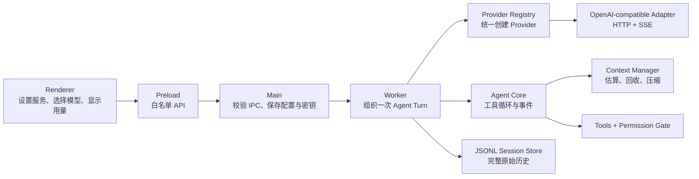
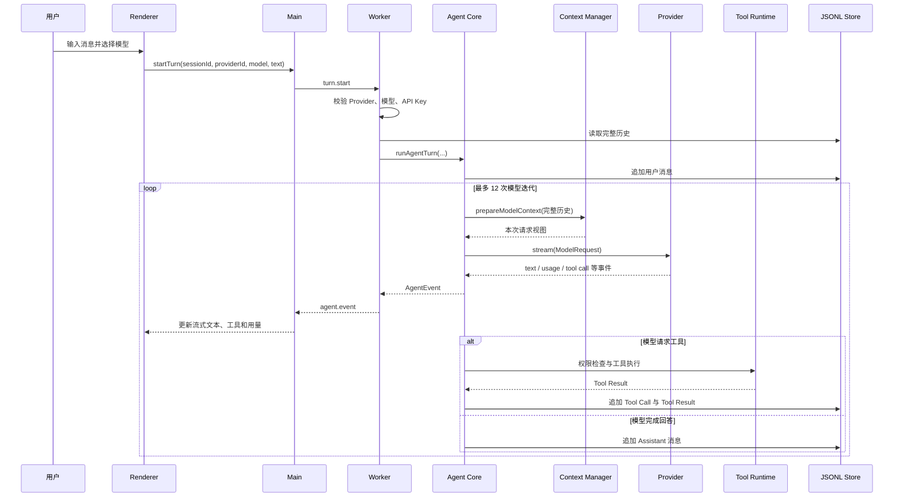
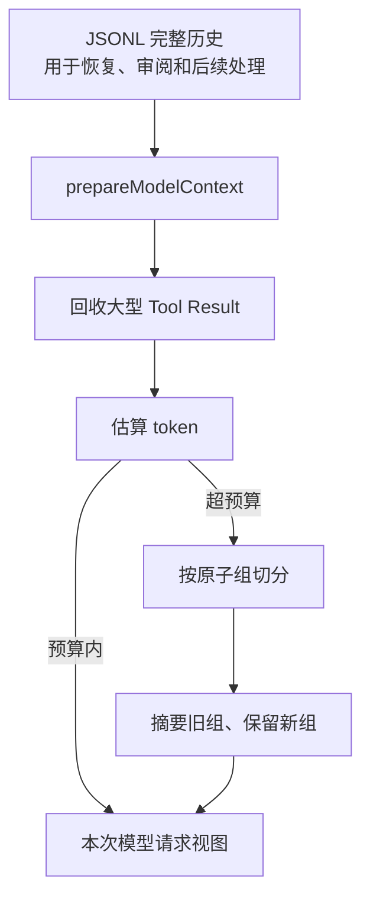

# Phase 2：Provider 与上下文管理技术实现方案

> 面向第一次接触 LLM 应用开发的读者。本文先解释概念，再沿着一轮对话的数据流说明实现，最后给出验证方法和代码入口。

## 1. 先记住这六个重点

如果暂时不想读完整文档，只需要先理解下面六件事：

1. **Provider 是“怎么调用模型”的适配层，Model 是具体模型。**  
   例如某个服务提供 Chat Completions 接口，它是 Provider；该服务下的具体模型 ID 才是 Model。
2. **当前只支持 OpenAI Chat Completions 兼容协议。**  
   OpenAI、DeepSeek、Kimi、GLM 等服务只有在接口格式兼容时才能接入。
3. **Agent Core 不直接拼厂商 HTTP 请求。**  
   它只认识统一的 `ModelRequest` 和 `ModelEvent`，协议细节集中在 `packages/providers`。
4. **磁盘中的完整会话和发送给模型的上下文不是同一份数据。**  
   JSONL 永久保留原始消息；裁剪和摘要只发生在本次模型请求的临时视图中。
5. **上下文不是满了才处理。**  
   系统在预计达到窗口预算前，先回收过大的 Tool Result，再压缩较老历史。
6. **Tool Call 和对应 Tool Result 必须作为一个整体。**  
   如果只留下调用、不留下结果，模型会看到一段不完整甚至非法的协议历史。

## 2. 当前范围

### 2.1 已实现

- OpenAI Chat Completions 兼容请求；
- `GET /models` 模型发现；
- SSE 流式文本和分片 Tool Call 聚合；
- Provider 配置、模型缓存和逐轮模型选择；
- API Key 的操作系统安全存储；
- input、output 和 cache read token 用量归一化；
- 上下文 token 保守估算；
- 大型 Tool Result 请求视图回收；
- Tool Call/Result 原子分组和旧历史摘要；
- 输出达到上限后的有界自动续写；
- 默认模型生成会话标题和历史摘要；
- 配置 v1、v2 到 v3 的兼容迁移。

### 2.2 当前没有实现

- Anthropic Messages、OpenAI Responses 等其他协议；
- Provider 不支持 `GET /models` 时的手动模型录入回退；
- 精确 tokenizer 计数；
- 多套 Provider 的可视化新增和删除界面；
- 自动重试、熔断或 Provider 故障转移；
- 真实 Provider 请求的默认 CI 测试。

内部配置仍使用 `providers: []`，是为了保留数据迁移和未来扩展空间。当前设置页只配置一个 OpenAI-compatible 服务，不展示 Provider 或协议选择器。

## 3. 新手术语表

| 名称 | 简单理解 | 本项目中的例子 |
|---|---|---|
| Provider | 负责调用模型服务的适配器 | `OpenAICompatibleProvider` |
| Protocol | HTTP 路径、请求体、认证头和流事件格式 | `openai_chat_completions` |
| Model | Provider 下实际执行推理的模型 ID | `gpt-5-mini` 或兼容服务返回的 ID |
| Context Window | 单次请求允许携带的输入与输出总预算 | 设置页中的“上下文窗口” |
| Max Output | 为这次模型输出预留的最大 token | 设置页中的“最大输出” |
| Tool Call | 模型请求应用执行某个工具 | `read_file({ path: "README.md" })` |
| Tool Result | 应用执行工具后回填给模型的结果 | 文件内容、命令输出或错误 |
| Token Usage | Provider 返回的输入和输出 token 统计 | `usage` 事件 |
| Prompt Cache | Provider 对重复输入的缓存 | `cached_tokens` |
| Compaction | 用摘要替换较老历史的请求视图 | `prepareModelContext` |

最常见的误区是把 Provider 和 Model 当成同一个概念。一个 Provider 可以返回很多模型；切换模型并不一定意味着切换协议。

## 4. 总体架构



### 4.1 每层负责什么

| 层 | 主要职责 | 明确不负责 |
|---|---|---|
| Renderer | 收集 Base URL、API Key、模型和窗口参数；展示消息与用量 | 不直接访问模型 API，不接触已保存的明文 Key |
| Main | 校验 IPC；读写普通配置；通过 `safeStorage` 处理密钥；启动 Worker | 不运行 Agent 工具循环 |
| Worker | 解析本轮 Provider/Model；读取历史；创建工具运行时；调用 Agent Core | 不实现厂商 SSE 格式 |
| Providers | 把内部请求转换成 Chat Completions；把 SSE 转成统一事件 | 不做会话持久化、审批和工具执行 |
| Agent Core | 控制“模型 → 工具 → 模型”循环；准备上下文；处理续写 | 不依赖 Electron，也不知道 API Key 如何保存 |
| Storage | JSONL 会话、配置版本迁移、原子保存和备份 | 不修改发送给模型的临时上下文 |

这种拆分的重点不是“文件看起来整齐”，而是让协议变化不会扩散到 Agent Core、工具和存储。

## 5. 一轮消息是怎么运行的



实际步骤如下：

1. Renderer 只发送用户输入、会话 ID、当前 Provider ID 和模型 ID。
2. Main 用 Zod 校验 IPC 输入，再转发给 Worker。
3. Worker 确认 Provider 存在、API Key 已配置、模型在缓存列表中。
4. Worker 从 JSONL 读取完整历史，并创建本轮的 `AbortController`。
5. Agent Core 先把当前用户消息追加到 JSONL。
6. 每次调用模型前，Context Manager 都重新准备一次请求视图。
7. Provider 把内部消息转成 Chat Completions 请求，并解析 SSE。
8. 如果模型产生 Tool Call，Agent Core 执行权限检查和工具，再把结果追加到历史。
9. 如果模型不再调用工具，本轮完成。
10. 用户取消时，同一个 AbortSignal 会传到模型请求、摘要和工具执行。

## 6. Provider 与模型配置

### 6.1 ProviderConfig 字段

```ts
type ProviderConfig = {
  id: string;
  name: string;
  protocol: 'openai_chat_completions';
  baseUrl: string;
  model: string;
  models: string[];
  contextWindowTokens: number;
  maxOutputTokens: number;
  hasApiKey: boolean;
};
```

| 字段 | 含义 | 注意事项 |
|---|---|---|
| `id` | 配置内部稳定标识 | API Key 也按这个 ID 关联 |
| `name` | UI 展示名称 | 当前默认是“OpenAI / 兼容服务” |
| `protocol` | 选择哪个协议 adapter | 当前只能是 `openai_chat_completions` |
| `baseUrl` | API 根地址 | 应填写到 `/v1` 一类根路径，不要包含 `/chat/completions` |
| `model` | 默认模型 | 必须同时存在于 `models` 中 |
| `models` | 已发现并缓存的模型 ID | 来自 `GET {baseUrl}/models` |
| `contextWindowTokens` | 模型上下文窗口 | 配错过大可能导致上游拒绝请求 |
| `maxOutputTokens` | 单次输出预算 | 必须小于上下文窗口 |
| `hasApiKey` | UI 是否显示“已安全保存” | 运行时派生，不写入普通配置 |

### 6.2 为什么还保留 Registry 和 Factory

`PROVIDER_REGISTRY` 保存协议元数据，`createProvider` 是创建 Provider 实例的唯一入口：

```ts
const provider = createProvider(config, apiKey);
```

现在只有一个协议，看起来可以直接 `new OpenAICompatibleProvider()`。保留工厂的价值在于：

- Worker 不需要知道 adapter 类名；
- 模型发现和正式请求共用创建逻辑；
- 将来增加协议时，改动集中在 `packages/providers`；
- 单元测试可以直接验证注册表和构造结果。

## 7. Chat Completions 适配细节

### 7.1 请求地址和认证

- 模型发现：`GET {baseUrl}/models`
- 模型请求：`POST {baseUrl}/chat/completions`
- 认证：`Authorization: Bearer <API_KEY>`
- 正式模型请求默认超时：90 秒
- 设置页模型发现超时：15 秒

`baseUrl` 保存时不强制去掉尾斜杠，Provider 实例化时会统一移除尾部 `/`，避免生成双斜杠 URL。

### 7.2 内部消息如何转换

项目内部只使用三种角色：`user`、`assistant`、`tool`。

| 内部内容 | Chat Completions 格式 |
|---|---|
| User 文本 | `{ role: "user", content: "..." }` |
| Assistant 文本 | `{ role: "assistant", content: "..." }` |
| Tool Call | Assistant 消息中的 `tool_calls[]` |
| Tool Result | 独立 `role: "tool"` 消息，并携带 `tool_call_id` |
| ToolDefinition | 请求体中的 `tools[].function` |

每次请求还会插入固定 System Message，要求模型只在确实获得 Tool Result 后声称工具已运行。

请求体核心字段：

```json
{
  "model": "selected-model",
  "stream": true,
  "stream_options": { "include_usage": true },
  "max_completion_tokens": 8192,
  "messages": [],
  "tools": []
}
```

### 7.3 SSE 如何还原成统一事件

网络返回的数据块不一定刚好对应一条 JSON。实现先由 `readSseData` 处理：

- UTF-8 字符被网络 chunk 拆开；
- 一条 SSE 事件跨多个 chunk；
- 一个 chunk 同时包含多条事件；
- 最后一条事件没有尾换行；
- 注释或非 `data:` 字段。

之后 `parseChatCompletionStream` 负责：

- `delta.content` → `text_delta`；
- 按 `tool_calls[].index` 聚合 Tool Call；
- 分片函数名和参数字符串持续累加；
- 流结束后解析完整参数 JSON；
- `usage.prompt_tokens` → input；
- `usage.completion_tokens` → output；
- `prompt_tokens_details.cached_tokens` → cache read；
- `finish_reason` → 统一停止原因。

如果 Tool Call 参数最终不是合法 JSON，不会让流解析器崩溃，而是保存为：

```json
{ "_invalidJson": "原始参数字符串" }
```

后续工具 Schema 会拒绝这次调用并返回明确错误。

当前 `AgentEvent` 预留了 cache write 字段，但 Chat Completions adapter 只读取 cache read；因此界面中的 cache write 通常为 0。

### 7.4 “OpenAI 兼容”并不代表一定兼容

第三方服务至少要支持：

- `GET /models`，返回 `{ data: [{ id: "..." }] }`；
- 流式 `POST /chat/completions`；
- 标准 SSE `data:` 事件；
- Function Tools；
- 分片 `tool_calls`；
- `max_completion_tokens`；
- 最好支持 `stream_options.include_usage`。

有些服务只兼容普通聊天，不兼容工具、usage 或模型发现。它们可能能完成一句简单问答，却不能完成 Coding Agent 的完整工具循环。

## 8. 配置、迁移与密钥

### 8.1 普通配置

普通配置位于 Electron `app.getPath('userData')` 下的 `config.json`。当前格式为 schema v3：

```json
{
  "schemaVersion": 3,
  "activeProviderId": "openai",
  "providers": [
    {
      "id": "openai",
      "name": "OpenAI / 兼容服务",
      "protocol": "openai_chat_completions",
      "baseUrl": "https://api.openai.com/v1",
      "model": "gpt-5-mini",
      "models": ["gpt-5-mini"],
      "contextWindowTokens": 128000,
      "maxOutputTokens": 8192
    }
  ],
  "utilityModel": {
    "providerId": "openai",
    "model": "gpt-5-mini"
  }
}
```

`utilityModel` 是内部兼容字段。设置保存时会自动同步为当前默认模型，界面不提供单独选择。

### 8.2 配置迁移

| 旧版本 | 旧结构 | 读取后的处理 |
|---|---|---|
| v1 | 单个 Base URL + 单个 Model | 转成 OpenAI Provider，并建立单元素 `models` |
| v2 | 单个 Provider + 模型列表 | 转成 v3 Provider 数组 |
| v3 | Provider 数组 | 保留兼容协议条目，过滤当前不支持的协议 |

如果过滤后一个兼容 Provider 都没有，系统回退到默认 OpenAI 配置。若旧的 active Provider 或 utility model 已不存在，则改用保留下来的第一个兼容 Provider 和它的默认模型。

### 8.3 为什么 Key 不放在 config.json

API Key 使用 Electron `safeStorage` 加密：

```text
userData/
├── config.json
├── config.json.bak
└── secrets/
    ├── provider-keys.bin
    └── provider-key.bin      # 旧版本兼容读取
```

`provider-keys.bin` 解密后是“Provider ID → API Key”的映射，但磁盘上保存的是整个 JSON 的加密结果。

安全原则：

- API Key 不进入 `config.json`；
- API Key 不进入 JSONL 会话；
- `hasApiKey` 只根据安全存储实时派生；
- Renderer 获取不到已保存 Key 的明文；
- 保存配置时先写临时文件再原子重命名；
- 原配置会复制为 `config.json.bak`。

## 9. 上下文管理：为什么需要它

上下文算法的逐步讲解、实现位置和验收方式，另见[《上下文管理技术实现方案》](./technical-implementation/context-management.md)。

模型每次请求都需要重新携带必要历史。随着对话增长，请求会遇到三个问题：

1. 输入越来越贵、越来越慢；
2. 大型文件或终端输出会迅速占满窗口；
3. 超过模型上下文窗口后，上游直接拒绝请求。

最关键的设计是区分两份数据：



- **完整历史**：追加写入 JSONL，不因压缩被修改。
- **请求视图**：每次模型迭代前临时计算，用完即可丢弃。

因此“压缩上下文”不等于“删除聊天记录”。

## 10. 上下文准备算法

### 10.1 第一步：回收大型 Tool Result

Tool Result 超过 12,000 字符时，请求视图只保留：

- 开头 4,000 字符；
- 一条明确的回收标记；
- 结尾 4,000 字符。

示意：

```text
[前 4000 字符]

[18500 characters reclaimed from older tool output]

[后 4000 字符]
```

同时把该 Tool Result 的 `truncated` 标记设为 `true`。原始内容仍在 JSONL 中。

为什么保留头尾：

- 文件头通常包含结构、导入和错误上下文；
- 文件尾或命令尾通常包含最终状态和报错；
- 比只保留开头更适合代码与终端输出。

### 10.2 第二步：保守估算 token

当前没有绑定某个厂商 tokenizer，而是使用确定性的保守估算：

- ASCII：约 4 个字符算 1 token；
- 非 ASCII：每字符按约 1.25 token；
- 每条 Message 增加固定开销；
- Tool Call 名称和 JSON 参数计入预算；
- Tool Result 计入预算；
- 工具描述和 JSON Schema 计入预算；
- 最后增加协议固定开销。

估算不是账单数字，它的目标是决定“什么时候应该开始压缩”。

### 10.3 第三步：计算安全目标

```text
target = max(
  1024,
  floor(contextWindowTokens × 0.82) - maxOutputTokens
)
```

例如：

```text
contextWindowTokens = 128000
maxOutputTokens     = 8192

target = 128000 × 0.82 - 8192
       = 96768 tokens
```

没有使用整个 128k 的原因：

- 为模型输出预留空间；
- 估算不是精确 tokenizer；
- 不同兼容服务可能有额外协议开销；
- 工具调用后还需要继续追加 Tool Result。

### 10.4 第四步：构造 Tool Call 原子组

下面三条消息必须属于同一组：

```text
Assistant: tool_call c1
Tool:      tool_result c1
```

多工具调用也一样：

```text
Assistant: tool_call c1 + tool_call c2
Tool:      tool_result c1
Tool:      tool_result c2
```

`groupContextMessages` 会把 Assistant Tool Call 和紧随其后的匹配 Tool Result 合并成一个数组。压缩时只能整体保留或整体进入摘要。

如果错误地把它们拆开，可能出现：

- Tool Result 找不到对应 `tool_call_id`；
- 模型误以为工具仍未执行；
- 兼容服务直接拒绝消息序列；
- 模型重复执行已经完成的写文件或终端命令。

### 10.5 第五步：保留新历史，摘要旧历史

当估算超过 target：

1. 从最新原子组向前选择要保留的消息；
2. 保留预算约为 `target × 62%`；
3. 至少保留最新的一组；
4. 更老的完整原子组进入摘要源；
5. 摘要作为一条内部 User Message 放在请求视图最前面；
6. 再次估算最终请求视图。

内部摘要消息形态：

```text
[Compacted conversation context]
...摘要...
[End compacted context]
```

并带有：

```ts
metadata: { internal: true }
```

Renderer 不展示这类内部消息。

### 10.6 摘要的上限和降级

摘要提示要求保留：

- 用户明确约束；
- 已做出的设计决策；
- 文件路径和代码位置；
- 已发生错误；
- 尚未完成的工作；
- Tool Call 和 Tool Result 的关键结论；
- 禁止编造事实。

实现还设置了三层上限：

- 提交给摘要模型的源文本最多保留 48,000 字符；
- 摘要模型失败时，本地回退摘要最多约 8,000 字符；
- 模型生成摘要超过 12,000 字符时，再保留头尾各 6,000 字符。

摘要失败不会中断主对话。系统会使用确定性的本地头尾摘要继续执行。

## 11. 输出截断自动续写

模型可能因为输出预算耗尽而返回 `length`。Agent Core 也兼容部分服务返回的 `max_tokens`。

处理流程：

1. 保存已经产生的 Assistant 文本；
2. 插入一条 `metadata.internal = true` 的续写提示；
3. 再次执行完整的上下文准备；
4. 再调用一次相同模型继续输出；
5. 最多自动续写两次。

为什么不是无限续写：

- Provider 可能错误地一直返回截断状态；
- 用户可能请求了不合理的大输出；
- 无限续写会造成不可控成本。

一旦模型产生 Tool Call 并完成工具执行，续写计数会重置，因为此时已经进入新的模型步骤。

## 12. 标题和摘要使用哪个模型

设置页不再提供单独的“标题与摘要模型”选择项。保存设置时，内部 `utilityModel` 自动同步为当前默认模型。

用途：

- 新会话首轮前，提示模型生成不超过 60 字符的纯文本标题；
- 需要压缩时，提示模型生成结构化历史摘要。

降级策略：

- 标题生成失败：直接使用首条用户提问的本地截断；
- 摘要生成失败：使用本地确定性摘要；
- 两者失败都不会阻止主 Agent Turn。

## 13. 统一事件与 UI

Provider 和 Agent Core 通过统一事件向上层报告状态：

| 事件 | 关键字段 | 当前 UI 行为 |
|---|---|---|
| `usage` | input、output、cache read、cache write | 输入框下方显示 `↑输入 ↓输出`，悬浮查看缓存 |
| `context.updated` | estimated、window、compacted、reclaimed | 显示 `当前估算 / 窗口`；压缩后悬浮显示消息数 |
| `output.continuing` | attempt | 已发出事件，当前没有单独视觉提示 |
| `text.delta` | text | 流式追加 Assistant 文本 |
| `turn.failed` | code、message | 显示错误并结束运行状态 |
| `turn.cancelled` | 无 | 停止本轮并清理审批 |

`reclaimedToolCharacters` 已在事件中提供，但当前 Renderer 没有单独展示。

## 14. 失败边界与错误分类

### 14.1 请求前拒绝

Worker 会在访问网络前检查：

- Provider ID 是否存在；
- Provider 是否有安全存储中的 API Key；
- 模型是否在该 Provider 的缓存列表；
- 会话是否存在；
- 同一会话是否已经有运行中的 Turn。

### 14.2 Provider 错误

| 情况 | 统一错误码 |
|---|---|
| HTTP 401 / 403 | `authentication` |
| HTTP 429 | `rate_limit` |
| HTTP 5xx | `provider_unavailable` |
| 其他非成功 HTTP | `provider_request` |
| 建连或读取失败 | `network` |
| 90 秒超时 | `timeout` |
| 成功响应但没有 body | `empty_response` |

错误响应正文最多保留 1,000 字符，避免巨大的上游错误页进入 UI。

### 14.3 取消

调用方取消使用同一条 AbortSignal 链路：

```text
Renderer 停止按钮
  → Main
  → Worker AbortController
  → Provider fetch / 摘要请求 / Agent Core / Tool Runtime
```

取消不是普通失败，会归一为 `turn.cancelled`。

## 15. 测试与验收

### 15.1 自动化测试

定向运行：

```bash
pnpm exec vitest run \\
  packages/providers/test/providers.test.ts \\
  packages/agent-core/test/context-manager.test.ts \\
  packages/contracts/test/contracts.test.ts \\
  packages/storage/test/session.test.ts
```

完整回归：

```bash
pnpm typecheck
pnpm lint
pnpm test
```

重点覆盖：

- Chat Completions 请求序列化；
- SSE 跨 chunk、无尾换行和 Tool Call 分片；
- usage 与 cache read 归一化；
- HTTP、超时和取消错误；
- Provider Registry 与 Factory；
- v1/v2/v3 配置迁移；
- API Key 字段不会写入普通配置；
- Tool Call/Result 原子分组；
- 12,000 字符以上 Tool Result 回收；
- 超预算历史摘要；
- 输出截断后的自动续写。

### 15.2 手工验证 Provider

1. 运行 `pnpm dev`。
2. 在设置页填写兼容服务 Base URL 和 API Key。
3. 点击“刷新模型”。
4. 选择默认模型并保存。
5. 发送“只回复 OK”，验证基本流式输出。
6. 再发送“读取 package.json 并告诉我 name”，验证 Function Tools。
7. 输入框下方应出现 input/output token 统计。

### 15.3 手工触发上下文压缩

为了快速触发：

1. 把上下文窗口设置为 `8192`；
2. 把最大输出设置为 `1024`；
3. 连续发送多轮较长文本；
4. 提前写入几个必须保留的约束；
5. 当界面显示接近 `8k` 时继续对话；
6. 悬浮上下文状态，确认出现“已压缩 N 条历史消息”；
7. 询问之前的约束，确认摘要保留了关键信息；
8. 重启应用，确认完整聊天历史仍然存在。

### 15.4 手工验证自动续写

1. 把最大输出临时设为 `256`；
2. 请求生成一篇明显超过 256 token 的长文；
3. 观察输出是否在一次截断后继续；
4. 自动化测试是判断续写次数和内部消息最可靠的依据，因为当前 UI 没有显示 `output.continuing`。

## 16. 常见问题

### 16.1 DeepSeek、Kimi、GLM 能不能直接用

只有它们提供的端点同时兼容模型发现、流式 Chat Completions 和 Function Tools 时才能完整使用。仅能聊天但不支持 Tool Calls 的接口，不能完成 Coding Agent 任务。

### 16.2 为什么要手动填写上下文窗口

`GET /models` 通常只返回模型 ID，不一定返回可靠的上下文长度。系统需要这个数字决定什么时候压缩，因此暂时由用户配置。

填得太小会过早压缩，影响细节；填得太大会压缩过晚，可能被 Provider 拒绝。

### 16.3 token 估算为什么和账单不一致

当前估算只用于上下文决策，不是精确计费。账单应以 Provider 返回的 `usage` 为准。

### 16.4 为什么不直接删除旧消息

删除会破坏会话恢复、审阅和后续重新摘要。项目只压缩请求视图，磁盘原始记录保持完整。

### 16.5 为什么模型列表必须缓存

Worker 在发请求前需要确认本轮模型属于当前 Provider。缓存也让输入框可以离线展示上次成功发现的模型列表。

### 16.6 为什么内部还有 providers 数组和 utilityModel

这是 v3 配置兼容边界：

- `providers` 为未来增加多套服务配置保留结构；
- `utilityModel` 让旧配置与 Worker 接口保持兼容；
- 当前 UI 不提供多 Provider 和独立 utility model 选择。

## 17. 未来增加新协议时怎么做

如果以后重新增加一种协议，推荐步骤：

1. 在 Contracts 扩展 `ProviderProtocolSchema`；
2. 在 `packages/providers` 新增请求转换器；
3. 新增该协议的 SSE 或流响应解析器；
4. 实现统一的 `ModelProvider.stream(ModelRequest)`；
5. 在 `PROVIDER_REGISTRY` 注册；
6. 在 `createProvider` 增加构造分支；
7. 为消息映射、Tool Call、usage、错误和取消增加离线测试；
8. 最后才在设置页增加协议和 Provider 选择 UI。

只要新 adapter 输出统一 `ModelEvent`，Agent Core、工具循环、权限审批和 JSONL 存储都不需要感知厂商字段。

## 18. 关键文件导航

| 想了解什么 | 文件 |
|---|---|
| Provider、模型和设置 Schema | `packages/contracts/src/persistence.ts` |
| Desktop IPC 输入边界 | `packages/contracts/src/desktop.ts` |
| 统一模型请求与事件 | `packages/contracts/src/model.ts`、`agent.ts` |
| Provider 注册与构造 | `packages/providers/src/registry.ts` |
| HTTP、认证、超时和模型发现 | `packages/providers/src/openai-compatible-provider.ts` |
| Chat Completions 请求转换 | `packages/providers/src/chat-completions-request.ts` |
| SSE 与 Tool Call 聚合 | `packages/providers/src/sse.ts`、`chat-completions-stream.ts` |
| 上下文估算、回收和摘要 | `packages/agent-core/src/context-manager.ts` |
| 工具循环和自动续写 | `packages/agent-core/src/run-agent-turn.ts` |
| 标题、摘要和运行时 Provider 解析 | `apps/desktop/src/worker/worker.ts` |
| 配置与密钥 IPC | `apps/desktop/src/main/main.ts` |
| 配置迁移和原子保存 | `packages/storage/src/index.ts` |
| UI 设置与上下文用量 | `apps/desktop/src/renderer/main.tsx` |

## 19. 最后的设计结论

这一阶段真正解决的不是“多一个设置框”，而是建立三条稳定边界：

1. **协议边界**：厂商 HTTP 与 SSE 只进入 Provider adapter。
2. **上下文边界**：JSONL 完整历史与模型请求视图分离。
3. **失败边界**：标题、摘要、缓存统计和自动续写都不能无限放大主对话故障。

理解这三条边界后，再阅读具体代码会容易很多。
