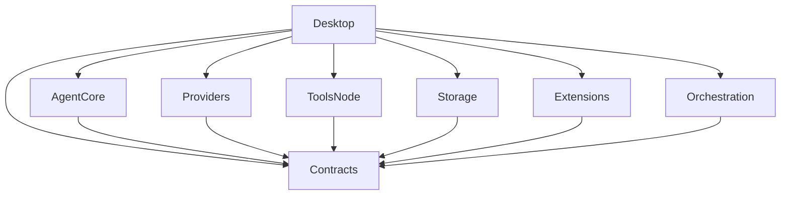
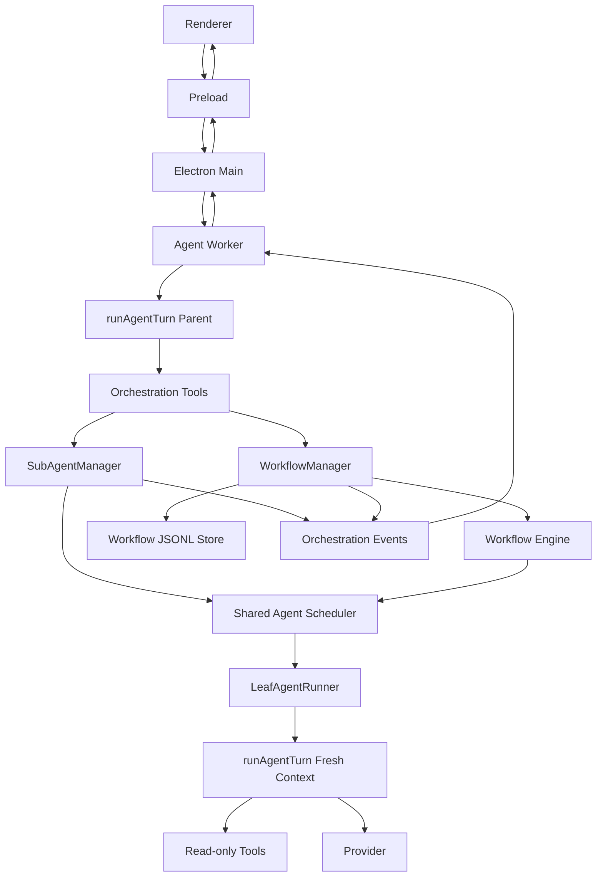

# Jojo Agent Phase 5：子 Agent 与工作流技术实现方案

> 文档状态：2026-08-16  
> 适用仓库：`zxt6991-source/jojo-agent`  
> 基线分支：`main`  
> 对应规划：`ts-desktop-agent-mvp-roadmap.md` → **Phase 5：子 Agent 与工作流**  
> 建议文档路径：`docs/phase-5-subagent-workflow.md`

---

## 1. 文档目标

Phase 5 的目标不是重新实现一套 Agent，而是在现有 `runAgentTurn`、Tool、Permission Gate、Worker、JSONL Storage 和统一事件体系之上，补一层**可控的 Agent 编排能力**。

Roadmap 对 Phase 5 的原始要求是：

- 一层子 Agent 委派；
- 并发上限、独立上下文和独立 usage；
- 后台 Agent 状态和取消；
- 声明式或脚本式 Workflow；
- Workflow 并发、超时、日志和恢复；
- 结果汇总和不完整标记。

验收场景：

1. 主 Agent 可以并行委派三个只读分析任务并汇总结果；
2. 子 Agent 不能无限递归派生；
3. Workflow 失败后可以定位到具体步骤。

本文给出一套与 Jojo 当前架构一致、可以分阶段落地的技术方案。

---

## 2. 当前代码基线与约束

### 2.1 已有能力可以直接复用

当前 `packages/agent-core/src/run-agent-turn.ts` 已经提供：

- 多轮模型调用；
- Tool Call；
- Tool Result 回填；
- Tool 重复调用保护；
- no-progress 保护；
- Context Window 管理；
- 历史压缩；
- 输出截断续写；
- AbortSignal 取消；
- usage 事件；
- `commitMessage` 可选持久化。

当前 `AgentRunOptions` 已经可以注入：

```ts
type AgentRunOptions = {
  sessionId: string;
  workingDirectory: string;
  model: string;
  history: Message[];
  userText: string;
  provider: ModelProvider;
  tools: Tool[];
  permissionGate: PermissionGate;
  signal: AbortSignal;
  emit: (event: AgentEvent) => void;
  approve: (...) => Promise<boolean>;
  commitMessage?: (message: Message) => Promise<void>;
  // ...
};
```

因此子 Agent **不应该复制 `runAgentTurn`**。

正确方案是：

```text
Main Agent
    │
    ├── runAgentTurn()
    │
    └── sub_agent_start Tool
             │
             ▼
      SubAgentManager
             │
             ▼
      LeafAgentRunner
             │
             ▼
        runAgentTurn()
```

父 Agent 和子 Agent 复用同一个 Agent Core，但使用不同：

- History；
- AbortController；
- Tool Set；
- Usage 统计；
- 生命周期；
- 结果输出。

### 2.2 当前 Tool Call 默认串行

当前 `runAgentTurn()` 内多个 Tool Call 通过 `for` 循环逐个执行。

因此不能简单依赖模型一次返回：

```text
sub_agent A
sub_agent B
sub_agent C
```

然后期待三个同步 Tool 自动并行。

Phase 5 不建议修改所有 Tool 的全局执行语义，因为：

- 文件修改不能无条件并行；
- Terminal 可能依赖前一个命令；
- 浏览器操作强依赖顺序；
- MCP Tool 是否可并行无法可靠判断；
- 会破坏现有 Tool 重复保护和审批语义。

因此子 Agent Tool 应采用：

```text
sub_agent_start
    │
    ├── 立即创建后台任务
    ├── 立即返回 agentId
    └── 不等待子 Agent 完成
```

主 Agent 可以连续启动三个任务：

```text
sub_agent_start(A) -> sa_x1
sub_agent_start(B) -> sa_x2
sub_agent_start(C) -> sa_x3
```

三个调用虽然由 Tool Loop 依次触发，但每次只做“登记 + 启动”，耗时很短。真正的 Agent Loop 在后台并行执行。

之后：

```text
sub_agent_wait([sa_x1, sa_x2, sa_x3])
```

一次等待并收集结果。

### 2.3 当前 Permission Gate 默认拒绝未知 Tool

`DefaultPermissionGate` 对未认识的 Tool 默认返回：

```ts
{ decision: 'deny', reason: `Unknown tool: ${call.name}` }
```

所以新增：

- `sub_agent_start`
- `sub_agent_wait`
- `sub_agent_cancel`
- `workflow_start`
- `workflow_wait`
- `workflow_status`
- `workflow_cancel`
- `workflow_resume`

后，必须增加 Orchestration Permission Gate。

不建议直接把这些名字硬编码进 `tools-node` 的 `DefaultPermissionGate`，因为 Agent 编排不是 Node 文件工具的职责。

---

## 3. Phase 5 核心设计决策

本方案建议固定以下原则。

### 3.1 第一版子 Agent 只允许只读

Phase 5 首版只提供：

```text
explore
```

一种子 Agent Profile。

允许的 Tool：

```text
read_file
list_files
grep
glob
web_search
web_fetch
```

可选：

```text
load_skill
```

第一版明确禁止：

```text
write_file
edit_file
delete_file
terminal
install_skill
browser_*
MCP Tool
sub_agent_*
workflow_*
```

原因：

1. Phase 5 Roadmap 的首个验收就是“三个只读分析任务”；
2. 多个 Agent 同时修改同一工作树会引入复杂冲突；
3. Terminal 即使看起来是只读命令，也不能可靠静态判断；
4. Browser 存在会话状态和大量审批；
5. MCP Tool 是否有副作用不能只根据名称判断；
6. 子 Agent 写文件需要进一步设计 worktree / branch / patch merge。

因此：

> Phase 5 先解决“并行思考与分析”，不要同时解决“多 Agent 并行修改代码”。

### 3.2 子 Agent 使用 fresh context，不 fork 父历史

子 Agent 默认：

```ts
history: []
```

父 Agent 必须在 `task` 中传递自包含任务描述。

例如：

```json
{
  "task": "分析 packages/agent-core 的 Tool Loop，重点说明工具执行顺序、取消和错误传播。",
  "label": "分析 Agent Core"
}
```

不要直接复制整个父对话。

原因：

- 父历史可能非常长；
- 三个子 Agent 会重复消耗父历史 Token；
- 子 Agent 可能把父对话中的“编排过程”误认为自己的任务；
- fresh context 更容易控制预算；
- 更容易保证隔离。

### 3.3 只允许一层子 Agent

结构：

```text
Main Agent
   │
   ├── Child A
   ├── Child B
   └── Child C
```

禁止：

```text
Main
  └── Child
       └── Grandchild
```

实现必须依靠**结构性约束**，不能只写 Prompt。

最重要的做法：

```ts
childTools = parentReadOnlyTools.filter(
  tool => !tool.definition.name.startsWith('sub_agent_')
       && !tool.definition.name.startsWith('workflow_')
);
```

同时在 SubAgentManager 中保留第二层防御：

```ts
if (request.depth >= 1) {
  throw new Error('Nested sub-agents are not allowed.');
}
```

### 3.4 子 Agent 不产生交互式审批

后台子 Agent 如果弹审批，会造成复杂状态：

```text
父 Agent 正在运行
  └── 子 Agent 等待批准
        └── UI 不知道当前批准属于谁
```

第一版策略：

- 子 Agent 只拥有正常情况下无需审批的只读 Tool；
- 如果 Permission Gate 返回 `ask`，子 Agent 将其转换为 `deny`；
- 子 Agent 在结果中明确报告“该操作需要主 Agent 或用户执行”。

例如：

```text
无法读取工作区外文件，因为该操作需要用户批准。
```

不让后台子 Agent 阻塞在 Approval。

### 3.5 Workflow 选择声明式 DAG，不执行任意脚本

Roadmap 允许：

> 声明式或脚本式 Workflow

Phase 5 推荐选**声明式 DAG**。

不建议第一版支持：

```ts
eval(workflowScript)
new Function(...)
vm.runInContext(...)
```

原因：

- Jojo 的安全原则是“机制保证，不依赖模型自觉”；
- 任意 JS/TS Workflow 会直接扩大本地代码执行面；
- Workflow 本质上只需要表达依赖、并发、超时和 Agent Step。

因此采用 YAML / JSON：

```yaml
schemaVersion: 1
name: analyze-repository
maxConcurrency: 3

steps:
  - id: agent-core
    type: agent
    profile: explore
    task: 分析 packages/agent-core 的职责。

  - id: storage
    type: agent
    profile: explore
    task: 分析 packages/storage 的持久化设计。

  - id: desktop
    type: agent
    profile: explore
    task: 分析 apps/desktop 的进程边界。

  - id: summary
    type: agent
    profile: synthesize
    dependsOn:
      - agent-core
      - storage
      - desktop
    task: 汇总三个模块，指出 Phase 5 应该在哪些层实现。
```

---

## 4. 推荐 Monorepo 调整

新增：

```text
packages/
  orchestration/
    src/
      subagent/
        manager.ts
        scheduler.ts
        tools.ts
        types.ts
      workflow/
        engine.ts
        manager.ts
        parser.ts
        scheduler.ts
        tools.ts
        prompt-builder.ts
      usage.ts
      abort.ts
      index.ts
```

最终依赖：



推荐 **`orchestration` 不直接依赖 Electron、Node fs、Provider 具体实现或 Storage 具体实现**。

核心执行通过接口注入：

```ts
export interface LeafAgentRunner {
  run(
    request: LeafAgentRunRequest,
    signal: AbortSignal,
    onEvent: (event: AgentEvent) => void
  ): Promise<LeafAgentRunResult>;
}
```

Desktop Worker 提供真实实现：

```text
LeafAgentRunner
    │
    ├── createProvider()
    ├── createDefaultToolRuntime()
    ├── filter read-only tools
    ├── create permission gate
    └── runAgentTurn()
```

这样未来如果增加：

- CLI；
- Web；
- VS Code；

仍然可以复用 `packages/orchestration`。

---

## 5. Contracts 设计

建议新增：

```text
packages/contracts/src/orchestration.ts
```

并从 `index.ts` 导出。

### 5.1 Usage

```ts
export const UsageTotalsSchema = z.object({
  inputTokens: z.number().int().nonnegative().default(0),
  outputTokens: z.number().int().nonnegative().default(0),
  cacheReadInputTokens: z.number().int().nonnegative().default(0),
  cacheWriteInputTokens: z.number().int().nonnegative().default(0)
});

export type UsageTotals = z.infer<typeof UsageTotalsSchema>;
```

每个子 Agent 独立统计。

不要直接把 child usage 混进父 Agent 的 `usage` 事件。

UI 可分别显示：

```text
Parent
  input: 12,430
  output: 1,930

Sub Agents
  A: 8,210 / 1,120
  B: 6,930 /   950
  C: 7,400 / 1,030
```

后续如果需要 Session 总成本，再做：

```text
sessionTotal = parentUsage + sum(subAgentUsage) + workflowUsage
```

### 5.2 SubAgent 状态

```ts
export const SubAgentStateSchema = z.enum([
  'queued',
  'running',
  'completed',
  'failed',
  'cancelled',
  'timed_out'
]);

export const SubAgentSnapshotSchema = z.object({
  id: z.string(),
  sessionId: z.string(),
  label: z.string(),
  task: z.string(),
  profile: z.enum(['explore', 'synthesize']),
  state: SubAgentStateSchema,

  createdAt: z.string().datetime(),
  startedAt: z.string().datetime().optional(),
  finishedAt: z.string().datetime().optional(),

  model: z.string(),
  usage: UsageTotalsSchema,

  stopReason: z.string().optional(),
  result: z.string().optional(),
  error: z.string().optional(),

  incomplete: z.boolean().default(false)
});

export type SubAgentSnapshot = z.infer<typeof SubAgentSnapshotSchema>;
```

### 5.3 Orchestration Event

不要把子 Agent 内部的 `text.delta`、`tool.started` 等直接混进父 Agent 的 `AgentEvent`。

新增单独事件：

```ts
export type OrchestrationEvent =
  | {
      type: 'subagent.changed';
      subagent: SubAgentSnapshot;
    }
  | {
      type: 'workflow.changed';
      workflow: WorkflowRunSnapshot;
    }
  | {
      type: 'workflow.log';
      runId: string;
      stepId?: string;
      level: 'info' | 'warning' | 'error';
      message: string;
      createdAt: string;
    };
```

Worker：

```ts
post({
  type: 'orchestration.event',
  event
});
```

Renderer 单独订阅。

好处：

- 父 Agent 对话轨迹不被子 Agent Token Stream 淹没；
- 子 Agent UI 可以独立展示；
- Workflow UI 不需要伪装成普通 Tool 行；
- 后续 Phase 6 后台任务也可以沿用。

---

## 6. 子 Agent Tool 设计

推荐模型可见 Tool：

### 6.1 `sub_agent_start`

输入：

```ts
const SubAgentStartInput = z.object({
  task: z.string().trim().min(1).max(40_000),
  label: z.string().trim().min(1).max(120).optional(),
  profile: z.enum(['explore']).default('explore'),
  timeoutMs: z.number().int().min(5_000).max(300_000).optional()
});
```

输出示例：

```json
{
  "id": "sa_1b7d8c6e",
  "state": "queued",
  "label": "分析 Agent Core"
}
```

Tool 必须立即返回，不等待任务结束。

### 6.2 `sub_agent_wait`

输入：

```ts
const SubAgentWaitInput = z.object({
  ids: z.array(z.string()).min(1).max(8),
  timeoutMs: z.number().int().min(100).max(120_000).default(60_000)
});
```

行为：

- 等所有指定 Agent 进入 terminal state；
- 或等待时间到；
- `wait` 自己受父 Turn `AbortSignal` 控制；
- 父 Turn 被取消，只停止等待，不默认杀死后台子 Agent。

返回：

```json
{
  "completed": true,
  "agents": [
    {
      "id": "sa_x1",
      "state": "completed",
      "incomplete": false,
      "result": "..."
    },
    {
      "id": "sa_x2",
      "state": "completed",
      "incomplete": true,
      "stopReason": "max_iterations",
      "result": "..."
    }
  ]
}
```

### 6.3 `sub_agent_status`

用于：

- 下一轮继续查询；
- UI 之外让模型查看单个任务；
- 获取已经完成的结果。

输入：

```json
{
  "id": "sa_x1"
}
```

### 6.4 `sub_agent_cancel`

输入：

```json
{
  "id": "sa_x1"
}
```

行为：

```text
queued   -> 直接移出队列 -> cancelled
running  -> AbortController.abort()
terminal -> 幂等返回当前状态
```

---

## 7. SubAgentManager

### 7.1 数据结构

```ts
type LiveSubAgent = {
  snapshot: SubAgentSnapshot;

  controller: AbortController;

  done: Promise<void>;
  resolveDone: () => void;

  parentSessionId: string;

  // 内部日志，仅保留有限 tail。
  logs: SubAgentLogEntry[];
};
```

Manager：

```ts
class SubAgentManager {
  private readonly agents = new Map<string, LiveSubAgent>();

  constructor(
    private readonly runner: LeafAgentRunner,
    private readonly scheduler: AgentExecutionScheduler,
    private readonly emit: (event: OrchestrationEvent) => void
  ) {}

  start(request: SubAgentStartRequest): SubAgentSnapshot;
  wait(ids: string[], signal: AbortSignal, timeoutMs: number): Promise<SubAgentSnapshot[]>;
  get(id: string): SubAgentSnapshot | undefined;
  list(sessionId: string): SubAgentSnapshot[];
  cancel(id: string): void;
  cancelSession(sessionId: string): void;
}
```

### 7.2 并发控制

建议第一版：

```ts
const MAX_CONCURRENT_SUBAGENTS = 4;
const MAX_SUBAGENTS_PER_SESSION = 8;
const SUBAGENT_RETENTION = 32;
```

Roadmap 验收要求 3 个并行任务，所以 `4` 是比较合理的默认值。

调度状态：

```text
queued
  │
  ▼
running
  │
  ├── completed
  ├── failed
  ├── cancelled
  └── timed_out
```

使用 FIFO Queue。

不要超限后直接无限创建 Promise。

### 7.3 全局共享 Scheduler

Workflow 的 Agent Step 和手动启动的子 Agent 本质上都在消耗模型并发。

推荐抽象：

```ts
class AgentExecutionScheduler {
  constructor(private readonly maxConcurrent: number) {}

  acquire(signal: AbortSignal): Promise<() => void>;
}
```

所有 leaf agent 共用：

```text
SubAgentManager ─────┐
                     ├── AgentExecutionScheduler
WorkflowEngine ──────┘
```

这样不会出现：

```text
手动子 Agent 4 个
+
Workflow 4 个
+
另一个 Workflow 4 个
=
12 个模型请求同时运行
```

第一版可以：

```ts
GLOBAL_LEAF_AGENT_CONCURRENCY = 4
```

之后再放到设置页。

---

## 8. LeafAgentRunner

真正把当前 Jojo Agent Core 变成子 Agent 的适配层建议放：

```text
apps/desktop/src/worker/orchestration-runtime.ts
```

接口：

```ts
type LeafAgentRunRequest = {
  id: string;
  sessionId: string;
  workingDirectory: string;

  task: string;
  profile: 'explore' | 'synthesize';

  providerId: string;
  model: string;

  maxIterations: number;
  timeoutMs: number;
};

type LeafAgentRunResult = {
  result: string;
  stopReason: string;
  usage: UsageTotals;
  incomplete: boolean;
};
```

执行逻辑：

```ts
await runAgentTurn({
  sessionId: request.sessionId,
  workingDirectory: request.workingDirectory,

  model,
  history: [],
  userText: request.task,

  provider,
  tools: childTools,

  permissionGate: childPermissionGate,

  signal,

  maxIterations: 8,

  contextWindowTokens,
  maxOutputTokens: Math.min(providerMaxOutputTokens, 4_096),

  emit: collectChildEvent,

  approve: async () => false

  // 不设置 commitMessage
});
```

注意：

```ts
commitMessage: undefined
```

因此子 Agent 的完整内部消息**不写入父 Session JSONL**。

父会话只保存：

```text
assistant tool_call: sub_agent_start
tool result: sa_x1
assistant tool_call: sub_agent_wait
tool result: 子 Agent 最终结果
```

这能保持父 Session 可恢复，同时不会被三个子 Agent 的几十条内部消息污染。

---

## 9. 子 Agent Tool Set

### 9.1 explore profile

建议：

```ts
const EXPLORE_TOOLS = new Set([
  'read_file',
  'list_files',
  'grep',
  'glob',
  'web_search',
  'web_fetch'
]);
```

通过现有 Default Tool Runtime 获取工具后过滤：

```ts
const childTools = toolRuntime.tools.filter(
  tool => EXPLORE_TOOLS.has(tool.definition.name)
);
```

禁止“父 Tool Belt 原样继承”。

### 9.2 synthesize profile

用于 Workflow 汇总节点：

```text
Tools = []
```

只允许模型根据输入材料总结。

这样最终汇总节点不会重新搜索或修改环境，使 Workflow 更可预测。

---

## 10. 子 Agent Permission Gate

新增：

```ts
class NonInteractivePermissionGate implements PermissionGate {
  constructor(private readonly inner: PermissionGate) {}

  async check(call: ToolCall, context: PermissionContext): Promise<PermissionDecision> {
    const decision = await this.inner.check(call, context);

    if (decision.decision !== 'ask') {
      return decision;
    }

    return {
      decision: 'deny',
      code: 'subagent_requires_approval',
      reason: 'This operation requires interactive approval and is unavailable to a background sub-agent.'
    };
  }
}
```

父 Agent：

```text
OrchestrationPermissionGate
  -> BrowserPermissionGate
      -> ExtensionPermissionGate
          -> DefaultPermissionGate
```

子 Agent：

```text
NonInteractivePermissionGate
  -> DefaultPermissionGate
```

由于 Tool Set 已经只读，因此第二条链非常简单。

---

## 11. Orchestration Permission Gate

新增位置建议：

```text
packages/orchestration/src/permission-gate.ts
```

```ts
const ORCHESTRATION_TOOLS = new Set([
  'sub_agent_start',
  'sub_agent_wait',
  'sub_agent_status',
  'sub_agent_cancel',
  'workflow_start',
  'workflow_wait',
  'workflow_status',
  'workflow_cancel',
  'workflow_resume'
]);

export class OrchestrationPermissionGate implements PermissionGate {
  constructor(private readonly inner: PermissionGate) {}

  check(call: ToolCall, context: PermissionContext): Promise<PermissionDecision> {
    if (ORCHESTRATION_TOOLS.has(call.name)) {
      return Promise.resolve({ decision: 'allow' });
    }

    return this.inner.check(call, context);
  }
}
```

第一版不为只读子 Agent 启动逐次弹审批。

安全靠：

- Tool allowlist；
- 并发上限；
- Agent 数量上限；
- timeout；
- max iterations；
- output 限制；
- 禁递归。

---

## 12. 子 Agent Usage

当前 Agent Core 已经会产生：

```ts
{
  type: 'usage',
  inputTokens?,
  outputTokens?,
  cacheReadInputTokens?,
  cacheWriteInputTokens?
}
```

Runner 内部聚合：

```ts
function accrueUsage(
  total: UsageTotals,
  event: Extract<AgentEvent, { type: 'usage' }>
) {
  total.inputTokens += event.inputTokens ?? 0;
  total.outputTokens += event.outputTokens ?? 0;
  total.cacheReadInputTokens += event.cacheReadInputTokens ?? 0;
  total.cacheWriteInputTokens += event.cacheWriteInputTokens ?? 0;
}
```

不要转发为父 `usage`。

而是：

```text
AgentEvent usage
      │
      ▼
LeafAgentRunner
      │
      ▼
SubAgentSnapshot.usage
      │
      ▼
OrchestrationEvent
```

---

## 13. 不完整结果

这是 Phase 5 非常重要的语义。

子 Agent 可能因为：

- max iterations；
- max tokens；
- 输出继续次数耗尽；
- timeout；
- 部分 Tool 失败；

得到“有内容但不完整”的结果。

不要只用：

```text
success / failure
```

需要：

```ts
incomplete: boolean
```

推荐规则：

```ts
const INCOMPLETE_STOP_REASONS = new Set([
  'max_iterations',
  'length',
  'max_tokens'
]);
```

状态仍然可以是：

```text
completed
```

但：

```text
incomplete = true
```

结果返回给主 Agent 时明确加：

```text
[INCOMPLETE]
```

### 13.1 对 `runAgentTurn` 的小改动

当前父 Agent 达到 `maxIterations` 后会抛出 `AgentError('max_iterations')`。

对于子 Agent，更希望保留已经生成的部分结果。

建议增加：

```ts
type AgentRunOptions = {
  // ...
  allowPartialOnMaxIterations?: boolean;
};
```

默认：

```ts
false
```

保持现有父 Agent 行为不变。

子 Agent：

```ts
allowPartialOnMaxIterations: true
```

达到上限时：

```ts
return {
  messages: state.messages,
  stopReason: 'max_iterations'
};
```

由 SubAgentManager 标记：

```ts
incomplete = true
```

---

# 14. Workflow 数据模型

新增 Contracts：

```ts
const WorkflowStepBaseSchema = z.object({
  id: z.string().regex(/^[A-Za-z][A-Za-z0-9_-]{0,63}$/),
  dependsOn: z.array(z.string()).max(16).default([]),
  timeoutMs: z.number().int().min(5_000).max(300_000).optional(),
  continueOnError: z.boolean().default(false)
});

const WorkflowAgentStepSchema = WorkflowStepBaseSchema.extend({
  type: z.literal('agent'),
  profile: z.enum(['explore', 'synthesize']).default('explore'),
  task: z.string().trim().min(1).max(40_000)
});

export const WorkflowDefinitionSchema = z.object({
  schemaVersion: z.literal(1),

  name: z.string().trim().min(1).max(120),
  description: z.string().max(4_000).optional(),

  maxConcurrency: z.number().int().min(1).max(4).default(3),
  timeoutMs: z.number().int().min(5_000).max(1_800_000).default(600_000),

  steps: z.array(WorkflowAgentStepSchema).min(1).max(32),

  outputStepId: z.string().optional()
});
```

解析后还要进行语义校验：

1. Step ID 唯一；
2. `dependsOn` 指向已存在 Step；
3. Step 不能依赖自己；
4. 图不能有环；
5. `outputStepId` 必须存在；
6. 最大 32 Step；
7. 依赖数量受限。

---

## 15. 为什么 Workflow 用 DAG

DAG 可以自然表达：

### 串行

```text
A -> B -> C
```

### 并行

```text
       ┌-> B -┐
A -----|      |-> D
       └-> C -┘
```

### 多个独立分析任务

```text
A
B
C
 \ | /
   D
```

不需要一开始支持：

- if；
- while；
- foreach；
- 任意脚本；
- 动态 eval。

Phase 5 的目标是：

> 可重复任务编排

不是做完整 Workflow Programming Language。

---

## 16. WorkflowManager 与 WorkflowEngine

分成两层。

### 16.1 WorkflowManager

负责生命周期：

```ts
class WorkflowManager {
  start(...): WorkflowRunSnapshot;
  wait(...): Promise<WorkflowRunSnapshot>;
  get(...): WorkflowRunSnapshot | undefined;
  list(...): WorkflowRunSnapshot[];
  cancel(...): Promise<void>;
  resume(...): Promise<WorkflowRunSnapshot>;
}
```

### 16.2 WorkflowEngine

负责执行一个 DAG：

```ts
class WorkflowEngine {
  async run(
    context: WorkflowExecutionContext,
    signal: AbortSignal
  ): Promise<WorkflowRunResult>;
}
```

Manager 不应该自己写 DAG 调度代码。

---

## 17. Workflow Step 状态

```ts
export type WorkflowStepState =
  | 'pending'
  | 'queued'
  | 'running'
  | 'completed'
  | 'failed'
  | 'cancelled'
  | 'timed_out'
  | 'blocked';
```

Workflow：

```ts
export type WorkflowRunState =
  | 'running'
  | 'completed'
  | 'failed'
  | 'cancelled'
  | 'timed_out'
  | 'interrupted';
```

`blocked` 表示：

```text
A failed
  │
  └── B dependsOn A
         -> blocked
```

与 `failed` 区分。

这样验收时可以明确：

```text
workflow failed at step: analyze-storage
```

而不是只有：

```text
Workflow failed
```

---

## 18. DAG 调度算法

伪代码：

```ts
while (hasUnfinishedSteps()) {
  throwIfAborted(signal);

  const ready = pendingSteps.filter(step =>
    step.dependsOn.every(dep => isCompleted(dep))
  );

  const blocked = pendingSteps.filter(step =>
    step.dependsOn.some(dep => isTerminalFailure(dep))
  );

  markBlocked(blocked);

  while (
    ready.length > 0 &&
    running.size < definition.maxConcurrency
  ) {
    const step = ready.shift()!;
    startStep(step);
  }

  if (running.size === 0) {
    break;
  }

  await Promise.race(running.values());
}
```

每个 `startStep()` 还必须通过共享：

```text
AgentExecutionScheduler
```

因此实际并发是：

```text
min(
  workflow.maxConcurrency,
  GLOBAL_LEAF_AGENT_CONCURRENCY
)
```

---

## 19. Workflow Step 输入

如果 Step 有依赖：

```yaml
- id: summary
  dependsOn:
    - a
    - b
    - c
```

不要要求模型自己写复杂模板表达式。

由程序构造：

```text
Task:
汇总三个模块，并指出核心风险。

Dependency results:

--- a ---
...

--- b ---
...

--- c ---
...
```

使用结构化边界。

伪代码：

```ts
function buildStepPrompt(
  step: WorkflowAgentStep,
  dependencies: WorkflowStepResult[]
): string {
  return [
    step.task,
    '',
    'Dependency results:',
    ...dependencies.map(dep =>
      `\n--- ${dep.stepId} ---\n${truncate(dep.output)}`
    )
  ].join('\n');
}
```

### 19.1 限制结果注入大小

必须限制 dependency output。

建议：

```text
单个 Step 最终结果：<= 16 KB
单个依赖注入：<= 12 KB
总依赖注入：<= 48 KB
```

超出：

```text
[Dependency output truncated]
```

避免最终汇总节点因为三个超长分析结果直接撑爆 Context。

---

## 20. Workflow 最终结果

如果：

```yaml
outputStepId: summary
```

则：

```ts
workflow.result = steps.summary.output;
```

否则返回结构化结果：

```text
Workflow completed.

[agent-core]
...

[storage]
...

[desktop]
...
```

Workflow 级别：

```ts
incomplete =
  anyStep.incomplete ||
  anyStep.state !== 'completed';
```

因此：

```text
completed + incomplete=true
```

也是合法结果。

例如某个独立支路达到 max iterations，但 summary 仍然成功生成。

---

# 21. Workflow 持久化

Roadmap 明确要求：

> Workflow 日志和恢复

因此 Workflow 不应只存在内存。

建议独立目录：

```text
userData/
  workflows/
    runs/
      wf_<uuid>.jsonl
```

不要写进：

```text
sessions/<sessionId>.jsonl
```

原因：

- Workflow 日志量可能很大；
- 生命周期可能跨父 Turn；
- 一个 Session 可存在多个 Workflow；
- 恢复逻辑与 Conversation Message 完全不同；
- Session JSONL 应继续只表达用户可见对话。

---

## 22. Workflow JSONL Journal

新增：

```text
packages/storage/src/workflow-store.ts
```

记录格式：

### 22.1 meta

```json
{
  "schemaVersion": 1,
  "type": "meta",
  "runId": "wf_xxx",
  "sessionId": "session_xxx",
  "workingDirectory": "/repo",
  "providerId": "openai",
  "model": "xxx",
  "definition": {},
  "createdAt": "..."
}
```

注意：

**API Key 永远不能持久化。**

### 22.2 run state

```json
{
  "schemaVersion": 1,
  "type": "run_state",
  "state": "running",
  "createdAt": "..."
}
```

### 22.3 step state

```json
{
  "schemaVersion": 1,
  "type": "step_state",
  "stepId": "agent-core",
  "state": "running",
  "attempt": 1,
  "createdAt": "..."
}
```

### 22.4 step result

```json
{
  "schemaVersion": 1,
  "type": "step_result",
  "stepId": "agent-core",
  "output": "...",
  "usage": {},
  "stopReason": "stop",
  "incomplete": false,
  "createdAt": "..."
}
```

### 22.5 log

```json
{
  "schemaVersion": 1,
  "type": "log",
  "stepId": "agent-core",
  "level": "info",
  "message": "Started sub-agent.",
  "createdAt": "..."
}
```

坚持 append-only。

不要反复 rewrite 整个 Workflow 文件。

---

# 23. Workflow 恢复

## 23.1 崩溃后的状态

假设：

```text
A completed
B completed
C running
D pending
```

应用异常退出。

由于没有：

```text
C completed
```

下一次读取 Journal 时：

```text
C -> interrupted
Workflow -> interrupted
```

UI 显示：

```text
工作流已中断，可恢复
```

### 23.2 `workflow_resume`

恢复策略：

- 已完成 Step 不重新运行；
- 崩溃时 `running` Step 从头重跑；
- `pending` Step 按 DAG 正常继续；
- `failed` Step 默认重跑；
- 之前成功的独立分支结果继续使用。

例如：

```text
A completed
B completed
C interrupted
D dependsOn A,B,C
```

Resume：

```text
A reuse
B reuse
C rerun
D run
```

### 23.3 Definition 使用快照

启动 Workflow 时把完整 Definition 写入 meta。

Resume 必须使用**该次 Run 的 Definition Snapshot**。

不能重新读取当前磁盘上的：

```text
.jojo/workflows/foo.yaml
```

否则用户修改 YAML 后恢复旧 Workflow，会导致执行图发生变化。

### 23.4 Workspace 变化

Phase 5 第一版可以接受：

> 恢复 Workflow 时默认假设 Working Directory 中代码没有发生重大变化。

但 UI 必须提示：

```text
工作区内容可能已在工作流中断后发生变化；恢复会复用已完成步骤的旧结果。
```

后续可加入 Git HEAD / dirty fingerprint。

---

# 24. Workflow Tool

推荐：

### `workflow_start`

支持两种输入：

#### Inline

```json
{
  "definition": {
    "schemaVersion": 1,
    "name": "...",
    "steps": []
  }
}
```

#### Saved Workflow

```json
{
  "workflowId": "analyze-repository"
}
```

二选一。

### `workflow_wait`

```json
{
  "runId": "wf_xxx",
  "timeoutMs": 60000
}
```

### `workflow_status`

```json
{
  "runId": "wf_xxx"
}
```

### `workflow_cancel`

```json
{
  "runId": "wf_xxx"
}
```

### `workflow_resume`

```json
{
  "runId": "wf_xxx"
}
```

---

# 25. 可重复 Workflow 文件

建议项目级：

```text
<workspace>/.jojo/workflows/
```

用户级：

```text
userData/workflows/definitions/
```

格式：

```text
*.yaml
*.yml
```

优先级：

```text
project workflow
    >
user workflow
```

同名时项目级覆盖。

例如：

```text
.jojo/workflows/review-architecture.yaml
```

当前 `apps/desktop` 已经依赖 `yaml`，不需要新增 YAML 解析生态。

---

# 26. Worker 集成

当前 Worker 中：

```ts
const controllers = new Map<string, AbortController>();
const approvals = new Map<...>();
```

Phase 5 不要把子 Agent Controller 全塞进 `controllers`。

保持：

```text
controllers
  = foreground parent turn only
```

新增：

```ts
const executionScheduler = new AgentExecutionScheduler(4);

const subAgentManager = new SubAgentManager(...);

const workflowManager = new WorkflowManager(...);
```

结构：

```text
Worker
 ├── foreground controllers
 ├── approvals
 ├── McpManager
 ├── BrowserToolBridge
 ├── SubAgentManager
 └── WorkflowManager
```

### 26.1 startTurn

在 `startTurn()` 创建 Tool 时加入：

```ts
const orchestrationTools = [
  ...createSubAgentTools(subAgentManager, sessionContext),
  ...createWorkflowTools(workflowManager, sessionContext)
];
```

最终：

```ts
tools: [
  ...toolRuntime.tools,
  ...browserBridge.tools(),
  ...orchestrationTools
]
```

Permission Gate：

```ts
permissionGate:
  new OrchestrationPermissionGate(
    new BrowserPermissionGate(
      new ExtensionPermissionGate(
        toolRuntime.permissionGate
      ),
      browserSettings
    )
  )
```

### 26.2 子 Agent 不能获得 orchestrationTools

LeafAgentRunner 重新构造工具：

```ts
tools: readonlyTools
```

不是：

```ts
tools: parentTools
```

这点是禁递归的核心。

---

# 27. WorkerCommand / WorkerMessage

新增：

```ts
export type WorkerCommand =
  | ExistingCommands
  | {
      type: 'subagent.cancel';
      sessionId: string;
      subAgentId: string;
    }
  | {
      type: 'workflow.cancel';
      sessionId: string;
      runId: string;
    }
  | {
      type: 'workflow.resume';
      sessionId: string;
      runId: string;
    };
```

新增：

```ts
export type WorkerMessage =
  | ExistingMessages
  | {
      type: 'orchestration.event';
      event: OrchestrationEvent;
    };
```

同时建议 Phase 5 开始前完成 Roadmap P0 中的：

> Main ↔ Worker IPC 运行时 Schema 校验

不要再只依赖 TypeScript 类型。

Phase 5 会显著增加后台状态，如果 IPC 仍然无 runtime validation，故障定位会变难。

---

# 28. DesktopApi

新增：

```ts
type DesktopApi = {
  // ...

  listSubAgents(sessionId: string): Promise<SubAgentSnapshot[]>;
  cancelSubAgent(input: {
    sessionId: string;
    subAgentId: string;
  }): Promise<void>;

  listWorkflowRuns(sessionId: string): Promise<WorkflowRunSnapshot[]>;
  getWorkflowRun(input: {
    sessionId: string;
    runId: string;
  }): Promise<WorkflowRunDetail | null>;

  cancelWorkflowRun(input: {
    sessionId: string;
    runId: string;
  }): Promise<void>;

  resumeWorkflowRun(input: {
    sessionId: string;
    runId: string;
  }): Promise<void>;

  onOrchestrationEvent(
    listener: (event: OrchestrationEvent) => void
  ): () => void;
};
```

---

# 29. Renderer UI

第一版不需要复杂 DAG 编辑器。

## 29.1 Sub Agent

建议增加：

```text
Sub Agents
────────────────────
● 分析 Agent Core       8.2k / 1.1k
● 分析 Storage          6.9k / 0.9k
✓ 分析 Desktop          7.4k / 1.0k
```

状态：

```text
○ queued
● running
✓ completed
! incomplete
× failed
■ cancelled
```

展开：

```text
Task
Duration
Model
Usage
Final Result
Error
Cancel
```

不要默认显示子 Agent 所有 Token Stream。

### 29.2 Workflow

UI：

```text
Architecture Review
running · 3/4 steps

✓ agent-core
✓ storage
● desktop
○ summary
```

失败：

```text
Architecture Review
failed

✓ agent-core
× storage
  └─ provider_timeout

○ summary
  └─ blocked by storage
```

这直接满足：

> Workflow 失败后可以定位具体 Step

---

# 30. Session 删除与 Worker 生命周期

Phase 5 上线前必须处理现有：

> 删除运行中 Session 时存在取消 / 删除竞态

新增后台 Agent 后这个问题会更严重。

删除 Session 正确顺序：

```text
Renderer delete
    │
    ▼
Main
    │
    ├── cancel foreground turn
    ├── cancel session sub-agents
    ├── cancel session workflows
    │
    ▼
等待 Worker session quiescent
    │
    ▼
删除 Session JSONL
```

新增 Worker 侧：

```ts
async function stopSession(sessionId: string) {
  controllers.get(sessionId)?.abort();

  subAgentManager.cancelSession(sessionId);

  await workflowManager.cancelSession(sessionId);

  await waitForAllSessionJobs(sessionId);
}
```

之后 Worker 回：

```text
session.stopped
```

Main 才真正删除。

---

# 31. Background 生命周期语义

建议明确以下规则。

## 父 Turn 正常完成

```text
后台子 Agent：继续
后台 Workflow：继续
```

## 用户点击“停止本轮”

```text
父 Turn：取消
正在 sub_agent_wait 的等待：取消
后台子 Agent：继续
后台 Workflow：继续
```

原因：

用户点击“停止回复”不一定等于：

> 杀死我刚才启动的所有后台分析。

UI 提供独立取消按钮。

## Session 删除

```text
父 Turn：取消
所有 Sub Agent：取消
所有 Workflow：取消
```

## App 正常退出

```text
Sub Agent：取消，不恢复
Workflow：中断并保留 Journal，可下次 resume
```

## Worker Crash

```text
Sub Agent：丢失
Workflow：Journal 推导 interrupted，可 resume
```

---

# 32. 为什么 Sub Agent 第一版不持久化

Standalone Sub Agent 可以只保存在内存：

```text
Map<subAgentId, LiveSubAgent>
```

原因：

- Phase 5 只要求后台状态和取消；
- 子 Agent 本身没有对话续聊需求；
- Workflow 已经会持久化重要 Step 输出；
- 不需要把 child history 长期存盘；
- Worker Crash 后重新跑一个只读分析成本可控。

可以保留：

```text
最多 32 个完成任务
或
30 分钟 TTL
```

之后 GC。

Workflow 则必须持久化，因为 Roadmap 明确要求恢复。

---

# 33. 错误模型

统一错误代码：

```text
subagent_not_found
subagent_limit_reached
subagent_timeout
subagent_cancelled
subagent_requires_approval
nested_subagent_forbidden

workflow_invalid_definition
workflow_cycle
workflow_step_not_found
workflow_step_failed
workflow_timeout
workflow_cancelled
workflow_interrupted
workflow_not_resumable
provider_unavailable
```

Step Error：

```ts
type WorkflowStepError = {
  stepId: string;
  code: string;
  message: string;
  attempt: number;
};
```

Workflow Result：

```ts
type WorkflowRunResult = {
  runId: string;
  state: WorkflowRunState;
  incomplete: boolean;

  output?: string;

  steps: WorkflowStepSnapshot[];

  failedStepIds: string[];
  blockedStepIds: string[];

  usage: UsageTotals;
};
```

---

# 34. Timeout

需要三层 Timeout。

## 34.1 Agent Step

默认：

```text
120 s
```

## 34.2 Workflow

默认：

```text
600 s
```

## 34.3 `wait`

默认：

```text
60 s
```

注意：

```text
wait timeout
≠
agent timeout
```

例如：

```text
Agent 最长 120s
sub_agent_wait 最长 20s
```

wait 返回：

```text
still_running
```

但 Agent 继续后台运行。

---

# 35. AbortSignal 传播

结构：

```text
Workflow AbortController
        │
        ├── Step A Controller
        ├── Step B Controller
        └── Step C Controller
```

Step Controller 同时受：

```text
workflow signal
+
step timeout
+
manual cancel
```

不要只检查：

```ts
if (signal.aborted)
```

而是封装：

```ts
createLinkedAbortController(...)
```

避免每个模块自己写监听清理逻辑。

---

# 36. 安全边界

Phase 5 第一版必须保证：

### 子 Agent

- fresh history；
- 不继承 orchestration tools；
- 不允许 terminal；
- 不允许写文件；
- 不允许 browser；
- 不允许 MCP；
- 不弹审批；
- 工作目录仍由原 Permission Gate 控制；
- Web Fetch 仍使用现有 HTTP 安全校验。

### Workflow

- 不执行任意 JS；
- YAML 只解析成 Schema；
- 不允许 Workflow 指定本机任意可执行程序；
- 不允许 Workflow 修改 Provider Base URL；
- API Key 不落盘；
- Resume 使用持久化 Definition Snapshot；
- Step 数量和并发都有硬上限。

---

# 37. 对现有 Agent Core 的修改应尽量小

建议 `agent-core` 只做两个小改动。

## 37.1 Partial max iteration

```ts
allowPartialOnMaxIterations?: boolean
```

## 37.2 可选 Run Metadata

为了未来追踪，可以增加：

```ts
runContext?: {
  kind: 'foreground' | 'subagent' | 'workflow';
  runId?: string;
  parentId?: string;
};
```

但不要让 Agent Core 根据 `kind` 写业务分支。

只用于：

- event tracing；
- observability；
- debug。

Agent Core 仍然只负责：

> model ↔ tool loop

SubAgent/Workflow 生命周期全部留在 Orchestration。

---

# 38. Prompt 设计

主 Agent增加一段 trusted runtime instruction：

```text
You may delegate independent read-only investigation tasks to sub-agents.

Sub-agents have fresh context and do not see this conversation. Every delegated task must be self-contained.

For parallel investigation, start all independent sub-agents first, then wait for them together.

Sub-agents cannot modify files, run terminal commands, use the browser, or spawn more agents.

Treat results marked INCOMPLETE as partial evidence and state the limitation when using them.
```

### Explore Child

```text
You are a read-only coding sub-agent.

Focus only on the delegated task.
Inspect the project using the available read-only tools.
Do not ask to modify files or execute commands.
Return concise findings with relevant file paths, symbols, and unresolved uncertainties.
```

### Synthesize Child

```text
You are a synthesis sub-agent.

Use only the supplied dependency results.
Do not assume facts that are not present.
Clearly distinguish consensus, conflicts, missing evidence, and incomplete upstream results.
Return a concise final synthesis.
```

---

# 39. Workflow 示例

```yaml
schemaVersion: 1
name: phase5-design-review
description: 并行分析 Jojo 现有架构后汇总 Phase 5 接入点
maxConcurrency: 3
timeoutMs: 600000
outputStepId: summary

steps:
  - id: agent-core
    type: agent
    profile: explore
    task: >
      分析 packages/agent-core，重点说明 runAgentTurn、
      tool execution、AbortSignal、usage 和 context 管理如何被子 Agent 复用。

  - id: desktop
    type: agent
    profile: explore
    task: >
      分析 apps/desktop/src/worker/worker.ts，
      找出加入 SubAgentManager 和 WorkflowManager 的最佳接入点。

  - id: storage
    type: agent
    profile: explore
    task: >
      分析 packages/storage 和 contracts persistence，
      设计 Workflow append-only JSONL Journal 的接入方式。

  - id: summary
    type: agent
    profile: synthesize
    dependsOn:
      - agent-core
      - desktop
      - storage
    task: >
      汇总上游结果，给出 Phase 5 的跨包修改清单、主要风险和实现顺序。
```

运行：

```text
workflow_start
     │
     ▼
wf_123
     │
     ├── agent-core ─┐
     ├── desktop ────┼─ parallel
     └── storage ────┘
             │
             ▼
          summary
             │
             ▼
        Workflow Result
```

---

# 40. 测试方案

## 40.1 Contracts

新增：

```text
packages/contracts/src/orchestration.test.ts
```

覆盖：

- 合法 Workflow；
- 重复 Step ID；
- 不存在的 dependency；
- 自依赖；
- cycle；
- 超过 Step 上限；
- outputStep 不存在；
- 非法状态；
- IPC Schema。

## 40.2 SubAgentManager

新增：

```text
packages/orchestration/src/subagent/manager.test.ts
```

必须覆盖：

### 并发

同时启动 6 个：

```text
maxConcurrent = 3
```

验证：

```text
任何时刻 running <= 3
```

### 三任务并行

通过 Deferred Promise 验证 A/B/C 在任意一个完成前都已经进入 running。

这就是 Phase 5 核心验收。

### fresh context

Fake Runner 断言：

```ts
history.length === 0
```

### 禁递归

Child Tool Set 中不存在：

```text
sub_agent_start
workflow_start
```

### Cancel queued

验证不进入 Runner。

### Cancel running

验证 AbortSignal 变为 aborted。

### Usage

三个 child 分别统计，不串账。

### incomplete

`max_iterations` 返回：

```text
completed
incomplete=true
```

---

## 40.3 Workflow Engine

新增：

```text
packages/orchestration/src/workflow/engine.test.ts
```

覆盖：

1. A -> B 串行；
2. A/B/C 并行 -> D；
3. concurrency=2 时最多同时两个；
4. Step timeout；
5. Workflow timeout；
6. 手动 cancel；
7. A fail 后依赖 A 的 B 为 blocked；
8. 与 A 无关的 C 仍可完成；
9. `continueOnError`；
10. dependency result 注入；
11. 输出截断；
12. overall incomplete；
13. failedStepIds；
14. usage 汇总。

---

## 40.4 Workflow Store

新增：

```text
packages/storage/src/workflow-store.test.ts
```

覆盖：

- append；
- load；
- 损坏尾记录恢复；
- running -> interrupted 推导；
- completed Step 重放；
- schema version；
- 同一 run 并发 append 串行化。

可以复用现有 Session JSONL 对损坏尾记录的处理思路。

---

## 40.5 Resume

重点测试：

初始 Journal：

```text
A completed
B running
C pending
```

重新加载：

```text
A completed
B interrupted
C pending
```

Resume 后：

```text
A 不执行
B 执行一次
C 在 B 完成后执行
```

---

## 40.6 Worker Integration

使用 Scripted Provider / Fake Provider：

模型第一轮返回：

```text
sub_agent_start A
sub_agent_start B
sub_agent_start C
```

第二轮：

```text
sub_agent_wait A/B/C
```

第三轮：

```text
final summary
```

验证：

- 三个 child 确实重叠运行；
- Session JSONL 只有父消息；
- child 内部消息没有写 Session；
- Parent Tool Result 可以恢复；
- UI 收到 `subagent.changed`；
- Cancel 可以传到 Worker。

---

## 40.7 Electron E2E

至少增加两个 Phase 5 E2E：

### E2E 1：Parallel Sub Agents

```text
打开测试项目
→ 输入“并行分析三个模块”
→ UI 出现三个 Sub Agent
→ 三个进入 Running
→ 全部 Completed
→ 主 Agent 返回汇总
```

### E2E 2：Workflow Failure

```text
启动测试 Workflow
→ Step B 注入模拟失败
→ UI 明确显示 B failed
→ 依赖 B 的 Step D blocked
→ Workflow Result 标记 incomplete / failed
```

---

# 41. 实施阶段

推荐不要一次实现全部。

## Phase 5.0：前置可靠性

必须先处理：

- [ ] 运行中 Session 删除竞态；
- [ ] Worker IPC Runtime Schema；
- [ ] Worker session stop / quiescent 协议。

### 验收

删除正在运行的 Session：

```text
不会重新生成 JSONL
不会残留 Child
不会残留 Workflow
```

---

## Phase 5.1：Contracts + Orchestration Skeleton

新增：

```text
packages/contracts/src/orchestration.ts
packages/orchestration/
```

完成：

- [ ] UsageTotals；
- [ ] SubAgentSnapshot；
- [ ] Workflow Definition；
- [ ] Workflow Snapshot；
- [ ] Orchestration Event；
- [ ] Scheduler；
- [ ] 基础测试。

---

## Phase 5.2：Read-only Sub Agent

完成：

- [ ] LeafAgentRunner；
- [ ] SubAgentManager；
- [ ] `sub_agent_start`；
- [ ] `sub_agent_wait`；
- [ ] `sub_agent_status`；
- [ ] `sub_agent_cancel`；
- [ ] explore profile；
- [ ] fresh context；
- [ ] max concurrency；
- [ ] timeout；
- [ ] usage；
- [ ] incomplete；
- [ ] 禁递归；
- [ ] Worker 注入。

### Gate

必须先通过 Roadmap 的第一条验收：

> 主 Agent 并行委派三个只读分析任务并汇总结果。

通过后再做 Workflow。

---

## Phase 5.3：Sub Agent UI

完成：

- [ ] Renderer 状态面板；
- [ ] running / completed / incomplete / failed；
- [ ] duration；
- [ ] usage；
- [ ] result preview；
- [ ] cancel；
- [ ] session change 清理展示。

---

## Phase 5.4：Workflow Engine

完成：

- [ ] DAG Schema；
- [ ] DAG validation；
- [ ] scheduler；
- [ ] dependencies；
- [ ] step timeout；
- [ ] workflow timeout；
- [ ] cancel；
- [ ] result aggregation；
- [ ] incomplete；
- [ ] failed Step localization。

先只允许：

```text
agent
```

一种 Step 类型。

不要此时增加：

```text
shell step
browser step
arbitrary tool step
condition
loop
```

---

## Phase 5.5：Workflow Persistence / Recovery

完成：

- [ ] `JsonlWorkflowStore`；
- [ ] append-only Journal；
- [ ] interrupted；
- [ ] resume；
- [ ] completed Step reuse；
- [ ] Definition Snapshot；
- [ ] Workflow log；
- [ ] 恢复测试。

---

## Phase 5.6：Saved Workflow + UI

完成：

- [ ] `.jojo/workflows/*.yaml`；
- [ ] user-level workflows；
- [ ] discovery；
- [ ] project override；
- [ ] Workflow Run Panel；
- [ ] Step 状态；
- [ ] log；
- [ ] cancel；
- [ ] resume。

---

# 42. 文件级修改清单

## `packages/contracts`

新增：

```text
src/orchestration.ts
```

修改：

```text
src/index.ts
src/desktop.ts
src/persistence.ts   # 仅 Workflow Journal Schema 如选择放此处
```

---

## `packages/agent-core`

修改：

```text
src/types.ts
src/run-agent-turn.ts
```

只加入：

- partial max-iterations；
- 可选 run metadata。

不加入：

```text
SubAgentManager
WorkflowEngine
Workflow Store
```

---

## `packages/orchestration`

新增整个 Workspace：

```text
package.json
tsconfig.json

src/
  index.ts
  usage.ts
  abort.ts
  permission-gate.ts

  subagent/
    manager.ts
    scheduler.ts
    tools.ts
    types.ts

  workflow/
    engine.ts
    manager.ts
    parser.ts
    tools.ts
    prompt-builder.ts
    types.ts
```

---

## `packages/storage`

新增：

```text
src/workflow-store.ts
```

修改：

```text
src/index.ts
```

可选重构：

```text
internal/jsonl helpers
```

但不要为了 Phase 5 强行大规模重写现有 Session Store。

---

## `apps/desktop/src/worker`

新增：

```text
orchestration-runtime.ts
```

修改：

```text
worker.ts
```

职责：

- 创建 shared Scheduler；
- 创建 SubAgentManager；
- 创建 WorkflowManager；
- 构造 child runner；
- 注入 Tool；
- 处理 UI cancel/resume；
- 转发 orchestration event。

---

## `apps/desktop/src/main`

修改：

- IPC Handler；
- Worker supervision；
- session stop；
- orchestration event forwarding。

---

## `apps/desktop/src/preload`

增加：

- query；
- cancel；
- resume；
- event subscription。

---

## `apps/desktop/src/renderer`

新增：

```text
components/SubAgentPanel.tsx
components/WorkflowPanel.tsx
```

根据现有 UI 结构调整具体路径。

---

# 43. 不建议在 Phase 5 做的功能

明确推迟：

### 43.1 可写子 Agent

涉及：

- Worktree；
- Branch；
- Patch Merge；
- 文件冲突；
- Approval 路由；
- 多 Agent 修改顺序。

应该单独做 Phase 5.x。

### 43.2 子 Agent 续聊

第一版：

```text
spawn -> result -> end
```

暂不做：

```text
sub_agent_send
continue child context
```

因为 Roadmap 只要求一层委派，不要求长期 child conversation。

### 43.3 Sub Agent 持久化

Workflow 持久化即可。

### 43.4 Arbitrary Script Workflow

不执行 JavaScript / TypeScript。

### 43.5 Workflow Condition / Loop

Phase 5 DAG 已能满足主要编排需求。

### 43.6 自动定时触发

属于 Phase 6。

---

# 44. 未来扩展边界

当前方案应为后续保留：

```ts
profile:
  | 'explore'
  | 'synthesize'
  | 'review'
  | 'general'
```

以及：

```ts
WorkflowStep =
  | AgentStep
  | ToolStep
  | ApprovalStep
  | ConditionStep;
```

但 Phase 5 代码不要提前实现未使用分支。

后续如果需要“会改代码的子 Agent”，推荐：

```text
Main Workspace
   │
   ├── git worktree child-A
   ├── git worktree child-B
   └── git worktree child-C
```

子 Agent 在独立 Worktree 修改。

最后 Main Agent：

```text
review diff
→ merge/apply patch
```

不要让三个 Child 直接同时改同一个目录。

---

# 45. 与 Octo Agent 可借鉴但不照搬的部分

Octo 的 Sub-Agent / Workflow 设计中有几项适合 Jojo：

1. 子 Agent 使用独立上下文；
2. 后台任务用 handle 表达；
3. Manager 与具体 Agent Loop 解耦；
4. 结构性禁止子 Agent 递归派生；
5. 子 Agent 有自己的 usage；
6. max-turn / max-token 结果需要 INCOMPLETE；
7. Workflow 适合后台执行；
8. Workflow 状态应独立于父 Turn。

Jojo 当前不需要照搬：

- 子 Agent follow-up/续聊；
- 多种 transport；
- CLI one-shot 特殊同步模式；
- 大量 Agent preset；
- 任意复杂 Workflow DSL。

Jojo 的优势是当前只需要服务：

```text
Desktop Coding Agent
```

所以 Phase 5 可以做得更窄、更可靠。

---

# 46. Phase 5 最终架构



核心约束：

```text
agent-core
    只负责 Agent Loop

orchestration
    负责 Agent 生命周期和 DAG

storage
    负责 Workflow Journal

desktop worker
    负责依赖注入

renderer
    只消费状态
```

---

# 47. Phase 5 Definition of Done

只有以下条件全部满足，才把 Roadmap Phase 5 标记为完成。

## 子 Agent

- [ ] 主 Agent 可以启动只读子 Agent；
- [ ] 三个子 Agent 可以真实并行；
- [ ] 并发有硬上限；
- [ ] 子 Agent fresh context；
- [ ] 子 Agent usage 独立；
- [ ] 子 Agent 有 timeout；
- [ ] 子 Agent 可以后台运行；
- [ ] UI 可查看状态；
- [ ] UI 可取消；
- [ ] 子 Agent 没有 orchestration Tool；
- [ ] 无法递归派生；
- [ ] incomplete 明确传播；
- [ ] Child messages 不污染父 Session。

## Workflow

- [ ] 支持声明式 YAML / JSON；
- [ ] 支持 DAG dependency；
- [ ] 支持并行 Step；
- [ ] 支持 max concurrency；
- [ ] 支持 Step timeout；
- [ ] 支持 Workflow timeout；
- [ ] 支持 cancel；
- [ ] 支持 JSONL Journal；
- [ ] App / Worker 中断后可以识别 interrupted；
- [ ] 可以 resume；
- [ ] 完成 Step 不重复执行；
- [ ] 失败能定位 stepId；
- [ ] blocked Step 明确；
- [ ] usage 可汇总；
- [ ] incomplete 可汇总；
- [ ] Renderer 可查看运行状态和日志。

## 可靠性

- [ ] Session 删除前先停止所有后台活动；
- [ ] Worker IPC 有 runtime validation；
- [ ] 单元测试覆盖 Scheduler / Manager / DAG / Recovery；
- [ ] 至少两个 Electron E2E；
- [ ] `pnpm typecheck` 通过；
- [ ] `pnpm lint` 通过；
- [ ] `pnpm test` 通过；
- [ ] `pnpm build` 通过。

---

# 48. 推荐实现顺序总结

最推荐的实际编码顺序：

```text
1. Session stop/quiescent + Worker IPC validation
                    │
                    ▼
2. contracts/orchestration.ts
                    │
                    ▼
3. packages/orchestration + shared scheduler
                    │
                    ▼
4. LeafAgentRunner
                    │
                    ▼
5. SubAgentManager
                    │
                    ▼
6. sub_agent_start/wait/status/cancel
                    │
                    ▼
7. 三个 read-only 子 Agent 并行验收
                    │
                    ▼
8. Sub Agent UI
                    │
                    ▼
9. Workflow DAG Engine
                    │
                    ▼
10. Workflow JSONL Journal
                    │
                    ▼
11. Resume / interrupted
                    │
                    ▼
12. Saved YAML Workflow + Workflow UI
```

不要反过来先做复杂 Workflow UI，也不要先做可写子 Agent。

---

# 49. 结论

结合 Jojo 当前代码，Phase 5 最合适的方向不是把 `agent-core` 改造成“多 Agent Core”，而是新增一层：

```text
Orchestration
```

它负责：

```text
Sub Agent 生命周期
+
并发
+
后台状态
+
Workflow DAG
+
日志
+
恢复
```

现有：

```text
runAgentTurn
```

继续作为唯一 Agent Loop。

第一版用：

```text
read-only child
+
fresh context
+
background handle
+
shared scheduler
+
declarative DAG
+
append-only workflow journal
```

可以在不破坏现有安全边界的情况下完整覆盖 Roadmap Phase 5。

最关键的三个实现原则是：

1. **子 Agent 不复制父 History，只接收自包含任务。**
2. **子 Agent 通过后台 Manager 并发，不修改现有所有 Tool 的串行语义。**
3. **Workflow 恢复基于独立 JSONL Journal，而不是把运行状态塞进 Session Message。**

这样 Phase 5 完成后，Jojo 的核心能力会从：

```text
Single Agent + Tools
```

升级为：

```text
Main Agent
   │
   ├── Parallel Read-only Agents
   │
   └── Recoverable Workflow DAG
```

并且能继续为 Phase 6 的记忆、后台任务、定时任务和通知提供统一的后台执行基础。
