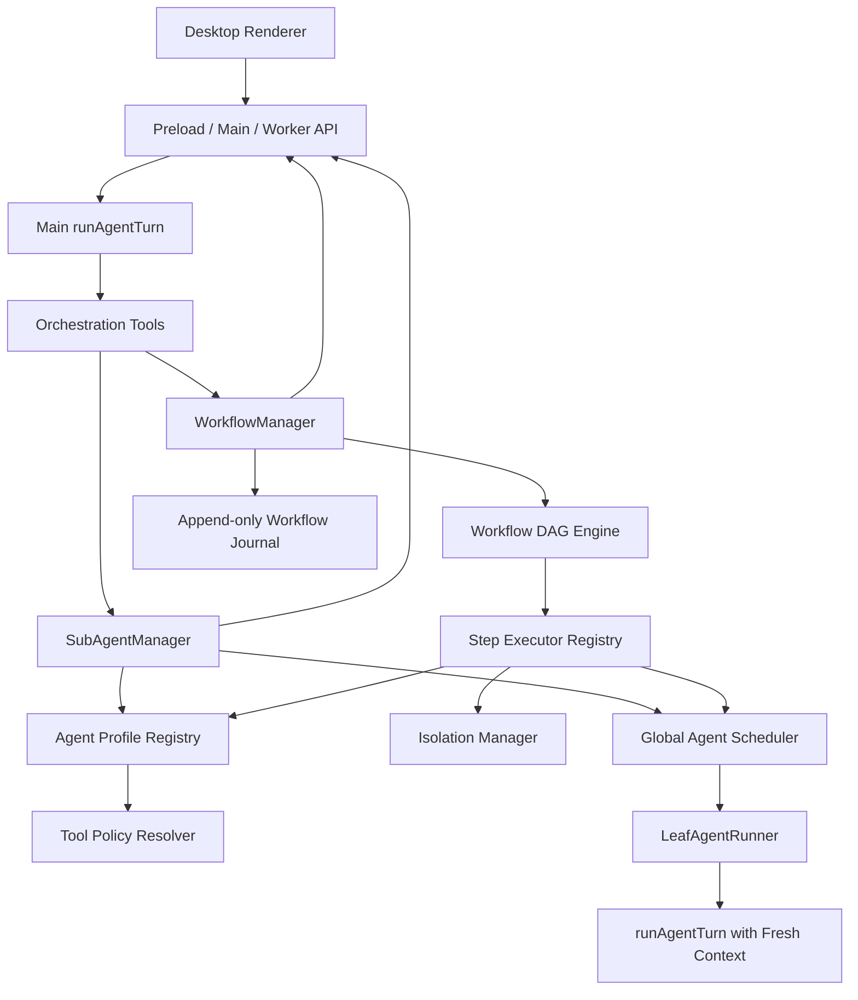
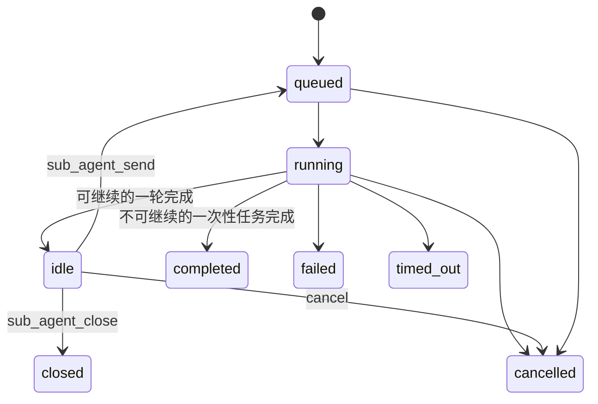

# Jojo Agent 子 Agent 与 Workflow 统一技术设计及优化路线图

> 文档状态：2026-08-16 统一整理版  
> 适用仓库：`zxt6991-source/jojo-agent`  
> 代码基线：当前工作区实现；当文档与代码冲突时，以 Contracts、Runtime 和自动化测试为准  
> 整合来源：`subagent-workflow-technical-design.md`、`subagent-workflow-optimization-plan-v2.md`、`subagent-workflow-optimization-roadmap.md`  
> 文档定位：作为后续子 Agent 与 Workflow 设计、实施和验收的统一入口；三份来源文档保留为历史设计记录

---

## 1. 结论先行

Jojo Agent 已经完成了 Phase 5 的核心闭环，不再处于“需要从零实现 Workflow Runtime”的阶段。

当前基础可以概括为：

```text
Main Agent
   ├── 后台 Sub-Agent
   │     ├── Profile Registry
   │     ├── Tool Policy
   │     ├── Continue / Send / Close
   │     └── Structured Output
   │
   └── 可恢复 Workflow DAG
         ├── 并发与依赖调度
         ├── Timeout / Cancel / Error Propagation
         ├── JSONL Journal / Restore / Resume
         └── WorkflowCard 可观察界面
```

后续不应重写现有 Engine，也不应把 Workflow 改造成 Ruby、JavaScript 或其他任意脚本驱动模式。推荐继续强化以下产品定位：

```text
Typed Declarative Multi-Agent Workflow Runtime

= 声明式 DAG
+ 类型化 Contract
+ 确定性调度
+ 强制权限边界
+ 结构化数据流
+ 可恢复执行
+ Worktree 隔离
+ 桌面可视化
```

从当前实现出发，后续优化顺序应调整为：

```text
基线收口与 E2E（进行中）
  ↓
User / Project Profile 加载 ✅
  ↓
Workflow Agent Options ✅
  ↓
Typed Inputs / Step Reference ✅
  ↓
Retry Policy ✅
  ↓
Worktree Isolation / Diff Review ✅
  ↓
Step Executor / Tool Step ✅
  ↓
Saved Workflow / Args / Templates ✅
  ↓
foreach ✅
  ↓
condition / sub-workflow ✅
  ↓
Concurrency Group ✅
  ↓
Electron Worker 写 Agent E2E ✅
  ↓
Budget / Provider Semaphore ✅
  ↓
DAG Viewer / Timeline ✅
  ↓
可视化编辑器 / 窗口级 E2E
```

其中近期最高优先级不是新增更多 Step 类型，而是：

1. 把当前已实现能力通过完整测试和 E2E 收口；
2. 让 Workflow 从“自然语言结果拼接器”升级为结构化数据流；
3. 在开放并行写入前完成 Worktree 隔离和可审查的 Branch / Diff 生命周期。 ✅ 运行时隔离、Diff 审查、不自动 Merge、Concurrency Group 与 Electron Worker 写 Agent E2E 已落地。

下一主路径不是 pipeline。DAG Viewer / Timeline 已落地；可视化编辑器和窗口级 Playwright 仍不做。不要把 pipeline 标成已完成。

---

## 2. 三份来源文档的合并规则

三份文档反映了不同时间点，直接拼接会产生相互矛盾的状态描述。

| 来源 | 原始定位 | 继续保留的价值 | 已被覆盖的内容 |
|---|---|---|---|
| `subagent-workflow-technical-design.md` | Phase 5 从零落地方案 | 架构边界、安全原则、生命周期、Manager/Engine 分层 | 大量“尚未实现”的任务状态 |
| `subagent-workflow-optimization-plan-v2.md` | Workflow Runtime 与后续阶段计划 | 详细验收标准、Exit Gate、Release Gate | “Workflow Runtime 是下一步”的旧判断 |
| `subagent-workflow-optimization-roadmap.md` | 基于较新代码的增量 Roadmap | Profile、Tool Policy、Continue、Structured Output、Workflow V2、Worktree 路线 | 文末部分“立即开始 Profile 基础”的旧行动项 |

本统一文档按以下优先级消解冲突：

```text
当前代码与测试
  > 后期文档的实现状态
  > 早期文档的规划状态
```

因此：

- Workflow Engine、Manager、DAG、Journal、Resume 和基础 UI 视为已有能力；
- Built-in Profile、Tool Policy、`sub_agent_send/close` 和 Structured Output 视为当前工作区已实现能力；
- 自定义 Profile 加载、Typed Inputs、Retry、Worktree Isolation、StepExecutor/Tool Step、Saved Workflow、foreach、condition、sub-workflow、Concurrency Group、Budget / Provider Semaphore 与 DAG Viewer / Timeline 已实现；pipeline / 可视化编辑器仍视为待实现；
- 旧文档中的未完成复选框不能单独作为当前状态依据。

---

## 3. 目标、范围与非目标

### 3.1 目标

统一 Runtime 需要稳定支持：

- 主 Agent 并行委派多个独立任务；
- 子 Agent 使用独立上下文、独立 Usage 和独立生命周期；
- 权限、工具、模型和隔离策略由 Runtime 强制执行；
- Workflow 使用可静态验证的声明式 DAG；
- Workflow 支持并发、依赖、取消、超时、失败定位、持久化和恢复；
- Agent 间数据逐步使用结构化输出和显式引用传递；
- 可写 Agent 在独立 Worktree 中执行，结果通过 Branch / Diff 审查；
- UI 能展示节点状态、耗时、Usage、错误、重试和隔离结果。

### 3.2 当前阶段非目标

以下能力不进入近期主路径：

- 任意 Ruby / JavaScript / TypeScript Workflow 脚本；
- `eval`、`new Function` 或任意表达式执行；
- 无限层递归 Sub-Agent；
- 多个可写 Agent 直接共享主工作目录；
- 默认自动合并子 Agent 分支；
- 第一轮同时实现 condition、foreach、pipeline、human、HTTP、sub-workflow 等所有 Step 类型；
- 分布式 Agent 调度。

---

## 4. 核心设计原则

### 4.1 Agent Core 保持单一

父 Agent、手动 Sub-Agent 和 Workflow Agent Step 都复用 `runAgentTurn()`。

```text
Parent runAgentTurn
        │
        ├── SubAgentManager ──┐
        │                     ├── LeafAgentRunner ── runAgentTurn(fresh context)
        └── WorkflowEngine ───┘
```

`agent-core` 只负责 Agent Loop，不承载 Sub-Agent 生命周期、Workflow DAG 或持久化。

### 4.2 后台 Handle 实现并行

普通 Tool Call 仍可保持串行。`sub_agent_start` 和 `workflow_start` 只登记后台任务并立即返回 ID，真正的 Agent Loop 在后台并行执行。

推荐调用模式：

```text
start A → sa_a
start B → sa_b
start C → sa_c
wait [sa_a, sa_b, sa_c]
```

不应为了 Sub-Agent 并行而修改所有 Tool 的全局执行语义。

### 4.3 Fresh Context 默认隔离

新子 Agent 默认使用：

```ts
history: []
```

委派任务必须是自包含描述。父对话中的必要背景应显式写入 `task`，不能默认复制整个父历史。

Continuation 只复用该子 Agent 自己的历史，不复用父上下文。

### 4.4 只允许一层 Sub-Agent

结构保持：

```text
Main
 ├── Child A
 ├── Child B
 └── Child C
```

禁止：

```text
Main → Child → Grandchild
```

该约束必须同时由 Tool Set 和 Manager 的 `depth` 校验保证，不能只依赖 Prompt。

### 4.5 权限只能收紧，不能隐式放宽

有效权限计算：

```text
全局可用工具
  ∩ Profile allow
  ∩ Request allow
  - Profile deny
  - Request deny
  - readOnly 写工具集合
```

其中：

- `deny` 优先级最高；
- Request 只能比 Profile 更严格；
- `readOnly=true` 必须在 Runtime 层移除写工具；
- 子 Agent 不获得 `sub_agent_*` 和 `workflow_*`；
- 后台 Agent 不发起交互式审批；对已通过路径校验的 `write_file` / `edit_file` / `delete_file` / `terminal`，`ask` 转为 `allow`，其余 `ask` 仍拒绝。

### 4.6 Workflow 保持声明式 DAG

Workflow 的优势应是：

```text
可验证、可预测、可视化、可恢复、可审计
```

控制流扩展应采用有限、类型化、可静态验证的语法，而不是引入任意代码执行。

### 4.7 所有并发统一进入全局 Scheduler

有效 Agent 并发为：

```text
min(
  workflow.maxConcurrency,
  global AgentExecutionScheduler limit,
  resource-group limit,
  future provider-specific limit
)
```

手动 Sub-Agent 和 Workflow Step 不应维护两套互不感知的 Provider 并发池。

---

## 5. 当前实现基线

本节基于当前工作区的 Contracts、Runtime、Tools、UI 和测试文件整理。

### 5.1 Sub-Agent

#### 已实现

- `SubAgentManager`；
- `AgentExecutionScheduler`；
- `sub_agent_start`；
- `sub_agent_wait`；
- `sub_agent_status`；
- `sub_agent_cancel`；
- `sub_agent_send`；
- `sub_agent_close`；
- 后台启动和批量等待；
- `queued/running/idle/completed/failed/cancelled/timed_out/closed` 状态；
- Fresh Context；
- 单层递归限制；
- 独立 Usage；
- Timeout 和 Abort；
- 多轮 Round History；
- Continuation Context；
- Structured Output 与 JSON Schema 校验；
- `INCOMPLETE` 传播；
- Profile/Request 两层 Tool Policy；
- 非交互式 Permission Gate。

#### 内置 Profile

| Profile | 用途 | 默认工具策略 | 当前说明 |
|---|---|---|---|
| `explore` | 搜索、阅读和解释代码 | 只读文件与 Web 工具 | 适合并行调查 |
| `code-review` | 缺陷、安全和可维护性审查 | 只读文件工具 | 不修改工作区 |
| `synthesize` | 汇总依赖结果 | 无工具 | 只使用提供的证据 |
| `general` | 通用工程任务 | 非只读 Profile | 可写任务默认强制 `isolation: worktree`，结果不自动 Merge |

#### 当前限制

- User/Project Profile 已支持基础加载，但尚无桌面管理和诊断界面；
- Continuation 保存在 Worker 内存中，进程重启后不可恢复；
- 子 Agent Snapshot 本身未做持久化；
- 子 Agent 的完整桌面可视化不如 WorkflowCard 完整；
- Profile 加载警告尚未进入桌面可观察界面；
- 仍需补充长时间运行、Retention、Context 上限和资源回收 E2E。

### 5.2 Workflow

#### 已实现

- `WorkflowDefinitionSchema`，当前为 `schemaVersion: 1`；
- 第一种 Step：`type: agent`；
- `WorkflowEngine` 与 `WorkflowManager`；
- `workflow_start`；
- `workflow_wait`；
- `workflow_status`；
- `workflow_cancel`；
- `workflow_resume`；
- JSON/YAML Definition 解析；
- 重复 ID、未知依赖、自依赖和环检测；
- `dependsOn`；
- `continueOnError`；
- `maxConcurrency`；
- Step Timeout 和 Workflow Timeout；
- blocked 和 deadlock 处理；
- 全局 Scheduler 共享；
- Step/Workflow Usage；
- Step Structured Output；
- Step 级 `model/maxIterations/tools/readOnly` 与 Profile/Model UI 展示 ✅；
- Workflow Args、显式 `inputs.valueFrom` 和受限 Step Reference ✅；
- Agent Step `isolation` 与 Worktree Isolation Snapshot ✅；
- 结果截断与不完整标记；
- Append-only Journal；
- Restore、interrupted 和 Resume；
- Definition Hash 一致性检查；
- 已完成 Step 在 Resume 时不重复运行；
- WorkflowCard 的状态、进度、耗时、Usage、错误、输出、取消、恢复、Attempt 与 Isolation Diff。

#### 当前限制

- Workflow Step 支持 `agent` 与 allowlist `tool`；Engine 通过 StepExecutor 执行，Tool Step 不占用 LLM Scheduler；
- V1 Step 仍通过 Prompt 拼接依赖；显式 Inputs Step 已改为受限结构化注入；
- 未声明 Inputs 的 V1 Step 仍使用依赖 Prompt 拼接；声明 Inputs 的 Step 已使用显式数据注入；
- ✅ Workflow Agent Step 已支持有界、白名单驱动的自动 Retry Policy；
- ✅ Workflow Args 支持受限运行时值，Saved Workflow 可声明 Input Definition（string/number/boolean、required/default）；
- ✅ Saved Workflow Registry：project `.jojo/workflows` > user `~/.jojo/workflows` > builtin，支持 Reload；
- ✅ 内置模板：`repo-understand`、`architecture-review`、`code-review`；`workflow_start({ name, args })` 与 `workflow_list`；
- ✅ Tool Step：只允许 `read_file | list_files | grep | glob | web_search | web_fetch`，权限继续生效，输出可进入 Typed Inputs；无任意 Shell；
- ✅ foreach：Virtual Step Instance、itemLimit、continueOnError、双重限流、Resume 跳过已完成实例、输出按 index 顺序；
- ✅ condition：`equals` / `notEquals` / `exists`，未走分支为 `skipped`，join 在 skipped+completed 时仍执行，无 eval；
- ✅ sub-workflow：按 name 调用 Saved Workflow，`maxWorkflowDepth = 3`（含 root），嵌套走 Engine 内 `run()`，Resume 保留 child snapshot；
- ✅ Concurrency Group：同名 `resources.group` 受 `maxConcurrency` 限制，Sub-Agent 与 Workflow 共用一个 limiter；不同 group / 独立 Worktree 可并行；
- ✅ Worktree Isolation：可写 Agent 默认独立 Worktree，无修改自动清理，有修改保留 Branch/Diff 且不自动 Merge；
- ✅ Budget / Provider Semaphore：启动前 Token/USD 检查；同 Provider 可限流；
- ✅ WorkflowCard 依赖图 + 时间线：snapshot 携带 `dependsOn`，节点展示 state/duration/tokens/errorCode，详情含结构化输出与 Diff；
- 不是可视化编辑器；Step 级 Logs / Tool Calls 列表仍未进入 snapshot。

### 5.3 状态总表

| 能力 | 状态 | 下一动作 |
|---|---|---|
| 后台只读 Sub-Agent | 已实现 | 补 E2E 与资源回收验证 |
| Profile Registry | Built-in/User/Project 与 Reload 已实现 ✅ | 增加桌面列表和加载警告展示 |
| Tool Policy | 已实现 | 补越权、未知工具和自定义 Profile 安全测试 |
| Model Override | Sub-Agent 与 Workflow Step 已实现，UI 可展示 ✅ | 后续补 Provider 级成本统计 |
| Agent Continue / Round | 已实现 | 补 Retention、Context 上限和重启语义 |
| Structured Output | 已与 Typed Inputs 打通 ✅ | WorkflowCard 已展示 structuredResult；后续可补更丰富的查看器 |
| Workflow DAG Runtime | 已实现，Engine 只负责 DAG/状态/调度/取消/Timeout/Retry ✅ | 不重写；condition/sub-workflow 已接入，后续不把 pipeline 塞进 Engine |
| Workflow UI | 基础卡片 + 依赖图 + 时间线 + Attempt/Isolation Diff/foreach/condition/child/budget ✅ | 可视化编辑器与 Step Logs/Tool Calls 仍不做 |
| Journal / Resume | 已实现 | 补真实崩溃恢复 E2E |
| Custom Profile | 基础加载已实现 ✅ | 增加 UI、诊断与更多安全 E2E |
| Typed Inputs / Reference | Args、显式引用与 V1/V2 Prompt 路径已实现 ✅ | 后续扩展声明式 Input Definition |
| Retry Policy | Step 级白名单重试、Backoff、Attempt Journal/Usage/Resume 与 UI 已实现 ✅ | 时间线已能看到 attempt 对应的耗时 |
| Worktree Isolation | Isolation Manager、强制可写隔离、Branch/Diff/DiffStat、Cleanup 与 UI 已实现 ✅ | Electron Worker 写 Agent E2E 已补；窗口级 Playwright 仍不做 |
| Concurrency Group | `resources.group` + 全局 ResourceGroupLimiter，同组限流、异组并行、与 Scheduler / Provider Semaphore 叠加 ✅ | 不默认把可写 Agent 绑到 main-worktree-writer |
| Budget / Provider Semaphore | 启动前 Token/USD 预算与按 Provider 限流已实现 ✅ | 不中断已启动的 Step；主工作树直写互斥仍不做 |
| Saved Workflow / Args | Registry、Input Definition、三个内置模板、Reload 与 `workflow_start({ name, args })` 已实现 ✅ | 后续可补保存到磁盘的 GUI 与更多模板 |
| Tool / Control Step | Agent + allowlist Tool Step、condition、sub-workflow 已实现 ✅ | 不开放任意 Shell；pipeline / human / HTTP 仍不做 |
| foreach | Virtual instances、itemLimit、双重限流、Resume 与 UI 已实现 ✅ | 保持现有语义，不摊平进 snapshot.steps |
| condition | equals/notEquals/exists、skipped 级联、join 可运行、Resume 保留 skipped ✅ | 不增加 eval / Function / 额外运算符 |
| sub-workflow | 按 name 调用 Saved Workflow、depth≤3、Engine 内递归、child snapshot Resume ✅ | 不支持 inline nested definition，不走 WorkflowManager |

---

## 6. 目标架构



职责边界：

| 层 | 负责 | 不负责 |
|---|---|---|
| `agent-core` | 单次 Agent Loop、Tool Call、Context、Usage、Abort | Sub-Agent Manager、DAG、Journal |
| `orchestration/subagent` | Profile、Policy、子 Agent 生命周期、Round、Continuation | Electron UI、JSONL 文件格式 |
| `orchestration/workflow` | DAG、Step 状态、依赖、Retry、数据引用、恢复语义 | Provider 配置 UI |
| `orchestration/isolation` | Worktree、Branch、Diff、Cleanup | 自动 Merge 决策 |
| `storage/persistence` | Append-only Journal、恢复读取、大小限制 | Workflow 调度 |
| Desktop Worker | 依赖注入、Provider、Tool Runtime、共享 Scheduler | 业务规则复制 |
| Renderer | 展示状态和发起显式操作 | 推导运行真相 |

---

## 7. Sub-Agent 统一设计

### 7.1 生命周期



语义：

- `idle` 表示当前无任务但上下文可继续；
- `completed` 表示一次性任务已永久完成；
- `closed` 表示 Continuation Context 已释放；
- busy 状态调用 `send/close` 返回稳定错误，不在第一版排队消息；
- `cancel` 应保持幂等。

### 7.2 Profile 合并顺序

目标来源层级：

```text
project .jojo/agents
  > user ~/.jojo/agents
  > builtin
```

建议 Profile 定义：

```ts
type AgentProfileDefinition = {
  name: string;
  description: string;
  systemPrompt: string;
  source: 'builtin' | 'user' | 'project';
  readOnly: boolean;
  allowedTools?: string[];
  deniedTools?: string[];
  model?: string;
  maxIterations?: number;
  timeoutMs?: number;
  outputSchema?: Record<string, unknown>;
};
```

项目 Profile 只能覆盖行为默认值，不能扩大应用全局权限，也不能获得 orchestration tools。

### 7.3 Structured Output

执行链：

```text
outputSchema
  ↓ schema size/depth/node validation
Agent Prompt Constraint
  ↓
Final Text
  ↓ JSON parse
JSON Schema validation
  ├── success → structuredResult + schemaValid=true
  └── failure → stable error code + failed/incomplete
```

非法 JSON 或 Schema 不匹配不得以成功状态进入 Workflow 下游。

### 7.4 Usage 与不完整结果

```text
Sub-Agent Total Usage = Σ Round Usage
Workflow Total Usage  = Σ Step Usage
Session Total Usage   = Parent + Manual Sub-Agents + Workflow
```

以下情况必须传播 `incomplete=true`：

- `max_iterations`；
- `length/max_tokens`；
- Timeout；
- Cancel；
- 输出截断；
- Structured Output 校验失败；
- Workflow 包含未完成或被阻塞 Step。

### 7.5 子 Agent 持久化边界

近期仍保持：

- Workflow 持久化；
- 普通 Sub-Agent 和 Continuation 暂时仅内存保留。

在加入 Sub-Agent 持久化前，应先明确：

- Provider/Model 变化后的恢复语义；
- Tool 执行历史是否保存；
- Context 压缩和敏感数据策略；
- Idle Agent 的 TTL 与最大保留数；
- App 重启后是恢复、标记 expired，还是明确关闭。

---

## 8. Workflow 统一设计

### 8.1 当前 V1 Contract

```yaml
schemaVersion: 1
name: repo-analysis
maxConcurrency: 3
timeoutMs: 600000

steps:
  - id: inspect-core
    type: agent
    profile: explore
    task: 分析 packages/agent-core

  - id: inspect-storage
    type: agent
    profile: explore
    task: 分析 packages/storage

  - id: summary
    type: agent
    profile: synthesize
    dependsOn:
      - inspect-core
      - inspect-storage
    task: 汇总模块关系、风险和建议

outputStepId: summary
```

V1 继续兼容，不因后续扩展立即废弃。

### 8.2 DAG 调度

基础 Step 状态：

```text
pending → queued → running
                    ├── completed
                    ├── failed
                    ├── timed_out
                    ├── cancelled
                    └── interrupted

pending ── dependency failure ──> blocked
```

调度规则：

1. Definition 在运行前完成重复 ID、未知依赖、自依赖和环检测；
2. 所有依赖满足的 Step 才能进入 ready；
3. ready Step 同时受 Workflow 并发和全局 Scheduler 限制；
4. 依赖失败且不允许继续时，下游进入 `blocked`；
5. 无 running、无 ready、仍有未终止节点时报告 deadlock；
6. Cancel 或 Timeout 后不再启动新 Step，并向运行中 Step 传播 AbortSignal。

### 8.3 `continueOnError` 语义

当前语义以失败依赖自身的 `continueOnError` 为准。后续扩展时必须避免同时引入另一套“下游忽略失败”字段，防止语义歧义。

建议继续保持：

```text
Step A continueOnError=true
  → A 失败不会阻止依赖 A 的后续 Step
```

下游 Prompt/Input 必须携带 A 的失败状态，而不能把失败当作成功输出。

### 8.4 Prompt 与依赖注入

V1 兼容路径：

```text
task + dependency summaries
```

必须继续限制：

- 单个依赖输出长度；
- 总依赖注入长度；
- 截断标记；
- failed/blocked/incomplete 来源标记；
- 无输出依赖的安全处理。

显式 Inputs 路径（已实现）：

```yaml
inputs:
  findings:
    valueFrom: $steps.inspect.structuredResult.findings
  target:
    valueFrom: $workflow.args.target
```

V2 只注入 Step 显式声明的 Inputs，不再无条件拼接所有上游全文。

### 8.5 Retry

建议 Contract：

```yaml
retry:
  maxAttempts: 3
  backoffMs: 1000
  retryOn:
    - provider_timeout
    - provider_error
```

默认不可重试：

- `invalid_profile`；
- `output_schema_invalid`；
- `permission_denied`；
- `workflow_deadlock`；
- `workflow_reference_invalid`。

Journal 需要记录每次 attempt，Resume 后不能丢失累计 Usage。

### 8.6 Journal 与恢复

继续采用 Append-only JSONL：

```text
workflow.started
workflow.updated
step.started
step.completed / failed / timed_out / cancelled / blocked
workflow.completed / failed / timed_out / cancelled / interrupted
workflow.log
```

恢复规则：

- `completed` Step 不重跑；
- 崩溃时的 `queued/running` Step 转为 `interrupted`；
- Resume 后 interrupted/failed/pending Step 进入新 attempt；
- Definition Hash 不一致时拒绝 Resume；
- 已产生 Usage 保留，新 attempt Usage 累加；
- Journal 尾部半条 JSON 不影响前面的完整记录；
- Persistence 失败不能静默忽略。

### 8.7 Workflow 生命周期

| 场景 | 预期行为 |
|---|---|
| 父 Turn 正常完成 | Workflow 可继续后台运行 |
| 用户停止本轮 | 当前 Turn 的 wait 退出；是否取消 Workflow 由显式操作决定 |
| 用户点击 Workflow Cancel | 向所有 queued/running Step 传播取消 |
| Session 删除 | 先 cancelSession 并等待 quiescent，再删除持久化数据 |
| App 正常退出 | 停止新任务，尽力刷完 Journal，未完成 Run 下次恢复为 interrupted |
| Worker Crash | Journal 恢复最后完整状态，运行中 Step 标记 interrupted |

---

## 9. 安全边界

### 9.1 Tool Permission

- Tool 是否可用必须由 Runtime 决定；
- Prompt 中的“不要写文件”不能替代工具过滤；
- Unknown Tool 默认拒绝；
- 自定义 Profile 不得添加应用未提供的 Tool；
- Workflow Step 不能通过参数突破 Profile 限制。

### 9.2 Working Directory

- 所有路径必须 canonicalize；
- 拒绝通过 `..`、软链接或未解析变量跳出允许根目录；
- Worktree Agent 的允许根目录必须切换到对应 Worktree；
- Cleanup 只能操作 Runtime 自己创建且记录过的路径。

### 9.3 Workflow Definition

- Definition 必须在运行前完成 Schema 和 DAG 校验；
- 禁止 `eval`、任意 Shell 插值和任意 JavaScript Expression；
- YAML 禁止 Alias Expansion；
- Definition、Step 数、依赖数、Input 和输出均设置硬上限。

### 9.4 可写 Agent

- 可写 Sub-Agent / Workflow Step 默认强制独立 Worktree；显式 `isolation: none` 被拒绝；
- 不自动 Merge；
- 返回 Branch、Changed Files、DiffStat 和可审查 Diff；
- 用户明确批准后才进入合并流程。

---

## 10. 后续优化路线

### Phase A：基线收口与可靠性验证

目标：把当前工作区已有能力从“Implemented”推进到“Done”。

#### 工作项

- ✅ 固化 Contracts、Profile、Tool Policy、Continue 和 Structured Output 的回归测试；
- ✅ 已有 `A/B/C → D` Workflow 确定性集成测试；Electron Worker 写 Agent E2E 已补（真实 `write_file` + Worktree + WorkflowCard）；窗口级 Playwright 仍不做；
- ✅ queued/running Cancel 自动化测试；
- ✅ Step/Workflow Timeout 自动化测试；
- ✅ failed dependency / blocked 自动化测试；
- ✅ 使用真实 JSONL Store 的进程重启式 Resume 集成测试；
- ✅ 验证 `sub_agent_send → idle → send → close` 的 Context、Usage 和资源回收；
- ✅ Session 删除采用带回执的 `stop → parent turn quiescent → sub-agent/workflow quiescent → persistence flush → delete` 协议；
- ✅ 全仓 `typecheck/lint/test` 通过（2026-08-16：32 个测试文件、242 项测试）；生产 Vite Bundle 通过；Electron Maker 制品封装连续数分钟无进度后被停止，停止时 pnpm 报告 `spawn ENOENT`，待单独排查环境问题；
- ✅ 后续实现状态统一维护在本文件。

#### Exit Gate

- ✅ 核心单元测试全部通过；
- [ ] 关键 Workflow E2E 全部通过；
- [ ] 无 Promise、AbortController、Timer 和 Continuation 泄漏；
- ✅ Session 删除会等待 Worker 与持久化静默，不再先删后写；
- ✅ 当前工作区所有新增能力通过 Typecheck、Lint、Test 和 Build；
- ✅ UI 使用单调 Revision，旧状态覆盖已有自动化测试。

### Phase B：可扩展 Profile 与 Workflow 数据契约

目标：让专业 Agent 可配置，并让 Workflow 从全文 Prompt 串接升级为显式数据流。

#### B1. User / Project Profile Loader ✅

支持：

```text
~/.jojo/agents/*.md
.jojo/agents/*.md
```

已完成：

- ✅ Frontmatter Schema、文件大小、数量和命名约束校验；
- ✅ Built-in/User/Project 来源和 `Project > User > Built-in` 覆盖规则；
- ✅ 单个损坏文件隔离，不影响其他 Profile；
- ✅ Reload 使用防御性副本，不影响已运行 Agent；
- ✅ 新 Turn 与 Workflow Resume 使用最新 Profile；
- ✅ Project Profile 仍受 Runtime Tool Set、Tool Policy 和非交互式 Permission Gate 限制；
- ✅ Registry `get/list()` 返回来源与来源路径；
- ✅ `~/.jojo/agents/*.md` 与项目 `.jojo/agents/*.md` 加载；
- ✅ Loader、覆盖、Reload、坏文件隔离自动化测试。

#### B2. Workflow Agent Options ✅

Agent Step 已增加：

```yaml
model: inherit
maxIterations: 8
readOnly: true
tools:
  allow: [read_file, grep, glob]
  deny: [terminal]
outputSchema: {}
```

已完成：

- ✅ `model` 支持指定已配置模型或使用 `inherit`；
- ✅ `maxIterations` 限制为 1～20，并进入实际 Runner Request；
- ✅ `tools.allow/deny` 进入统一 Tool Policy Resolver；
- ✅ `readOnly` 只能进一步收紧 Profile 权限；
- ✅ Snapshot 保存 Profile、请求模型与 Runner 实际选择模型；
- ✅ Resume 为旧 Snapshot 补齐 Profile/Model，同时保持已完成 Step 不重跑；
- ✅ Workflow Tool JSON Schema 已暴露全部 Agent Options；
- ✅ WorkflowCard 展示 Step Profile 与实际 Model；
- ✅ 保持 `schemaVersion: 1` 向后兼容；
- ✅ Contract、Engine、Resume 和 UI 自动化测试。

#### B3. Typed Inputs 与 Step Reference ✅

第一版已支持有限路径引用：

```text
$workflow.args.<name>
$steps.<stepId>.output
$steps.<stepId>.structuredResult.<path>
```

已完成：

- ✅ 只支持 `$workflow.args`、直接依赖的 raw output 与 structuredResult 路径；
- ✅ Definition 阶段拒绝未知来源、非直接依赖和非法语法；
- ✅ Runtime 缺失与非法引用分别返回 `workflow_reference_not_found/invalid`；
- ✅ Args 限制类型、字段数和单值长度；Resolved Inputs 设置 64 KiB 上限；
- ✅ Structured Output 继续使用既有大小、深度、节点数和数组长度上限；
- ✅ 只向 Agent Prompt 注入声明的 Input，并明确按不可信数据处理；
- ✅ 显式 Inputs 不再拼接未声明的依赖全文；
- ✅ V1 Prompt Builder 保持兼容；
- ✅ Args 写入 Journal，Restore/Resume 保留同一运行参数；
- ✅ Contract、Reference Resolver、Engine、Tool、Persistence 和 Resume 测试。

#### B4. Retry Policy ✅

已在 Typed Inputs 稳定后加入：

- ✅ `maxAttempts` 限制为 1–5，避免无限重试；
- ✅ `backoffMs` 限制为 0–30 秒，默认 1 秒；
- ✅ `retryOn` 只接受 `step_timeout`、`provider_timeout`、`provider_error` 和 `output_schema_validation_failed`；
- ✅ 每个 Attempt 使用独立 Timeout/Abort Controller，失败 Usage 跨 Attempt 累计；
- ✅ Scheduler 令牌在 Backoff 前释放，避免重试等待占用全局执行槽；
- ✅ Journal 记录 `step.failed/timed_out → step.retrying → step.started`，Snapshot 保留单调递增 Attempt；
- ✅ Cancel/Workflow Timeout 可中断 Backoff，且不会启动下一次 Attempt；
- ✅ Resume 不重跑已完成 Step，失败 Step 延续 Attempt 编号和累计 Usage，并获得新的有界重试预算；
- ✅ WorkflowCard 在第 2 次及以后显示 Attempt；
- ✅ Contract、Engine、Timeout、Cancel、Scheduler、Usage、Resume、Journal 和 UI 测试。

#### Exit Gate

- ✅ 自定义 Profile 可安全加载和 Reload；
- ✅ 不同 Workflow Step 可选择不同已配置 Model；
- ✅ Step 权限不能突破 Profile，只能通过 Request Policy 收紧；
- ✅ 声明 Inputs 的下游只读取显式字段；
- ✅ 引用错误有稳定 Error Code；
- ✅ Retry 仅作用于明确可重试错误；
- ✅ V1 Workflow 无行为回归。

### Phase C：安全的 Writable Multi-Agent ✅

目标：允许多个 Coding Agent 并行修改，但不污染主工作区。

#### C1. Isolation Manager ✅

已新增：

```text
packages/orchestration/src/isolation/
├── types.ts
├── policy.ts
├── paths.ts
├── manager.ts
└── git-worktree.ts
```

接口已实现：

```text
prepare → isolated cwd / branch
inspect → changed files / diff stat / diff
finish  → 无修改则清理，有修改则保留审查结果
cleanup → 仅清理 Runtime 创建且登记过的路径
```

#### C2. Worktree 生命周期 ✅

```text
无修改
  → 自动清理临时 Worktree 和 Runtime 创建的临时 Branch

有修改
  → 保留 Branch 与 Worktree
  → 返回 Worktree、Branch、Changed Files、DiffStat、Diff
  → 等待审查
```

第一版不自动 Merge。

#### C3. `general` Profile 安全收口 ✅

- 可写任务默认要求 `isolation: worktree`；显式 `none` 返回 `isolation_required`；
- 非 Git 仓库返回 `worktree_not_a_git_repository`；
- Terminal 和文件写入继续经过 Permission/Capability，cwd 切换到 Worktree；
- 后台 Agent 对已通过路径校验的 Worktree 内写入/终端不再弹审批；越权路径仍 deny；
- Agent 不能写出 Worktree：工具层仍按工作目录 canonicalize；
- 失败和取消后产生的修改仍可审查；无修改则清理。

#### C4. Concurrency Group ✅

已增加资源组，为需要互斥的 Agent 提供独立于 LLM Scheduler 的限流：

```yaml
resources:
  group: main-worktree-writer
  maxConcurrency: 1
```

已落地：

- Agent Step、foreach agent template 与 `sub_agent_start` 可声明 `resources`；
- 同名 group 必须使用相同 `maxConcurrency`（定义期校验；运行时冲突为 `resource_group_conflict`）；
- 默认 `maxConcurrency = 1`，最大 4；
- 先拿 resource group，再拿 Provider Semaphore，再拿 `AgentExecutionScheduler`；
- Sub-Agent 与 Workflow 共用同一个 `ResourceGroupLimiter`；
- 不同 group 可并行；未声明 resources 的独立 Worktree 写 Agent 仍可并行；
- 不自动把可写 Agent 绑到 `main-worktree-writer`（它们已经强制 Worktree）；
- 取消等待 group 的 Step 不会启动 runner。

主工作树直写互斥仍随 `isolation: none` 一起不做。

#### Exit Gate

- ✅ 至少三个写 Agent 可在独立 Worktree 并行（自动化测试 + Electron Worker 真实 `write_file` E2E）；
- ✅ 主工作区和 Git Index 保持不变；
- ✅ 同文件修改不会发生直接文件系统覆盖；
- ✅ Branch、Changed Files、DiffStat 和完整 Diff 可查看；
- ✅ Cancel/Failure/Cleanup 无路径逃逸或误删；
- ✅ 不自动 Merge；
- ✅ 非 Git 仓库行为明确且测试覆盖；
- ✅ 同名 resource group 串行，异组并行；
- ✅ Sub-Agent 与 Workflow 共用 limiter；
- ✅ 同组 maxConcurrency 冲突有稳定错误码。

### Phase D：可复用 Workflow 与执行器扩展

目标：在数据契约和隔离稳定后，提高 Workflow 的复用性和非 LLM 执行效率。

#### D1. StepExecutor 抽象 ✅

将 `engine.ts` 逐步拆为：

```text
workflow/
├── engine.ts
├── scheduler.ts
├── retry.ts
├── data/
│   ├── references.ts
│   └── inputs.ts
└── executors/
    ├── types.ts
    ├── agent-step.ts
    └── tool-step.ts
```

Engine 只负责状态机、依赖、调度、取消、Timeout 和 Retry；具体 Step 执行由 Executor 负责。 ✅

#### D2. Tool Step ✅

很多确定性操作不应经过 LLM：

```yaml
- id: files
  type: tool
  tool: list_files
  input: { path: . }
```

已落地：

- 只能调用 Workflow 允许且 Runtime 注册的 Tool（`read_file | list_files | grep | glob | web_search | web_fetch`）；
- Tool Capability 和 Permission 继续生效；
- 第一版不直接把任意 Shell 暴露为 Workflow Step；
- Tool 输出可以进入 Structured Input Reference；
- Tool Step 受 Workflow `maxConcurrency` 限制，但不占用全局 LLM Scheduler。

#### D3. Saved Workflow / Args / Templates ✅

来源层级：

```text
project .jojo/workflows
  > user ~/.jojo/workflows
  > builtin
```

已落地：

- `workflow_start({ name, args })` 与 `workflow_list`；
- string/number/boolean 等有限类型 Args；
- required/default 校验，类型错误在执行前失败；
- Agent Task 仅支持 `{{inputs.xxx}}`，Step 数据流继续使用 `$workflow.args` / `$steps...`；
- Reload；同名覆盖 project > user > builtin；单个坏文件不影响其他定义；
- 内置模板 `repo-understand`、`architecture-review`、`code-review` 只使用只读 Profile 与 allowlist Tool，不能获得额外权限；
- Resume 使用启动时冻结的 Definition Snapshot，并再次校验 Args 与 Input Definition。

#### Exit Gate

- [x] Agent 和 Tool Step 使用统一状态、日志、Usage 和取消协议；
- [x] Saved Workflow 可发现、校验、运行和 Reload；
- [x] Args 类型错误在执行前失败；
- [x] 模板不能获得额外权限；
- [x] Resume 能验证 Definition 与 Args 一致性。

### Phase E：高级声明式编排与可观察性

建议顺序：

```text
foreach
  ↓
condition
  ↓
sub-workflow
  ↓
budget / provider semaphore / cost ✅
  ↓
DAG viewer / timeline ✅
  ↓
pipeline
  ↓
visual editor
```

#### foreach

已落地：

- 静态 DAG 上使用 `type: foreach`，不改写 definition；
- Virtual Step Instance 挂在父 Step `instances` 上，不摊平进 `snapshot.steps`；
- `items.valueFrom` 必须是直接依赖的 `$steps.<id>.structuredResult...` 数组；
- `itemLimit` 默认 8、最大 20，超出则 `foreach_item_limit`，不静默截断；
- 0 个 item 时父 Step 以 `structuredResult: []` 完成；
- `concurrency` 默认 2、最大 4，并受 workflow `maxConcurrency` 上限约束；父 Step 占用 1 个 workflow running slot；
- Agent 子实例仍走全局 `AgentExecutionScheduler`，Tool 子实例不占 LLM slot；
- template 只能是 agent 或 tool，禁止嵌套 foreach；`{{item}}` / `{{index}}` 在实例执行时插值；
- `continueOnError` 为 false 时停止启动后续 item，等待 in-flight 后父 Step 失败；为 true 时收齐后父 Step 完成；
- Retry 在 template 上，不在父 Step 上；
- Resume 原样保留已完成实例，其余带着存储的 `item` 重置为 pending；
- 父 Step `structuredResult` 按 index 顺序聚合，usage 为实例之和。

#### Exit Gate

- [x] 0/1/上限 items，超限失败且不截断；
- [x] 非数组 items 失败为 `foreach_items_invalid`；
- [x] 输出顺序固定，不受完成先后影响；
- [x] `continueOnError` 停止后续或收齐后完成；
- [x] Agent 实例走全局 Scheduler，Tool 实例不占 LLM slot；
- [x] Resume 跳过已完成实例并保留 stored item；
- [x] 下游可通过 `$steps.<foreach>.structuredResult.N` 引用。

#### condition

已落地：

- 静态 DAG 上使用 `type: condition`，不改写 definition；
- 只支持 `equals` / `notEquals` / `exists`，`.strict()`，无 eval / Function；
- `left` 使用 `{ valueFrom }`，`$steps.` 必须是直接依赖；
- `then` / `else` 必须存在、必须 `dependsOn` 该 condition、互斥、不能指向自身；
- 命中后 condition 以 `structuredResult: { matched }` 完成，未走分支的根节点标为 `skipped`；
- Skip cascade：pending 步在所有依赖已终态、至少一个 `skipped`、且没有 `completed` 时才跳过；join（skipped + completed）仍执行；
- `skipped` 是终态，不是失败，也不算 incomplete；Resume 原样保留；
- `exists` 缺字段为 false；`equals` / `notEquals` 缺字段失败为 `workflow_reference_not_found`；
- 不占 Agent Scheduler；condition 本身不 Retry。

#### Exit Gate

- [x] then/else 静态校验（存在、dependsOn、互斥）；
- [x] 拒绝 eval 等额外键；
- [x] then 链 cascade skip，join 仍运行；
- [x] `exists` 缺字段走 else，`equals` 缺字段失败；
- [x] Resume 保持 skipped，不重跑。

#### sub-workflow

已落地：

- 与递归 Sub-Agent 分开；只按 name 调用 Saved Workflow（project > user > builtin），禁止 inline nested definition；
- args 为字面量或 `{ valueFrom }`，解析后必须是 string/number/boolean，再走 `resolveWorkflowArgs`；
- `$steps.` 引用必须是直接依赖；
- `maxWorkflowDepth = 3`（含 root）。Root depth 默认 1；嵌套为 `depth + 1`；`depth > 3` 在启动子 run 前抛 `workflow_depth_exceeded`；
- 嵌套执行走 `WorkflowEngine.run()`，不走 WorkflowManager，不占 `maxPerSession`，不发第二张 workflow card；
- 子 request id 为 `${request.id}:${step.id}`；父 Step 占 1 个 workflow slot，子 Agent Step 共用同一 `AgentExecutionScheduler`；
- 完整 child `WorkflowRunSnapshot` 存在 `step.child`；父 usage = 子 usage，父 output = child.result；
- Resume：未完成的 workflow step 保持 pending 并克隆 `child`；嵌套 `run(..., child)` 走 `createResumedWorkflowSnapshot`，已完成子步跳过；
- 未知 name → `saved_workflow_not_found`；非法 args → `workflow_invalid_args`；子 run 非 success → 父 `workflow_step_failed`（timeout/cancel 除外）。

#### Exit Gate

- [x] 按 name 调用 Saved Workflow 并插值 args；
- [x] valueFrom 必须来自直接依赖；
- [x] 未知 name 与 depth 4 有稳定错误码；
- [x] Resume 不重跑已完成的 child steps。

#### Budget 与 Provider Semaphore

已落地：

```yaml
budget:
  maxInputTokens: 200000
  maxOutputTokens: 50000
  maxTotalTokens: 250000
  maxCostUsd: 2.0
  inputUsdPerMillion: 3
  outputUsdPerMillion: 15
```

Step 级（仅 Token）：

```yaml
budget:
  maxOutputTokens: 8000
```

- Workflow 与 Agent Step / foreach agent template 可声明 budget；`.strict()`，至少一项限额；`maxCostUsd` 必须同时给出费率；
- 在启动下一消耗 Token 的 Step（agent、foreach agent、nested workflow）前检查已累计 usage（含 in-flight）；不足则 `blocked` + `workflow_budget_exceeded`，不启动 runner、不占用 LLM slot；
- Tool / condition 不消耗预算，预算耗尽后仍可运行；
- 不中断已启动的 Step；超额后阻止后续 Step 与 Retry；
- USD 成本按 `(input+cacheRead)*inputUsdPerMillion + (output+cacheWrite)*outputUsdPerMillion` / 1e6；
- Resume 使用已累计 usage，剩余不足则继续 blocked；
- Provider Semaphore 按 `providerId` 独立限流，与 `min(workflow.maxConcurrency, AgentExecutionScheduler, resource-group)` 叠加；未配置的 Provider 不限流；
- 获取顺序：resource group → provider → LLM scheduler；Sub-Agent 与 Workflow 共用同一个 `ProviderSemaphore`。

#### Exit Gate

- [x] 启动前检查剩余 Token / USD，不足不启动下一消耗 Step；
- [x] 稳定错误码 `workflow_budget_exceeded`；
- [x] Retry 在预算耗尽后不再发起；
- [x] Resume 尊重已用额度；
- [x] 同 Provider 串行、异 Provider 可并行；Sub-Agent 与 Workflow 共用 semaphore；
- [x] WorkflowCard 展示预算剩余与错误码。

#### DAG UI

已落地运行时 Viewer，不是可视化编辑器：

- Step snapshot 携带 `dependsOn`（Resume / Journal 向后兼容，缺省视为无依赖）；
- WorkflowCard 默认「依赖图」：按最长路径分层，节点展示 state / duration / tokens / errorCode / worktree，边为 `dependsOn`；
- 「时间线」按 `startedAt`–`finishedAt` 相对 run origin 排列已开始的 Step；
- 点击节点或时间线条目会选中并展开对应 Step 列表项；
- 详情在原有 Output / Error / Diff 之上增加 Structured Output；
- foreach 实例与 nested child 仍挂在父节点详情里，不摊平进顶层图；
- 不做拖拽编辑、保存回 Definition，也不把 Logs / Tool Calls 写入 snapshot。

#### Exit Gate

- [x] 线性链与 fan-in/fan-out 分层正确；
- [x] 节点反映实时 state / duration / usage / errorCode；
- [x] 时间线只包含已开始的 Step；
- [x] Structured Output 可在详情中查看；
- [x] 可视化编辑器仍明确未做。

---

## 11. 推荐 PR 顺序

| PR | 内容 | 依赖 | 主要验收 |
|---|---|---|---|
| PR-00 | 当前能力收口与 E2E（部分完成） | 无 | ✅ 全仓 Gate、崩溃恢复、Cancel/Timeout、Electron Worker 写 Agent E2E；窗口级 Playwright 仍不做 |
| PR-01 | User/Project Profile Loader ✅ | PR-00 | ✅ 来源、覆盖、Reload、权限边界 |
| PR-02 | Workflow Agent Options ✅ | PR-00 | ✅ model/tools/readOnly/maxIterations、Snapshot、UI |
| PR-03 | Typed Inputs / Reference Resolver ✅ | PR-02 | ✅ 显式字段、Args、无 eval、Journal、V1 兼容 |
| PR-04 | Retry Policy ✅ | PR-03 | ✅ attempt、backoff、retryOn、Scheduler、Cancel、Usage、Journal、Resume、UI |
| PR-05 | Isolation Manager ✅ | PR-00 | ✅ Worktree 创建、边界和 Cleanup |
| PR-06 | Writable Agent / Branch / Diff ✅ | PR-05 | ✅ 主工作区不变、不自动 Merge、UI Diff |
| PR-07 | StepExecutor 拆分与 Tool Step ✅ | PR-03 | ✅ Engine 行为无回归、权限一致、Tool 不占 LLM slot |
| PR-08 | Saved Workflow / Args / Templates ✅ | PR-03、PR-07 | ✅ 发现、校验、Reload、参数化 |
| PR-09 | foreach ✅ | PR-04、PR-07 | ✅ 动态实例、限流、恢复 |
| PR-10 | condition / sub-workflow ✅ | PR-09 | ✅ 静态验证、深度限制、skipped |
| PR-11 | Budget / Provider Semaphore ✅ | PR-04、PR-06、C4 | ✅ 启动前预算；Provider 限流与 Group/Scheduler 叠加；写资源互斥已由 Concurrency Group 承担 |
| PR-12 | DAG Viewer / Timeline ✅ | 前述状态稳定 | ✅ 依赖图、时间线、错误/Usage/Diff/结构化输出；不是可视化编辑器 |

可并行关系：

```text
Profile Loader ───────────────┐
                              ├── Saved Workflow / Templates
Workflow Options → Inputs ────┘

Isolation Manager → Writable Agent

Inputs → Retry → foreach → condition/sub-workflow
```

---

## 12. 测试与 Release Gate

### 12.1 单元测试

Sub-Agent：

- start/queue/concurrency/wait/status；
- timeout/cancel/close；
- send/busy/closed；
- Round 与 Usage 累计；
- Profile 合并与 Reload；
- allow/deny/readOnly；
- Structured Output 边界；
- retention 和 continuation cleanup。

Workflow：

- 线性 `A → B → C`；
- fan-out；
- fan-in `A/B/C → D`；
- failed dependency → blocked；
- `continueOnError`；
- cycle、unknown dependency 和 deadlock；
- cancel/timeout；
- retry success/exhausted；
- typed reference valid/missing/type mismatch；
- tool step allowlist / permission_denied / 不占用 LLM Scheduler；
- saved workflow 发现/覆盖/Reload/args 校验/resume 一致性；
- resume 后 completed 不重跑；
- Worktree failure/cleanup；
- foreach 0/1/上限 Items；
- budget 启动前拦截 / retry 跳过 / resume；
- provider semaphore 同 Provider 串行、异 Provider 并行。

Workflow Engine 测试优先使用 `FakeLeafAgentRunner`，不依赖真实 LLM。

### 12.2 Integration / E2E

至少保留以下端到端场景：

1. 主 Agent 启动三个只读 Sub-Agent 并汇总；
2. Workflow `A/B/C → D` 并发与 fan-in；
3. Step 失败后下游 blocked，UI 精确定位 stepId；
4. Workflow Cancel 和 Timeout；
5. 进程中断后 Restore / Resume，已完成 Step 不重跑；
6. 子 Agent `start → idle → send → idle → close`；
7. 三个写 Agent 使用独立 Worktree，主工作区不变；
8. Saved Workflow 带 Args 运行并恢复。

### 12.3 通用 Release Gate

每项能力只有同时满足以下 Gate 才能标记为 Done：

| Gate | 要求 |
|---|---|
| 功能 | Happy Path、Error Path、Cancel、Timeout |
| 安全 | 无递归绕过、权限绕过、路径逃逸、无限并发、动态代码执行 |
| 稳定性 | 无 Promise/Abort/Timer 泄漏，无 Busy Loop，Retention 有上限 |
| 可观察性 | 状态、错误、Usage、日志至少有一条稳定读取路径 |
| 测试 | Unit、Integration、至少一个 E2E、现有能力无回归 |
| 工程 | Typecheck、Lint、Test、Build 通过 |

```text
Done = 功能 + 安全 + 稳定性 + 可观察性 + 测试 + 工程
```

---

## 13. 兼容与迁移策略

### 13.1 `schemaVersion: 1`

已新增的 Agent Step 参数与 Typed Inputs 保持 V1 向后兼容；后续加入 Retry 时继续遵守这一原则。

只有出现无法兼容的语义变化时才引入 `schemaVersion: 2`，例如：

- Step Union 语义发生不兼容变化；
- Args/Inputs 成为必需结构；
- `continueOnError` 或 Resume 的含义改变。

### 13.2 Prompt Builder

```text
V1 → buildStepPromptV1(dependency summaries)
V2 → buildStepPromptV2(explicit typed inputs)
```

两条路径在迁移期并存，V2 稳定后再决定 V1 的废弃窗口。

### 13.3 Journal

- 继续 Append-only；
- 新记录字段保持可选；
- Reader 忽略可安全忽略的未知字段；
- 结构性不兼容时升级 Journal Schema；
- 升级前保留旧 Run 的只读恢复能力。

---

## 14. 文件级演进建议

```text
packages/contracts/src/orchestration.ts
  增加 Profile Source、Workflow Agent Options、Inputs、Retry、Isolation、Step Union

packages/orchestration/src/subagent/
  profile-loader.ts
  profile-registry.ts
  tool-policy.ts
  manager.ts

packages/orchestration/src/workflow/
  engine.ts
  scheduler.ts
  retry.ts
  persistence.ts
  prompt-builder.ts
  data/references.ts
  data/inputs.ts
  executors/types.ts
  executors/agent-step.ts
  executors/tool-step.ts

packages/orchestration/src/isolation/
  types.ts
  manager.ts
  git-worktree.ts

packages/storage/
  继续提供 JSONL 基础设施与大小/轮转策略

apps/desktop/src/worker/
  统一注入 Profile Registry、Scheduler、Runner、Persistence、Isolation

apps/desktop/src/renderer/
  在 WorkflowCard 基础上演进 DAG、Attempt、Structured Output 与 Diff 展示
```

不要把 Workflow 业务规则复制到 Worker、Main 或 Renderer。

---

## 15. 近期执行清单

如果只规划接下来三个迭代，建议采用以下范围。

### Iteration 1：当前能力收口

- ✅ 完成全仓工程 Gate；
- ✅ Workflow 并发、Cancel、Timeout、Blocked、Crash Resume 已有自动化覆盖；Electron Worker 写 Agent E2E 已补；
- ✅ Sub-Agent Continue、Structured Output 和 Session Quiescent 验证；Retention 长时 E2E 待补；
- ✅ 校正 UI 与文档中的实现状态。

### Iteration 2：结构化 Workflow

- ✅ User/Project Profile Loader；
- ✅ Workflow Agent Options；
- ✅ Typed Inputs；
- ✅ Step Reference；
- ✅ Retry Policy；
- 对应 Error Code、Journal 和 UI Attempt 信息。

### Iteration 3：安全并行写入 ✅

- ✅ Isolation Manager；
- ✅ Git Worktree；
- ✅ `general` 强制隔离策略；
- ✅ Branch / Changed Files / DiffStat / Diff；
- ✅ Cancel/Failure Cleanup；
- ✅ 三 Agent 并行写入自动化测试；Electron Worker 真实 `write_file` E2E 已补；
- ✅ 明确禁止自动 Merge。

完成这三个迭代后，Jojo Agent 将从：

```text
可运行的 Sub-Agent + Workflow Beta
```

进入：

```text
具备结构化数据流和安全并行编码能力的 Multi-Agent Runtime
```

Saved Workflow、Worktree Isolation、Tool Step、foreach、condition、sub-workflow、Concurrency Group、Electron Worker 写 Agent E2E、Budget / Provider Semaphore 与 DAG Viewer / Timeline 已落地。不要提前做 pipeline 或可视化编辑器。窗口级 Playwright 仍不是当前切片。

---

## 16. 最终 Definition of Done

达到以下条件后，才建议把该能力标记为 Stable Multi-Agent Orchestration：

- [x] 主 Agent 可启动、等待、查询和取消多个后台 Sub-Agent；
- [x] 子 Agent 使用独立 Context、Usage、Timeout 和状态；
- [x] 子 Agent 不可递归派生；
- [x] Built-in Profile、Tool Policy、Continue 和 Structured Output 可用；
- [x] Workflow 可执行、并发、取消和恢复声明式 DAG；
- [x] Workflow 有 Journal、Usage、错误定位和基础 UI；
- [x] Electron Worker 写 Agent E2E：三个 `general` Step 经 DesktopLeafAgentRunner 调用真实 `write_file`，主工作区不变，Step snapshot 含 Branch/Diff；越权路径被拒绝；
- [ ] 当前能力通过完整工程 Gate 和窗口级 Electron E2E；
- ✅ User/Project Profile 可安全加载；
- ✅ Workflow 使用 Typed Inputs 和稳定引用；
- ✅ Retry 有确定语义并可恢复；
- ✅ 可写 Agent 使用独立 Worktree；
- ✅ 多个写 Agent 可并行且主工作区不变；
- ✅ Branch / Diff 可审查且默认不自动 Merge；
- [x] Workflow 可保存、参数化和复用；
- [x] foreach 新 Step 类型不绕过 Permission、Scheduler、Journal 或 Resume；
- [x] condition / sub-workflow 与其它新 Step 类型不绕过 Permission、Scheduler、Journal 或 Resume；
- [x] Concurrency Group 对 Sub-Agent 与 Workflow 生效，且不绕过 Scheduler；
- [x] Budget 在启动前拦截，Provider Semaphore 与 Group/Scheduler 叠加；UI 能解释预算与错误码；
- [x] DAG Viewer / Timeline 能展示依赖、状态、Usage、错误、Diff 与结构化输出；
- [ ] 可视化编辑器 / 窗口级 Electron E2E；
- [ ] 所有关键路径均有自动化测试。
