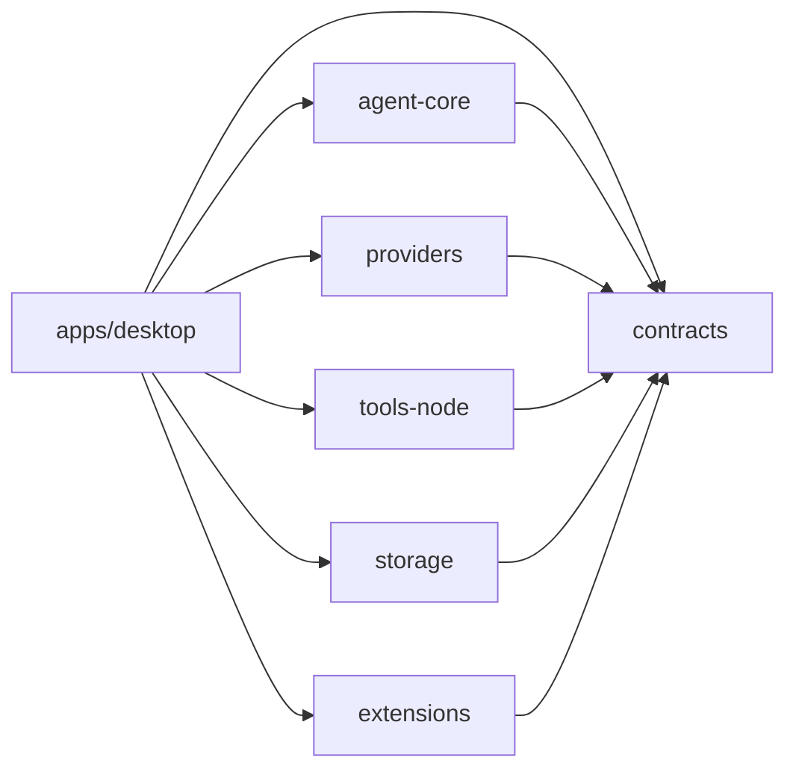

# 各 Workspace 技术实现方案

> 文档状态：2026-08-11
> 适用版本：0.1.0（MVP）

本文档集说明 pnpm monorepo 中每个应用或包的技术实现。文中的“当前实现”均以仓库代码为准；“演进方案”是后续扩展建议，不代表已经可用。

## Workspace 清单

| Workspace | 包名 | 主要职责 | 实现方案 |
|---|---|---|---|
| `apps/desktop` | `@desktop-agent/desktop` | Electron 运行时、桌面 UI、IPC 与进程编排 | [Desktop 应用](./desktop.md) |
| `packages/contracts` | `@desktop-agent/contracts` | 跨包数据模型、运行时校验与 IPC 契约 | [Contracts](./contracts.md) |
| `packages/agent-core` | `@desktop-agent/agent-core` | 与平台无关的 Agent 工具循环 | [Agent Core](./agent-core.md) |
| 上下文管理 | 多包协作 | token 预算、大结果回收、历史压缩与截断续写 | [上下文管理](./context-management.md) |
| `packages/providers` | `@desktop-agent/providers` | 模型服务协议适配与 SSE 解析 | [Providers](./providers.md) |
| Phase 2 横切能力 | 多包协作 | Provider 配置、模型发现与上下文稳定性 | [Phase 2 方案](../phase-2-multi-provider-context.md) |
| `packages/tools-node` | `@desktop-agent/tools-node` | 本地文件、目录、终端工具及权限 Gate | [Tools Node](./tools-node.md) |
| `packages/storage` | `@desktop-agent/storage` | JSONL 会话与 JSON 配置持久化 | [Storage](./storage.md) |
| `packages/extensions` | `@desktop-agent/extensions` | MCP 客户端、动态工具目录与本地 Skills | [MCP 与 Skills](./extensions.md) |

根目录只承担 workspace、TypeScript、ESLint、Vitest 与构建脚本编排，不发布独立运行时包。

## 依赖与运行关系

`contracts` 是所有模块共享的稳定边界。`agent-core` 只依赖接口，不直接依赖 Electron、Node 工具、模型厂商或存储实现；`apps/desktop` 在 Worker 中完成依赖注入。

## 一次对话的端到端链路

1. Renderer 通过 Preload 暴露的 `DesktopApi` 发起 `startTurn`。
2. Main 校验 IPC 来源和输入，把命令发送给 Utility Process Worker。
3. Worker 从 Storage 读取会话，将 Provider、Tools、Permission Gate 和持久化回调注入 Agent Core。
4. Agent Core 流式消费 Provider 事件；遇到 Tool Call 时先经过 Permission Gate，再执行本地工具或等待批准。
5. 用户消息、助手消息和工具结果逐条追加到 JSONL；Agent 事件经 Main 转发给 Renderer。
6. Renderer 展示增量文本、工具卡片、审批对话框，并在一轮结束后读取 Git 工作区变更。

## 全局实现约束

- Renderer 调用 Main 的 IPC 输入先经 Zod Schema 校验；Main↔Worker 消息当前只受 TypeScript 类型约束，属于待加强的可信内部边界。
- Renderer 保持 sandbox、Context Isolation，且不直接获得 Node.js 能力。
- API Key 与普通配置分离，由 Electron `safeStorage` 加密。
- 文件访问先解析真实路径，防止 `..` 与符号链接绕过工作目录边界。
- Terminal 默认不经过 Shell，每次调用必须由用户批准。
- 会话消息采用追加写 JSONL，单会话同一时间只允许一轮运行。
- 单元测试由根目录 Vitest 统一发现；类型检查和 ESLint 同样在根目录执行。

## 变更规则

跨包新增能力时，按以下顺序落地：

1. 在 `contracts` 定义数据结构、事件或接口，并明确兼容策略；
2. 在能力所属包实现，不把平台细节泄漏进 `agent-core`；
3. 在 `apps/desktop` 组合依赖并补齐 IPC/UI；
4. 为能力包补单元测试，为跨进程链路补集成测试；
5. 同步本目录中对应实现方案和 `docs/current-features.md`。
