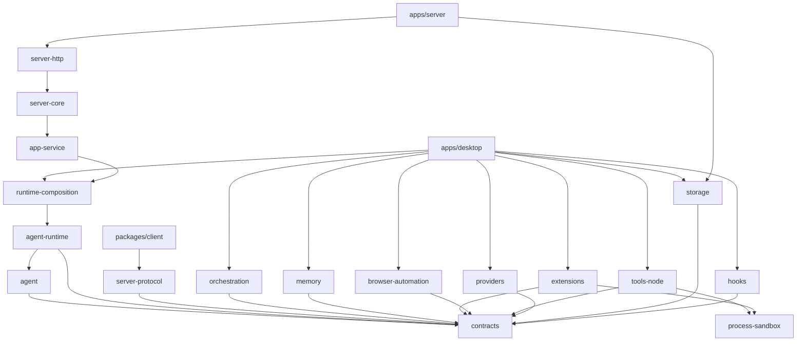

# 各 Workspace 技术实现方案

> 文档状态：2026-08-29
> 适用版本：0.1.0

本文档集说明 pnpm monorepo 中每个应用或包的技术实现。文中的“当前实现”均以仓库代码为准；“演进方案”是后续扩展建议，不代表已经可用。与代码冲突时以 Contracts、Runtime 公共 API 和测试为准。

## Workspace 清单

| Workspace | 包名 | 主要职责 | 实现方案 |
|---|---|---|---|
| `apps/desktop` | `@desktop-agent/desktop` | Electron 运行时、桌面 UI、IPC 与进程编排 | [Desktop 应用](./desktop.md) |
| `apps/server` | `@desktop-agent/server` | 无 Electron 的 headless / 网络 Server Host 组合入口 | [HTTP API / Client SDK](../jojo-http-api-server-client-sdk-final-design-code-aligned-v2.md) |
| `apps/browser-test-site` | `@desktop-agent/browser-test-site` | 浏览器自动化集成测试站点（CDP / iframe） | [浏览器自动化](../jojo-browser-automation-final-design.md) |
| `packages/contracts` | `@desktop-agent/contracts` | 跨包数据模型、运行时校验、Runtime / Extension / IPC 契约 | [Contracts](./contracts.md) |
| `packages/agent` | `@desktop-agent/agent` | 模型、消息、工具执行原语与兼容入口 | [Agent](./agent.md) |
| `packages/agent-runtime` | `@desktop-agent/agent-runtime` | 公共 Runtime API、Durable Operation、Lane、恢复与测试 Contract Suite | [Runtime 最终设计](../jojo-general-agent-runtime-harness-final-design.md)、[公共边界](../jojo-runtime-public-boundary-stabilization-final-design.md) |
| `packages/runtime-composition` | `@desktop-agent/runtime-composition` | 把 Provider / Tool / Permission / Memory / Hook 注入 Runtime | [公共边界](../jojo-runtime-public-boundary-stabilization-final-design.md) |
| `packages/app-service` | `@desktop-agent/app-service` | 面向 Desktop / Server Transport 的 Runtime 应用服务、审批与恢复 | [HTTP API / Client SDK](../jojo-http-api-server-client-sdk-final-design-code-aligned-v2.md) |
| `packages/server-protocol` | `@desktop-agent/server-protocol` | REST / WebSocket 共用的版本化 Zod Protocol | [HTTP API / Client SDK](../jojo-http-api-server-client-sdk-final-design-code-aligned-v2.md) |
| `packages/server-core` | `@desktop-agent/server-core` | Connection、Lease、Idempotency、AuthZ 与命令协调 | [HTTP API / Client SDK](../jojo-http-api-server-client-sdk-final-design-code-aligned-v2.md) |
| `packages/server-http` | `@desktop-agent/server-http` | Fastify REST / WebSocket Transport | [HTTP API / Client SDK](../jojo-http-api-server-client-sdk-final-design-code-aligned-v2.md) |
| `packages/client` | `@desktop-agent/client` | 不依赖 Runtime 的 `JojoClient` / `JojoSession` / `JojoRun` SDK | [HTTP API / Client SDK](../jojo-http-api-server-client-sdk-final-design-code-aligned-v2.md) |
| 上下文管理 | 多包协作 | token 预算、大结果回收、历史压缩与截断续写 | [上下文管理](./context-management.md) |
| `packages/orchestration` | `@desktop-agent/orchestration` | Sub-Agent、Workflow Engine、Isolation、Saved Workflow | [统一设计路线图](../subagent-workflow-unified-design-roadmap.md) |
| `packages/providers` | `@desktop-agent/providers` | Chat Completions 与 Embedding 协议适配 | [Providers](./providers.md) |
| Phase 2 横切能力 | 多包协作 | Provider 配置、模型发现与上下文稳定性 | [Phase 2 方案](../phase-2-multi-provider-context.md) |
| `packages/tools-node` | `@desktop-agent/tools-node` | 本地文件、目录、公开网页检索、终端工具及权限 Gate | [Tools Node](./tools-node.md) |
| `packages/process-sandbox` | `@desktop-agent/process-sandbox` | Terminal / MCP stdio 共用的进程隔离、环境 allowlist、脱敏与平台后端 | [Terminal / MCP 权限与沙箱加固](../jojo-terminal-mcp-permission-sandbox-hardening-design.md) |
| `packages/storage` | `@desktop-agent/storage` | SQLite Runtime / Server State / MCP Trust、JSONL Session / Workflow Journal 与 JSON 配置 | [Storage](./storage.md) |
| `packages/memory` | `@desktop-agent/memory` | Markdown 记忆、候选治理、语义检索与 Memory 工具 | [Memory M4](../jojo-agent-memory-m4-compaction-orchestration-design.md)、[M5](../jojo-agent-memory-m5-candidate-governance-design.md)、[M6](../jojo-agent-memory-m6-semantic-retrieval-design.md) |
| `packages/extensions` | `@desktop-agent/extensions` | MCP 客户端、信任与网络安全策略、延迟工具目录、本地 Skills；包内另有尚未接入 Desktop 的 Extension Host | [MCP 与 Skills](./extensions.md)、[Extension 契约](../jojo-extension-contract-v2-code-aligned.md) |
| `packages/hooks` | `@desktop-agent/hooks` | 生命周期 Hook Engine、hooks.yml 加载与项目信任 | [Hooks](./hooks.md) |
| `packages/browser-automation` | `@desktop-agent/browser-automation` | 可复用 CDP 驱动、录制 / 回放与 Host 适配端口 | [浏览器自动化](../jojo-browser-automation-final-design.md) |
| Phase 4 横切能力 | Desktop + Contracts + Browser | 受控浏览器、下载、图片消息与视觉请求 | [浏览器与富内容](./browser-rich-content.md) |

根目录只承担 workspace、TypeScript、ESLint、Vitest 与构建脚本编排，不发布独立运行时包。Desktop Worker 和 Server Host 都通过 `runtime-composition` 装配同一套 Runtime，不把 Electron IPC 或 HTTP 细节泄漏进 `agent` / `agent-runtime`。

## 依赖与运行关系

分层约束：

- `contracts` 是所有模块共享的稳定边界，含消息、权限、Runtime、Extension、Orchestration、Memory 与 Desktop IPC Schema。
- `agent` 只提供平台无关的执行原语；`agent-runtime` 在其上实现 Durable Operation、Lane 和 `RunHandle`，导出 `AgentRuntime` / `RuntimeSession` / `RuntimeLane`，并通过 `./testing`、`./spi` 子路径提供 Contract Suite 与存储 SPI。它不直接依赖 Electron、具体 Provider、工具、存储或 Hook Engine。
- `runtime-composition` 用 `createJojoRuntime()` 注入 Provider、Tool、Permission、Approval、Memory、Hook 和可选 Capability。
- `app-service` 把 Runtime 转成会话 / Run / 审批 / 恢复的应用服务；`server-core` 补 Lease、幂等与授权；`server-http` 暴露 REST 与 `/api/v1/events` WebSocket。
- `packages/client` 只依赖 `server-protocol`，不依赖 Runtime。
- `apps/desktop` 的 Utility Process Worker 完成 Desktop 侧依赖注入（Orchestration、Memory、MCP/Skills、Browser、Hooks），再进入 Runtime。
- `tools-node` 和 `extensions` 共用 `process-sandbox`。Terminal 始终通过它执行；Desktop MCP stdio 强制通过它启动，避免各自维护不同的环境、进程树和平台隔离逻辑。
- `apps/server` 导出 `createHeadlessServer()` / `createNetworkServer()`，默认监听 `127.0.0.1:7788`；非回环地址必须同时启用 `allowRemote` 并配置 token。当前默认能力为 Runtime Run / Lane / 审批 / 图片 / Sub-Agent；Workflow、Browser、Memory 远程 API 尚未开放。

## 一次对话的端到端链路

### Desktop

1. Renderer 通过 Preload 暴露的 `DesktopApi` 发起 `startTurn`。
2. Main 用 Zod Schema 校验 IPC 来源和输入，再把 `WorkerCommand` 发给 Utility Process Worker；命令与回程消息都受 `WorkerCommandSchema` / `WorkerMessageSchema` 和字节上限约束。
3. Worker 从 Storage 读取会话，将 Provider、Tools、Permission Gate、Orchestration、Memory、Browser、Hooks 和 Runtime Store 注入 `createJojoRuntime()`；Terminal 与 MCP stdio 同时注入共享 Process Sandbox，MCP 连接前读取 SQLite Trust Grant 并验证配置指纹。
4. Agent Runtime 持久化状态迁移并流式消费 Provider 事件；遇到 Tool Call 时先记录 effect intent，再经过 Permission Gate 执行或等待批准。
5. 用户消息、助手消息和工具结果逐条追加到 JSONL；Agent / Orchestration 事件经 Main 转发给 Renderer。Preload 对推送到页面的事件再做一次 Schema 校验。
6. Renderer 把消息折叠为对话 / 轨迹视图，展示增量文本、工具行、审批对话框、WorkflowCard 与 Memory 状态，并在一轮结束后读取 Git 工作区变更。

### Headless Server

1. `JojoClient` 连接 `/api/v1/events`，用 REST 创建会话并 `session.run()`。
2. `server-http` 校验 Protocol Schema、鉴权与幂等键，交给 `server-core`。
3. Control Lease 持有者才能启动 Run 或决议审批；Observer 只能订阅事件与查询 Snapshot。
4. `app-service` 调用同一套 Runtime；断线后可通过 `run.get` / `run.result()` 用 Snapshot 恢复终态。
5. 非回环绑定拒绝无 token 的远程监听。

## 全局实现约束

- Renderer 调用 Main 的 IPC 输入先经 Zod Schema 校验。Main ↔ Worker 的命令和事件同样经 `packages/contracts/src/desktop-ipc.ts` 运行时校验，默认上限 16 MiB；非法或超大消息会被拒绝并记为协议违规。
- Preload 推送给 Renderer 的 Agent / Orchestration / Browser 事件再次经 Schema 过滤，畸形负载不会进入 UI。
- Renderer 保持 sandbox、Context Isolation，且不直接获得 Node.js 能力。
- API Key 与普通配置分离，由 Electron `safeStorage` 加密；MCP OAuth token 同样走安全存储。MCP 敏感 env / Header 禁止明文配置，改用 `SecretReference` 在连接时解析；当前通用 Broker 支持 `env` provider。
- 文件访问先解析真实路径，防止 `..` 与符号链接绕过工作目录边界。
- Terminal 默认不经过 Shell，并逐次审批；审批预览来自与实际执行共用的 `TerminalSecurityPlan`，展示命令、cwd、风险、Sandbox Strength 与能力，避免审批内容和执行参数分叉。Renderer 的分裂按钮支持一次、相似规则和整段对话三种 scope；相似规则只保存哈希，对话 scope 只保存在 Worker 内存中并随会话停止清理。
- `process-sandbox` 只继承 allowlist 环境，隔离 HOME / TMP，统一流式脱敏、超时和进程树终止。Linux strong 后端使用 Bubblewrap；macOS 使用 Seatbelt 强化敏感目录与网络边界；其他平台或后端不可用时，strict fail closed，fallback 明确报告 soft 与宿主能力。macOS 后端不等同于 Linux mount namespace 的最小 Host 可见性。
- Terminal 和 MCP stdio 的 strong 默认网络策略为 `none`；MCP workspace 按 `none` / `read` / `write` 映射为隔离 cwd、只读或可写边界。域名 allowlist、OCI、Windows 强隔离和 cgroup 资源限制仍是后续能力。
- MCP Server 默认必须通过配置指纹信任；command / args / URL、Secret Ref 标识及安全能力变化会使 Trust Grant 失效。Server Instructions 默认关闭，动态工具元数据始终视为不可信提示。
- MCP HTTP 默认只允许 HTTPS，显式 loopback 可使用 HTTP；连接与 OAuth 流程都执行 DNS 全地址分类、基于 network grant 的私网 / link-local 判断（Metadata 永久拒绝）和 Redirect 逐跳复验，跨 Origin Redirect 会移除敏感 Header。
- MCP 工具默认按 `external_side_effect` 逐次审批；相似规则绑定当前 Server 指纹与精确工具名，整段对话 scope 可放行当前对话中的普通审批，但不会绕过项目 Hooks 的持久版本信任。可信只读必须同时满足有效 Server Trust、本地 `trustedReadTools` 和远端 `readOnlyHint=true`；Resource 与 Prompt 不继承该豁免。
- 会话消息采用追加写 JSONL，单会话同一时间只允许一轮运行；删除走 Main 生命周期门禁与 Storage tombstone，阻止晚到写入复活记录。
- 可写 Sub-Agent / Workflow 必须在 Git Worktree 中执行，默认不自动 Merge。
- 单元测试由根目录 Vitest 统一发现；类型检查和 ESLint 同样在根目录执行。CI 另跑 Electron E2E（Xvfb）和 Linux `electron-forge package`。

## 变更规则

跨包新增能力时，按以下顺序落地：

1. 在 `contracts` 定义数据结构、事件或接口，并明确兼容策略；需要远程暴露时同步 `server-protocol`。
2. 在能力所属包实现，不把平台细节泄漏进 `agent` 或 `agent-runtime`。
3. 通过 `runtime-composition` 注入能力。Desktop 在 `apps/desktop` 补齐 IPC/UI；网络面在 `app-service` / `server-core` / `server-http` 补齐，并更新 Client SDK。
4. 为能力包补单元测试，为跨进程或 HTTP 链路补集成测试（含 `packages/agent-runtime/test/public-runtime.test.ts` 的 Host Contract Suite）。
5. 同步本目录中对应实现方案、`docs/current-features.md` 和根 `README.md`。
