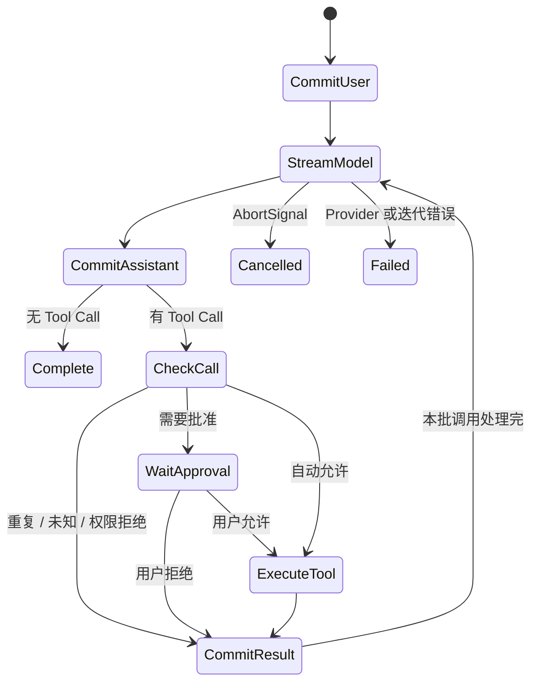

# Agent Core 技术实现方案

路径：`packages/agent-core`  
包名：`@desktop-agent/agent-core`

## 1. 定位与边界

Agent Core 实现与 Electron、具体 Provider、工具和存储无关的单轮 Agent 循环。调用方通过 `AgentRunOptions` 注入所有副作用，因此核心可以在桌面端、CLI 或测试中复用。

本包负责消息编排、模型事件消费、工具调度、权限决策、取消、迭代上限和事件输出；不负责 HTTP、文件系统、进程管理、持久化格式或 UI。

## 2. 依赖注入接口

一次运行必须注入：

- 会话 ID、工作目录、模型名、历史消息和用户输入；
- `ModelProvider`；
- `Tool[]` 与 `PermissionGate`；
- `AbortSignal`；
- Agent 事件 `emit`；
- 审批回调 `approve`；
- 可选的 `commitMessage` 持久化回调和最大迭代次数。

`ScriptedProvider` 用预定义事件序列替代真实模型，供确定性的单元测试使用。

## 3. 模块结构

`src/index.ts` 只维护稳定的公共出口，具体实现按职责拆分：

| 模块 | 职责 |
|---|---|
| `types.ts` | 定义 `AgentRunOptions` 与 `AgentRunResult` 公共类型 |
| `run-agent-turn.ts` | 创建 Turn State、编排模型迭代、提交消息和统一终态 |
| `model-step.ts` | 消费一次 Provider 流，聚合文本、Tool Call 与停止原因 |
| `tool-execution.ts` | 处理重复调用、工具查找、权限判断、审批和执行结果 |
| `messages.ts` | 集中构造 User、Assistant、Tool Message 并执行提交回调 |
| `errors.ts` | 提供分类错误、取消检查和未知错误消息归一化 |
| `scripted-provider.ts` | 提供测试用的确定性 Provider |

`run-agent-turn.ts` 是唯一的流程编排层；模型事件分支和工具权限分支分别收敛在独立模块中。内部模块不从公共 `index.ts` 反向导入，避免循环依赖。

## 4. 核心状态机

每次迭代先完整消费 Provider 的流式事件，聚合文本与已完成 Tool Call，再提交一条 Assistant Message。随后按调用顺序执行工具，每个结果各提交一条 Tool Message，供下一次模型请求使用。

## 5. 正确性保护

- 默认最多 12 次模型迭代，兼顾小型代码任务的检索、修改和验证步骤，同时防止无限工具循环。
- `executedCallIds` 保证同一个 Tool Call ID 不会执行两次。
- 未知工具生成 `unknown_tool` 结果，而不是抛出并丢失上下文。
- 策略拒绝与用户拒绝分别使用 `permission_denied` 和 `user_denied`。
- 工具异常转换为 `tool_error`，允许模型看到失败并继续回答。
- Provider 无任何事件时返回 `empty_response`。
- 每轮和每个 Tool Call 开始前检查 AbortSignal，并把同一信号传给 Provider、审批回调与 Tool；取消统一产生 `turn.cancelled`。

## 6. 消息提交语义

`appendMessage` 先把消息加入本轮内存数组，再等待 `commitMessage`。因此持久化失败会终止本轮，避免继续生成一段无法恢复的历史。用户、助手和工具消息均采用相同提交路径。

当前一次 Provider 响应中的多个 Tool Call 按顺序执行。这样审批与消息顺序稳定，但不会并发执行互不依赖的只读工具。

## 7. 错误与事件

核心内部可识别错误携带稳定 `code`；未知异常归类为 `agent_error`。取消返回正常的 `AgentRunResult`，其他失败在发出 `turn.failed` 后继续抛给调用方。

事件用于展示过程，Message 用于构成可恢复历史。调用方不能只持久化事件来替代消息。

## 8. 测试方案

现有测试覆盖基本工具循环、重复 Tool Call ID、审批拒绝后继续、工具异常恢复和 Provider 空响应分类。应继续补充：

1. 最大迭代和其他 Provider 分类失败；
2. 运行前、流式中、审批中与工具执行中的取消；
3. 未知工具和权限策略拒绝；
4. 多 Tool Call 的顺序与消息提交失败；
5. usage 事件及终态事件只出现一次。

## 9. 演进方案

- 若支持并行工具，先在协议中表达依赖和并发安全属性，再只并发执行明确无依赖的调用。
- 将重试、上下文裁剪和 token 预算作为可注入策略，保持核心不绑定厂商。
- 将当前进程内 `TurnState` 演进为可序列化的显式状态机，便于恢复中断任务和做属性测试。
- 支持子 Agent 时把它建模为受限 Tool/Runner，不让平台编排逻辑侵入主循环。
