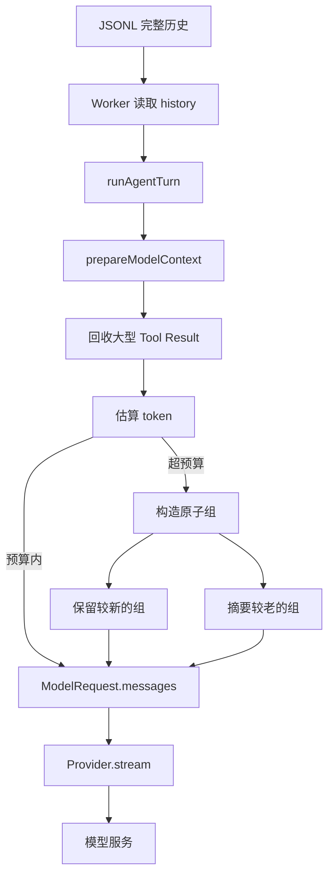
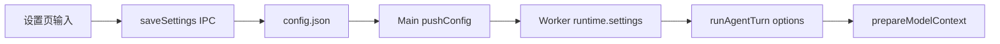

# 上下文管理技术实现方案

> 适用版本：0.1.0
> 面向读者：第一次接触 LLM 上下文窗口、Tool Call 和历史压缩的开发者。
> 文档目标：不仅说明“做了什么”，还在每个机制后标出当前项目的具体实现文件和函数。

## 1. 一句话理解

上下文管理负责在每次调用模型前，从完整会话历史中准备一份“这次真正发送给模型的消息视图”。

它要同时做到三件事：

1. 尽量保留最近信息和关键约束；
2. 避免超过模型的上下文窗口；
3. 不破坏 Tool Call 与 Tool Result 的对应关系。

最重要的设计是：

```text
磁盘中的完整历史 ≠ 本次发送给模型的上下文视图
```

完整历史继续保存在 JSONL；回收和摘要只修改本次请求使用的临时数组。

> **项目实现位置**
>
> - 上下文入口：[`prepareModelContext`](../../packages/agent/src/context-manager.ts)
> - 每次模型调用前接入：[`runAgentTurn`](../../packages/agent/src/run-agent-turn.ts)
> - 完整历史读取和持久化注入：[`startTurn`](../../apps/desktop/src/worker/worker.ts)

## 2. 为什么需要上下文管理

LLM 并不会自动记住之前的会话。应用每调用一次模型，都要重新发送它需要看到的消息。

对话变长后会遇到四个问题：

### 2.1 请求越来越大

每轮都发送完整历史会让输入 token、延迟和费用持续增长。

### 2.2 工具结果可能特别大

一次读取文件、搜索项目或运行测试，可能返回几万甚至几十万字符。少数大型 Tool Result 就能占满窗口。

### 2.3 超过窗口后请求直接失败

如果输入历史、工具定义和预留输出的总预算超过模型限制，Provider 通常会拒绝请求，而不是自动帮应用压缩。

### 2.4 错误裁剪会破坏工具协议

如果只保留 Tool Result，却删掉它前面的 Tool Call，模型会看到一个找不到来源的结果。反过来，只保留调用、不保留结果，也会让模型误以为工具仍未执行。

> **项目实现位置**
>
> - Tool Call/Result 消息结构：[`packages/contracts/src/messages.ts`](../../packages/contracts/src/messages.ts)
> - Chat Completions 消息映射：[`toChatMessages`](../../packages/providers/src/chat-completions-request.ts)
> - 原子分组：[`groupContextMessages`](../../packages/agent/src/context-manager.ts)

## 3. 先理解几个术语

| 术语 | 新手解释 | 本项目中的表示 |
|---|---|---|
| Message | 一条会话消息 | `Message` |
| Content Block | Message 内的文本、工具调用或工具结果 | `text`、`tool_call`、`tool_result` |
| Context Window | 一次模型请求可容纳的总 token 范围 | `contextWindowTokens` |
| Max Output | 为模型回答预留的 token | `maxOutputTokens` |
| Token Estimate | 请求前的近似 token 数 | `estimateContextTokens` |
| Reclaim | 缩短过大的 Tool Result | `reclaimToolResults` |
| Compaction | 用摘要替换较老历史 | `prepareModelContext` |
| Internal Message | 只供模型和恢复逻辑使用、UI 不展示的消息 | `metadata.internal = true` |
| Atomic Group | 必须一起保留或一起压缩的一组消息 | Tool Call + 对应 Tool Result |

> **项目实现位置**
>
> - Message Schema：[`MessageSchema`](../../packages/contracts/src/messages.ts)
> - Agent 运行参数：[`AgentRunOptions`](../../packages/agent/src/types.ts)
> - Context 返回结果：[`ContextPreparationResult`](../../packages/agent/src/context-manager.ts)

## 4. 整体数据流



每次 Agent 模型迭代都会重新执行这条管线。原因是工具执行后会产生新的 Tool Result，下一次请求的上下文大小已经变化。

> **项目实现位置**
>
> - 循环中调用 `prepareModelContext`：[`run-agent-turn.ts`](../../packages/agent/src/run-agent-turn.ts)
> - 构造 `ModelRequest`：[`runModelStep`](../../packages/agent/src/model-step.ts)
> - Provider 接口定义：[`ModelProvider`](../../packages/contracts/src/model.ts)

## 5. 上下文输入和输出

### 5.1 输入

`prepareModelContext` 接收：

```ts
type ContextPreparationOptions = {
  messages: Message[];
  tools: ToolDefinition[];
  instructions?: string[];
  contextWindowTokens: number;
  maxOutputTokens: number;
  summarize?: (source: string, signal: AbortSignal) => Promise<string>;
  signal: AbortSignal;
};
```

| 字段 | 来源 | 作用 |
|---|---|---|
| `messages` | JSONL 历史 + 本轮新增消息 | 要处理的完整内存历史 |
| `tools` | 当前 Tool Runtime | 工具描述和 JSON Schema 也占 token |
| `instructions` | Runtime、Memory、MCP 等指令 | 与工具一样属于不可通过压缩历史回收的固定成本 |
| `contextWindowTokens` | 「设置 → 模型」中的当前 Provider | 模型窗口上限 |
| `maxOutputTokens` | 「设置 → 模型」中的当前 Provider | 为本次回答预留输出空间 |
| `summarize` | Worker 注入 | 用默认模型生成历史摘要 |
| `signal` | 本轮 AbortController | 用户取消时终止摘要 |

### 5.2 输出

```ts
type ContextPreparationResult = {
  messages: Message[];
  estimatedTokens: number;
  compactedMessages: number;
  reclaimedToolCharacters: number;
  budget: ContextBudget;
};
```

| 字段 | 含义 |
|---|---|
| `messages` | 本次真正发给 Provider 的消息视图 |
| `estimatedTokens` | 处理后的估算 token |
| `compactedMessages` | 被摘要替代的原始消息数 |
| `reclaimedToolCharacters` | 从大型 Tool Result 请求视图中回收的字符数 |
| `budget` | target、固定成本、消息预算、容量不足状态和建议最小窗口 |

这些统计随后通过 `context.updated` 事件发送给 Renderer。

> **项目实现位置**
>
> - 类型与算法：[`context-manager.ts`](../../packages/agent/src/context-manager.ts)
> - 事件定义：[`AgentEvent`](../../packages/contracts/src/agent.ts)
> - 事件发出：[`runAgentTurn`](../../packages/agent/src/run-agent-turn.ts)
> - UI 消费：[`onAgentEvent`](../../apps/desktop/src/renderer/main.tsx)

## 6. 第一步：回收大型 Tool Result

### 6.1 规则

当一个 Tool Result 超过 12,000 字符时：

- 保留开头 4,000 字符；
- 保留结尾 4,000 字符；
- 中间替换为回收提示；
- 设置 `truncated: true`。

示意：

```text
[原结果开头 4000 字符]

[22000 characters reclaimed from older tool output]

[原结果结尾 4000 字符]
```

### 6.2 为什么保留头尾

- 文件开头通常有导入、类型和整体结构；
- 命令输出结尾通常有测试汇总或最终错误；
- 只保留开头容易丢失真正的失败原因；
- 只保留结尾又容易丢失执行背景。

### 6.3 不会修改原始历史

函数使用 `map` 创建新的 Message 和 Content Block。JSONL 中已经保存的完整 Tool Result 不会被覆盖。

> **项目实现位置**
>
> - 阈值常量：`TOOL_RESULT_CHARACTER_LIMIT`、`TOOL_RESULT_EDGE_CHARACTERS`
> - 回收函数：`reclaimToolResults`
> - 文件：[`packages/agent/src/context-manager.ts`](../../packages/agent/src/context-manager.ts)
> - Tool Result Schema：[`ToolResultSchema`](../../packages/contracts/src/messages.ts)

## 7. 第二步：估算 token

### 7.1 为什么不是精确 tokenizer

不同模型使用不同 tokenizer。当前实现选择一个保守、确定性、无外部依赖的估算器。它用于“何时压缩”，不用于计费。

### 7.2 文本估算

`textTokens` 的规则：

```text
ASCII 字符：约 4 字符 / token
非 ASCII 字符：约 1 字符 × 1.25 token
```

非 ASCII 采用更高权重，是为了对中文等文本留出安全余量。

### 7.3 还要计算哪些内容

估算不仅包含聊天文本，还包含：

- 每条 Message 的固定开销；
- Tool Call 名称和参数 JSON；
- Tool Result 内容；
- ToolDefinition 名称、描述和 JSON Schema；
- 协议固定开销。

如果只计算对话文字，会严重低估 Coding Agent 请求，因为工具 Schema 本身也可能很大。

> **项目实现位置**
>
> - 文本估算：`textTokens`
> - Content Block 估算：`blockTokens`
> - 完整请求估算：`estimateContextTokens`
> - 文件：[`packages/agent/src/context-manager.ts`](../../packages/agent/src/context-manager.ts)

## 8. 第三步：计算安全预算

当前公式：

```text
target = max(
  1024,
  floor(contextWindowTokens × 0.82) - maxOutputTokens
)
fixed = tools + instructions + protocol overhead
messageBudget = max(0, target - fixed)
```

工具 Schema、Skill/MCP 目录和运行指令不能靠删除聊天历史回收，因此必须先从 target 扣除。如果 `messageBudget < 1024`，Runtime 会先发出 `context.updated(overCapacity = true)`，随后以 `context_overflow` 终止本次请求，并给出包含最小消息预算的建议窗口。这个保护避免“越压缩用户历史，固定成本占比反而越高”的压缩风暴。

### 8.1 为什么只使用窗口的 82%

留下 18% 安全余量，用于字符估算误差、协议开销、工具定义变化和兼容服务差异。

### 8.2 为什么再减最大输出

上下文窗口通常同时约束输入和输出。如果把整个窗口都用于历史，模型就没有空间生成回答。

### 8.3 数值示例

```text
上下文窗口 = 128000
最大输出   = 8192

floor(128000 × 0.82) = 104960
target               = 104960 - 8192
                     = 96768 tokens
```

再扣除工具与指令固定成本后，剩余的 `messageBudget` 才用于会话消息和压缩摘要。

> **项目实现位置**
>
> - 比例常量：`DEFAULT_TARGET_RATIO = 0.82`
> - 最小预算和公式：`prepareModelContext` 内部的 `target`
> - 文件：[`packages/agent/src/context-manager.ts`](../../packages/agent/src/context-manager.ts)
> - 设置范围 Schema：[`ProviderConfigSchema`](../../packages/contracts/src/persistence.ts)
> - 设置页输入与校验：[`apps/desktop/src/renderer/main.tsx`](../../apps/desktop/src/renderer/main.tsx)

## 9. 第四步：保护 Tool Call/Result 原子关系

### 9.1 什么是原子组

普通 User 或 Assistant 文本可以单独成组。带工具调用时，Assistant 和紧随其后的匹配 Tool Result 必须合为一组：

```text
[
  Assistant(tool_call c1, tool_call c2),
  Tool(tool_result c1),
  Tool(tool_result c2)
]
```

### 9.2 分组算法

`groupContextMessages` 从前向后遍历：

1. 读取当前 Message 中所有 Tool Call ID；
2. 如果没有 Tool Call，当前消息单独成组；
3. 如果有 Tool Call，继续查看紧随其后的 Tool Message；
4. 只有 Tool Result ID 都属于当前调用集合时才加入本组；
5. 遇到普通消息或不匹配结果时结束该组。

### 9.3 为什么必须这样做

拆开后可能导致 Provider 拒绝消息、结果找不到调用、模型重复执行工具，或者无法判断写文件操作是否成功。

> **项目实现位置**
>
> - 提取调用 ID：`messageToolCallIds`
> - 提取结果 ID：`toolResultIds`
> - 原子分组：`groupContextMessages`
> - 文件：[`packages/agent/src/context-manager.ts`](../../packages/agent/src/context-manager.ts)
> - 自动化测试：[`context-manager.test.ts`](../../packages/agent/test/context-manager.test.ts)

## 10. 第五步：保留新历史，摘要旧历史

只有完整估算超过 target 且固定成本仍有可用消息预算时才进入压缩。

### 10.1 保留预算

```text
keepBudget = max(1024, floor(messageBudget × 0.62))
```

算法从最新原子组向前选择消息：

- 最近消息优先；
- 原子组不能拆开；
- 至少保留最新一组；
- 更老的完整组进入摘要。

62% 是可用消息预算中为最新原始消息预留的比例，剩余空间用于摘要和估算误差。

### 10.2 摘要消息

旧历史摘要被包装成内部 User Message：

```text
[Compacted conversation context]
...历史摘要...
[End compacted context]
```

并带有 `metadata: { internal: true }`。最终请求视图是：

```text
[内部历史摘要]
[最近的原始消息组]
[最新用户消息]
```

摘要正文前还有稳定的 pinned requirements 区段。它以 JSON 字符串逐条保存旧摘要继承的要求和真实 User Message；连续压缩时先解析旧区段再加入新要求。常规要求保留原文，单条超大要求才会按 token 预算保留头尾并显式标注裁剪。模型生成的叙述摘要始终从属于该区段。

> **项目实现位置**
>
> - 保留预算和选择逻辑：`prepareModelContext`
> - 摘要消息构造：`summaryMessage`
> - 文件：[`packages/agent/src/context-manager.ts`](../../packages/agent/src/context-manager.ts)
> - internal 字段定义：[`MessageSchema`](../../packages/contracts/src/messages.ts)
> - Renderer 过滤内部消息：[`apps/desktop/src/renderer/main.tsx`](../../apps/desktop/src/renderer/main.tsx)

## 11. 摘要如何生成和降级

### 11.1 摘要源

`sourceForSummary` 把消息转成带角色的纯文本，并保留 Tool Call、输入参数、结果状态和结果内容。

摘要提示要求保留用户约束、设计决策、文件路径、错误、未完成工作和工具结果，同时禁止编造事实。

### 11.2 三层长度保护

| 阶段 | 上限 | 处理 |
|---|---:|---|
| 摘要源 | 48,000 字符 | 保留头尾各一半 |
| 本地回退摘要 | 约 8,000 字符 | 保留头尾各 4,000 |
| 稳定摘要结果 | 最多约为消息预算的 34%（并限制为 3,200 tokens） | pinned requirements 优先，其余模型摘要按 token 预算保留头尾 |

### 11.3 摘要失败不会终止主对话

`summarize` 因网络、Key、超时或 Provider 错误失败时，Context Manager 使用 `fallbackSummary`。摘要是增强项，不是主 Agent Turn 的单点故障。

> **项目实现位置**
>
> - 摘要源：`sourceForSummary`
> - 本地回退：`fallbackSummary`
> - 捕获失败：`prepareModelContext` 中的 `try/catch`
> - 文件：[`packages/agent/src/context-manager.ts`](../../packages/agent/src/context-manager.ts)
> - 摘要提示和 1,024 输出上限：[`apps/desktop/src/worker/worker.ts`](../../apps/desktop/src/worker/worker.ts)
> - 默认模型请求：`utilityCompletion`

## 12. 完整历史为什么不会丢

`runAgentTurn` 中的消息提交顺序是：

1. 把 Message 加入本轮内存数组；
2. 调用 `commitMessage`；
3. Worker 把 Message 追加到 JSONL；
4. 下一次模型迭代再从内存数组准备请求视图。

Context Manager 只返回新数组，不调用存储接口，也不覆盖 JSONL。即使请求使用了摘要，重启后仍能加载完整 User、Assistant、Tool Call 和 Tool Result。

> **项目实现位置**
>
> - 统一提交函数：[`appendMessage`](../../packages/agent/src/messages.ts)
> - Worker 注入 `commitMessage`：[`apps/desktop/src/worker/worker.ts`](../../apps/desktop/src/worker/worker.ts)
> - JSONL 追加：[`JsonlSessionStore.appendMessage`](../../packages/storage/src/index.ts)
> - JSONL Schema：[`SessionRecordSchema`](../../packages/contracts/src/persistence.ts)

## 13. 输出截断和上下文的关系

模型可能因为输出 token 用完返回 `length`，部分兼容服务可能返回 `max_tokens`。

Agent Core 会：

1. 保存已经生成的 Assistant 内容；
2. 插入内部续写消息；
3. 再次执行 `prepareModelContext`；
4. 使用相同模型继续生成；
5. 最多自动续写两次。

重新准备上下文很重要：上一段 Assistant 输出已经进入历史，不能继续使用截断前的旧请求视图。

> **项目实现位置**
>
> - 续写次数：`MAX_OUTPUT_CONTINUATIONS = 2`
> - 停止原因判断：[`runAgentTurn`](../../packages/agent/src/run-agent-turn.ts)
> - 续写消息：[`createContinuationMessage`](../../packages/agent/src/messages.ts)
> - 自动化测试：[`context-manager.test.ts`](../../packages/agent/test/context-manager.test.ts)

## 14. 配置如何传到 Context Manager



当前 UI 允许：

- 上下文窗口：8,192～2,000,000；
- 最大输出：256～128,000；
- 最大输出必须小于上下文窗口。

`contextWindowTokens = 128000` 和 `maxOutputTokens = 8192` 是「设置 → 模型」中 Provider 的默认配置。Session Meta 不保存这两个字段；Worker 每轮都读取当前 Provider 配置，因此在模型设置中保存新值后，所有使用该 Provider 的会话从下一轮起生效。

数字输入在编辑期间以字符串保存，可以先清空再重新输入；点击保存时才转换和校验，避免空字符串立刻变成 0。

> **项目实现位置**
>
> - UI 输入与错误提示：[`apps/desktop/src/renderer/main.tsx`](../../apps/desktop/src/renderer/main.tsx)
> - IPC Schema：[`SaveSettingsInputSchema`](../../packages/contracts/src/desktop.ts)
> - 配置约束：[`ProviderSettingsSchema`](../../packages/contracts/src/persistence.ts)
> - 配置保存：[`JsonConfigStore.save`](../../packages/storage/src/index.ts)
> - Main 推送 Worker：[`pushConfig`](../../apps/desktop/src/main/main.ts)
> - Worker 注入运行参数：[`startTurn`](../../apps/desktop/src/worker/worker.ts)

## 15. 事件和 UI 展示

每次 Context Manager 完成后，Agent Core 发出：

```ts
{
  type: 'context.updated',
  estimatedTokens,
  contextWindowTokens,
  compactedMessages,
  reclaimedToolCharacters,
  fixedTokens,
  targetTokens,
  messageBudgetTokens,
  overCapacity,
  iteration,
  maxIterations,
  finalResponseOnly
}
```

Renderer 当前展示估算 token/窗口、压缩消息数、本轮 input/output、cache usage 和 `Loop 当前/上限`。容量不足时状态变红，悬停可看到固定成本与目标预算；进入迭代上限的无工具回答时显示“收尾”。

持久化 compaction 位于 SQLite Runtime Store，而非 JSONL 消息流。Renderer 选择/刷新会话时读取主 lane 的 compaction 并按时间合并为压缩节点；Markdown 轨迹导出走同一合并规则，因此能解释每次新问题前实际发生的上下文变化。

切换、新建或删除会话，以及开始新一轮时，会清空上一会话的 Context/Usage UI 状态。当前没有单独展示 `reclaimedToolCharacters`。

> **项目实现位置**
>
> - 事件定义：[`packages/contracts/src/agent.ts`](../../packages/contracts/src/agent.ts)
> - 事件发出：[`packages/agent/src/run-agent-turn.ts`](../../packages/agent/src/run-agent-turn.ts)
> - UI 更新和清理：[`apps/desktop/src/renderer/main.tsx`](../../apps/desktop/src/renderer/main.tsx)
> - UI 样式：[`apps/desktop/src/renderer/styles.css`](../../apps/desktop/src/renderer/styles.css)

## 16. 一个完整例子

假设：

```text
contextWindowTokens = 128000
maxOutputTokens     = 8192
```

历史包含早期需求、一次 30,000 字符文件读取、一组 Tool Call/Result，以及最近两轮要求。

处理过程：

1. 30,000 字符 Tool Result 缩成“头 4,000 + 标记 + 尾 4,000”；
2. 计算 `floor(128000 × 0.82) - 8192 = 96768`；
3. 扣除工具与指令固定成本；若剩余消息预算不足 1,024 tokens，则直接报容量不足；
4. 如果完整请求仍超过 target，按 `messageBudget × 0.62` 计算 keepBudget；
5. 从最新消息向前保留预算内的完整组；
6. 较老组交给默认模型摘要，失败则用本地摘要；
7. 最终发送“内部摘要 + 最近原始消息 + 最新用户消息”；
8. JSONL 仍保留原始 30,000 字符 Tool Result 和全部历史。

## 17. 正确性约束

修改上下文算法时必须守住：

1. 不修改传入的原始 Message；
2. 不在 Context Manager 中写存储；
3. Tool Call 和匹配 Tool Result 不拆组；
4. 最新消息至少保留一组；
5. 摘要失败不能中断主对话；
6. 内部摘要不会伪装成用户气泡，而是显示为可展开的压缩/系统节点；
7. 用户取消传递到摘要请求；
8. 最终请求仍带完整 ToolDefinition；
9. token 估算不冒充 Provider usage；
10. 自动续写有明确上限。
11. 固定工具与指令成本超过 target 时，不得通过压缩用户消息继续尝试；
12. 连续压缩必须继承 pinned user requirements；
13. 同一会话重复 `load_skill` 不得再次注入完整 Skill 内容。

> **项目实现位置**
>
> - 核心约束：[`context-manager.ts`](../../packages/agent/src/context-manager.ts)
> - 取消与续写：[`run-agent-turn.ts`](../../packages/agent/src/run-agent-turn.ts)
> - UI 内部消息过滤：[`main.tsx`](../../apps/desktop/src/renderer/main.tsx)
> - 自动化断言：[`context-manager.test.ts`](../../packages/agent/test/context-manager.test.ts)

## 18. 测试方法

### 18.1 定向测试

```bash
pnpm exec vitest run packages/agent/test/context-manager.test.ts
```

覆盖原子分组、大结果回收、固定成本超限、连续压缩约束继承、内部消息和自动续写。

### 18.2 完整回归

```bash
pnpm typecheck
pnpm lint
pnpm test
```

### 18.3 UI 手工验证

1. 打开「设置 → 模型」，确认默认显示 `128000 / 8192`；
2. 连续发送多轮长文本并提前写入三个必须记住的约束；
3. 悬浮上下文状态，查看压缩提示；
4. 询问之前三个约束；
5. 切换到轨迹视图并导出 Markdown，确认压缩记录出现且顺序正确；
6. 重启应用，确认完整历史与压缩记录仍可见；
7. 在模型设置中人为降低窗口并启用超大工具目录，确认显示“容量不足”而不是反复压缩。

## 19. 当前限制

- 估算不是精确 tokenizer，中文、代码和 JSON 仍会有误差；
- 模型叙述摘要仍可能遗漏细节；pinned requirements 只保障预算内的用户原文，单条超大输入会显式保留头尾；
- 摘要后如果仍超预算，当前不会递归执行多轮压缩；
- Context/Usage 数字是本轮运行时 UI 状态；持久化 compaction 会从 SQLite 重建并显示；
- 12,000 的 Tool Result 阈值按字符而不是 token；
- 82% 和 62% 是当前经验参数，还没有评测集校准。

## 20. 后续演进建议

1. 为不同模型增加可插拔 tokenizer；
2. 增加压缩后的硬预算校验和二次降级；
3. 为重要约束建立结构化 Context State；
4. 为大型 Tool Result 提供可回查引用；
5. 在 UI 展示回收字符数和自动续写状态；
6. 增加真实 Provider 的长会话集成测试；
7. 记录摘要版本和来源范围；
8. 用评测集衡量压缩前后任务成功率。

## 21. 代码导航

| 主题 | 实现位置 |
|---|---|
| 上下文核心算法 | [`packages/agent/src/context-manager.ts`](../../packages/agent/src/context-manager.ts) |
| 模型迭代与自动续写 | [`packages/agent/src/run-agent-turn.ts`](../../packages/agent/src/run-agent-turn.ts) |
| ModelRequest 构造 | [`packages/agent/src/model-step.ts`](../../packages/agent/src/model-step.ts) |
| 内部续写消息 | [`packages/agent/src/messages.ts`](../../packages/agent/src/messages.ts) |
| AgentRunOptions | [`packages/agent/src/types.ts`](../../packages/agent/src/types.ts) |
| Message / Tool 数据结构 | [`packages/contracts/src/messages.ts`](../../packages/contracts/src/messages.ts) |
| Context/Usage 事件 | [`packages/contracts/src/agent.ts`](../../packages/contracts/src/agent.ts) |
| 模型接口 | [`packages/contracts/src/model.ts`](../../packages/contracts/src/model.ts) |
| 上下文配置 Schema | [`packages/contracts/src/persistence.ts`](../../packages/contracts/src/persistence.ts) |
| 设置 IPC Schema | [`packages/contracts/src/desktop.ts`](../../packages/contracts/src/desktop.ts) |
| 默认模型摘要注入 | [`apps/desktop/src/worker/worker.ts`](../../apps/desktop/src/worker/worker.ts) |
| Context UI 与状态清理 | [`apps/desktop/src/renderer/main.tsx`](../../apps/desktop/src/renderer/main.tsx) |
| JSONL 完整历史 | [`packages/storage/src/index.ts`](../../packages/storage/src/index.ts) |
| 自动化测试 | [`packages/agent/test/context-manager.test.ts`](../../packages/agent/test/context-manager.test.ts) |

## 22. 最后总结

当前方案可以用下面这条链路记忆：

```text
完整历史
  → 回收大型 Tool Result
  → 保守估算 token
  → 预算内直接发送
  → 超预算时保护 Tool 原子组
  → 摘要旧历史
  → 保留最新历史
  → 发给模型
```

核心价值不是单纯“把消息变短”，而是在长会话中同时保护请求可继续执行、工具协议完整、最近任务信息尽量不丢，以及磁盘原始历史可恢复。
