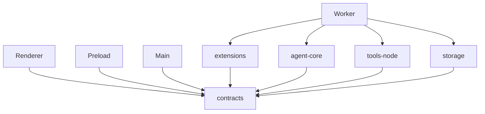
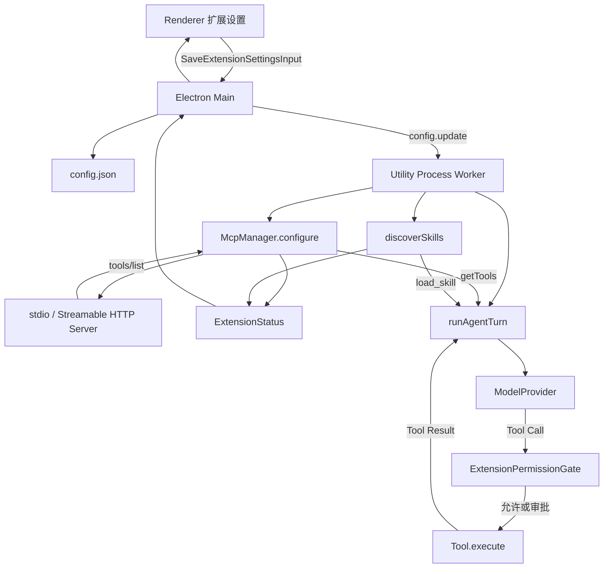
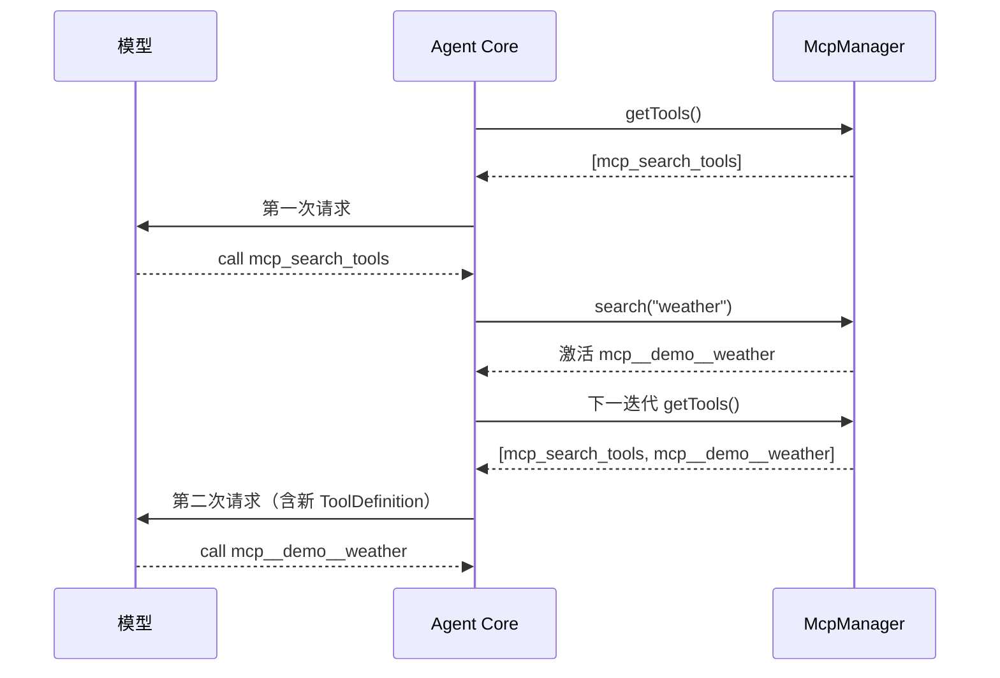
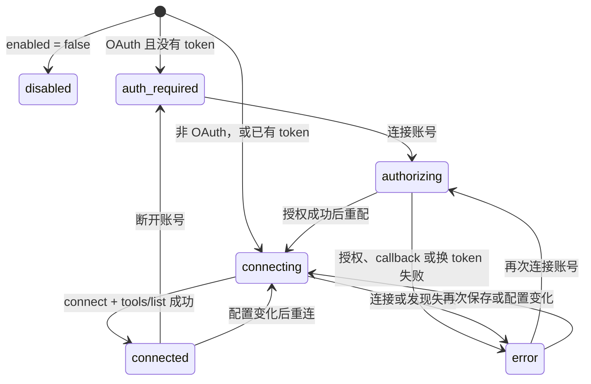

# MCP 与 Skills 技术实现方案

> 适用版本：0.1.0  
> 文档状态：2026-08-12  
> 面向读者：第一次接触 MCP、动态工具目录和 Agent Skills 的开发者。  
> 文档目标：说明扩展能力如何从配置进入 Worker、如何变成模型可调用工具、如何审批和回填，并在每个机制后给出当前项目的具体实现位置。

## 1. 一句话理解

MCP 与 Skills 解决的是同一个问题的两个层面：在不继续硬编码业务工具的前提下，让 Agent 获得新的外部能力和新的任务方法。

- **MCP** 把外部进程或远程服务提供的工具接入现有 Agent Tool 循环；
- **Skills** 把本地 `SKILL.md` 中的任务说明按需交给模型，再由模型组合已有工具完成工作。

最重要的设计是：

```text
扩展配置和 Skill 全文 ≠ 每次模型请求都要携带的上下文
```

MCP 大工具集先只暴露搜索入口，Skill 初始只暴露名称和描述；只有模型真正需要时，具体工具定义或 Skill 全文才进入后续模型请求。

> **项目实现位置**
>
> - MCP 连接与工具适配：[`McpManager`](../../packages/extensions/src/mcp-manager.ts)
> - Skill 发现与按需加载：[`discoverSkills` / `createSkillTool`](../../packages/extensions/src/skills.ts)
> - 动态工具刷新：[`runAgentTurn`](../../packages/agent-core/src/run-agent-turn.ts)
> - Worker 组合入口：[`startTurn`](../../apps/desktop/src/worker/worker.ts)

## 2. 目标与非目标

### 2.1 当前目标

Phase 3 当前实现覆盖：

1. MCP stdio client；
2. MCP Streamable HTTP client（含 OAuth 2.1 / PKCE）；
3. MCP `tools/list` 发现和 `tools/call` 调用；
4. 连接中、需要登录、授权中、已连接、停用和错误状态；
5. 大型 MCP 工具目录延迟激活；
6. 本地 `SKILL.md` 发现、启停和错误展示；
7. Skill 全文按需注入；
8. 通过 `install_skill` 非交互安装项目 Skill，并在当前 Turn 动态刷新；
9. MCP 工具逐次审批；
10. 重复工具调用的无进展保护；
11. 旧配置兼容和扩展配置持久化。

### 2.2 当前明确不做

当前没有实现：

- MCP Resources 和 Prompts 暴露给模型；
- 旧 HTTP+SSE transport 回退；
- MCP Sampling、Elicitation 和 Roots 交互；
- MCP Server 市场、安装器或自动更新；
- Skill 市场浏览、签名、可信来源校验和联网自动更新；
- Skill 依赖声明、版本解析和脚本生命周期；
- 基于 embedding 的语义工具搜索。

“连接上 MCP Server”在当前版本中只代表工具能力可用，不代表完整覆盖 MCP 协议的所有 capability。

> **项目实现位置**
>
> - 路线图范围：[`ts-desktop-agent-mvp-roadmap.md`](../../ts-desktop-agent-mvp-roadmap.md)
> - Extensions 对外导出：[`packages/extensions/src/index.ts`](../../packages/extensions/src/index.ts)
> - 当前功能说明：[`docs/current-features.md`](../current-features.md)

## 3. 先理解几个术语

| 术语 | 新手解释 | 本项目中的表示 |
|---|---|---|
| MCP Server | 提供标准化工具的本地进程或远程服务 | `McpServerConfig` |
| Transport | Client 与 Server 的通信方式 | `stdio` / `streamable_http` |
| Remote Tool | MCP Server 原始工具 | SDK `Tool` |
| Exposed Tool | 转换后给模型看的本项目工具 | `ToolDefinition` + `Tool` |
| Tool Catalog | 已发现但不一定全部暴露的 MCP 工具集合 | `McpManager.entries` |
| Activation | 把搜索匹配的 MCP 工具加入下一步模型请求 | `McpManager.activated` |
| Skill | 带元数据和任务说明的本地 `SKILL.md` | `DiscoveredSkill` |
| Skill Metadata | 可提前给模型看的名称和描述 | `id` / `name` / `description` |
| On-demand Injection | 需要时才把完整 Skill 正文放进上下文 | `load_skill` Tool Result |
| Extension Status | UI 展示的连接和发现状态 | `ExtensionStatus` |
| Extension Gate | 在默认权限规则外处理 MCP/Skill 工具 | `ExtensionPermissionGate` |

> **项目实现位置**
>
> - 配置与状态契约：[`packages/contracts/src/extensions.ts`](../../packages/contracts/src/extensions.ts)
> - 通用 Tool 接口：[`packages/contracts/src/tools.ts`](../../packages/contracts/src/tools.ts)
> - Tool Call / Result：[`packages/contracts/src/messages.ts`](../../packages/contracts/src/messages.ts)

## 4. 为什么单独建立 `extensions` Workspace

MCP client 需要 Node.js 子进程、网络和官方 SDK；Skill 发现需要文件系统。这些能力不能进入 Renderer，也不应该进入纯 TypeScript Agent Core。

当前依赖关系是：



职责边界：

| 模块 | 职责 |
|---|---|
| `contracts` | 配置、状态、IPC 和 Tool 类型 |
| `extensions` | Node MCP client、工具适配、Skill 文件发现、扩展权限 Gate |
| `agent-core` | 接受静态工具和动态工具提供器，不知道 MCP SDK 或文件系统 |
| `storage` | 保存扩展配置，不连接 Server |
| `apps/desktop/worker` | 管理扩展生命周期并注入 Agent Turn |
| `apps/desktop/main` | 校验设置 IPC、持有最新状态、管理 OAuth loopback callback 与加密凭据、向 Worker 推配置 |
| `apps/desktop/renderer` | 编辑配置并展示状态，不直接获得 Node 权限 |

这样做保持了原有约束：Agent Core 只依赖接口，Renderer 仍在 sandbox 中，MCP 协议差异不会泄漏到模型 Provider。

> **项目实现位置**
>
> - Workspace 包：[`packages/extensions/package.json`](../../packages/extensions/package.json)
> - TypeScript 路径：[`tsconfig.base.json`](../../tsconfig.base.json)
> - Worker 依赖注入：[`apps/desktop/src/worker/worker.ts`](../../apps/desktop/src/worker/worker.ts)
> - 全局架构索引：[`docs/technical-implementation/README.md`](./README.md)

## 5. 整体运行时数据流



配置链路和执行链路是分开的：保存配置会触发连接/发现；真正的工具执行发生在某次 Agent Turn 内，并复用现有审批、事件、消息和持久化机制。

## 6. 扩展配置契约

### 6.1 顶层结构

```ts
type ExtensionSettings = {
  mcpServers: McpServerConfig[];
  skills: {
    directories: string[];
    disabled: string[];
  };
};
```

默认值：

```json
{
  "mcpServers": [],
  "skills": {
    "directories": [],
    "disabled": []
  }
}
```

### 6.2 stdio Server

```json
{
  "id": "local-files",
  "name": "Local Files MCP",
  "enabled": true,
  "transport": "stdio",
  "command": "node",
  "args": ["/absolute/path/server.js"],
  "cwd": "/optional/working/directory",
  "env": {
    "SERVICE_TOKEN": "value"
  }
}
```

### 6.3 Streamable HTTP Server

```json
{
  "id": "remote-service",
  "name": "Remote Service",
  "enabled": true,
  "transport": "streamable_http",
  "url": "https://example.com/mcp",
  "versionNegotiation": "auto",
  "headers": {
    "Authorization": "Bearer value"
  }
}
```

### 6.4 Schema 限制

| 字段 | 当前限制 |
|---|---|
| Server 数量 | 最多 50 |
| Server `id` | 1～64 字符，只允许字母、数字、`_`、`-`，且不能重复 |
| Server `name` | 1～120 字符 |
| stdio `args` | 最多 100 项 |
| HTTP URL | 只接受 `http:` / `https:` |
| HTTP `versionNegotiation` | `auto` / `legacy`，默认 `auto` |
| OAuth `scopes` | 可省略，最多 50 项非空字符串 |
| OAuth `resourceOrigins` | 可省略，最多 20 项；必须是没有 path、query、fragment 的 HTTPS origin，并以 `/` 结尾 |
| Skill 目录 | 最多 50 个 |
| disabled Skill ID | 最多 500 个 |

所有 Renderer 输入先经过 `SaveExtensionSettingsInputSchema`。无效 JSON 在 Renderer 显示错误；结构错误、重复 ID 或非法 URL 由 Main 的 Zod 校验拒绝。

> **项目实现位置**
>
> - Zod Schema：[`packages/contracts/src/extensions.ts`](../../packages/contracts/src/extensions.ts)
> - 保存 IPC Schema：[`SaveExtensionSettingsInputSchema`](../../packages/contracts/src/desktop.ts)
> - Main IPC 处理：[`registerIpc`](../../apps/desktop/src/main/main.ts)
> - 设置表单：[`apps/desktop/src/renderer/main.tsx`](../../apps/desktop/src/renderer/main.tsx)

## 7. 配置持久化与旧版本兼容

扩展设置作为现有 Provider 配置的 `extensions` 字段保存在 `config.json`：

```json
{
  "schemaVersion": 3,
  "activeProviderId": "openai",
  "providers": [],
  "utilityModel": {},
  "extensions": {
    "mcpServers": [],
    "skills": { "directories": [], "disabled": [] }
  }
}
```

兼容规则：

1. v1/v2 旧配置继续迁移为当前 Provider 设置；
2. 没有 `extensions` 的 v3 配置自动获得空默认值；
3. 保存 Provider 设置时保留现有扩展设置；
4. 保存扩展设置时保留现有 Provider 设置；
5. 保存前复制 `.bak`；
6. 使用临时文件替换，最终文件权限为 `0600`。

扩展配置不写入 Session JSONL。所有会话共享当前应用级 MCP/Skill 配置，但项目目录内的 Skills 会按会话工作目录额外发现。OAuth client registration、token、PKCE verifier 和 discovery 状态不进入 `config.json`，而是按 Server ID 单独加密保存在 `secrets/mcp-oauth.bin`。

### 7.1 Renderer 展示与编辑状态

扩展面板把运行状态作为主界面，并为 MCP 提供左右分栏的原始配置入口：

- MCP 页面默认展示用户级服务列表，Skills 通过同页标签进入；
- 搜索在 Renderer 内即时过滤名称、描述、路径、来源和状态，不产生 IPC；
- 每个条目使用紧凑行展示名称、摘要、来源或连接状态，并通过 switch 启停；
- MCP switch 修改对应 Server 的 `enabled`，Skill switch 修改 `skills.disabled` ID 集合；
- OAuth HTTP Server 在行内显示“连接账号”或“断开账号”；点击连接会先保存当前草稿，再启动浏览器授权；
- 点击 MCP 页面右上角“添加”，会在最右侧展开 `mcp.json` 数据输入栏；列表与 JSON 编辑器并排显示，关闭输入栏不会丢失草稿；
- Skills 的“目录设置”仍在列表上方展开额外目录编辑器；
- “保存更改”统一通过 `saveExtensionSettings` 进入 Main 校验与持久化，取消不会写盘。

Renderer 不自行连接 MCP 或读取 `SKILL.md`。列表内容来自 Main 缓存的 `ExtensionStatus`，草稿只负责呈现和提交配置，因而没有扩大 Renderer 的 Node.js 权限边界。

> **项目实现位置**
>
> - 读取和迁移：[`JsonConfigStore.get`](../../packages/storage/src/index.ts)
> - 原子保存：[`JsonConfigStore.save`](../../packages/storage/src/index.ts)
> - Provider 设置保存时保留扩展：[`apps/desktop/src/main/main.ts`](../../apps/desktop/src/main/main.ts)
> - 配置回归测试：[`packages/storage/test/session.test.ts`](../../packages/storage/test/session.test.ts)

## 8. Worker 中的扩展生命周期

Worker 维护四类运行状态：

```ts
let runtime: { settings: ProviderSettings; apiKeys: Record<string, string> } | null;
let skillStatuses: SkillStatus[];
let extensionReady: Promise<void>;
let mcpConfigSignature: string;
```

收到 `config.update` 后：

1. 新配置排到上一轮配置任务之后，避免两个 `McpManager.configure` 并发修改连接；
2. 更新 Worker 的 Provider/扩展配置；
3. 扫描全局 Skill 目录；
4. 发布一次 Skill 状态；
5. MCP 配置变化时关闭旧连接并重连；
6. 如果上一次存在连接错误，即使配置文本相同也允许重试；
7. 发布逐个 Server 的最终连接状态。

Agent Turn 开始前会 `await extensionReady`，保证不会在配置尚未完成时使用半初始化工具目录。

OAuth 开始、callback 完成和断开操作同样等待 `extensionReady`，避免授权请求读取到尚未应用的新配置。OAuth 凭据变更先串行写入安全存储，再向 Renderer 报告操作成功。

保存纯 Provider 设置时，如果 MCP 配置没有变化且现有连接没有错误，Worker 不会无意义地重启已连接 Server。用户明确修改 MCP 配置时，旧连接会被关闭后重建。

> **项目实现位置**
>
> - 配置串行化：Worker 的 `parentPort.on('message')`
> - 配置应用：`applyRuntimeConfig`
> - Turn 等待：`startTurn` 中的 `await extensionReady`
> - 进程退出清理：Worker 的 `SIGTERM` 处理
> - 文件：[`apps/desktop/src/worker/worker.ts`](../../apps/desktop/src/worker/worker.ts)

## 9. MCP 连接建立

### 9.1 Client 创建

每个启用的 Server 创建独立官方 `Client`：

```ts
new Client(
  { name: 'desktop-agent', version: '0.1.0' },
  {
    versionNegotiation: {
      mode: config.transport === 'streamable_http'
        ? config.versionNegotiation
        : 'auto'
    }
  }
)
```

Streamable HTTP 的 `versionNegotiation` 默认是 `auto`，由官方 SDK 先通过 `server/discover` 协商协议时代。对不支持新版探测、但会对未知方法返回 HTTP 5xx 的旧版服务器，可显式设置为 `legacy`，跳过探测并直接执行 2025 `initialize`。项目本身不手写 MCP JSON-RPC 握手，也不会在服务端 5xx 时静默降级。

### 9.2 stdio transport

`StdioClientTransport` 负责启动子进程并通过 stdin/stdout 通信：

- `command` 和 `args` 来自配置；
- 可选 `cwd`；
- 设置了自定义 `env` 时，与 SDK 的安全默认环境合并；
- stderr 使用 pipe，避免污染 MCP stdout 协议通道。

### 9.3 Streamable HTTP transport

`StreamableHTTPClientTransport` 接收 URL、可选 request headers，以及在配置 `auth.type: "oauth"` 时注入的 `OAuthClientProvider`。OAuth 采用 SDK 的 protected-resource / authorization-server discovery、动态客户端注册、Authorization Code + PKCE 和 refresh token 流程。

OAuth 配置示例：

```json
{
  "id": "coros",
  "name": "COROS",
  "enabled": true,
  "transport": "streamable_http",
  "url": "https://mcp.coros.com/mcp",
  "versionNegotiation": "legacy",
  "auth": {
    "type": "oauth",
    "scopes": ["openid", "mcp.tools", "offline_access"],
    "resourceOrigins": ["https://mcpcn.coros.com/"]
  }
}
```

`scopes` 可省略，由服务端 metadata / challenge 决定。用户点击“连接账号”后，Main 在 `127.0.0.1` 随机端口启动一次性 callback listener，通过系统浏览器打开授权页，并在 callback 校验 `state`；SDK 继续校验 issuer 并交换 token。授权等待独立于 MCP 15 秒连接超时，最长 5 分钟。

对于把统一入口路由到区域资源的服务，可通过 `auth.resourceOrigins` 显式列出允许的 HTTPS canonical resource origin。OAuth provider 仅在 origin 已被配置允许且 protected-resource metadata 中的 `resource` 完全一致时放行；若 SDK 提供 metadata URL，还会要求它与 canonical resource 同源。其余情况仍执行 SDK 默认的同源/路径校验，避免把 resource indicator 和 token 导向不可信 origin。

授权完成后，MCP transport 使用上述已验证的 canonical resource URL 建立连接；用户配置的统一入口 URL 仍保留用于 OAuth discovery。这样区域网关不需要处理 MCP version negotiation、`tools/list` 和 `tools/call`。

### 9.4 超时和失败隔离

连接握手默认 15 秒超时。每个 Server 独立连接：一个 Server 失败只把自己的状态标记为 `error`，不会阻止其他 Server 完成连接，也不会阻止没有 MCP 的普通 Agent 对话。

如果 Client 已创建但 `tools/list` 失败，会主动关闭这条连接，避免 stdio 子进程或 HTTP session 泄漏。

> **项目实现位置**
>
> - 官方 SDK 适配：`defaultConnectionFactory`
> - 连接超时：`CONNECT_TIMEOUT_MS`
> - 并行连接与错误隔离：`McpManager.configure`
> - 关闭连接：`McpManager.close`
> - 文件：[`packages/extensions/src/mcp-manager.ts`](../../packages/extensions/src/mcp-manager.ts)

## 10. MCP 工具发现和名称映射

连接成功后调用 `client.listTools()`。SDK 会处理工具列表分页，`McpManager` 得到完整工具数组后把每个远程工具转换成项目通用 `Tool`。

名称格式：

```text
mcp__<server-id>__<remote-tool-name>
```

例如：

```text
Server id: github
Remote name: search_repositories
Exposed name: mcp__github__search_repositories
```

这样可避免与 `read_file`、`terminal`、`load_skill` 等内置工具冲突。若远程名称含模型 Tool Name 不允许的字符，会替换为 `_` 并追加 8 位 SHA-256 后缀；超过 64 字符时同样截断并加哈希，降低规范化碰撞风险。

工具描述增加 Server 来源：

```text
[MCP: Server Name] Original tool description
```

远程 `inputSchema` 直接作为 `ToolDefinition.inputSchema`；如果不存在有效对象，则回退为 `{ "type": "object" }`。

> **项目实现位置**
>
> - 名称规范化：`exposedName`
> - Tool 适配：`createToolEntry`
> - 通用 ToolDefinition：[`packages/contracts/src/tools.ts`](../../packages/contracts/src/tools.ts)
> - Chat Completions 工具序列化：[`packages/providers/src/chat-completions-request.ts`](../../packages/providers/src/chat-completions-request.ts)

## 11. 大工具集为什么需要延迟加载

工具定义本身会占用上下文：每个名称、描述和 JSON Schema 都会进入模型请求。一个 MCP Server 可能暴露几十或几百个工具，如果全部发送：

- 输入 token 明显增加；
- 模型更难在大量相似工具中做选择；
- 小上下文模型更早触发历史压缩；
- 与任务无关的 Schema 浪费请求预算。

当前阈值：

```text
已连接 MCP 工具总数 <= 24  → 全部直接暴露
已连接 MCP 工具总数 > 24   → 先只暴露 mcp_search_tools
```

这个总数跨所有已连接 Server 计算，不按单 Server 分别计算。

> **项目实现位置**
>
> - 阈值：`MAX_EAGER_TOOLS = 24`
> - 选择逻辑：`McpManager.getTools`
> - 工具定义 token 估算：[`estimateContextTokens`](../../packages/agent-core/src/context-manager.ts)

## 12. `mcp_search_tools` 如何激活工具

搜索工具输入：

```json
{ "query": "weather forecast" }
```

当前搜索是确定性的轻量关键词匹配：

1. query 转小写并按空白拆词；
2. 搜索文本由 Server 名称、远程名称、title 和 description 组成；
3. 每命中一个词加 1 分；
4. 至少命中一个词的候选保留；
5. 分数降序、名称升序；
6. 最多激活 12 个；
7. 空 query 返回排序后的前 12 个。

返回结果会告诉模型已激活的公开工具名和描述。激活集合在当前 MCP 配置生命周期内累积，直到 Server 重新配置或 Worker 退出。

这不是 embedding 语义搜索。例如用户搜索 `forecast` 能命中描述中的同词，但 `天气` 不一定能命中只写了 `weather` 的英文描述。

> **项目实现位置**
>
> - 输入校验：`SearchInput`
> - 目录搜索：`McpManager.createSearchTool`
> - 结果上限：`MAX_SEARCH_RESULTS = 12`
> - 自动允许目录搜索：[`ExtensionPermissionGate`](../../packages/extensions/src/permission-gate.ts)

## 13. Agent Core 如何看到刚激活的工具

原 Agent Core 只在 Turn 开始时读取一次静态 `tools`。延迟 MCP 需要模型执行搜索后，在下一次模型迭代中看到新工具，因此增加了：

```ts
type AgentRunOptions = {
  tools: Tool[];
  getTools?: () => Tool[];
};
```

每次模型迭代前：

1. 合并静态工具和 `getTools()` 返回的动态工具；
2. 按 Tool Name 去重；
3. 重建 `toolsByName`；
4. 重建发给模型的 `toolDefinitions`；
5. 再执行 Context Manager 和模型请求。

完整时序：



Agent Core 仍不知道“动态工具来自 MCP”；未来浏览器、插件或其他延迟工具目录也可以复用 `getTools`。

> **项目实现位置**
>
> - 运行参数：[`packages/agent-core/src/types.ts`](../../packages/agent-core/src/types.ts)
> - 合并和刷新：`currentTools` / `refreshTools`
> - 模型迭代：[`packages/agent-core/src/run-agent-turn.ts`](../../packages/agent-core/src/run-agent-turn.ts)
> - 动态工具回归测试：[`packages/agent-core/test/agent.test.ts`](../../packages/agent-core/test/agent.test.ts)

## 14. MCP Tool Call 如何执行和回填

模型调用公开名称后，Agent Core 先经过 Permission Gate。批准后，适配 Tool 会：

1. 确保输入是普通对象，否则使用空对象；
2. 把公开名称映射回远程原始名称；
3. 调用 `client.callTool({ name, arguments })`；
4. 把本轮 `AbortSignal` 传给 SDK；
5. 把 MCP content 和 structured content 转成字符串；
6. 返回现有 `ToolResult`；
7. Agent Core 追加 Tool Message 并进入下一次模型迭代。

结果归一化规则：

| MCP Content | ToolResult 文本 |
|---|---|
| `text` | 原文本 |
| `resource_link` | `[resource name: uri]` |
| text resource | resource 文本 |
| binary resource | URI 占位说明 |
| image | MIME 和 base64 字符数说明 |
| audio | MIME 和 base64 字符数说明 |
| structured content | 格式化 JSON |

当前桌面消息契约只有文本 Tool Result，因此图片和音频不会作为多模态块继续传给模型。归一化文本最多保留 1,000,000 字符。MCP 返回 `isError: true` 时映射为 `ok: false` 和 `mcp_tool_error`。

> **项目实现位置**
>
> - Tool 执行适配：`createToolEntry`
> - Content 归一化：`resultText`
> - 通用执行和异常处理：[`executeToolCall`](../../packages/agent-core/src/tool-execution.ts)
> - 消息提交：[`createToolMessage`](../../packages/agent-core/src/messages.ts)

## 15. MCP 权限和安全边界

当前权限规则：

| 工具 | 决策 |
|---|---|
| `mcp_search_tools` | 自动允许，只搜索内存目录 |
| `load_skill` | 自动允许，只读取当前动态目录中已经发现的 Skill 内容 |
| `install_skill` | 每次请求批准，写入当前工作区 `.agents/skills` |
| `mcp__*` | 每次请求用户批准 |
| 其他工具 | 委托现有 `DefaultPermissionGate` |

MCP 审批卡展示公开工具名和完整输入参数。用户拒绝后生成 `user_denied` Tool Result，模型仍可解释原因或寻找替代方案。

必须区分两种风险：

1. **Server 启动风险**：启用 stdio Server 会在连接阶段立即以当前用户权限运行 `command`。这个动作发生在具体 Tool Call 审批之前；
2. **工具调用风险**：连接后每次 `mcp__*` 调用都要审批，但 Server 如何解释参数由外部实现决定。

因此 MCP 工具审批不是操作系统沙箱，也不能把不可信 Server 变成安全程序。只应配置可信 stdio 命令和可信 HTTP endpoint。

> **项目实现位置**
>
> - 组合权限 Gate：[`packages/extensions/src/permission-gate.ts`](../../packages/extensions/src/permission-gate.ts)
> - 通用审批等待：[`waitForApproval`](../../apps/desktop/src/worker/worker.ts)
> - 审批 UI：[`apps/desktop/src/renderer/main.tsx`](../../apps/desktop/src/renderer/main.tsx)

## 16. Extension Status 如何进入 UI

状态结构：

```ts
type ExtensionStatus = {
  mcpServers: McpServerStatus[];
  skills: SkillStatus[];
};
```

MCP 状态机：



Main 保存 Worker 最近一次状态，并提供：

- `getExtensionStatus()`：Renderer 主动读取；
- `extensions:changed`：Worker 状态变化后通知 Renderer 重新读取。

MCP 标签页显示 Server 名、传输类型、连接状态、工具数量或错误；OAuth Server 还显示账号连接按钮。Skill 标签页显示名称、描述、来源、路径、启停和解析错误。两个标签页都支持搜索与行内 switch，原始配置由高级入口按需展开。

> **项目实现位置**
>
> - 状态类型和 IPC：[`packages/contracts/src/extensions.ts`](../../packages/contracts/src/extensions.ts)、[`desktop.ts`](../../packages/contracts/src/desktop.ts)
> - Worker 发布状态：[`apps/desktop/src/worker/worker.ts`](../../apps/desktop/src/worker/worker.ts)
> - Main 缓存与转发：[`apps/desktop/src/main/main.ts`](../../apps/desktop/src/main/main.ts)
> - Preload 白名单 API：[`apps/desktop/src/preload/preload.ts`](../../apps/desktop/src/preload/preload.ts)
> - 状态面板：[`apps/desktop/src/renderer/main.tsx`](../../apps/desktop/src/renderer/main.tsx)

## 17. Skill 文件格式

最小 Skill：

```markdown
---
name: code-reviewer
description: Review code for correctness and regressions.
---

# Workflow

1. Inspect the change.
2. Read related tests.
3. Report concrete findings.
```

当前用 `yaml` 包解析完整 YAML frontmatter，并读取两个字段：

- `name`：必填，用于展示并生成稳定 ID；
- `description`：必填，用于模型判断是否需要加载。

其他 frontmatter 字段允许存在且会保留在文件中，但当前不参与发现与模型 catalog。成熟解析器负责引号、转义、块标量、数组、对象和 anchor 语义；解析错误会显示为 invalid。

Skill ID 从 `name` 转小写并把非 `[a-z0-9_-]` 字符替换为 `-`。例如 `Code Review` 变成 `code-review`。如果结果为空，回退为 `SKILL.md` 所在目录名。

> **项目实现位置**
>
> - frontmatter 读取：`parseSkillSource`
> - Skill 与资源解析：`parseSkillFile` / `discoverResources`
> - 文件：[`packages/extensions/src/skills.ts`](../../packages/extensions/src/skills.ts)

## 18. Skill 从哪些位置发现

全局配置应用时扫描：

1. `userData/skills`；
2. `~/.agents/skills`；
3. `~/.codex/skills`；
4. `~/.config/agents/skills`；
5. 设置页逐行添加的目录。

每次 Turn 开始时额外扫描当前会话工作目录：

6. `<workspace>/.codex/skills`；
7. `<workspace>/.agents/skills`。

覆盖优先级固定为“项目 > 用户 > 自定义 > 默认”，不依赖调用方传入目录的先后顺序。用户 Skill 因而会覆盖同 ID 的默认 Skill；被覆盖版本仍在状态页可见，但不会暴露给模型。

扫描规则：

- 最深 5 层；
- 最多收集 500 个 `SKILL.md`；
- 某个目录一旦找到 `SKILL.md`，就把该目录作为一个 Skill，不再向其子目录递归；
- 忽略名称以 `.` 开头的子目录；
- 不跟随扫描过程中遇到的目录符号链接；
- 路径去重后按绝对路径扫描；
- 不存在或不可读目录静默跳过，不中断 Agent。

项目 Skill 只在知道会话工作目录后才能发现，因此应用刚启动、尚未开始 Turn 时，状态面板主要展示全局 Skill；某个 Turn 开始后会发布包含该项目 Skill 的最新状态。

> **项目实现位置**
>
> - 文件收集：`collectSkillFiles`
> - 多目录发现：`discoverSkills`
> - 全局目录：`globalSkillDirectories`
> - 项目目录注入：Worker `startTurn`

### 18.1 `install_skill` 的非交互安装闭环

模型需要安装 Skill 时不应调用通用 `terminal`，而应调用：

```json
{
  "source": "Tencent/WeChatReading",
  "skills": ["weread-skills"]
}
```

`install_skill` 经用户批准后，在当前工作区执行等价命令：

```bash
npx --yes skills add Tencent/WeChatReading \
  --skill weread-skills \
  --yes --agent universal --copy
```

这里有两个 `--yes`：第一个属于 `npx`，避免首次下载 CLI 时询问；第二个属于 `skills add`。`--agent universal --copy` 强制写入项目 `.agents/skills`，避免依赖交互式 Agent 选择和全局符号链接。

安装工具不会只看退出码。命令结束后会重新扫描 Skill 目录；若 `.agents/skills` 中没有有效 `SKILL.md`，返回 `skill_install_unverified`。成功刷新后，Worker 的动态 `getTools` 在下一次模型迭代重新创建 `load_skill` catalog，因此新 Skill 在同一 Turn 内即可加载。

> **项目实现位置**
>
> - 安装参数与结果验证：[`packages/extensions/src/skill-installer.ts`](../../packages/extensions/src/skill-installer.ts)
> - 安装审批：[`packages/extensions/src/permission-gate.ts`](../../packages/extensions/src/permission-gate.ts)
> - 动态重扫与工具组合：[`apps/desktop/src/worker/worker.ts`](../../apps/desktop/src/worker/worker.ts)

### 18.2 桌面端 Skill 管理

技能页可以创建标准 Skill 根目录、编辑 `SKILL.md`、导入或导出整个目录、从另一个目录更新现有 Skill，以及把整个根目录移入操作系统废纸篓。创建时会初始化 `scripts`、`templates`、`references`；导入、导出、更新和删除均以根目录为原子边界，因此这些资源不会与说明文件脱离。导入同名用户 Skill 时先确认更新，旧目录进入废纸篓后再替换。

Renderer 不直接访问文件系统。所有管理操作经过受信 IPC，在 Main 中重新校验当前已发现的 Skill 路径和导入文件的 YAML；完成后通知 Worker 与 Renderer 刷新目录。

## 19. Skill 校验、启停和冲突处理

当前限制：

| 项目 | 限制 |
|---|---:|
| 扫描文件数 | 500 |
| 递归深度 | 5 |
| 文件检查上限 | 约 480,000 字节 |
| 注入正文上限 | 120,000 字符 |
| 模型可见 Skill catalog | 16,000 字符描述文本 |

处理规则：

1. 缺少 frontmatter、`name` 或 `description`：状态为 invalid，不暴露给模型；
2. 同一轮发现两个相同 Skill ID：按来源优先级保留项目/用户版本，其他版本标记 `overriddenBy` 并停用；
3. ID 出现在 `skills.disabled`：正常展示，但不进入模型工具目录；
4. 所有 Skill 都停用或无效：不创建 `load_skill` 工具；
5. UI switch 修改 disabled ID，保存后下一次配置应用和 Turn 使用新状态。

禁用以 ID 为键，而不是文件路径。移动 Skill 目录不会自动使其重新启用；修改 `name` 导致 ID 改变时，会被视为另一个 Skill。

> **项目实现位置**
>
> - 上限常量：`MAX_SKILL_FILES`、`MAX_SCAN_DEPTH`、`MAX_SKILL_CHARACTERS`
> - 冲突和错误：`discoverSkills`
> - 工具创建条件：`createSkillTool`
> - 启停 UI：[`apps/desktop/src/renderer/main.tsx`](../../apps/desktop/src/renderer/main.tsx)

## 20. Skill 为什么是按需注入

如果启动时把所有 `SKILL.md` 全文塞进 system prompt：

- Skill 越多，上下文成本越高；
- 不相关说明会干扰当前任务；
- 多个 Skill 规则可能互相冲突；
- 每次模型迭代都会重复发送大量静态文本。

当前方案只把 catalog 放入 `load_skill` 的 Tool Definition：

```text
code-reviewer: Review code for correctness.
release-checker: Verify release readiness.
```

模型认为某项 Skill 匹配后调用：

```json
{ "skillId": "code-reviewer" }
```

Tool Result 才包含：

```text
[Skill: code-reviewer]
Root: /path/to/code-reviewer
SKILL.md: /path/to/code-reviewer/SKILL.md

Resource directories (resolve relative paths from Root):
- scripts: /path/to/code-reviewer/scripts
- templates: /path/to/code-reviewer/templates
- references: /path/to/code-reviewer/references

---
name: code-reviewer
...

# Workflow
...
[End skill]
```

该 Tool Result 按普通消息规则写入 JSONL，并参与后续上下文管理；这意味着同一轮后续模型步骤能使用正文，长会话中也可能被 Tool Result 回收或历史压缩。

> **项目实现位置**
>
> - 元数据 catalog：`createSkillTool` 中的 `catalog`
> - `load_skill` JSON Schema：`createSkillTool`
> - 全文返回：`Tool.execute`
> - 上下文回收：[`packages/agent-core/src/context-manager.ts`](../../packages/agent-core/src/context-manager.ts)
> - JSONL 提交：[`apps/desktop/src/worker/worker.ts`](../../apps/desktop/src/worker/worker.ts)

## 21. MCP 与 Skills 如何共用 Agent Tool 循环

从 Agent Core 视角看，三类工具没有协议差异：

```text
内置 Node Tool ─┐
Skill load Tool ├─> ToolDefinition + Tool.execute ─> PermissionGate ─> ToolResult
MCP Tool ───────┘
```

完整 Turn 流程：

1. Worker 创建八个默认工具；
2. Worker 扫描项目、应用和用户级 Skills；
3. Worker 把 `install_skill`、当前 `load_skill` 和 `McpManager.getTools()` 合并为动态工具提供器；
4. Agent Core 合并并去重工具；
5. Context Manager 把当前 ToolDefinition 成本计入 token 估算；
6. Provider 把工具序列化为 Chat Completions function tools；
7. 模型返回 Tool Call；
8. ExtensionPermissionGate 决定允许、拒绝或询问；
9. 结果作为标准 Tool Message 回填；
10. 安装成功时立即重扫 Skills；
11. 下一迭代重新刷新动态工具和上下文。

这使 MCP 与 Skills 自动获得原有能力：重复 Call ID 保护、相同调用无进展保护、最大迭代兜底、取消、审批拒绝回填、Tool Result 持久化和上下文压缩。

无进展检测有两层：

1. 工具名与规范化参数完全相同的调用最多实际执行两次，第三次不再执行；
2. `read_file`、`list_files`、`grep`、`glob`、`load_skill` 和 `mcp_search_tools` 的成功结果会计算 SHA-256 指纹。即使参数不同，只要同类只读工具返回当前 Turn 已经出现过的相同内容，也会标记为 `no_progress`。

首次出现 `no_progress` 后，模型仍有两个工具步骤改变方法。若仍继续调用工具，Agent Core 会追加内部收束提示、在下一步把 ToolDefinition 置空并要求模型根据已有证据直接回答。这样既给模型一次恢复机会，也防止它通过不断改写 grep、文件路径或验证命令绕过精确参数检测。只有模型在工具已暂停后仍自行生成 Tool Call，Turn 才以 `no_progress` 失败；正常情况会得到一条带明确限制和后续动作的最终答复。

> **项目实现位置**
>
> - 工具组合：Worker `startTurn`
> - Agent 循环：[`packages/agent-core/src/run-agent-turn.ts`](../../packages/agent-core/src/run-agent-turn.ts)
> - 工具执行：[`packages/agent-core/src/tool-execution.ts`](../../packages/agent-core/src/tool-execution.ts)
> - Provider 映射：[`packages/providers/src/chat-completions-request.ts`](../../packages/providers/src/chat-completions-request.ts)

## 22. 错误处理与恢复

| 失败点 | 当前处理 | 是否中断普通对话 |
|---|---|---|
| Skill 目录不存在 | 跳过 | 否 |
| Skill frontmatter 无效 | 状态显示错误，不暴露 Tool | 否 |
| Skill ID 重复 | 后一个停用并显示错误 | 否 |
| Skill 安装被拒绝 | `user_denied` 回填模型 | 否 |
| Skill CLI 成功但未发现文件 | `skill_install_unverified` 回填模型 | 否 |
| 完全相同的工具调用第三次出现 | 不再执行，返回 `no_progress` | 否，进入恢复窗口 |
| 不同只读搜索返回已有内容 | 返回内容并标记 `no_progress` | 否，进入恢复窗口 |
| 无进展后又执行两个工具步骤 | 暂停工具，强制基于现有证据回答 | 否 |
| 工具暂停后仍生成 Tool Call | Turn 以 `no_progress` 终止 | 是 |
| MCP Server 停用 | 状态为 disabled，不连接 | 否 |
| OAuth Server 尚无 token | 状态为 auth_required，不发起 MCP 连接 | 否 |
| OAuth 配置缺失 | “连接账号”返回未配置 OAuth 的明确错误 | 否 |
| OAuth callback 路径或 state 不匹配 | 拒绝 callback，状态进入 error | 否 |
| OAuth 授权超过 5 分钟 | 关闭 callback listener 并返回超时错误 | 否 |
| canonical resource 未在 allowlist 或 metadata 不匹配 | 拒绝跨 origin resource，状态进入 error | 否 |
| MCP 连接超时 | 对应 Server 状态为 error | 否 |
| MCP version negotiation 探测返回 5xx | `auto` 模式报错；需确认服务能力后显式改为 `legacy` | 否 |
| MCP `tools/list` 失败 | 关闭对应连接，状态为 error | 否 |
| 某一 Server 失败 | 其他 Server 继续连接 | 否 |
| MCP Tool 返回 `isError` | 失败 Tool Result 回填模型 | 否 |
| MCP Tool 抛异常 | Agent Core 转为 `tool_error` | 否，除非取消 |
| 用户拒绝 MCP Tool | `user_denied` 回填模型 | 否 |
| 用户取消 Turn | AbortSignal 传给 MCP SDK | 当前 Turn 取消 |
| Worker 退出 | Main 报错并重启 Worker | 当前 Turn 失败 |

重新保存相同 MCP 配置时，如果当前状态包含 `error`，Worker 会再次尝试连接。当前没有独立“重连”按钮、指数退避或后台周期重试。

> **项目实现位置**
>
> - Server 错误隔离：`McpManager.configure`
> - Tool 异常归一化：[`executeKnownTool`](../../packages/agent-core/src/tool-execution.ts)
> - Worker 错误事件：[`apps/desktop/src/worker/worker.ts`](../../apps/desktop/src/worker/worker.ts)
> - Worker 监督：[`startWorker`](../../apps/desktop/src/main/main.ts)

## 23. 凭据和敏感信息

Provider API Key 与 MCP OAuth 凭据都使用 Electron `safeStorage`；手写在 MCP 配置里的 `env` 和 `headers` 则不加密：

| 信息 | 存储位置 | 是否加密 |
|---|---|---|
| Provider API Key | `secrets/provider-keys.bin` | 是，使用 OS safeStorage |
| MCP stdio `env` | `config.json` | 否 |
| MCP HTTP `headers` | `config.json` | 否 |
| MCP OAuth client registration、token、PKCE/discovery 状态 | `secrets/mcp-oauth.bin` | 是，使用 OS safeStorage |
| Skill 正文 | 用户指定的本地 `SKILL.md` | 否 |

`config.json` 使用 `0600`，只允许当前用户读取，但这不等于系统安全存储加密。当前 UI 会提示不要保存长期高权限凭据。

其他注意事项：

- MCP Tool Result 会发送给用户选择的模型 Provider；
- Skill 正文加载后同样会发送给模型并写入会话 JSONL；
- HTTP endpoint 会收到配置 headers；
- stdio Server 继承 SDK 允许的安全默认环境，再叠加显式 `env`；
- “断开账号”只删除本地 OAuth 凭据，不会调用服务端 token revocation；
- 当前没有对 MCP Tool Result 做敏感字段自动脱敏。

> **项目实现位置**
>
> - MCP 配置 Schema：[`packages/contracts/src/extensions.ts`](../../packages/contracts/src/extensions.ts)
> - Provider 密钥对照实现：[`apps/desktop/src/main/main.ts`](../../apps/desktop/src/main/main.ts)
> - 安全提示 UI：[`apps/desktop/src/renderer/main.tsx`](../../apps/desktop/src/renderer/main.tsx)

## 24. 正确性约束

修改 MCP/Skills 时必须守住：

1. Renderer 不直接 import Node.js、MCP SDK 或读取 Skill 文件；
2. Agent Core 不依赖 MCP SDK 或 Electron；
3. 所有设置输入经过 Zod；
4. MCP 公开工具名不能与内置工具冲突；
5. 每个 `mcp__*` 调用都经过审批；
6. `mcp_search_tools` 只能改变内存激活集合，不能执行外部业务操作；
7. Skill 全文不能在未调用 `load_skill` 时进入模型上下文；
8. disabled、invalid 和重复 Skill 不暴露给模型；
9. 单个 MCP Server 失败不能阻止其他 Server 或普通对话；
10. 配置更新不能并发破坏连接状态；
11. 动态工具必须在每次模型迭代前刷新；
12. MCP Tool Result 继续满足 Tool Call/Result 配对；
13. 取消信号传到 MCP Tool Call；
14. Worker 退出时关闭持有的 MCP 连接；
15. 旧配置缺少 `extensions` 时必须可读。
16. `install_skill` 必须经过审批、使用参数数组且不能进入交互选择；
17. Skill 安装成功必须以重新发现到有效文件为准，不能只依赖退出码；
18. 新安装 Skill 必须在当前 Turn 的下一模型迭代可见；
19. 第三次完全相同的工具调用不能再次产生外部副作用；
20. 不同搜索参数不能用来绕过相同只读结果检测；
21. 无进展收束时必须先尝试生成无工具的最终回答，而不是直接显示迭代上限错误。
22. OAuth callback 必须绑定 `127.0.0.1`、校验固定路径和不可预测的 `state`；
23. OAuth token、client registration、PKCE verifier 和 discovery 状态不能写入普通配置或 Session JSONL；
24. OAuth 凭据写入必须串行完成，成功结果不能早于安全存储落盘；
25. 跨 origin canonical resource 必须是 HTTPS、在显式 allowlist 中，并与 discovery metadata 的 `resource` 完全一致；
26. canonical resource 通过验证后，MCP transport 必须连接 canonical URL，而 OAuth discovery 仍使用用户配置 URL；
27. OAuth start、callback 和 disconnect 必须排在 Worker 配置队列之后执行。

> **项目实现位置**
>
> - 核心约束测试：[`packages/extensions/test/extensions.test.ts`](../../packages/extensions/test/extensions.test.ts)
> - 动态工具测试：[`packages/agent-core/test/agent.test.ts`](../../packages/agent-core/test/agent.test.ts)
> - Schema 测试：[`packages/contracts/test/contracts.test.ts`](../../packages/contracts/test/contracts.test.ts)
> - 配置迁移测试：[`packages/storage/test/session.test.ts`](../../packages/storage/test/session.test.ts)

## 25. 测试方法

### 25.1 Extensions 定向测试

```bash
pnpm exec vitest run packages/extensions/test/extensions.test.ts
```

当前覆盖：

- Skill metadata 发现；
- Skill 正文只通过 `load_skill` 返回；
- disabled Skill 不进入模型目录；
- 用户级 Skill 默认目录；
- `install_skill` 固定非交互参数、审批和安装后重扫；
- CLI `exit 0` 但无 Skill 文件时的失败验证；
- MCP 连接状态；
- OAuth 缺少凭据时进入 `auth_required`；
- OAuth client/token 按 issuer 保存，PKCE state 与 scope metadata；
- COROS 类区域 canonical resource 的允许、拒绝及实际 transport URL；
- 25 个工具触发延迟目录；
- 关键词搜索激活目标工具；
- 激活工具调用映射回远程名称。

### 25.2 Agent Core 动态工具测试

```bash
pnpm exec vitest run packages/agent-core/test/agent.test.ts
```

其中动态工具测试验证搜索调用后下一次 ModelRequest 出现新 MCP ToolDefinition；无进展测试同时覆盖完全相同调用、不同参数返回相同只读内容，以及恢复窗口耗尽后 ToolDefinition 为空的强制最终回答。

### 25.3 完整回归

```bash
pnpm typecheck
pnpm lint
pnpm test
pnpm --filter @desktop-agent/desktop package
```

Production package 可以验证官方 MCP SDK 已正确进入 Worker bundle，而不是只在 TypeScript 源码中可解析。

### 25.4 手工验证 stdio

1. 准备一个可信 MCP stdio Server；
2. 打开 MCP 标签页，点击“配置 MCP”添加 `stdio` JSON 配置；
3. 保存后确认状态为“已连接”和正确工具数；
4. 让模型执行该 Server 能力；
5. 确认出现 MCP 审批卡；
6. 拒绝一次，确认模型收到拒绝结果；
7. 再次请求并批准，确认结果回填；
8. 停用 Server 并保存，确认子进程关闭、状态为“已停用”。

### 25.5 手工验证 Streamable HTTP OAuth（COROS）

1. 在 MCP JSON 中加入 9.3 节的 COROS 完整配置并保存；
2. 确认初始状态为“远程 · 需要登录”，而不是直接尝试 `tools/list`；
3. 点击“连接账号”，在系统浏览器完成授权；
4. 确认 callback 页面显示授权完成，应用状态随后变为“已连接”；
5. 确认实际连接使用 `https://mcpcn.coros.com/mcp`，并以 `legacy` 模式跳过 `server/discover`；
6. 调用一个 COROS 工具，确认仍出现逐次 MCP 工具审批；
7. 点击“断开账号”，确认状态回到“需要登录”；此操作只清除本地凭据，不撤销服务端 token。

若仍看到 `Version negotiation failed: ... HTTP 500`，优先确认运行的是包含 `versionNegotiation: "legacy"` 支持的最新 desktop package，且保存后的生效配置确实带有该字段。

### 25.6 手工验证 Skill

1. 在项目 `.codex/skills/demo/SKILL.md` 创建最小 Skill；
2. description 写出明确触发场景；
3. 发起匹配任务；
4. 在工具卡确认先调用 `load_skill`；
5. 确认后续操作遵循 Skill 正文；
6. 在技能标签页关闭该 Skill 的开关并保存；
7. 再次发起新 Turn，确认 Skill 不再出现在模型目录。

### 25.7 手工验证 Skill 安装与动态刷新

1. 在对话中要求安装 `Tencent/WeChatReading` 的 `weread-skills`；
2. 确认模型调用 `install_skill`，而不是 `terminal`；
3. 审批卡应显示安装来源和可选 Skill 名；
4. 批准后确认 `<workspace>/.agents/skills/weread-skills/SKILL.md` 存在；
5. 不开始新 Turn，确认模型下一步已经能调用 `load_skill`；
6. 用一个无 Skill 的测试仓库验证即使 CLI 返回 0 也会得到 `skill_install_unverified`。

## 26. 当前限制

- 只消费 MCP Tools，不消费 Resources 和 Prompts；
- 没有旧 SSE transport 回退；
- 没有 Server 自动重试、健康检查和运行日志面板；
- Server instructions 虽可由 SDK读取，但当前没有注入模型 system prompt；
- MCP 图片和音频只转换为文本占位，不支持多模态回填；
- MCP Tool Result 截取到 1,000,000 字符时没有独立的外部结果引用；
- 工具搜索是关键词包含匹配，不是语义搜索；
- 激活工具会持续到 MCP 重配，而不是按 Turn 自动清空；
- Skill catalog 超过 16,000 字符时会裁剪描述文本；
- 项目 Skill 状态会在 Turn 开始和 `install_skill` 完成后刷新，但文件系统的外部变更没有实时 watcher；
- MCP env/headers 未用 safeStorage 加密；
- OAuth 只实现动态客户端注册的 Authorization Code + PKCE；没有静态 client ID/secret 配置入口；
- OAuth callback 使用随机 loopback 端口，尚无固定 redirect URI 或 client metadata URL；redirect URI 变化时会丢弃旧 client/token 并重新注册授权；
- “断开账号”只清除本地凭据，没有 token revocation；
- 跨 origin canonical resource 需要用户在 `resourceOrigins` 中显式配置可信 origin，没有自动信任区域跳转；
- 安装器没有验证 Skill 来源、签名、版本或依赖；桌面端更新是用户选择本地目录后的整目录替换，不是联网自动更新；
- 没有真实第三方 MCP Server 的默认 CI 集成测试。

## 27. 后续演进建议

1. 支持 OAuth token revocation 和固定 redirect URI / client metadata URL；
2. 支持 Resources、Prompts 和 Server instructions；
3. 为连接增加手动重连、退避和健康检查；
4. 展示 stdio stderr 和结构化连接日志；
5. 用语义索引替代简单关键词工具搜索；
6. 让工具激活范围可按 Turn、Session 或全局配置；
7. 为图片、音频和 Embedded Resource 增加多模态 Content Block；
8. 定义 Skill 版本 Schema；
9. 为 Skill 安装增加来源校验、版本锁定和联网自动更新机制；
10. 为项目切换主动刷新 Skill 状态，而不等待 Turn；
11. 增加官方 MCP test server 的 stdio/HTTP/OAuth 集成测试；
12. 为 Server 工具列表变化通知增加在线刷新；
13. 为大型 MCP 结果增加落盘引用和按需回读。

## 28. 代码导航

| 主题 | 实现位置 |
|---|---|
| 扩展配置和状态 Schema | [`packages/contracts/src/extensions.ts`](../../packages/contracts/src/extensions.ts) |
| 扩展 IPC / Worker 消息 | [`packages/contracts/src/desktop.ts`](../../packages/contracts/src/desktop.ts) |
| MCP Client 和连接生命周期 | [`packages/extensions/src/mcp-manager.ts`](../../packages/extensions/src/mcp-manager.ts) |
| MCP OAuth provider 与 canonical resource 校验 | [`packages/extensions/src/mcp-oauth.ts`](../../packages/extensions/src/mcp-oauth.ts) |
| MCP / Skill 权限 Gate | [`packages/extensions/src/permission-gate.ts`](../../packages/extensions/src/permission-gate.ts) |
| Skill 发现和按需工具 | [`packages/extensions/src/skills.ts`](../../packages/extensions/src/skills.ts) |
| Skill 非交互安装 | [`packages/extensions/src/skill-installer.ts`](../../packages/extensions/src/skill-installer.ts) |
| Extensions 公共导出 | [`packages/extensions/src/index.ts`](../../packages/extensions/src/index.ts) |
| 动态工具运行参数 | [`packages/agent-core/src/types.ts`](../../packages/agent-core/src/types.ts) |
| 动态工具刷新和 Agent 循环 | [`packages/agent-core/src/run-agent-turn.ts`](../../packages/agent-core/src/run-agent-turn.ts) |
| 工具执行和审批回填 | [`packages/agent-core/src/tool-execution.ts`](../../packages/agent-core/src/tool-execution.ts) |
| Worker 扩展组合 | [`apps/desktop/src/worker/worker.ts`](../../apps/desktop/src/worker/worker.ts) |
| Main 配置和状态 IPC | [`apps/desktop/src/main/main.ts`](../../apps/desktop/src/main/main.ts) |
| Preload 白名单 API | [`apps/desktop/src/preload/preload.ts`](../../apps/desktop/src/preload/preload.ts) |
| Renderer 设置和状态面板 | [`apps/desktop/src/renderer/main.tsx`](../../apps/desktop/src/renderer/main.tsx) |
| 扩展 UI 样式 | [`apps/desktop/src/renderer/styles.css`](../../apps/desktop/src/renderer/styles.css) |
| 配置持久化和迁移 | [`packages/storage/src/index.ts`](../../packages/storage/src/index.ts) |
| Extensions 单元测试 | [`packages/extensions/test/extensions.test.ts`](../../packages/extensions/test/extensions.test.ts) |
| Agent 动态工具测试 | [`packages/agent-core/test/agent.test.ts`](../../packages/agent-core/test/agent.test.ts) |

## 29. 最后总结

当前方案可以用下面两条链路记忆：

```text
MCP 配置
  → OAuth Server 无 token 时等待“连接账号”
  → Main 完成 loopback callback，Worker 通过 PKCE 获取并加密保存凭据
  → Worker 建立 stdio / Streamable HTTP 连接
  → 验证并使用 canonical resource（如服务端声明）
  → tools/list 发现
  → 小目录直接暴露 / 大目录先搜索激活
  → Agent Core 每次迭代刷新工具
  → MCP Tool Call 逐次审批
  → tools/call
  → 归一化 Tool Result 回填模型
```

```text
Skill 目录
  → 扫描 SKILL.md
  → 校验 name / description / ID
  → 初始只暴露 metadata catalog
  → 模型调用 load_skill
  → 完整正文作为 Tool Result 按需进入上下文
  → 模型组合现有工具完成任务
```

安装链路是：

```text
模型调用 install_skill
  → 用户批准
  → npx/skills 双重非交互执行
  → 写入项目 .agents/skills
  → 验证并重新扫描 SKILL.md
  → 下一模型迭代动态出现 load_skill
```

核心价值不只是“多了两种扩展入口”，而是让外部能力能够复用现有 Agent 的审批、取消、持久化、上下文和错误恢复机制，同时控制大型工具目录与 Skill 全文对模型上下文的成本。
