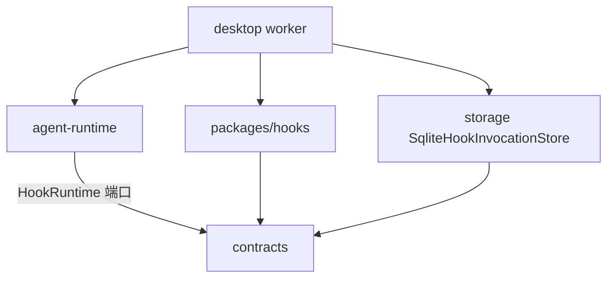

# Hooks 技术实现方案

路径：`packages/hooks`  
包名：`@desktop-agent/hooks`

> 适用版本：0.1.0  
> 文档状态：2026-08-22  
> 面向读者：第一次接触 Jojo Hooks、要改配置加载或 Hook Engine 的开发者。  
> 完整设计与路线图见 [`jojo-agent-hooks-design.md`](../jojo-agent-hooks-design.md)。本文只描述当前仓库里已经落地的包职责、模块边界和装配方式。

## 1. 定位与边界

`packages/hooks` 是进程内 Hook Engine：读取 `hooks.yml`、校验与编译、按生命周期调用处理器，并把结果交回 Agent Runtime。它依赖 Node.js（读文件、`spawn`），**不依赖 Electron**。

本包负责：

- 把 YAML 配置变成 `HookRegistry` 中的 typed handler；
- 按事件匹配、超时、输出解析和错误策略执行；
- 用 fingerprint 判断项目配置是否可信 / 已禁用；
- 用 invocation store 保证同一 Operation 上同一 hook 不重复生效。

本包不负责：

- 何时触发哪个生命周期事件（由 `agent-runtime` 决定）；
- Permission Gate、工具执行、会话 JSONL；
- 设置页、审批对话框、打开编辑器（由 Desktop 组装）；
- SQLite 落盘（Desktop 注入 `SqliteHookInvocationStore`，本包默认内存实现）。

`agent-runtime` **不得**依赖本包，只依赖 `contracts` 里的 `HookRuntime` 端口。未注入时使用 `NoopHookRuntime`。



## 2. 一句话理解

Hooks 让用户在不改 Agent 源码的前提下，观察或改写一轮执行：注入上下文、拦截工具、或在结束时做副作用。

```text
hooks.yml  →  parse / trust / register
                 ↓
           HookRegistry snapshot
                 ↓
     inject / preToolUse / dispatch
                 ↓
        Runtime 把结果写进 Operation
```

配置文件本身不是模型上下文。只有 `SessionStart`、`UserPromptSubmit`、`PostToolUse` 返回的 `additionalContext` 才会进入投影；`PreToolUse` 只影响是否执行工具；`Stop` / `SubagentStop` / `PreCompact` 不回写对话。

## 3. 术语

| 术语 | 含义 | 代码 |
|---|---|---|
| Hook Event | 稳定生命周期点 | `HookEventName` |
| Envelope | 每次调用都带的会话 / Operation / Agent 元数据 | `HookEnvelope` |
| `HookRuntime` | Runtime 看到的端口 | `inject` / `preToolUse` / `dispatch` / `configured` |
| Registry | 按事件保存的 typed handler 列表 | `HookRegistry` |
| User Hooks | `~/.jojo/hooks.yml`，始终尝试加载 | `source: 'user'` |
| Project Hooks | `<workspace>/.jojo/hooks.yml`，默认不可信 | `source: 'project'` |
| Fingerprint | 配置文件内容的 `sha256:` 摘要 | `hookConfigFingerprint` |
| Disable | 按路径跳过项目 Hooks，改文件也不再询问 | `HookTrustStore.disable` |
| Invocation | 一次 hook 执行的耐久记录 | `operationId:event:subjectId:hookId` |

## 4. 源码结构

`src/index.ts` 只做稳定导出。调用方从 `@desktop-agent/hooks` 导入，不引用内部文件路径。

| 文件 | 职责 |
|---|---|
| `config.ts` | YAML + Zod 校验；超时 / matcher / async / `canApprove` 规则 |
| `config-loader.ts` | 读用户 / 项目配置，按信任状态注册 Shell handler，返回 runtime 与状态 |
| `registry.ts` | `on(event, handler)`；id 全局唯一；`snapshot()` 供一次事件使用 |
| `engine.ts` | `DefaultHookRuntime`：匹配、调用、聚合、耐久去重、异步副作用 |
| `matcher.ts` | 仅 `PreToolUse` / `PostToolUse` 用正则匹配 `toolName` |
| `shell-runner.ts` | `spawn(command, { shell: true })`，stdin 写入 JSON payload |
| `output-parser.ts` | 把 stdout 解析成 inject / PreToolUse 结果 |
| `environment.ts` | 过滤密钥类环境变量；解析 `${env:NAME}` |
| `trust.ts` | `~/.jojo/hooks-trust.json` 的信任 / 禁用存储 |
| `invocation-store.ts` | 内存版 `HookInvocationStore` |
| `errors.ts` | `HookExecutionError` 与未知错误归一化 |

契约在 [`packages/contracts/src/hooks.ts`](../../packages/contracts/src/hooks.ts)：事件名、Envelope、结果 Schema、`HookRuntime`、`NoopHookRuntime`、设置页用的 `HookConfigStatus`。

## 5. 生命周期与结果语义

当前事件分三类：

| 事件 | 调用方式 | 结果 | Runtime 用法 |
|---|---|---|---|
| `SessionStart` | `inject` | `additionalContext` | 每个 session 在本进程内只触发一次；`source` 为 `new` / `startup` / `resume` |
| `UserPromptSubmit` | `inject` | `additionalContext` | 用户输入提交后；已有 `hookctx:` 条目则跳过 |
| `PostToolUse` | `inject` | `additionalContext` | 工具结果落盘后；恢复时不重跑工具 |
| `PreToolUse` | `preToolUse` | `neutral` / `approve` / `block` | `block` 不执行工具；`approve` 且 `canSkipApproval` 时可跳过用户审批 |
| `Stop` | `dispatch` | 无 | 本轮**进入**终态时一次；异步 hook 可 `defer` |
| `SubagentStop` | `dispatch` | 无 | 子 Agent 结束 |
| `PreCompact` | `dispatch` | 无 | 压缩历史前 |

`DefaultHookRuntime` 的关键聚合规则：

- **inject**：按注册顺序拼接非空上下文；单 hook ≤ 16 KiB，整次事件 ≤ 32 KiB。
- **preToolUse**：任一 `block` 立即返回；`approve` 可被后续 `block` 覆盖；`canSkipApproval` 仅当返回 `approve` 的 handler 来自 **user** 且 `canApprove: true`。
- **dispatch**：默认同步等待；`async: true` 时先记账再后台执行，失败不影响当前 Turn。
- **失败默认 fail-open**（`onError: continue`）。仅 `PreToolUse` + `onError: block` 会把失败变成 `block`。Runtime 侧 `safeInject` / `safePreToolUse` 再兜一层，引擎抛错也不会弄停整轮。

`agent-runtime` 把注入文本写成耐久 `hook_context` 条目，投影时并入模型上下文。Hook 不能改工具参数，也不能绕过 Permission Gate 的硬拒绝。

## 6. 配置、信任与加载

### 6.1 文件位置

| 来源 | 路径 | 加载条件 |
|---|---|---|
| 用户 | `~/.jojo/hooks.yml` | 存在且合法即注册 |
| 项目 | `<workingDirectory>/.jojo/hooks.yml` | 存在、合法，且该路径当前 fingerprint 已信任，且未被 Disable |
| 信任库 | `~/.jojo/hooks-trust.json` | `0600`，按绝对路径记录 fingerprint / disabled |

缺少文件是 `missing`，不是错误。解析失败是 `invalid`，该来源跳过，Agent 照常启动。

### 6.2 `hooks.yml` 形状

```yaml
version: 1

hooks:
  PreToolUse:
    - id: guard-terminal
      command: ./scripts/guard.sh
      matcher: ^terminal$
      timeout: 5s
      onError: continue
      canApprove: true
  Stop:
    - id: notify
      command: ./scripts/notify.sh
      async: true
```

加载后 registry id 为 `{source}.{id}`，例如 `user.guard-terminal`。校验规则：

- `timeout` 必须是 `ms` / `s`，且不超过 30s（默认 `5s`）；
- `matcher` 只允许出现在 `PreToolUse` / `PostToolUse`；
- `async: true` 只允许 `Stop` / `SubagentStop`；
- `canApprove: true` 只允许 **user** 来源的 `PreToolUse`。

空模板常量为 `EMPTY_HOOK_CONFIG`（`version: 1` + `hooks: {}`）。设置页“打开配置”在文件不存在时会写入它。

### 6.3 项目信任

`loadHookRuntime` 对项目文件的状态机：

```text
missing → 不注册
invalid → 不注册，留下 error
disabled → 不注册，也不在 Turn 中弹信任框
untrusted → 不注册；Worker 可弹 trust_project_hooks
trusted + fingerprint 匹配 → 注册为 loaded
```

`trust(path, fingerprint)` 会清掉 disabled，只信任这一版内容。文件一改 fingerprint 就失效，需要重新信任。`disable(path)` 按路径生效，改文件仍保持禁用，直到再次信任。

设置页和 Turn 内审批共用同一 trust store。Turn 里点“禁用项目 Hooks”会持久写入；点停止取消回合**不会**误写成禁用。

`loadHookSettings({ includeProject: false })` 只检查用户配置，供没有工作区时的设置页使用。

## 7. Shell 执行与安全

`ShellHookRunner` 把 payload JSON 写到 stdin，并设置：

- `cwd` 为当前 working directory；
- `JOJO_HOOK_ACTIVE=1`、`JOJO_HOOK_EVENT=<event>`；
- 经过 `sanitizedHookEnvironment()` 的父进程环境（去掉 `API_KEY` / `TOKEN` / `SECRET` 等，以及 `NODE_OPTIONS`、`OPENAI_API_KEY` 等）；
- `hooks.yml` 里 `env` 的字面量或 `${env:NAME}` 展开。

约束：

- 超时默认 5s、上限 30s；超时或 abort 会杀掉进程组（非 Windows 使用 `detached` + 负 PID）；
- stdout 上限 64 KiB，超出记 `hook_output_too_large`；
- stderr 只保留尾部 8 KiB，供 `PreToolUse` exit `2` 时作为 block reason；
- `PreToolUse`：exit `0` 解析 JSON 决策；exit `2` 视为 `block`；其它非 0 为执行失败；
- inject 类事件：exit `0` 时优先把 stdout 当 JSON `{ additionalContext }`，否则把文本本身当上下文。

Hook 默认**不能**替代用户批准。只有 user + `canApprove` 的 `approve` 可以把 `canSkipApproval` 设为 true；项目 Hook 即使返回 `approve` 也不能跳过审批。

## 8. 耐久性

调用 id：

```text
`${operationId}:${event}:${subjectId}:${hook.id}`
```

`subjectId` 按事件取值：工具 callId、`session`、`prompt`、`operation`、subagentId 或 PreCompact 的 `eventId`。

- `completed`：直接返回上次 result，不再执行；
- `failed`：默认跳过；`PreToolUse` + `onError: block` 则继续 block；
- `async` 副作用：先 `beginInvocation`，再在后台跑；进程重启后 `recoverPendingSideEffects()` 只恢复 `Stop` / `SubagentStop` / `PreCompact` 的未完成记录（`running` 且未过 30s lease 的会跳过，避免双跑）。

Desktop Worker 使用 `userData/runtime/hooks.sqlite`。单元测试和设置页 inspect 使用内存 store，inspect **不会**去恢复 SQLite 里的副作用。

当前 Turn 持有加载时的 registry snapshot。设置页 Reload / Trust / Disable 会 `hooks.invalidate` 清空 Worker 缓存；已经开始的 Turn 不中途换引擎。

## 9. Desktop 装配

| 位置 | 做什么 |
|---|---|
| [`apps/desktop/src/worker/worker.ts`](../../apps/desktop/src/worker/worker.ts) | 每轮 `loadHookRuntime`；未信任则复用工具审批问 `trust_project_hooks`；拒绝则 `disable`；把 runtime 交给 `runAgentTurn` / Sub-Agent |
| [`apps/desktop/src/main/main.ts`](../../apps/desktop/src/main/main.ts) | `hooks:status/reload/trust/disable/open-config` IPC；打开缺失文件时写入空配置 |
| [`apps/desktop/src/renderer/HooksSettings.tsx`](../../apps/desktop/src/renderer/HooksSettings.tsx) | 设置页：路径、状态、打开配置、重新加载、信任、禁用 |
| [`packages/storage/src/sqlite-hook-invocation-store.ts`](../../packages/storage/src/sqlite-hook-invocation-store.ts) | Durable invocation 表 |
| [`packages/agent-runtime/src/harness/runner.ts`](../../packages/agent-runtime/src/harness/runner.ts) | 在状态机里调用端口；SessionStart 每 session 每进程一次 |

Sub-Agent 通过 `resolveHooks` 复用当前 session 已加载的 runtime，不单独再弹一次项目信任。

## 10. 测试

| 文件 | 覆盖 |
|---|---|
| `packages/hooks/test/config-trust.test.ts` | 超时 / matcher / async / 审批来源；fingerprint 信任；Disable 跨内容变更仍保持；`includeProject: false` |
| `packages/hooks/test/engine.test.ts` | block 覆盖 approve、user `canApprove`、inject 截断、耐久去重、async defer、重启恢复副作用 |
| `packages/hooks/test/shell-runner.test.ts` | stdin JSON、exit `2` block、超时杀进程、密钥环境过滤 |
| `packages/agent-runtime/test/hooks.test.ts` | SessionStart 次数与 source；PreToolUse 恢复不重跑；PostToolUse 不重放工具；Stop 只在进入终态时一次 |
| `packages/storage/test/sqlite-hook-invocation-store.test.ts` | SQLite invocation CRUD 与未完成列表 |
| `packages/orchestration/test/subagent-hooks.test.ts` | 子 Agent 复用 hook runtime |

## 11. 当前明确不做

- TypeScript / 进程内插件加载器（配置层目前只有 Shell command）；
- 独立 `hook_jobs` 队列或跨 Worker 调度；
- 改写 `toolInput`、改写用户原文、或覆盖 Permission deny；
- Trajectory 里的 Hook 卡片、设置页 Hook 列表 / last-run（Phase 2/3 UI）；
- Provider 级 Hook（请求发出前后）。

配置写错、项目未信任或已禁用时，Agent 必须仍能对话。

## 12. 相关文档

- 设计与核对清单：[`docs/jojo-agent-hooks-design.md`](../jojo-agent-hooks-design.md)
- Runtime 状态机：[`docs/jojo-general-agent-runtime-harness-final-design.md`](../jojo-general-agent-runtime-harness-final-design.md)
- 契约层：[`docs/technical-implementation/contracts.md`](./contracts.md)
- 桌面装配：[`docs/technical-implementation/desktop.md`](./desktop.md)
- 上手说明中的包职责：[`docs/current-features.md`](../current-features.md)
