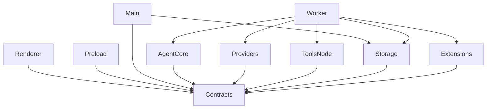
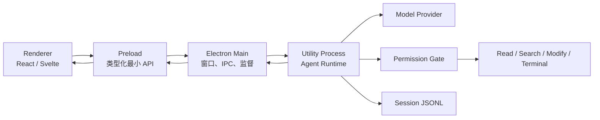

# TypeScript Desktop Agent：MVP 与后续开发规划

> 文档状态：2026-08-11（已按当前源码、测试与 CI 配置重新核对，当前版本 0.1.0）
> 状态标记：
> - ✅ 已完成
> - 🚧 部分完成 / 已开始但未全部完成
> - ⬜ 未完成 / 仍按计划推迟

## 1. 文档目的

本文用于指导一个以 TypeScript 为主的本地桌面 AI Agent 从零开始开发。产品形态参考
octo-agent、Codex 和 Claude Code，但第一阶段只解决一件事：让用户能够在桌面应用中与模型对话，
并在明确授权后让模型读取本地项目和执行命令。

本文覆盖：

- 第一版 MVP 的严格范围；
- 推荐的 monorepo 和运行时架构；
- 分阶段开发顺序与验收标准；
- MVP 之后到可公开发布版本的演进路线；
- 安全、测试、数据兼容和范围控制原则。

> 🚧 总览：核心对话 MVP、Phase 1 小型代码任务能力、Phase 2 上下文管理与 Phase 3 MCP/Skills 已完成；Provider 当前收敛为 OpenAI Chat Completions 兼容协议。“可公开发布”门槛仍未全部满足：UI/E2E、IPC 安全测试、干净机器安装验证、代码签名等仍缺失。

### 1.1 2026-08-09 实现快照

| 范围 | 当前状态 | 说明 |
|---|---|---|
| 核心对话、流式输出、Tool Call | ✅ | OpenAI Chat Completions 兼容协议可用 |
| 项目与会话 | ✅ | 按目录分组；同项目多会话；首条提问生成标题；可重命名和删除 |
| 模型选择 | 🚧 | OpenAI Chat Completions 兼容服务可配置、发现模型并逐轮选择；第二种独立协议暂未支持 |
| 内置工具与审批 | ✅ | 读取、目录、grep、glob、写入、精确编辑、删除、终端共八个工具 |
| 代码修改能力 | ✅ | 修改前 Diff 审批、读后冲突检测、原子替换与按会话回收站 |
| 持久化 | 🚧 | JSONL 会话和配置迁移可用；错误状态不持久化，运行中删除会话存在取消/删除竞态 |
| 自动化测试 | 🚧 | 当前 8 个测试文件、64 个 Vitest 用例通过；没有 Renderer UI、IPC 集成和 E2E 测试 |
| 发布工程 | 🚧 | Forge、ASAR、Fuses 和 Linux CI package 已配置；干净机器验证、签名、notarization、自动更新未完成 |
| MCP 与 Skills | ✅ | stdio / Streamable HTTP、工具状态、延迟发现、本地 `SKILL.md` 启停与按需加载已完成 |

### 1.2 当前剩余工作优先级

#### P0：先补可靠性和发布底线

- ⬜ 删除运行中会话时，等待 Worker 确认停止后再删除 JSONL，避免文件被异步写回并重新创建；
- ⬜ 为 Main/Preload/Worker IPC 增加运行时事件校验和自动化测试；
- ⬜ 增加至少两个离线 Electron E2E 冒烟测试；
- ⬜ 在 macOS / Windows / Linux 的干净环境验证安装、首次启动、配置、对话和卸载；
- ✅ 增加 Renderer 首屏错误兜底，模块或初始化异常时展示错误详情与重新加载入口。

#### P1：补齐 Coding Agent 的核心能力

- ✅ `write_file`、`edit_file` 与 `delete_file`；
- ✅ 写入前 Diff 审批、内容哈希/mtime 冲突检测、覆盖与删除回收站；
- ✅ `grep`、`glob` 项目检索；
- ✅ Tool Result 大输出回收、上下文窗口估算和安全历史压缩；
- ⬜ 在 UI 展示 token usage，并支持清除已保存的 API Key；
- ⬜ Provider 不支持 `/models` 时提供可控的手动模型回退。

#### P2：扩展协议与生态

- ⬜ 第二种 Provider 协议；Provider/Model 注册表已保留扩展边界；
- ✅ MCP 与 Skills；
- ⬜ 浏览器、多模态、子 Agent、工作流；
- ⬜ 记忆、定时任务、后台任务与通知；
- ⬜ 签名、notarization、自动更新、崩溃日志导出和正式兼容策略。

## 2. 产品定位

### 2.1 目标用户

- 在本机项目中使用 AI 完成阅读、分析、修改和命令执行的开发者；
- 希望自行配置模型 API，而不是把代码和会话托管到产品服务端的用户；
- 需要图形界面，但仍希望保留终端式可控性和透明度的用户。

### 2.2 MVP 核心价值

用户选择一个本地目录并输入任务后，应用能够：

1. ✅ 流式显示模型回复；
2. ✅ 展示模型准备执行的工具及参数；
3. ✅ 在需要时请求用户批准；
4. ✅ 执行受控的文件读取或终端命令；
5. ✅ 把结果交回模型，直到得到最终回答；
6. ✅ 保存会话，应用重启后可以继续。

### 2.3 产品原则

1. **机制优先**：权限、历史一致性、超时和恢复由程序保证，不依赖模型自觉。
2. **本地优先**：会话、配置和工具执行默认留在本机，仅模型请求访问用户配置的 API。
3. **最小权限**：Renderer 不接触 Node.js；每个工具调用经过校验和权限判断。
4. **内核可复用**：Agent Core 不依赖 Electron，未来可以被 CLI、Web Server 或插件复用。
5. **事件驱动**：UI 只消费统一的 Agent Event，不感知具体模型协议和工具实现。
6. **范围克制**：MVP 不做浏览器、子 Agent、MCP、工作流、记忆和定时任务。

> ✅ 以上原则在当前实现中均已落实（见第 5、6、12 节标记）。

## 3. 技术选型

| 层级 | MVP 选择 | 状态与说明 |
|---|---|---|
| 桌面框架 | Electron | ✅ 已采用（当前 v39） |
| 构建与打包 | Electron Forge | ✅ 已采用（Forge + Vite 插件） |
| 前端 | React + Zustand 或 Svelte | ✅ 已采用 React 19；当前状态主要使用 React Hooks，Zustand 已安装但尚未实际接入 |
| Monorepo | pnpm workspace | ✅ 已采用（pnpm 10 workspace） |
| Schema | Zod | ✅ 已采用（v4） |
| Agent 进程 | Electron `utilityProcess` | ✅ 已采用（Agent Utility Process / Worker） |
| 会话存储 | JSONL | ✅ 已采用 |
| 单元测试 | Vitest | ✅ 已采用（当前 8 个测试文件、64 个用例） |
| UI 测试 | Testing Library | ⬜ 未引入 |
| 端到端测试 | Playwright（MVP 后期） | ⬜ 未引入 |

如果使用 pnpm，根目录 `.npmrc` 应设置：

```ini
node-linker=hoisted
```

> ✅ 根目录 `.npmrc` 已配置 `node-linker=hoisted`。

## 4. 基础 Monorepo

MVP 从第一版就按运行职责拆分 Provider、Node 工具和存储。初始结构包含一个应用和五个共享包；
拆分依据是依赖方向、安全边界和变化节奏，而不是文件数量：

```text
desktop-agent/
  apps/
    desktop/
      src/
        main/                 # 窗口、生命周期、IPC、Agent 进程管理
        preload/              # Renderer 可访问的最小类型化 API
        renderer/             # React/Svelte UI
        worker/               # Agent Utility Process 入口

  packages/
    contracts/                # 消息、事件、IPC、配置和 Zod Schema
    agent-core/               # 纯 TypeScript Agent 循环
    providers/                # 模型厂商适配器与流式协议归一化
    tools-node/               # Node 工具、权限 Gate 和进程管理
    storage/                  # Session、配置和安全存储抽象

  package.json
  pnpm-workspace.yaml
  tsconfig.base.json
  .npmrc
```

> ✅ MVP 初始结构与此一致；Phase 3 新增 `extensions` 共享包承载 Node MCP client 与本地 Skills，未污染 Agent Core 或 Renderer 安全边界。

包内仍然按功能目录组织，不继续把单个 Provider、Tool 或 Store 拆成独立 package。只有某个模块需要
独立发布、出现不同运行环境，或者被两个以上上层应用以不同方式复用时，才继续拆分。

### 4.1 强制依赖方向



必须遵守：

- ✅ `contracts` 不依赖 Node.js、DOM、Electron 或任何业务实现；
- ✅ `agent-core` 只依赖 `contracts`，不依赖 Electron 和具体 Provider；
- ✅ `providers`、`tools-node`、`storage` 互不依赖，通过 `contracts` 中的接口和数据结构协作；
- ✅ Renderer 只能依赖浏览器安全的包；
- ✅ Node.js 文件系统和子进程能力只存在于 Main、Worker、`tools-node` 或 `storage`；
- ✅ Provider 协议差异在 adapter 内归一化，Agent Core 不按厂商分支。

## 5. 运行时架构



> ✅ 当前运行时架构与此一致（Main / Preload / Renderer / Worker 四进程职责已落地）。

### 5.1 各进程职责

#### Renderer ✅

- 会话列表、消息流、Composer、设置页和审批弹窗；
- 通过 Preload API 发起命令并订阅事件；
- 不读取文件、不执行命令、不直接持有模型 API Key；
- Markdown 渲染前必须经过消毒。

#### Preload ✅

- 通过 `contextBridge` 暴露白名单 API；
- 不向 Renderer 暴露原始 `ipcRenderer`；
- 只传递结构化、可校验、可序列化的数据；
- 对事件回调移除 Electron 原始事件对象。

#### Main 🚧

- ✅ 管理窗口、应用生命周期和单实例；
- ⬜ 托盘、通知和开机启动尚未实现；
- 验证所有 Renderer IPC 的来源与参数；
- 启停和监督 Agent Utility Process；
- Worker 崩溃时回收状态并向 UI 报告；
- 提供文件夹选择、安全存储等系统能力。

#### Agent Worker ✅

- 持有 Agent Core、Provider、Tool Registry、Permission Gate 和 Session Store；
- 运行模型循环并产生统一 Agent Event；
- 管理取消、超时、输出上限和工具子进程；
- 不直接操作窗口和 UI。

## 6. 核心契约

### 6.1 Provider

```ts
export interface ModelProvider {
  stream(request: ModelRequest): AsyncIterable<ModelEvent>
}
```

Agent Core 只接收归一化事件，例如：

- `text_delta`
- `tool_call_delta`
- `tool_call_completed`
- `usage`
- `response_completed`
- `response_failed`

> ✅ 已实现：`OpenAICompatibleProvider` 按此接口归一化 SSE 事件（含流式 Tool Call 聚合、usage、AbortSignal 取消、90 秒超时和错误分类）。

### 6.2 Tool

```ts
export interface Tool {
  definition: ToolDefinition
  execute(input: unknown, context: ToolContext): Promise<ToolResult>
}
```

`ToolDefinition` 使用 JSON Schema 描述模型可见参数；执行前再通过 Zod Schema 验证输入。

> ✅ 已实现：八个默认工具均按此接口实现，参数执行前经 Zod 校验。

### 6.3 Permission Gate

```ts
export interface PermissionGate {
  check(call: ToolCall): Promise<
    | { decision: 'allow' }
    | { decision: 'deny'; reason: string }
    | { decision: 'ask'; requestId: string }
  >
}
```

MVP 权限策略：

- ✅ `read_file`：工作目录内默认允许；目录外询问；
- ✅ `list_files`：工作目录内默认允许；
- ✅ `terminal`：每次询问；
- ✅ 用户拒绝不会中断整轮，而是生成失败的 `tool_result` 交回模型。

### 6.4 Agent Event

```ts
export type AgentEvent =
  | { type: 'turn.started'; sessionId: string; turnId: string }
  | { type: 'text.delta'; text: string }
  | { type: 'tool.started'; id: string; name: string; input: unknown }
  | { type: 'tool.progress'; id: string; text: string }
  | { type: 'tool.finished'; id: string; result: ToolResult }
  | { type: 'approval.required'; request: ApprovalRequest }
  | { type: 'turn.completed'; stopReason: string }
  | { type: 'turn.cancelled' }
  | { type: 'turn.failed'; code: string; message: string }
```

UI、日志和未来的 CLI/WebSocket 都使用同一套事件。

> ✅ 已实现：`turn.started` / `text.delta` / `tool.started` / `tool.progress` / `tool.finished` / `approval.required` / `usage` / `turn.completed` / `turn.cancelled` / `turn.failed` 全部落地。

## 7. MVP 功能范围

### 7.1 必须完成

#### 桌面基础

- ✅ Electron 应用可以在目标平台启动；
- ✅ 单窗口、单实例；
- ✅ Renderer/Main/Worker 三层通信可用；
- ✅ 开发模式支持热更新；
- 🚧 Forge 已配置 deb / squirrel / zip maker，CI 会执行 Linux package；尚无仓库内证据证明多平台安装产物已完成验收。

#### 会话

- ✅ 创建、选择、重命名和删除会话；
- ✅ 每个会话绑定一个本地工作目录；
- ✅ 按工作目录分组项目，并允许一个项目创建多个会话；
- ✅ 新会话使用默认模型生成标题（失败时回退第一条提问），仍允许用户手动重命名；
- ✅ 会话消息以 JSONL 保存；
- ✅ 应用重启后可恢复会话；
- ✅ 文件尾损坏时忽略不完整记录，不丢失此前完整历史。

#### 模型

- ✅ 支持 OpenAI Chat Completions 兼容协议；
- ✅ 分 Provider 获取并缓存模型列表，兼容旧单模型/单 Provider 配置迁移；
- ✅ Composer 支持为每一轮选择模型；
- 🚧 Provider 不支持标准 `/models` 时没有手动模型回退；
- ✅ 支持流式文本；
- ✅ 支持流式 Tool Call 参数聚合；
- ✅ 支持取消当前请求；
- ✅ 提供明确的认证、限流、超时和网络错误提示；
- ✅ API Key 通过操作系统安全存储保存（Electron `safeStorage`）。

#### Agent 循环

- ✅ 用户消息进入历史；
- ✅ 模型返回 Tool Call 后能够执行工具并回填结果；
- ✅ 模型不再调用工具时正常结束；
- ✅ 每轮有最大迭代次数（Coding Agent 默认最多 12 次）；
- ✅ 每个 Tool Call 必须对应一个 Tool Result（重复 Tool Call ID 只执行一次）；
- ✅ 首次模型请求失败时不会在重试后复制用户消息（失败直接发出 `turn.failed`）；
- ✅ 取消后历史仍可继续使用。

#### 工具

MVP 只实现三个工具：

1. `read_file` ✅
   - 读取 UTF-8 文本；
   - 文件大小上限（默认 512,000 字节）；
   - 超限时返回截断结果；
   - 拒绝未授权目录（真实路径检查，防止 `..` 和符号链接绕过）。
2. `list_files` ✅
   - 列出目录（递归）；
   - 忽略常见大目录，例如 `.git`、`node_modules`；
   - 结果数量和深度受限（默认 500 条、深度 3）。
3. `terminal` ✅
   - 指定工作目录执行；
   - 支持 stdout/stderr 流式输出；
   - 支持取消和超时（默认 120 秒，可配 1～300 秒）；
   - 输出有字节上限（默认 1,000,000 字节）；
   - 每次执行前要求用户批准。

#### UI

- ✅ 会话侧栏；
- ✅ 消息列表；
- ✅ Markdown 和代码块渲染（含 DOMPurify 消毒）；
- ✅ 工具调用卡片；
- ✅ 审批弹窗（Codex 风格审批卡片、可读命令、拒绝 / 允许一次）；
- ✅ Composer 和停止按钮（Enter 发送、Shift+Enter 换行、运行期间停止）；
- ✅ Provider/API Key/模型设置；
- ✅ 空状态、加载状态和错误状态。

> ✅ 额外已实现：项目分组与同目录多会话、首条提问自动标题、Provider 模型发现与逐轮模型选择、Phase 1 安全文件修改，以及当前 Agent 轮次的 Git 工作区修改摘要与审阅面板。

### 7.2 明确不做

以下功能在 MVP 基线中推迟；其中代码修改已在后续 Phase 1 完成：

- ✅ 文件写入和代码编辑（Phase 1）；
- ⬜ MCP；
- ⬜ Skills；
- ⬜ 子 Agent；
- ⬜ 浏览器自动化；
- ⬜ 长期记忆和向量数据库；
- ⬜ 定时任务和后台自动化；
- ⬜ 工作流 DSL；
- ⬜ 多窗口、多设备同步和多人协作；
- ⬜ 插件市场；
- ⬜ 云端账号系统；
- ⬜ 自动更新。

## 8. MVP 开发里程碑

时间是单人全职开发的相对估算，实际以验收条件为准。

### M0：工程地基（2～3 天） ✅ 已完成

任务：

- ✅ 初始化 pnpm workspace 和 Electron Forge；
- ✅ 创建 `contracts`、`agent-core`、`providers`、`tools-node`、`storage`；
- ✅ 配置 TypeScript、ESLint、Vitest 和统一脚本；
- ✅ 建立 Main、Preload、Renderer、Worker 通信；
- ✅ 用假事件完成 Renderer 到 Worker 的往返。

验收：

- ✅ `pnpm dev` 可以启动应用；
- ✅ Renderer 可以发出 `startTurn`；
- ✅ Worker 每 100 ms 返回一段假文本；
- ✅ UI 流式显示并能停止；
- ✅ `pnpm test` 和 `pnpm typecheck` 通过。

### M1：纯 Agent Core（3～5 天） ✅ 已完成

任务：

- ✅ 定义 Message、Content Block、Tool Call、Tool Result 和 Agent Event；
- ✅ 实现不依赖 Electron 的 Agent 循环；
- ✅ 实现 Fake Provider 和 Fake Tool Registry；
- ✅ 加入最大迭代数、取消和错误路径；
- ✅ 保证 Tool Call/Tool Result 配对。

验收：

- ✅ 使用脚本化 Fake Provider 完成“调用工具后输出答案”（已有对应单元测试）；
- ✅ 工具失败和用户拒绝时模型仍能继续（已有对应单元测试）；
- ✅ 重复 Tool Call 不会无限执行（已有对应单元测试）；
- ✅ 取消后历史结构仍然合法；
- ✅ Agent Core 单元测试不启动 Electron、不访问网络。

### M2：真实模型接入（4～6 天） ✅ 已完成

任务：

- ✅ 只选择一个 Provider（OpenAI Chat Completions 兼容）；
- ✅ 接入流式文本和 Tool Call；
- ✅ 将厂商事件归一化成 `ModelEvent`；
- ✅ 聚合分片的工具参数 JSON；
- ✅ 增加超时、AbortSignal、错误分类和 token usage；
- ✅ 完成 API Key 安全存储（`safeStorage` 加密，与普通配置分离）。

验收：

- ✅ 普通对话可以稳定流式完成；
- ✅ 模型可以正确发出一个工具调用；
- ✅ 无效 Key、限流、断网和请求超时都有可理解提示；
- ✅ UI 和 Agent Core 不出现 Provider 专属字段。

### M3：受控工具与审批（5～7 天） ✅ 已完成

任务：

- ✅ 实现工作目录和路径规范化；
- ✅ 实现 `read_file`、`list_files`、`terminal`；
- ✅ 实现权限 Gate 和审批请求协议；
- ✅ Terminal 增加流式输出、取消、超时和输出上限；
- ✅ 工具输入全部通过 Zod 校验；
- ✅ 增加路径穿越和符号链接测试。

验收：

- ✅ Agent 可以读取用户选择目录内的 README 并总结；
- ✅ Agent 可以申请执行 `npm test`，用户批准后看到实时输出；
- ✅ 用户拒绝命令后，模型能够解释或选择替代方案（已有对应单元测试）；
- ✅ 目录外读取不能绕过审批（已有对应单元测试）；
- ✅ 关闭或取消会正确回收子进程（进程组回收）。

### M4：持久化和可恢复性（3～5 天） 🚧 主要完成

任务：

- ✅ 实现 JSONL Session Store；
- ✅ 实现会话列表、标题、工作目录和消息恢复；
- 🚧 保存 Tool Call 和 Tool Result；`turn.failed` 等错误状态不会写入永久记录；
- ✅ 增加不完整文件尾恢复；
- ✅ 增加单会话运行锁，避免同时执行两个 turn；
- ⬜ 首轮失败时回滚未成功提交的输入（当前用户消息在调用 Provider 前即追加，失败后仍保留）；
- ⬜ 删除运行中会话时等待 Worker 完成取消，避免删除后的 JSONL 被异步写回；

验收：

- ✅ 应用强制退出后重开，完整消息仍然存在；
- ✅ 人为截断 JSONL 最后一行，之前的记录仍可读取（已有对应单元测试）；
- ✅ 恢复会话后可以继续调用模型；
- ✅ 同一会话不会并行运行两轮导致历史交错（已有对应单元测试）。
- 🚧 删除未运行会话会移除对应 JSONL；运行中删除的竞态尚未覆盖。

### M5：MVP UI 和打包（5～7 天） 🚧 部分完成

任务：

- ✅ 完成会话侧栏、聊天区、Composer、工具卡片和设置页；
- ✅ 会话侧栏按项目目录分组，支持同项目多会话及首条提问自动标题；
- ✅ 模型列表自动发现、缓存和逐轮模型选择；
- ✅ Markdown 消毒和代码块展示（DOMPurify）；
- ✅ 增加首次启动配置流程（设置页可配置 Provider）；
- ✅ 配置 CSP、context isolation、sandbox 和导航限制；
- ✅ 配置 Electron Fuses 和 ASAR；
- 🚧 生成 macOS 或 Windows 安装包（Forge 已配置 maker；CI 只执行 Linux package，macOS/Windows 产物未验证）；
- ⬜ 完成端到端冒烟测试（未引入 Playwright / E2E）。
- ✅ Renderer 首屏失败提示：捕获模块加载与未处理 Promise 异常，避免再次静默黑屏。

验收：

- ✅ 新用户安装后能在 5 分钟内完成第一次 Agent 对话；
- ✅ 可以选择目录、读取文件、审批并执行一条命令；
- ✅ 重启应用后会话可以恢复；
- ✅ Renderer 无 Node.js 权限；
- 🚧 安装包可在一台干净机器上启动（CI 配置了 Linux package，干净机器冒烟未验证）。

## 9. MVP 发布门槛

只有同时满足以下条件才算 MVP 完成：

> 🚧 整体判断：核心功能门槛基本满足，但发布门槛未全部满足。缺口主要是运行中会话删除竞态、IPC/UI/E2E 测试、干净机器安装验证，以及多平台签名与发布流程。

### 功能

- ✅ 至少一个模型 Provider 可稳定完成对话和 Tool Call；
- ✅ 三个工具的成功、失败、拒绝和取消路径完整；
- ✅ 会话可保存和恢复；
- 🚧 Forge 可以 package，CI 配置了 Linux package；尚未完成多平台安装包与干净机器验收。

### 稳定性

- ✅ Agent Worker 崩溃不会导致整个桌面应用直接退出（Main 监督 Worker 生命周期）；
- 🚧 模型断流、工具超时和用户取消具备处理路径；运行中删除会话仍可能与 Worker 写入竞态；
- ✅ 后台不存在遗留 terminal 子进程（进程组回收）；
- ✅ 单轮迭代和单次输出都有硬上限。

### 安全

- ✅ `nodeIntegration: false`；
- ✅ `contextIsolation: true`；
- ✅ Renderer sandbox 开启；
- ✅ Preload 不暴露通用 IPC；
- ✅ IPC 和工具输入经过运行时校验（Zod）；
- ✅ Markdown 完成消毒（DOMPurify）；
- ✅ API Key 不以明文写入普通配置文件（`safeStorage` 加密）；
- ✅ Terminal 每次运行必须明确批准。

### 质量

- 🚧 Agent Core 关键工具循环有单元测试，但取消、最大迭代、未知工具和纯文本直出等分支仍缺用例；
- ✅ 路径、权限、Session 恢复有单元测试；
- ⬜ Renderer UI、Main/Preload/Worker IPC 和 Electron E2E 测试；
- ✅ CI 执行 lint、typecheck、test 和至少一个平台的 package（GitHub Actions，Linux）；
- ✅ 不依赖真实模型的测试可以离线运行。

## 10. MVP 后续规划

后续按照“先可控写入，再扩展生态，再增加自治程度”的顺序推进。

### Phase 1：代码修改能力 ✅ 已完成

目标：从只读助手升级为可完成小型代码任务的 Coding Agent。

功能：

- ✅ `write_file`、`edit_file` 和 `delete_file`；
- ✅ 修改前读取检查（新文件创建除外，完整覆盖要求完整读取）；
- ✅ SHA-256、mtime 与文件大小冲突检测，审批执行时二次复核；
- ✅ 覆盖或删除前进入按会话隔离的应用回收站；
- ✅ 写入前逐行 Diff 预览与批准；
- ✅ `grep`、`glob` 项目搜索；
- ✅ Git diff/status 集成，但不自动提交（当前 Agent 轮次修改摘要，并过滤轮次前已有改动）。

验收场景：

- ✅ 用户可要求修改一个函数并运行测试；
- ✅ Agent 可读取文件、生成 diff、等待批准、写入并通过 `terminal` 执行测试；
- ✅ 外部编辑器在读取后或审批期间修改文件时，Agent 拒绝盲目覆盖（自动化用例覆盖）。

### Phase 2：Provider 与上下文管理 🚧 部分完成

目标：提高模型选择自由和长会话稳定性。

功能：

- ⬜ 第二种独立 Provider 协议（当前暂不支持）；
- ✅ 模型配置与选择：Provider 注册表、分 Provider 模型发现/缓存/默认模型和逐轮选择；
- ✅ Prompt Cache 统计归一化；
- ✅ 上下文窗口估算；
- ✅ Tool Result 大输出回收；
- ✅ 安全边界上的历史压缩；
- ✅ 输出截断恢复；
- ✅ 默认模型复用于标题和摘要，不提供单独选择项。

技术方案见 `docs/phase-2-multi-provider-context.md`。

验收场景：

- 🚧 Agent Core 与协议实现保持解耦，但跨协议切换需等待第二种协议重新接入；
- ✅ 长会话接近窗口上限时自动压缩且 Tool Call 配对不被破坏（自动化测试覆盖）。

### Phase 3：MCP 与 Skills ✅ 已完成

目标：建立外部能力扩展机制，避免继续硬编码业务工具。

功能：

- ✅ MCP stdio client；
- ✅ MCP Streamable HTTP client；
- ✅ MCP 工具发现、连接状态和错误面板；
- ✅ 大工具集延迟加载（超过 24 个时通过目录搜索激活匹配工具）；
- ✅ 本地 `SKILL.md` 发现与启停；
- ✅ Skill 内容通过 `load_skill` 按需注入，而不是全部塞进上下文。

验收场景：

- ✅ 用户配置一个 MCP Server 后无需改代码即可调用其工具；
- ✅ 安装一个 Skill 后，Agent 能加载其说明并使用现有工具完成新的组合任务。

### Phase 4：浏览器与富内容 ⬜ 未开始

目标：支持网页操作和多模态任务。

功能：

- ⬜ 浏览器 CDP 连接；
- ⬜ 打开、点击、输入、截图和页面结构读取；
- ⬜ 下载管理；
- ⬜ 图片消息和视觉模型；
- ⬜ Browser Tool 权限和域名限制；
- ⬜ 防止远程页面接触 Electron 特权 API。

验收场景：

- ⬜ Agent 在受控浏览器中打开网站、读取内容并完成表单操作；
- ⬜ 网页内容无法通过 Renderer 或 IPC 获得本机执行能力。

### Phase 5：子 Agent 与工作流 ⬜ 未开始

目标：支持并行探索和可重复任务编排。

功能：

- ⬜ 一层子 Agent 委派；
- ⬜ 并发上限、独立上下文和独立 usage；
- ⬜ 后台 Agent 状态和取消；
- ⬜ 声明式或脚本式 Workflow；
- ⬜ Workflow 并发、超时、日志和恢复；
- ⬜ 结果汇总和不完整标记。

验收场景：

- ⬜ 主 Agent 并行委派三个只读分析任务并汇总结果；
- ⬜ 子 Agent 不能无限递归派生；
- ⬜ Workflow 失败后可以定位到具体步骤。

### Phase 6：记忆、任务和自动化 ⬜ 未开始

目标：从单次 Coding Agent 扩展为长期本地助手。

功能：

- ⬜ 用户明确保存的偏好和规则；
- ⬜ 主题记忆按需加载；
- ⬜ 可选语义记忆后端；
- ⬜ 定时任务和唤醒；
- ⬜ 后台任务面板；
- ⬜ 通知、托盘和开机启动；
- ⬜ 无人值守任务使用更严格权限模式。

验收场景：

- ⬜ 用户保存编码偏好后，新会话能够遵守；
- ⬜ 定时任务在无人值守模式下不能绕过权限边界执行高风险操作。

### Phase 7：发布与生态 🚧 基础打包已开始

目标：达到可公开分发和持续升级的产品质量。

功能：

- 🚧 macOS、Windows、Linux 安装包（Forge maker 已配置，CI 仅执行 Linux package，产物验收未记录）；
- ⬜ 代码签名与 notarization；
- ⬜ 自动更新和校验；
- ⬜ 崩溃日志导出，但默认不上传遥测；
- ⬜ 配置和 Session 向前兼容策略；
- ⬜ CLI 或本地 HTTP API；
- ⬜ 插件/Skill 导入导出；
- ⬜ 文档站和贡献指南。

## 11. 测试策略

### 11.1 Agent Core 🚧 部分分支已覆盖

使用脚本化 Fake Provider 覆盖：

- ✅ Tool Call 执行并把结果交回下一次模型请求；
- ✅ 工具异常与用户拒绝转为失败 Tool Result 后继续；
- ✅ 重复 Tool Call ID 只执行一次；
- ✅ Provider 无事件时产生分类失败；
- ⬜ 纯文本直出独立用例；
- ⬜ 多个不同 Tool Call 的顺序与配对；
- ⬜ 最大迭代数耗尽；
- ⬜ Agent Core 层取消；
- ⬜ 未知工具、非法工具参数和 Tool Call/Tool Result 修复的独立用例；
- ⬜ 首轮 Provider 失败后的历史一致性与重试行为。

### 11.2 工具 🚧 主要路径已覆盖

所有文件测试运行在临时目录：

- ✅ 工作目录内外路径；
- 🚧 `..` 路径穿越与真实路径：实现存在，仍缺少完整的跨工具矩阵测试；
- ✅ `list_files` 符号链接逃逸；
- ✅ 大文件截断（已有对应单元测试）；
- ✅ Terminal 超时和取消；
- ✅ Terminal 非零退出、取消和超时；
- ✅ 文件修改前读取、Diff 审批、精确替换、读后冲突与越界符号链接；
- ✅ 覆盖/删除应用回收站与覆盖权限位保留；
- ✅ `grep` / `glob` 过滤、忽略目录和结果上限；
- ⬜ stdout/stderr 字节上限和截断；
- ⬜ 子进程树回收的集成测试；
- ⬜ `read_file` 自身的符号链接逃逸测试。

### 11.3 IPC 🚧 只有契约测试

- ⬜ Renderer 只能调用白名单方法；
- 🚧 `StartTurn`、模型列表等 Schema 有单元测试；真实 IPC handler 的非法参数路径未覆盖；
- ⬜ Worker 事件校验失败不会传入 UI；
- ⬜ 窗口销毁后订阅正确清理；
- ⬜ 伪造来源的 IPC 被拒绝。

> 注：IPC 来源校验和 Zod 参数校验已实现；缺少的是对真实 Main handler、Preload 白名单和 Worker 消息边界的自动化验证。

### 11.4 Session 🚧 部分覆盖

- ✅ 正常追加与读取（通过损坏尾恢复用例间接覆盖）；
- ✅ 不完整尾记录（已有对应单元测试）；
- ⬜ 重复保存与幂等行为；
- ✅ 并发写入保护（单会话锁，已有对应单元测试）；
- 🚧 配置 v1→v2 迁移已覆盖；Session 记录未来版本迁移未覆盖；
- ⬜ Tool Call/Tool Result 跨重启恢复；
- ✅ 首条提问标题与手动重命名优先级；
- ⬜ 删除普通会话与运行中会话取消/删除竞态。

### 11.5 端到端 ⬜ 未开始

至少维护两个离线 E2E：

- ⬜ Fake Provider 流式回复；
- ⬜ Fake Provider 请求 Terminal，用户拒绝后模型完成回答。

真实 Provider 测试作为手工或受控集成测试，不进入默认 CI（✅ 当前默认 CI 不依赖真实模型）。

## 12. 安全清单

### Electron

- ✅ Renderer 禁用 Node integration；
- ✅ 开启 context isolation 和 sandbox；
- ✅ 使用严格 CSP；
- ✅ 禁止任意导航和新窗口；
- ⬜ 外链只允许经过 URL 校验后交给系统浏览器（current-features 未明确；当前只限制跨来源导航）；
- ✅ 不加载远程 Renderer 代码；
- ✅ Preload 只暴露具体业务方法；
- ✅ 生产构建启用适合的 Electron Fuses；
- 🚧 ASAR 完整性与代码签名纳入发布计划（✅ ASAR 已启用；代码签名 / notarization 属于 Phase 7，未完成）。

### Agent 与工具

- ✅ 工具参数双重校验：JSON Schema 面向模型，Zod 面向执行器；
- ✅ 所有工具具备超时和取消；
- ✅ 文件和命令输出设置硬上限；
- ✅ Terminal 默认不使用 `shell: true`；
- ✅ 必须使用 shell 语法时，在审批中展示完整命令（审批卡片展示可读命令）；
- ✅ 不将 API Key、环境变量和凭据写入模型可见日志（API Key 与普通配置分离并加密）；
- ✅ 工作目录之外的访问默认拒绝或询问；
- ✅ 用户拒绝被记录为 Tool Result，不被静默绕过。
- ✅ 文件修改只允许工作目录内文本，审批后再次复核快照；覆盖和删除前保存可恢复副本。

## 13. 数据与兼容策略

所有持久化记录从第一版开始包含 `schemaVersion`：

```ts
type SessionRecord =
  | { schemaVersion: 1; type: 'meta'; session: SessionMeta }
  | { schemaVersion: 1; type: 'message'; message: Message }
  | { schemaVersion: 1; type: 'title'; title: string }
```

规则：

- ✅ 新版本必须能读取此前正式版本写出的 Session；
- ✅ 迁移在读取时完成，写入时使用最新版本；
- ✅ 不识别的字段忽略，不识别的记录类型保留警告但不让整个会话失效；
- ✅ 配置升级前保留备份（`.bak`）；
- ✅ API Key 与普通配置分开存储；
- ✅ UI 事件不是永久存储格式，持久化使用独立 Message Schema。

## 14. 主要风险与应对

| 风险 | 应对 | 状态 |
|---|---|---|
| 第一版功能膨胀 | 严格执行“不做列表”，新增功能必须替换而非叠加 MVP 任务 | ✅ 已执行 |
| Agent Core 被 Electron 污染 | 通过 workspace 依赖和 lint 规则禁止 Electron/Node import | ✅ 依赖方向已落实 |
| Provider 流式协议复杂 | 先支持一个 Provider；用 adapter 归一化并保存测试 fixture | 🚧 adapter 与内联流测试已落实，独立 fixture 库未建立 |
| Terminal 留下孤儿进程 | 统一取消与进程组回收，增加集成测试 | 🚧 进程组回收已实现，子进程树集成测试未完成 |
| 删除运行中会话产生残留 | 等待 Worker 停止并确认不会再写入后再删除 JSONL | ⬜ 待修复 |
| pnpm 与 Electron 打包冲突 | 使用 hoisted node linker，并在早期 M0 就执行一次 package | ✅ 已落实（`node-linker=hoisted`） |
| 会话被异常退出破坏 | JSONL 追加、尾记录容错、单会话锁和原子元数据写入 | ✅ 已落实 |
| IPC 扩展后失控 | 所有通道集中注册，contracts 定义 schema，禁止通用 send/invoke | ✅ 已落实 |
| Package 数量继续失控 | MVP 固定为一个应用加五个初始共享包；Phase 3 仅新增一个同时承载 MCP/Skills 的扩展包 | ✅ 已落实 |
| 安全工作被推迟 | 安全配置和权限 Gate 属于 MVP 验收项，不作为发布前补丁 | ✅ 已落实 |

## 15. 近期执行清单

按以下顺序开始：

1. ✅ 创建 pnpm workspace、桌面应用和五个初始共享包；
2. ✅ 定义 `contracts` 中的 IPC 与 Agent Event；
3. ✅ 建立 Renderer → Preload → Main → Worker 的假流式链路；
4. ✅ 在 `agent-core` 用 Fake Provider 实现工具循环；
5. 🚧 已有 Agent Core 离线测试，仍需补齐取消、最大迭代、未知工具和历史一致性；
6. ✅ 接入一个真实 Provider；
7. ✅ 实现工作目录和三个只读/受控工具；
8. ✅ 实现审批弹窗和 Terminal 取消；
9. ✅ 加入 JSONL Session；
10. 🚧 完成安装包和干净机器冒烟测试（CI 配置 Linux package；多平台产物和干净机器冒烟未完成）；
11. ⬜ 修复运行中会话删除竞态，并增加回归测试；
12. ⬜ 建立 Renderer UI、IPC 集成和 Electron E2E 测试。
13. ✅ 完成 Phase 1：项目检索、可审阅文件修改、冲突检测与回收站。
14. ✅ 完成 Phase 3：MCP stdio/Streamable HTTP、状态面板、延迟工具发现与按需 Skill。

在第 4 步完成之前，不投入复杂 UI；在第 8 步完成之前，不增加文件写入；在 MVP 发布之前，
不开始浏览器或子 Agent；MCP/Skills 已在 MVP 之后按 Phase 3 边界实现。

> ✅ 上述约束已遵守：MVP（0.1.0）完成后再引入 Phase 3 MCP/Skills，仍未引入浏览器或子 Agent。
